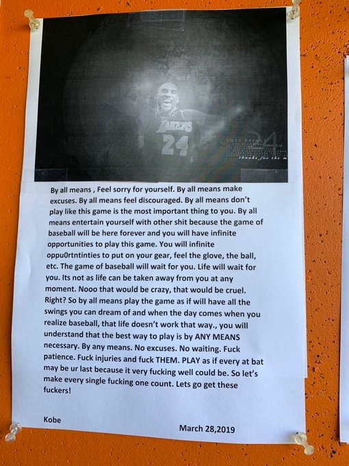

# 61~70

## 61、关于「物以稀为贵」？

「物以稀为贵」是真理吗？ -> 听xxx老师说，这是真理

拿前端这职业来说，在中国，会React的前端开发者比只会Vue的前端开发者工资要高，毕竟很多人用Vue，而用React的并不多，因此「物以稀为贵」

ps：

“物以稀为贵”这是经济学中的价值理论。

因为物质的创造靠的是生产力，所以物品的价值本质上反映的是生产力的价值，物以稀为贵本质上就是生产力以稀为贵。

生产力只有4种：劳动力（都不愿意做视为稀缺，但一般不缺）、知识、技术、想象力（所有生产力中最稀缺的）

➹：[“物以稀为贵”算不算是人类的一种扭曲的观念？ - 知乎](https://www.zhihu.com/question/20082425)

➹：[有人可以举出“物以稀为贵”的反例嘛（稀但不贵）？ - 知乎](https://www.zhihu.com/question/26694358)

➹：[“物以稀为贵”背后的经济逻辑 - 知乎](https://zhuanlan.zhihu.com/p/60484324)

➹：[物以稀为贵，情以真为重，人以勇为贵，所以，就要被珍视、被抢夺吗？ - 知乎](https://www.zhihu.com/question/38321084)

➹：[古董文物巨大的经济价值从何而来，究竟因何而在现代社会具有收藏意义？ - 知乎](https://www.zhihu.com/question/19656004)

## 62、关于对智能电视机的使用感悟？

2020年之前，家里用的电视机是一台纯平彩电，它给我的特点就是简单直接，适合年纪大的父母、老人们观看

我从未使用过智能电视机、机顶盒

有一次，到同学家里玩，我打算用遥控操控一下他们家的智能电视，结果，我完全不会操作，这其实挺尴尬的哈！（我完全不明白为啥这电视会有那么多台，也不知道这机顶盒是干嘛用的，也不知道为啥会有两个遥控）

2018年，家里装了电信的宽带，并且送了一个机顶盒 -> 宽度套餐里边有电信的iptv

2020年，家里购买了一台智能电视 -> 性价比高的小米电视

安装：

1. 支架 -> 让电视机睡着 -> 拧两个螺丝
2. 插上电源 -> 打开电视开关（中间、长按） -> 接上wifi -> 这台电视配置的遥控 -> 一般好看的影片需要付费 -> 但我每个月有交iptv的月费，所以不需要要
3. 机顶盒 -> 高清线 -> 注意是哪个接口 -> 接到电视后边 -> 选择信号源 -> 信号源搜索 -> 接上wifi -> 输入iptv的账号和密码（账号名没有@结尾的） -> 使用搭配机顶盒的遥控

注意事项：

1. 上年纪的人不会使用 -> 最好买有语音功能的
2. 两个遥控 -> 黑色和白色的 -> 黑色可以调音量，白色的也可以，二者音量可叠加 -> 音量过大或过小 -> 两个都调一下
3. 安置的时候，不需要选择挂墙的

感悟：

1. 有些东西你不用它们之前，觉得很高大尚，但用了之后，你会觉得也不过如此……

## 63、一个关于对概念理解的比喻？

片段摘抄自《[聊聊CSS世界中的margin-box « 张鑫旭-鑫空间-鑫生活](https://www.zhangxinxu.com/wordpress/2016/09/talking-about-css-margin-box/)》：

> 本文内容偏理论，非实用技术，对于深入理解CSS的一些概念和设计很有帮助。本文有些概念如果你不知道说的是什么意思，比方说“盒尺寸”，你大可忽略之，并不影响对本文核心观点的理解。这些概念是需要很多积累，而且属于一个完整体系里面的，所谓体系，就是从前往后是连贯下来的，而盒尺寸这个概念处于体系的中间，直接讲盒尺寸就像看电影直接从中间部分看起，肯定会有些困惑，但由于本来就是让大家看电影精华片段的，因此，无碍。

不理解某个概念就像是看一部电影只看了其中的某个片段（远离开头的片段）

但，有些时候，我们就是只想看精华片段……

## 64、日本的程序员为啥使用jQuery，而不是使用Vue.js？

Vue.js -> 写单页应用、数据优先 -> 日本20%前端用这个

jQuery -> 浏览器兼容、DOM操作优先 -> 日本80%前端用这个

大公司 -> 一个前端team -> 至少有5个人 -> 一个人学了，但是另外几个人表示没时间学，少数人服从多数人 -> 所以还是乖乖的用jQuery吧

小公司、新公司 -> 一个前端team -> 1个人、2个人这样子 -> 1个人学了Vue.js，那么第二个人肯定会学 -> 大家都会了，那就用Vue.js重构项目吧！

➹：[日本的程序员为什么使用jQuery不使用Vue.js？ - 西瓜视频](https://www.ixigua.com/i6789487878058541571/)

## 65、CTA按钮是个什么东东？

call to action：

- 在设计中经常会出现的吸引用户点击行为按钮 
- 如web设计中经常出现的比如：下载 购买 登录 注册 安装 订阅等。

如何设计：

1. 在保证整体和谐的情况下吸引眼球。很多网站的会把button设计的很艳丽也许是这个原因。         
2. 附带上特性简洁明确的介绍。如：free   30秒注册等。         
3. call to action的存在就意味着包含了希望得到回馈和目的，希望得到由此引发的利益，所以在设计的时候结合部分逻辑把更希望用户执行的行为进行优化。         
4. 放在合适容易点击的位置，并且确保点击准确顺利执行。

➹：[你喜欢的call to action设计案例有哪些，你觉得设计CTA要注意哪些问题？ - 孙少宁的回答 - 知乎](https://www.zhihu.com/question/19568331/answer/12243254)

➹：[17 Best Practices for Crazy-Effective Call-To-Action Buttons - WordStream](https://www.wordstream.com/blog/ws/2015/02/20/call-to-action-buttons)

## 66、一些关于网站整站设计、排版设计、组件设计的文章？

➹：[[译]网站设计综合指南 - 知乎](https://zhuanlan.zhihu.com/p/38555558)

➹：[交互设计中的排版-网页 - 知乎](https://zhuanlan.zhihu.com/p/21577848)

➹：[如何从零建设组件库 - 知乎](https://zhuanlan.zhihu.com/p/78106643)

## 67、你是否真正了解过「切图」这东东？

➹：[前端切图切到很高的境界是怎样一种体验？ - 知乎](https://www.zhihu.com/question/37048605)

## 68、Kobe 给 John Altobelli 的短信？（这是Kobe写的一篇关于生命脆弱的一段令人难以忘怀的文字）

背景：

科比 · 布莱恩特，湖人队的五届 NBA 冠军，和奥兰治海岸大学的棒球教练约翰 · 阿尔托贝利建立了友谊。 他们的女儿一起在曼巴体育学院的篮球队打球。

上个赛季，老阿尔托贝利要求科比为他的球队演讲。 然后他要求科比给他的球员提供一些智慧的话语。

2019年3月27日，科比照做了，给阿尔托贝利发了一条短信。 据 ESPN 的杰夫 · 帕桑报道，这条信息被打印出来，挂在球队休息区科比的照片下面。

> By all means, Feel sorry for yourself,By all means make excuses. By all means feel discouraged. By all means don’t play like this game is the most important thing to you. By all means entertain yourself with other sh*t because the game of baseball will be here forever and you will have infinite opportunities to play this game. You will [have] infinite opportunities to put on your gear, feel the glove, the ball, etc. The game of baseball will wait for you. Life will wait for you.
> 
> “It’s not as life can be taken away from you at any moment. Nooo that would be crazy, that would be cruel. Right? So, by all means, play the game as if [you] will have all the swings you can dream of and when the day comes when you realize baseball, that life doesn’t work that way, you will understand that the best [way] to play is by ANY MEANS necessary. By any means. No excuses. No waiting. F\*ck patience. F\*ck injuries and f\*ck THEM. PLAY as if every at bat may be ur last because it very f\*cking well could be. So let’s make every single f\*cking one count. Lets go get these f*ckers!”

写完这封信10个月后，Kobe和他13岁的女儿吉安娜（Gianna）与约翰·阿尔托贝利（John Altobelli）以及Altobelli他的46岁的妻子克里（Keri）以及他们夫妻俩的14岁的女儿阿丽莎（Alyssa）在1月26日的一次直升机失事中丧生。

科比在湖人队的20个赛季中，18次入选全明星，两次总决赛MVP，一次常规赛MVP（2008年）。

2016年退役后，他全身心投入到讲故事（storytelling）里边去，凭借短片《亲爱的篮球》(Dear Basketball)赢得了2018年的奥斯卡奖，该片根据他写的一首诗改编。

高于一切的是（Above all else），科比是一个尽心尽责的父亲，他有四个孩子。当直升机坠毁的时候，科比正在前往曼巴体育学院的路上，他将在那里指导吉安娜打一场篮球比赛。

原文：[Read Kobe Bryant's Text Message To John Altobelli](https://www.si.com/nba/lakers/news/read-kobe-bryants-text-message-to-john-altobelli)

网友对这封信翻译的大致内容：

> “你可以尽情地感觉难过，为自己找借口，感觉自己很气馁，你当然可以不把这场比赛看的太重，理所当然地用其他事情让自己开心起来，因为棒球比赛会一直在这，你有太多的机会来打比赛了。你也有无数的机会去穿上装备，戴上手套，投掷棒球等等。你会觉得棒球比赛会一直等着你，生活也会等着你去感受。我的意思并不是生命可以随时被夺走，不那太疯狂了，也太残酷了，不是吗？”
> 
> “所以，你完全可以在比赛中尽情地挥出你梦寐以求的挥击动作，但当你意识到棒球朝你飞驰来的那一刻时，你会发现生活不是之前想得那样。届时你将会明白，上了赛场无论如何都要打好比赛，不管以任何一种方式，没有借口，没有迟疑。去他的耐心，去他的伤病，去他的所有的其他人。要将每次的击球当成是最后一次，因为这太有可能了，所以我们要让每个时刻都充满意义，让我们莫负今朝。——Kobe，2019年3月28日。”

➹：[科比生前短信：要将每次击球都当成是最后一次_NBA_新浪竞技风暴_新浪网](https://sports.sina.com.cn/basketball/nba/2020-02-13/doc-iimxxstf0981220.shtml)

看后的一些想法：

就像是熬夜一样，你以为你每次熬夜之后，第二天还是可以正常的起来，但这也有可能是你最后一次熬夜了……

关于学一个东西，你以为每天都会有时间去学它，所以觉得不需要现在就去学它，于是，你就这样拖着，直到忘记了你有什么东西要去学……或许，当你下定决心要学它的时候，你发现自己没有时间去学它了！

关于爱情，你以为等自己有能力给她幸福之后，才向她表白，但这很有可能没有机会表白了……

时不待人，莫负今朝……

## 69、关于填鸭式教育？

填鸭式教育三大罪：

- 割裂知识 -> 不问为什么，不以解决问题为目的，存粹为了学习而学习
- 禁锢思维 -> 如果你想影响一个人，不仅仅是交谈，而是要按照你的方式塑造他，所以学校会有各种规范，各种框架，行为准则，上下课的定时打铃等等，这些都在培养“规范”的劳动工人。而且所有的知识都是经过精心筛选，比如你学的语文啦、思想XX呀，让你能够被填的饱饱的。而且一旦缺少了外界的灌输，将无所适从（指不知道依从哪个才好；也指不知道怎么办才好。说白了，无法识别哪些内容是好的，不知道自己该学习什么，即丧失了自我驱动学习的能力），比如我们今天毕业的大学生，即使有些参加了工作十几年的人，估计都不知道自己喜欢干什么，自己的目标是什么。 -> 就像是个机器人一样
- 精英制 -> 社会并不需要那么多懂知识，肯思考的人。所以经过层层筛选，大部分落榜者沦为贫苦大众

引用一段《乌合之众》的话：

> 向人灌输大量肤浅的知识，不出差错的背诵大量的教科书，是绝对不可能提高人的智力水平的。
> 
> 在我们的生活中，能够帮助我们走向成功的条件是判断力、是经验、开拓精神！而这些书本当中是无法习得的。
> 
> 观念只有在自然而正常的环境中才能形成，而书本的知识本质上是反人类的 -与人类的思维习惯不同。
> 
> 因此，我们需要年轻人每天从工厂、矿山、法庭、书房、建筑工地和医院中获得大量的感官印象；他得亲眼看到各种工具、材料和操作；他得与顾客、工作者和劳动者在一起，不管他们是不是干的好，不管他们是赚还是赔。
> 
> 只有这样，才能了解那些从眼睛、耳朵、双手甚至味觉中得到的各种细节，才能在心中逐渐形成观念，并且会组合、简化形成新的概念。
> 
> 而我们年轻人，却恰恰在最能出成果的年纪，被剥夺了所有这些宝贵的接触，七八年时间一直被关在学校里，切断了一切亲身体验的机会，对世间的事物缺乏准确的认识。
> 
> 而后成家立业，落入生活的俗套，把自己封闭在狭隘的职业中，这就是狭隘而平庸的生活。

➹：[填鸭式教育最大的弊端在哪？ - 方老司的回答 - 知乎](https://www.zhihu.com/question/20308185/answer/131529278)

---

别飞得太低，成为最好的自己

<video src="http://src.tangxt.cn/what-is-edu.mp4" controls>
  你的浏览器不支持 <code>video</code> 标签.
</video>

➹：[填鸭式教育最大的弊端在哪？ - 林择枝的回答 - 知乎](https://www.zhihu.com/question/20308185/answer/844521534)

## 70、什么叫用心？

其实用心这个词，已经有点用滥了。

在很多情况下，我们说到的”用心“仅是”看起来用心“，或者是”符合我理解的用心“。

举一个真正”用心“的故事：

> 20世纪30年代，台湾首富王永庆用仅有的200元资金，在一条偏僻的巷子租下一个很小的铺面开始卖米。他注意到米里掺杂有很多沙子、小石子之类的杂物，顾客买回去都要淘好几次米，才能下锅做饭，很不方便。王永庆就带着两个弟弟一起动手，将夹杂在米里的秕糠、沙石之类的杂物捡出来，然后再卖给顾客。后来，镇上的人都说买王永庆的米可以不淘米，一传十，十传百，米店的生意日渐红火。
> 
> 王永庆注意到来买米的顾客以老年人居多，于是，他主动送米上门，这一服务措施立即大受顾客欢迎。更重要的是，王永庆送米并非只送到顾客家门口，他将米倒进米缸里，如果米缸里还有陈米，他就将陈米倒出来，把米缸擦干净，把新米倒进去，再将陈米放在上层。
> 
> 每次给新顾客送米时，王永庆都会用本子细心记下这户人家米缸的容量，问明家庭有多少大人、多少小孩，每人饭量如何……据此估计该户人家下次买米的大概时间，到时候，不等顾客上门，他就主动将相应数量的米送到客户家里。
> 
> 王永庆这些“用心”的举措令顾客深受感动，逐渐成为他的铁杆用户。王永庆也从卖米过程中把握了经营的秘诀，那就是用心为顾客服务。王永庆始终遵循这一宗旨，终于成为台湾企业界的领航者。

➹：[评价人做事学习很用心，这个“用心”是什么意思？ - 谌斌的回答 - 知乎](https://www.zhihu.com/question/20038181/answer/13772881)

一个「用心」的5星视频：

<video src="http://src.tangxt.cn/1star.mp4" controls>
  你的浏览器不支持 <code>video</code> 标签.
</video>

➹：[最新进展：钉钉被小学生逼疯，拍片在线求饶哈哈哈哈](https://mp.weixin.qq.com/s/u47K4bodJ5q8-5wQrLJzBQ)

我并咩有分清用脑和用心有啥区别，有人说用心就是「用神、凝神、专注」、「尽心，尽力，尽责，尽能」，而用脑则会转移注意力，可用心不用脑地做事有啥意义呢？

用心和用脑看似对立，但其实这是有关联的，在我看来，理性用脑之后，得出自己该做什么，然后才可以用心尽力地去做

如上边两个例子，王永庆的举动，显然是用脑思考之后，然后用心去做的结果

钉钉为了叫少侠们不要打一星，显然费尽心思，用心做了这么一个让人感到快乐的视频

