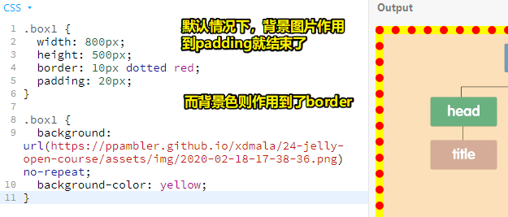
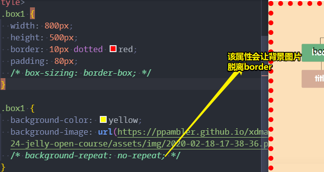
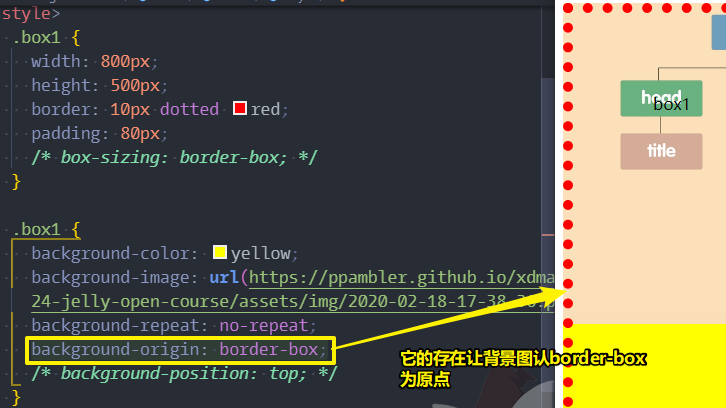
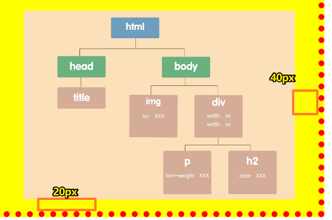
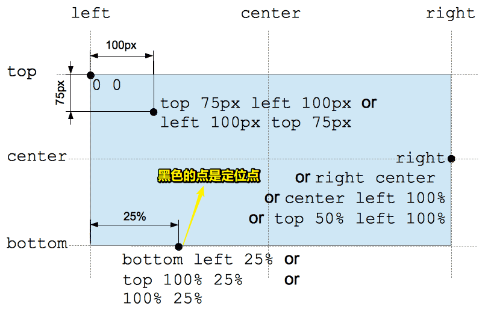
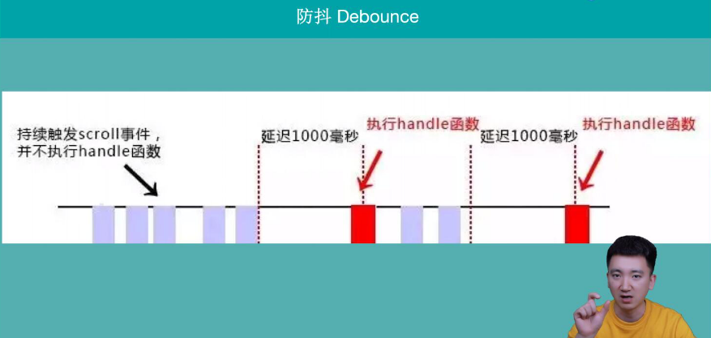

# 71~80

## 71、文档流到底是啥？

简单来说，normal flow就是一条传送带，传送带上有一个个盒子（有CSS样式的盒子），浏览器从传送带上拿到一个个盒子去做布局，布局好之后，就去渲染盒子

**➹：**[HTML 的文档流和文本流分别是什么？ - 知乎](https://www.zhihu.com/question/21911352)

**➹：**[在网页设计html中什么是文本流，请大家帮忙！！！_百度知道](https://zhidao.baidu.com/question/148313122.html)

## 72、我想修改一下默认的 github pages 样式？如我想要图片有阴影……

> 你要在别人的东西上动刀子，就必须要先了解别人的东西，随便改改，后遗症是很严重的。

找到样式文件：<https://ppambler.github.io/xdmala/assets/css/style.css>

在项目的root目里边 -> `touch assets/css/style.css` -> 把上边那个url里边的样式内容，copy进来 -> 追加你想要的自定义样式

注意：在github仓库里直接访问文件，是没有看到样式生效的，因为它与用github pages预览页面的css不是同一个css

**➹：**[Petelin/PureGithubBolg: 王垠的博客生成器，简单优雅的博客，使用markdown写作，可以自定义css样式，支持发布到page。](https://github.com/Petelin/PureGithubBolg)

**➹：**[自定义jekyll博客主题](http://echizen.github.io/tech/2014/10-06-custome-blog-style)

**➹：**[ssthouse/ssthouse-blog: 个人博客仓库：前端 / 数据可视化 / D3.js](https://github.com/ssthouse/ssthouse-blog)

**➹：**[CSS Box Shadow Examples](https://www.webfx.com/blog/images/assets/cdn.sixrevisions.com/0457-01-css-box-shadow-demo/demo.html)

## 73、「劣币驱逐良币」什么鬼？

在王垠的这篇文章「[谈职场中的命令口气](http://www.yinwang.org/blog-cn/2020/02/17/work-culture)」里边的结尾处有这么一句话：

> 这个世界之所以有那么多劣币驱逐良币，是因为良币太温柔与含蓄！

那么啥叫「劣币驱逐良币」呢？

粗暴简单理解：

> 某行业，99%的商家作假。另外1%要么假，要么死。
>
>而无论哪条路，良币都不复存在了。

补充理解：就好像聚美优品和很多网店卖假货，因为他知道可以驱逐良币，所以他想用这个策略战胜对手。然后这又涉及到博弈论。但是世界大部分事物从时间的维度看都不是零和博弈，是正和博弈。短期来看收益大，长期来看损失了信誉，双输

**➹：**[什么叫「劣币驱逐良币」？ - 冰水的回答 - 知乎](https://www.zhihu.com/question/19906388/answer/71831057)

博弈 ：

- 零和博弈：指博弈的双方在竞争关系下，一方的盈利就是另一方的损失。如赌博
- 负和博弈：指双方在竞争关系下，胜方所得的利益小于败方所得的损失。如杀敌一千，自损八百……（在战争中，失败的一方，会摧毁己方的武器和物资，以避免落入敌人手中，而胜利者得到的战果则寥寥无几。牛奶倒掉是否也是负和博弈？）
- 正和博弈：指竞争关系下的双方都会有利益。其实，正和博弈就是现在流行的双赢局面。如证券市场（我一直以为是零和博弈）

**➹：**[投资中的零和博弈，正和博弈，负和博弈 - 知乎](https://zhuanlan.zhihu.com/p/53918001)

**➹：**[为什么罗斯福新政时宁愿把过剩的牛奶、棉花扔掉也不免费分发给穷人？ - 知乎](https://www.zhihu.com/question/27082949)

贴近本质的理解：

> 比如说你去小卖铺打酱油，要一块二，你一摸兜，有一把旧钱，里面还有几张新票子，怎么办呢？
> 
> 正常会这么干：这几张旧的先花出去吧。所以旧的，劣币就流通了，良币自己留着了，然而并不是只有你这么想，所有人都会这么想，那么市场上流通的劣币会越来越多，良币越来越少。
> 
> 这在现在没什么大影响，然而在古代，火车都是用真金白银等值金属制造的，磨损的，或者压根成色就不咋地的货币价值是真的不足的，可在市场上还是按标定得金额流通，那大家就不干了，支付的时候用劣币，良币自己留着了。这样，就实现了驱逐的功能。

**➹：**[什么叫「劣币驱逐良币」？ - 梁峰诚的回答 - 知乎](https://www.zhihu.com/question/19906388/answer/71831451)

why理解：

> 所谓劣币驱逐良币，就是由于信息不对称导致的。
> 
> 拿2手车市场来举个例子，两辆外观一样，品牌一样，一样里程的车子。一辆经过大修，我们称为A，一辆车况良好，我们称为B。B的实际价值为2万，车主报价2万，A实际价值5千，车主报价5千。
> 
>在假设消费者不得知A经过大修的情况下，消费者当然更加青睐A。这款车在这个情况下的最终出售价格会无限接近A与B的平均价格，也就是12500。这样导致的结果就是，A的卖家赚了，而B的卖家如果卖这个价格会亏。久而久之，B的卖家会退出市场，因为市场价对于他来说是亏损的。而A的卖家会蜂拥而入，因为他们赚了。最终的结果就会是A大量侵占市场，B无奈退出。
>
>劣币驱逐良币就此完成。
>
>而这些假设成立最最大的先决条件就是A和B的车况，消费者通过已掌握的信息无从得知，从而出现了信息不对称。

**➹：**[什么叫「劣币驱逐良币」？ - baker tyler的回答 - 知乎](https://www.zhihu.com/question/19906388/answer/69545565)

回顾王垠文章结尾那句话，公司会因为劣币多了而破产吗？劣币真得获得了他们所想要的利益？比如「感受一下地位的差别，给人带来爽快感？」良币真得敢「刚」吗？假如你有孩子老婆父母要养？

我觉得，直接「刚」吧！事不过三，只要他人无理，何须容忍他人无理……

## 74、img元素不是inline-block吗？

img是一个被替换元素，默认情况下，它的display是inline，所以它是inline元素，但是它的默认尺寸是由嵌入图像的内部值定义的，因此，它就像是inline-block的行为一样，所以，你可以对img设定像 border/border-radius, padding/margin, width, height等这样的样式属性

**➹：**[\: The Image Embed element - HTML: Hypertext Markup Language - MDN](https://developer.mozilla.org/en-US/docs/Web/HTML/Element/img)

## 75、border底下会有background-image or color吗？



> 即使盒子模型是border-box这一点也不会变，注意上图的 `no-repeat`影响了结果，即背景图片也是作用到border下边的



然而，通过 `background-clip`这个属性则可以改变这种作用情况

该属性的默认值是`border-box`，所以这就是为啥背景图片和背景色都在border下边的缘故了

关于 `background-position`：

图片的原点是相对于 `background-origin`这个值而言的，默认情况下，`background-origin`的值是 `padding-box`

回顾之前上边的理解，我发现自己错了，正确的理解姿势是：

在只有背景色和和背景图片的情况下：

如果不写 `no-repeat`，那么背景图就是在border为止，因为 `background-clip`的值是 `border-box`，同样，背景色也是如此

如果你想要让背景图在padding-box处，那么你只需要添加 `background-repeat: no-repeat;`就可以了，因为 `background-repeat: no-repeat;`的存在可以让 `background-origin:padding-box`生效，而该`background-origin`显然要比`background-clip`强，这时图片就在padding-box处了，不过颜色还是在border-box处，毕竟`background-origin`是针对背景图而言的！

当然，如果你既想用`background-repeat: no-repeat;`，也想要让图片在border-box处的话，你可以 `background-origin: border-box;`



当然，一般我们都会让背景图杵在padding-box，即在`background-repeat: no-repeat;`的前提下，不需要设置 `background-origin`属性，用默认值即可

关于 `background-position`这个属性（无视盒子的内容区域）：

初始值是：`0% 0%`

1、top：图片的上沿对齐，并水平居中，只有一个关键字，另一个值默认是center，即 top <=> top center

2、left：图片的左沿对齐，并垂直居中

3、center：图片的对角交叉线中心点，与盒子的对角交叉线中心点重合

4、如果有3个值或4个值：表示指定偏移的相对位置，如 `right 40px bottom 20px;`：



5、如果是百分比值，那么其表现与CSS中其他的百分比单位表现都不一样

计算公式（注意负值的由来）：

```
positionX = (容器的宽度-图片的宽度) * percentX;
positionY = (容器的高度-图片的高度) * percentY;
```



为何`background-position:100% 100%`总之是定位在容器右下角，即无法溢出容器呢？

你给`background-position:left 100%`就能溢出一个身位的背景图

**➹：**[CSS \<position\>值简介理解background百分比定位 « 张鑫旭-鑫空间-鑫生活](https://www.zhangxinxu.com/wordpress/2015/03/background-object-position-value-percent/)

## 76、习惯养成？

坏习惯 -> 导致不自律 -> 长时间积累坏习惯，多种坏习惯并驾齐驱

不自律 = 多坏习惯集合

改坏习惯，但坏习惯很多，不可能一下子就能全部改掉

所以，你得先找到一个核心的坏习惯，然后先改掉它！

如，我就是不喜欢跑步，那么你就每天坚持跑步

每天你都坚持跑步了，那么你会不知不觉地带动着把其它的坏习惯都给改正过来了

逐渐地，你心态变得积极起来了，毕竟你知道曾经的习惯是不好的，而现在开始慢慢改正过来了，个人也变得愈来愈好了

至此，你这整个人都变得自律起来了，好习惯也养成了

总之，找到「核心」的坏习惯，并坚持改之，

要坚持，变自律，需要两种狠 -> 外界逼自己狠 or 自己逼自己狠，让自己站起来

对于我自己来说，自己的核心坏习惯是「不能早睡早起」，我想要的作息时间是「晚11点，早6点，中半个小时」

## 77、防抖？

防抖：



节流：

代码可视化：[debounce & throttle demo](http://demo.nimius.net/debounce_throttle/)

**➹：**[函数防抖与函数节流 - 知乎](https://zhuanlan.zhihu.com/p/38313717)

**➹：**[彻底弄懂函数防抖和函数节流 - 前端进阶 - SegmentFault 思否](https://segmentfault.com/a/1190000018445196)

## 78、编程与设计结合起来？

写的代码可以通过设计出来的图像、动效给具象出来！

**➹：**[B站史上最简明的编程入门|最合适设计师的编程入门【#006】_哔哩哔哩 (゜-゜)つロ 干杯~-bilibili](https://www.bilibili.com/video/av88961046)

看完这个视频之后，我有种想出学设计的冲动！


