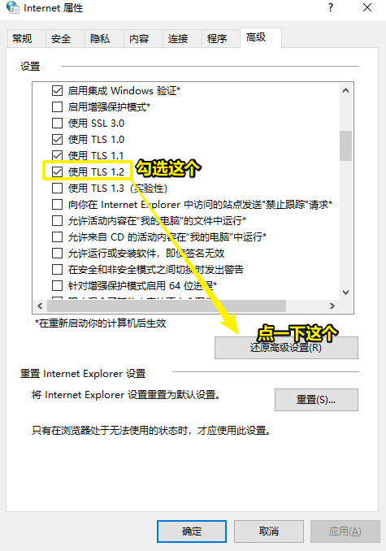

# 91~100

## 91、何不食肉糜？幸存者偏差？

何不食肉糜？

- 何不食肉糜是晋惠帝执政时期的一个名词。指对事物没有全面认知

出自：

> 有一年发生饥荒，百姓没有粮食吃，只有挖草根，吃树皮，许多百姓因此活活饿死。消息被迅速报到了皇宫中，晋惠帝坐在高高的皇座上听完了大臣的奏报后，大为不解。“善良”的晋惠帝很想为他的子民做点事情，经过冥思苦想后终于悟出了一个“解决方案”曰：“百姓无粟米充饥，何不食肉糜？”(百姓肚子饿没米饭吃，为什么不去吃肉粥呢？)

含义：

- 对事物没有全面认知，也指没有亲身经历过的人对别人的处境或行为妄加评论或建议。
- 幸存者偏差

幸存者偏差这个概念由来：

1941年，有一军官在探讨我们应该加强飞机的哪一部分 -> 结果从大量飞回来的飞机身上发现，机翼中弹最多，机尾中弹最少，所以理应加强机翼 -> 然而有一统计学家说「得加强机尾」，那么他为啥这样说呢？——因为能飞回来的都是幸存者呀！那些坠机的是否是因为机尾的缘故而GG了？ -> 于是，军官采用了这位统计学家的建议，大大加强了机尾，结果飞回来的飞机越来越多了……

幸存者偏差：你**只考察了幸存者所满足的特征**，但这并不能得出一个**有说服力的**结论来 -> 只看幸存者的特征，并不能得出一个普遍的规律

再举一个栗子，这个概念来自2000年前，古罗马时期，有一人（称他为A）是无神论者，有另一人（称他为B）劝说A拜神，因为有好处呀！

而A就问B「我为啥要拜神？」

B就回他「有一次，有一帮人出海了，结果有一些人游回来了，而另外的人则GG了，而游回来的人都是拜过神的，所以你看拜神是有好处的吧！」

此时，A就怼B了「把那些淹死的拜神者叫过来」

为啥A要这样说呢？——因为你会发现有这么一个特征，幸存者都拜神，可淹死的人都不会说话啊，而这意味着你无法知道这些淹死的人是否是拜神的，如果这些淹死的人都是拜过神的，那么说明这拜神有个鸡儿用哦！

关于偏差：

忽视了失败的人，那就是有偏差，如果没有忽视，那就是完整的，如

没有偏差：

A成功 -> 有特征C

B失败 -> 没有特征C

得出 -> C是成功要素

有偏差：

A成功 -> 有特征C -> C是成功要素

> 我似乎明白了，为啥哪些培训机构总是在鼓吹他们教导的学生有多少个进入BAT等这样的公司了，而这难道是在说明他们教好的吗？——了解过幸存者偏差这个概念之后，我意识到了，并不能得出「他们家的讲师教的好」这一结论，因为我们无法知道那些学得差的同学的情况是怎样的，或许你会说「教的这个班最高有2万，最低有1万工资，你说还不是我们教的牛逼？」——如果真是这样，那可能你们确实教的好，可这也并不一定，如果学生都是好学之人，除了看你们的教程以外，还看其它机构的，那么就不一定说你们教得牛逼了……总之，不要忽视那些失败的人，成功的要看，失败的也要看，唯有这样，这结论才是比较合理的！

其它例子：

- 成功学 -> 比尔盖茨、乔布斯都退学了，所以成功了；可那些退学了，没有成功的人呢？
- 足球 -> 梅西、C罗工资3、4千万欧元，工资贼高 -> 所以踢球能赚大钱，因此踢球好 -> 但在中超60%的球员，工资都在10万以下 -> 所以踢球能赚大钱的概率低到爆……
- 高考报热门专业赚大钱 -> 但你看到的只是热门专业里边的顶尖人才 -> 而大部分人是怎样的呢？你不一定知道哈！

小结：

- 生活中我们总是关注那些成功者和幸存者，忽视了那些失败者，而这是不合理的，所以我们在得出某个结论时，请不要以片面推整体……
- 充分考虑幸存者偏差
- 如果你不了解一个概念，请大胆点的举例子吧！

➹：[為什麼學馬雲的都變成了浮雲？死人不會說話 - 倖存者偏差 - YouTube](https://www.youtube.com/watch?v=Qrc16Ha5Cgg)

➹：[成功学有用吗？幸存者偏差，一个活着就该明白的事！李永乐老师聊聊大牌球星的身价（2018最新）_哔哩哔哩 (゜-゜)つロ 干杯~-bilibili](https://www.bilibili.com/video/av25457221?from=search&seid=4513939811480175934)

➹：[何不食肉糜_百度百科](https://baike.baidu.com/item/%E4%BD%95%E4%B8%8D%E9%A3%9F%E8%82%89%E7%B3%9C)

## 92、白花蛇舌草？

特征：根细长，分枝，白花。茎略带方形或扁圆柱形，光滑无毛，从基部发出多分枝

其成药味苦、淡，性寒。主要功效是清热解毒、消痛散结、利尿除湿。尤善治疗各种类型炎症。

我一般直接把「白花蛇舌草」晒干，然后煮水喝，喝起来那感觉就像是喝凉茶一样！ -> 并咩有出现什么身体不适

➹：[白花蛇舌草（茜草科耳草属植物）_百度百科](https://baike.baidu.com/item/%E7%99%BD%E8%8A%B1%E8%9B%87%E8%88%8C%E8%8D%89/500604)

## 93、我觉得自己缺乏创造力？

> 我很难把所学知识用在自己想要做的项目里边去

➹：[不要让任何人告诉你，你没有创造力。 - 锌](https://www.zincgroup.com/zh-CN/dont-let-anyone-tell-you-youre-not-creative/)

## 94、无法打开win10y应用商店？

> code -> 0x80131500

`win+R` -> inetcpl.cpl

清理应用商店的缓存：按 “Windows键+R”→运行→输入“WSReset.exe”并点击 “运行”。

可能是使用代理软件之类的副作用：打开Windows的设置→选择网络和Internet→找到代理，将“使用代理服务器关闭”（若本来就是关闭的，则先打开再关闭）

> 一个个试吧！解决这个问题，并不需要重启计算机！我的应该是代理软件的缘故！

➹：[微软商店，打开就显示无法加载该页面 代码0x80131500，这个情况怎么解决？ - 甘蔗的回答 - 知乎](https://www.zhihu.com/question/310873087/answer/586797589)

## 95、如何让win10任务栏全透明？

在win10应用商店，安装TranslucentTB就好了！（有汉化版的）

➹：[怎么让 Win10 任务栏全透明？ - 知乎](https://www.zhihu.com/question/37313273)

## 96、如何彻底隐藏任务栏？

安装：TaskBarHider

➹：[win10如何完全隐藏任务栏？ - 知乎](https://www.zhihu.com/question/48978062)

## 97、感觉这世界只有自己一人在注视着身边发生的一切？

➹：[为什么感觉自己是这个世界上的主角？ - 知乎](https://www.zhihu.com/question/266596713)

➹：[有时候总感觉自己是这个世界的主角，所有身边的人如同配角，自己仿佛在演一出电影，是我有问题吗？ - 知乎](https://www.zhihu.com/question/290546296)

## 97、啥叫引擎？

➹：[游戏开发所说的引擎是什么意思？ - 知乎](https://www.zhihu.com/question/58600883)

➹：[什么是引擎_网络_shenpanzhimao的博客-CSDN博客](https://blog.csdn.net/shenpanzhimao/article/details/84500521)