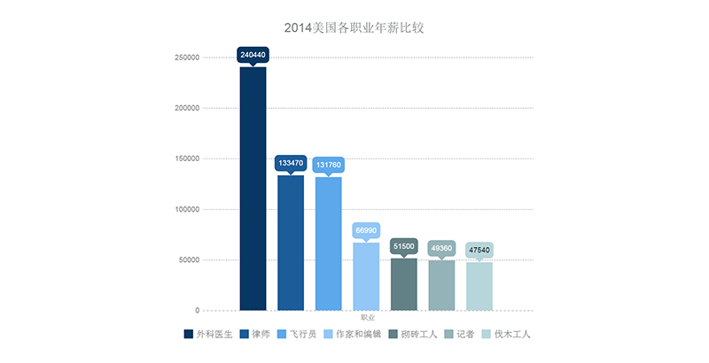

# 101~110

## 101、贝尔纳说了这么一句话「构成我们学习最大障碍的是已知的东西，而不是未知的东西。」，可我并不知道这是啥意思？

已有的知识会影响我们对新知识的吸收能力，例如，什麽都不懂的小孩，其学习能力是最强的，而成年后由於固有思维的阻碍，成年人对新知识的吸收能力也就低了

所以,这句话其实是鼓励人们放开心胸,在新知识之前要忘记已知,方可得新知,对未知的东西不应恐惧,要有求知心

电梯只能装在室内吗？ -> 非也 -> 室外也行

> 这句话，有点像「知识的诅咒」（一种认知偏差，指人在与他人交流的时候，下意识地假设对方拥有理解所需要的背景知识）

➹：[构成我们学习最大障碍的是已知的东西，而不是未知的东西_百度知道](https://zhidao.baidu.com/question/55260394.html)

➹：[构成我们学习最大障碍的是已知的东西——贝尔纳](https://www.mingrenzhuan.com/lizhimingyan/2858.html)

## 102、如何给自己起个英文名字？

我之前起的 -> Ambler -> 之所以起这个是因为自己认为这词可以形容慢慢走的人

- 中文 -> 姓名  -> 张三 -> 姓张名三
- 英文 -> First Name / GivenName / Forename（孩子出生后家里给取的“名”） -> Last Name / Family Name / Surname （家族共有的名字「以区别于其他家族」）
- 日语 -> “なまえ”（namae）「名前，即名」、“みょうじ”（myouji）「名字，即姓」

英文起名原则：

- 英文名不能自创，必须要有出处
- 本名优先，相似为主
- 美国人不喜欢起大自然存在的东西的名字，如你起个中文为岩石的名字 -> rock

英文有legal name（正式名）和 nickname（小名）的区别，如James（正式名）: Jay（小名）, Jim, Jimmy, Jamie

我喜欢「A」字开头的，而且要短点的

我找到一个英文名：

Adair	阿代尔	犹如橡树般坚强（力量和耐力的共同象征，能活200年以上，春天开花，是国家之树）

可这似乎是姓呀！

然而，「答案」的名字是「Allen Iverson」

但，Allen也是可以作为一个家族名的

我的偶像「LeBron James」 -> James就是家族名字 -> 也可以是个人的legal name

所以Adair可以作为名字，也可以作为姓 -> 阿呆儿 -> Adair Tang

还有：

Amos -> 任重道远的人（路程很远。比喻责任重大，要经历长期的奋斗） -> 该名字过于霸气

Alfred -> 小精灵，睿智的顾问

在注册各大网站时，Adair大多被注册了，所以我用了这样一个用户名「Adair_T」，如果有一天需要用到英文名，我就叫「Adair」（不知Adair这名有没有小名）

➹：[Last name 和 First name 到底哪个是名哪个是姓？ - 知乎](https://www.zhihu.com/question/20031049)

➹：[有哪些不烂大街的女生英文名？ - 知乎](https://www.zhihu.com/question/40593747)

➹：[怎么给自己起个英文名？ - 知乎](https://www.zhihu.com/question/19621041)

➹：[如何优雅地给自己取一个英文名 - 知乎](https://zhuanlan.zhihu.com/p/21339237)

➹：[橡树象征着什么意义?橡树的十大外形特征和作用_探秘志](http://www.tanmizhi.com/html/5738.html)

➹：[A开头的英文名_A开头的英文名 男孩 女孩](https://en-name.xiao84.com/names/fl_a.html)

➹：[英文网名生成器、英文姓名生成器、英文名字在线生成器](https://www.qmsjmfb.com/en.php)

## 103、为什么大多数人宁愿吃生活的苦，也不愿吃学习的苦？

> 生活的苦决定生存的下限，不得不吃；学习的苦决定生活的上限，求而不得。

这是一句让人感到「我太难了」的话！

➹：[为什么大多数人宁愿吃生活的苦，也不愿吃学习的苦？ - 知乎](https://www.zhihu.com/question/272483562)

## 104、耐用品？消耗品？

凳子挺耐用的 -> 耐用品

榨菜吃完一包就没了，口罩带了一次就GG了 -> 消耗品

## 105、ED是啥？

> ED，是勃起功能障碍（Erectile Dysfunction）的英文缩写，是指阴茎持续不能达到或者维持勃起以满足性生活。ED比过去用的“阳痿”（Impotence）一词更科学、确切，也更易于接受，而阳痿一词带有一定歧视的贬义

ED按其程度可分为轻、中、重三度。

其中，人们常说的阳痿通常属于重度的ED。  

➹：[ED是什么意思？ 爱问知识人](https://iask.sina.com.cn/b/11667832.html)

## 106、资源互置？

在恋爱先生里边：

你会的我不会 -> 出谋策划追女孩高手 -> 靳东饰演的「程皓」

我会的你也不会 -> 专攻电脑技术的“程序猿王” -> 田雨饰演的「邹北业」

这叫术业有专攻

邹北业需要程皓帮他出谋策划去追一个女孩，而邹北业可以帮程皓搞一个全北京最牛的牙医诊所信息系统

## 107、关于沉默？

这是我一直存在的疑问——不评价，不质疑，事不关己不关心，真得好吗？

➹：[如何看待这种当下越来越普遍的「沉默」人格？ - 知乎](https://www.zhihu.com/question/22642734)

➹：[面对无赖，敢于与之对抗真的比沉默管用吗？ - 知乎](https://www.zhihu.com/question/287319041)

➹：[沉默真的是金吗？？？ - 知乎](https://www.zhihu.com/question/303759051)

## 108、沉浸于过去的美好并不是件好事？

因：

听起儿时玩伴（L），高中时期去美国读书，如今大学毕业年薪已过5万美金

自己内心是否不平衡？嫉妒？妒忌？羡慕？

一种无形的压力扑面而来，回忆过去种种，意识到自身过于懦弱，没有一种「舍生忘死」的气魄

果：

解开自身枷锁，向着更好的自己而活，而不是温水煮青蛙的活着，明知自身确实有缺陷，理应正视之并改之，而不是逃避之

> "自律就是自由" 如果你無法控制去做對的事，那你就無法得到真正的自由

内心独白：L初中时成绩并没有好，当然，那时我也只能在成绩上比他好了，但也这只是五十步笑百步哈！如今，知识层面上他应该比我强很多了吧（单纯拿年薪来推测），以发展的眼光看待任何事物，包括自己，不要把自己给局限掉了，你能做的远远大于你所想象的……

祝L一切安好（我可不是舔狗，我只是开始佩服他了，我想他一定吃了很多苦吧！我可不会沙雕般地认为「如果我有money，我也出国了，我也能做到他这样，甚至比他更好」，「唯分数论」并不能衡量一个人的能力标准，这一点是L给我带来的启发，况且这分数也不是静态的……总不能这次你比我高分，下次你还比我高分，然后一直都是你比我高分吧！）

我看到这样一些话，关于人的成就：

> 成绩比较重要但不是决定因素，更重要的还是在重要关头做选择的运气，和一直坚持向上的勇气。但行好事，莫问前程……

➹：[「唯分数论」真的是一种错误的选拔机制吗？ - 知乎](https://www.zhihu.com/question/67436051)

➹：[你们以前大学班上成绩最好的与成绩最差的同学现在的生活状况是如何？ - 知乎](https://www.zhihu.com/question/20909779)

➹：[但行好事，莫问前程，如何理解？ - 知乎](https://www.zhihu.com/question/20979297)

➹：[温水煮青蛙理论是真的假的？有人做过验证么？ - 知乎](https://www.zhihu.com/question/23642982)

➹：[去美国打工真能挣到钱？ - 知乎](https://www.zhihu.com/question/31041543)

## 109、关于嫉妒和妒忌的区别？

**简单的解释：**

嫉妒是想要别人拥有的东西，中性词是羡慕，对应的英文是envy。

妒忌这里的关键是“忌”这个字，是指怕别人抢走你拥有的东西，对应的英文是jealousy。

举个栗子：

乞丐不会嫉妒马云，但会妒忌比自己穷的乞丐。

婚姻小三介入，大老婆的心理就是妒忌而不是嫉妒

**比较合理的解释：**

嫉妒：嫉妒的目标一般是比自己要厉害的竞争对手，嫉妒者往往害怕输给别人，输了的话他们有很强的挫败感，会感到很失落，感到自己无能为力。善于嫉妒的人往往外表自信，内心自卑。

例子：小明参加某竞赛输给了比自己强大的小亮，便觉得很失落，但一时无法摆脱失败的痛苦，便把这种失落的原因归咎于小亮，对小亮充满了嫉妒。

妒忌：妒忌的目标一般是拥有自己所没有东西的人，妒忌者的内心有强烈的渴望，
他们认为别人有的，自己也要有，不然会感到很悲伤，但他们并不像嫉妒者那样在乎输赢。善于妒忌的人往往患得患失，自我认同感很低，所以需要通过自己所占据的东西来证明自身价值。

例子：小明和小亮又参加了某某比赛，这次小明获胜了，小亮也祝贺小明。但是当小明领取属于他的冠军奖杯时，小亮突然感到心里拔凉拔凉的，有种说不出的伤感。再看看小明得意的样子，小亮便将这一幕铭记在心，对小明的妒忌油然而生。

所以，我想我是在嫉妒L吧！因为我听到L的年薪之后，贼鸡儿失落，也对自己过去的行为感到深深的失望……

➹：[妒忌和嫉妒的区别是什么？ - 爱情教练晋美的回答 - 知乎](https://www.zhihu.com/question/19915068/answer/987240002)

➹：[妒忌是一种普遍的情绪状态吗？或者只是构成性格的一种原料，有些性格的人可以免于嫉妒？ - 知乎](https://www.zhihu.com/question/19879526)

➹：[嫉妒和妒忌的区别是什么？_百度知道](https://zhidao.baidu.com/question/224591995)

## 110、关于用人单位是如何给你工资的？

拿单个行业来说，一般用人单位定工资待遇的标准是这样的：

- 100%能力，80%工资（掠夺你一点剩余价值）
- 150%能力，100%工资
- 300%能力，120%工资（到能给的上限了）
- 50%能力，70%工资（但是可能会不要你）

毕竟你300%能力也不代表能顶三个人干活，效率再高，精力还是摆在那里的

是这个意思么？

10k~15k -> 100% -> 照理说可以拿15k，但给了你12k? ->150%给15k？ 如果是这样的话，那么就去吹了，如去找15k~20k的工作 -> 之前150%的能力，可以给到17k

> 美国IT行业2:1 -> 5万刀年薪 -> 国内10万年薪人民币 -> 或者说是按3-4:1来算的话，就是15~20万年薪 -> 也就说是国内月薪1万5左右的能力值 -> 如果真是这样换算的话，似乎这能力也不是很强哈！（不论挣多少钱，只看能力说话） -> 我对L的年薪心理平衡了……但这其实并咩有啥意义，人之一生，所比较对象理应是昨日之自己，而不是他人……

➹：[为什么中国大学生毕业五年平均酬薪那么少，清北也不例外？ - 灵剑的回答 - 知乎](https://www.zhihu.com/question/46858507/answer/108524119)

➹：[美国普通工人工资，为什么高出中国工人工资那么多？ - 知乎](https://www.zhihu.com/question/265318350)

➹：[美国和中国的工资差距大吗？差距有多大？ - 知乎](https://www.zhihu.com/question/55259390)

➹：[美国各行业平均工资出炉，看看你的行业能在美国拿多少钱？ - 知乎](https://zhuanlan.zhihu.com/p/52070382)

> 因L的年薪问题，让我有了108~110这3个问题！在解决这些问题的过程中，也知道了一些自己不知道的东西，最终带来的意义就是「我对L的年薪感到心理平衡，因为我意识到自己应该关注的是能力水平，而不是工资」，举例来说，父亲是泥水匠，如果在国外做这些活儿的：

也能拿到5万刀年薪……

➹：[五国记者薪资大比拼！中英美日印谁比泥水匠还苦逼？_独家编译_腾讯新闻](https://news.qq.com/original/dujiabianyi/gongzi.html)

