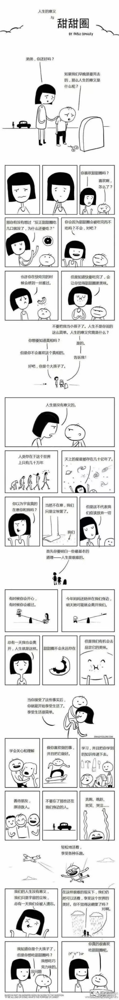

# 121~130

## 121、抽烟不好，为啥国家不禁烟？

吸烟 -> 每年10万人死亡 -> 财政角度 -> 40亿收入 -> 25000个工作岗位、出口业蓬勃发展

烟民为了同胞牺牲自己

➹：[抽烟不好，为什么国家不禁烟? - 知乎](https://www.zhihu.com/question/22079523)

## 122、矛盾论？

➹：[7分钟读懂矛盾论 - 知乎](https://zhuanlan.zhihu.com/p/52724855)

➹：[矛盾 - 知乎](https://www.zhihu.com/topic/19579185/hot)

➹：[马哲通俗之美 - 8 辩证法 - 矛盾 - 知乎](https://zhuanlan.zhihu.com/p/83955399)

➹：[矛盾 - 维基百科，自由的百科全书](https://zh.wikipedia.org/wiki/%E7%9F%9B%E7%9B%BE)

➹：[逻辑 - 维基百科，自由的百科全书](https://zh.wikipedia.org/wiki/%E9%80%BB%E8%BE%91#%E6%9C%AC%E8%B4%A8)

➹：[辩证法 - 维基百科，自由的百科全书](https://zh.wikipedia.org/wiki/%E8%BE%A9%E8%AF%81%E6%B3%95)

➹：[浅谈怎么理解矛盾分析法 - 知乎](https://zhuanlan.zhihu.com/p/37374816)

➹：[陈定学：究竟什么是矛盾_爱思想](http://www.aisixiang.com/data/51322.html)

## 123、心里有个疑问，那就是很热爱生活，但假如遭受无妄之灾死掉了，会不会觉得很遗憾、很可惜？

> 如果你不 热爱 生 活，请选择 死 亡

可热爱生活，但害怕死亡呢？

坦率的说

你热爱不热爱 时光都会流逝

你畏惧不畏惧 死亡都会来临

当死亡来临 你也做不了什么

so 安心搬砖 别多想

➹：[有没有热爱生活超过畏惧生死的人？ - 知乎](https://www.zhihu.com/question/287338071)

➹：[为何顾城，海子，杰克·伦敦这些热爱生活的人会自杀？ - 知乎](https://www.zhihu.com/question/40623908)

➹：[如何既热爱生活，又不畏死亡？ - 知乎](https://www.zhihu.com/question/329093008)

➹：[你有过哪些「无妄之灾」的经历？ - 知乎](https://www.zhihu.com/question/52537117)

## 124、生活的本质？

➹：[明天和意外哪个先到？ - 知乎](https://www.zhihu.com/question/31429186)

➹：[罗曼罗兰曾经说过，真正的英雄主义在了解生活的本质后依然是热爱生活。那么我想请问生活的本质究竟是什么？ - 知乎](https://www.zhihu.com/question/303888583)