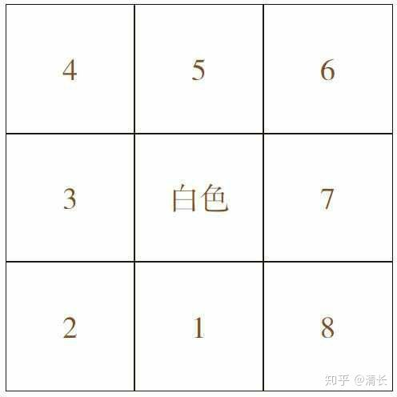
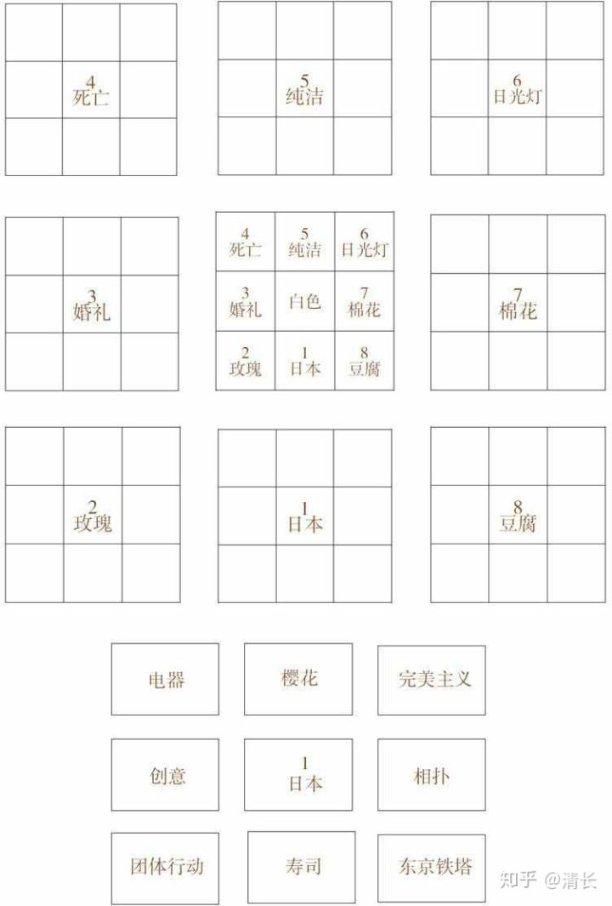

# 141~150

## 141、关于孤独？

孤独二字在这本小说里描述得非常不错：

[第254章 孤独与死亡_万古最强驸马](https://www.shuhaige.com/101800/426580.html)

我意识到自己之所以学习前端，是为了让自己有事可做，而不感到很孤独！

我们害怕失去，其实并不是害怕东西的失去，而是害怕失去后的那种孤独……

孤独不会消失，哪怕天崩地裂，哪怕宇宙毁灭

我们能做的就是紧抓眼前的一切，小心翼翼地守护着每一个自己所熟悉的人或者物

其实，我长久以来的胃病有何尝不是作为一种抵抗孤独而存在的东西呢

孤独可怕，也不可怕，关键在于你怎么看待孤独，以及怎么看待身边所发生的任何事物……

之前父母会老家，突然感到自己一人在家有种不适，其实是自己感到孤独了……

就像分手那样，分手过后，会过一段时间之后才恢复过来，因为你正在适应一个人的生活……

## 142、思虑周全？

引子：做出一个选择，需要考虑许久……

优柔寡断是想到了几个条件，但是在几个之间摇摆，迟迟无法决断。

思虑周全是各个方面考虑到了，会权衡各个方面，然后做出决断。

或许，在这里面有个核心的是：什么是最关心的因素，确定好，然后弊端等都能接受，拥有这份勇气，也就可以下决断了。

➹：[优柔寡断和思虑周全的区别？ - 知乎](https://www.zhihu.com/question/295203557)

## 143、什么叫形式化？

形式，[汉语词汇](https://baike.baidu.com/item/汉语词汇/2452931)，汉语拼音为 xíng shì，在中文中，形式是指某物的样子和[构造](https://baike.baidu.com/item/构造/11051570)，[区别](https://baike.baidu.com/item/区别/33208)于该物构成的材料，即为事物的外形。也有指[办事](https://baike.baidu.com/item/办事/5490390)的方法。形式犹言表象。

形式：指事物的外表，也指办事的方法。

➹：[形式（汉语词语）_百度百科](https://baike.baidu.com/item/%E5%BD%A2%E5%BC%8F/2090323)

➹：[形式化_百度百科](https://baike.baidu.com/item/%E5%BD%A2%E5%BC%8F%E5%8C%96)

➹：[形式 (哲学) - 维基百科，自由的百科全书](https://zh.wikipedia.org/wiki/%E5%BD%A2%E5%BC%8F_%28%E5%93%B2%E5%AD%B8%29)

➹：[沉迷「形式化方法」 - Holmes Conan's Lab](http://www.holmesconan.me/%E9%9A%8F%E7%AC%94/2018/07/20/formal-method.html)

➹：[形式化方法（formal method） - 知乎](https://zhuanlan.zhihu.com/p/62986903)

➹：[什么是形式化方法？_电脑软件_技术_天涯问答_天涯社区](http://wenda.tianya.cn/question/1b2ade04f1896d18)

➹：[什么是形式化验证？ - 知乎](https://zhuanlan.zhihu.com/p/56369013)

➹：[哪个故事真正符合你对形式化验证的想象？ - 链闻 ChainNews](https://www.chainnews.com/articles/272630338740.htm)

## 145、拘泥？

- v -> 固守某种东西，不知变通 -> 拘泥书本
- adj -> 拘谨；拘束 -> 老熟人了，不必那么 拘泥！

## 146、思想自由，兼容并包？

➹：[如何做到“思想自由、兼容并包”? - 知乎](https://www.zhihu.com/question/31341492)

## 147、专科考研？

➹：[专科生考研怎么考？我是大专生，毕业三年，可以考研了吗？如何报名？ - 知乎](https://www.zhihu.com/question/31231460)

➹：[专科考研参考院校（浙江）](https://mp.weixin.qq.com/s/49jo96Vtqc-sOvp5fZZwRA)

➹：[专科生可以考研吗？报考常见的20个疑问 - 知乎](https://zhuanlan.zhihu.com/p/27585803)

## 148、思维体操？

思维体操 -> 简单理解就是「思维跳跃」，能让你思维体操的东西，就是可以锻炼你思维的东西

如数学、编程等都是这样的东西

➹：[数学：思维体操 - 知乎](https://zhuanlan.zhihu.com/p/37544938)

➹：[谈谈数学思维的重要性？ - 知乎](https://www.zhihu.com/question/29152961)

➹：[思维体操_百度百科](https://baike.baidu.com/item/%E6%80%9D%E7%BB%B4%E4%BD%93%E6%93%8D)

## 149、关于「举一反三」？

无法举一反三：

> 你还没有找到内在的规律。
>
> 你需要从一个问题中提炼出本质，这样多个具有相同本质的问题也就迎刃而解。

> 先走一项能力达到化境是基础…

**具体点的培养举一反三的能力：**

来自[清长](https://www.zhihu.com/question/20827125/answer/973949979)的回答：

这里有一种方法可以培养和训练举一反三的能力。

**曼陀罗思考法：同步挖掘出思考的深度和广度**

这个方法最先是在一本书中作者提到的，看了之后自己按方法实践之后，特别有用，便分享出来。

这里的深度和广度指的是**垂直思考和发散性思考。**

**而题主想要加强的便是发散性思考，**这也是举一反三的能力。

要培养举一反三，要简单了解这两种思考。

> **垂直思考：**是一种逻辑式思考，讲究顺序严谨、逻辑推理的合理性。也是思考的深度，我们必须养成追根究底的精神，运用“判断力”一步步地进行，每一个步骤都必须说得出原因，而且要正确。强调深入问题找出答案，并把焦点放在找出最好的方法上**，一旦找到最佳的选择方法，我们便会立刻停止思考活动。**
>
> **发散性思考（水平思考）：**就是加大思考的广度，突破自我设限的思考。在思考的过程中强调通过“自由联想”让思考像脱缰野马一样，想到什么就写什么。强调思考的数量与流畅度，想的越多越好。这种能力，让我们在解决问题时，**并不是只找出“一个正确答案”。我们不仅要想出第二个答案、第三个答案，甚至想出第十个答案。**这就是扩散式思考

水平思考与垂直思考在我们日常生活中其实常常被使用。

> 例如：在一般“数学解题”的开始，通常要运用“水平思考”来决定某一个解题方向或思考方向，试试看能不能解。（除非对这一个题型已经很熟悉了。）有时一个解题的想法直接就冒了出来，而且也说不出为什么会想到如此解。如果想不出解题的方向，就只能继续运用水平思考寻找可能的解题方向。一旦想到解题方向后，我们会开始进行下一步的逻辑推理或计算，这时就是进行典型的“垂直思考”。

接下来说的仅仅是曼陀罗思考的基本概念，感兴趣自己可以深入研究。

首先请大家在第一层的曼陀罗（上图的九宫格形式就叫曼陀罗）内，八个空白格子内填上跟中心主题相关的词语。

发现了吗？这个曼陀罗也是水平思考！

例如刚刚的八个答案分别有日本、玫瑰、婚礼、死亡、纯洁、日光灯、棉花、豆腐。**分别再延伸出下一层次的曼陀罗，接着把这八个答案分别作为八个曼陀罗的主题。**

从白色想到日本，日本想到完美主义，这个过程不就是垂直思考吗？

现在已经有了8×8=64个答案了，如果你有兴趣的话，可以再用这样的方式进行

8×8×8=512个答案

这个方式叫做曼陀罗中的曼陀罗，可以同时训练水平思考与垂直思考。**思考就不再是一种单向或是单层次的思考，而是形成一种思考的网络。**

**透过这样的练习就能打开我们大脑的联想能力：看到这个想到什么？联想能力就是举一反三的能力，也就是解决问题的能力**，能不能想到别人没有想到的，比别人更早一步找到解决方法。

垂直思考里的逻辑判断有时会有错误，因为我们不可能把每个念头逐一实验，所以我们应该避免完全依赖垂直思考，须辅以水平思考方法。

> 一个点 -> 以这个点为中心画九宫格 -> 联想8个点与这个点建立联系 -> 套娃

➹：[不能举一反三是知识能力不够还是发散思维不够？ - 知乎](https://www.zhihu.com/question/46363721)

➹：[如何拥有触类旁通、举一反三的能力？ - 知乎](https://www.zhihu.com/question/346691137)

➹：[如何培养举一反三的能力？ - 知乎](https://www.zhihu.com/question/20827125)

## 150、有很多知识扑面而来，我顶不住了？

> 知识看的太多是否会失去思考能力？

[知识看的太多是否会失去思考能力？ - 雨天蘑菇的回答 - 知乎](https://www.zhihu.com/question/374987196/answer/1040892828) ：

知识和思考能力没有关系。

知识本身不存在让人失去思考能力的功能。

但是确实存在这样的人，因为知识太多而失去思考能力。

让我们先来看下，这些人是些什么样的人。一般因为知识太多而失去思考能力的人，只把知识储备作为目标，就是说知识本身就是他们的最终目的。我们通常叫这种人，书呆子。

把知识本身作为追求目标的问题在哪里呢，就是知识本身不创造价值，运用知识解决问题，才能创造价值。最直接的事例，参考屠龙之技。

知识绝对不会影响人的能力，但是过多的知识储备，会扭曲人对自我能力的认知，把知识本身误解为价值。如前所述，知识没有价值，解决问题才有价值。

但是我们会尊重传承知识的人，因为很多知识是无数代人的积累与提炼，储存并传承知识就是他们的工作，这样的工作本身也是有价值的。

综上所述，知识和思考能力没有关系。

> 如果你学到的知识无法解决你的问题，那么这样的知识是死的，是无用的……

➹：[知识看的太多是否会失去思考能力？ - 知乎](https://www.zhihu.com/question/374987196)

➹：[学习的智慧](http://www.yinwang.org/blog-cn/2019/07/12/learning-philosophy)

