# 161~170

## 161、为啥要去理解一个数学公式的推导？

我看了这个答案之后：

[阶和公式 - 文三十的文章 - 知乎](https://zhuanlan.zhihu.com/p/88704434) 

我就明白我为啥学不好数学了

其中一部分来自老师，另一部分来自于自己，来自于自己这部分原因很简单，那就是「自己只听一个老师讲这个东西」，而自己不主动去了解其它老师是如何讲解同一个东西的，如果你很认真上课，但也没听懂这个老师A所讲的，那么你就换一个老师B来听听，即便其它同学听懂了A所讲的！当然，这也不是一直套娃下去的，「货比三家」即可

## 162、人类的本质是复读机？

➹：[为什么会出现「人类的本质是复读机」这一现象？ - 知乎](https://www.zhihu.com/question/60779889)

## 163、自己关于对「模型」二字的理解？

学过JS的童鞋都应该了解过「DOM事件模型」吧

那么这「模型」二字该怎样理解呢？ -> 可以理解为「规则」之意哈 -> 如「DOM事件规则」有捕获和冒泡这两种规则

关于后端里边的MVC的M层——Model层：

可以把它理解为「模型层」

假设我们后端用的是Node.js、MongoDB ，那么Node.js 与MongoDB之间通信的桥梁来自于mongoose

而mongoose可以为我们创建数据模型 -> 即数据规格，如一个集合里边有哪些字段 -> 这里的模型就有种「模具」的意思在里边了

广义上，给模型的意思：

- n -> 仿照实物或图样按比例制作的物品 -> 「火箭 模型」
- n -> 铸造机件、器物等的模（mú）子 -> 「铸件 模型」

但这是中文的意思，我们应该关心的是英文「model」的意思：

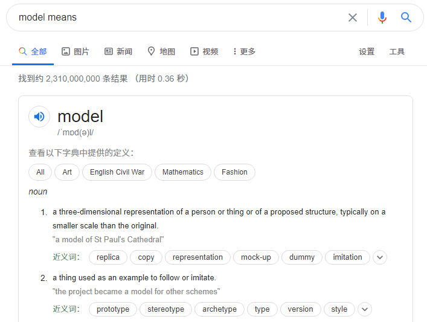

摘抄一个在Node.js 里边定义model的代码片段：

```js
const mongoose = require('mongoose');
const Schema = mongoose.Schema;
const userSchema = new Schema({
    userId: Schema.Types.ObjectId,
    userName: { unique: true, type: String },
    password: String,
    createDate: { type: Date, default: Date.now() }
});
```

从中可以看到一个「Schema」的词汇：

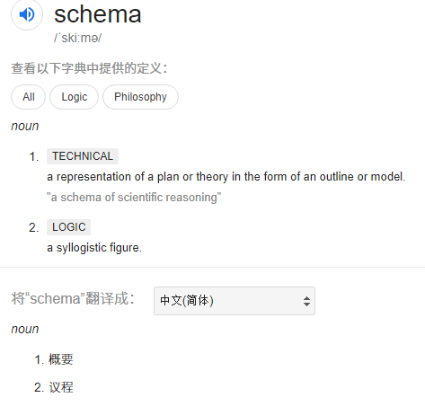

看它的第一个在技术层上的解释：以大纲（略图、轮廓）或模型的形式表现一个计划或理论 -> 一种科学推理的模式

可见，mongoose之所以用 `schema`，是因为这表示的是一个集合的概要、轮廓，也就是所谓的 `model`

推荐一个网站：

[What does model mean?](https://www.definitions.net/definition/model)

该网站给出了一个英文名词，在各种场景下的意思

**model, theoretical account, framework** *(noun)*

从中我可以认为「model」，在计算机里边广义上就是「描述」之意

> a hypothetical description of a complex entity or process（**对复杂实体或过程的假设性描述**）

如：

> *"the computer program was based on a model of the* *circulatory* *and* *respiratory* *systems"*

计算机程序是基于循环和呼吸系统的模型 -> 你也可以说计算机程序是基于循环和呼吸系统的一种过程描述 -> 说白了模型的本质含义就是「依葫芦画瓢」，如人吸气和呼气对应着计算机程序的输入和输出……

以上所知就是基于我所看到的解释然后自行对「model」理解的结果……

## 164、自己关于对进制的理解？

我们知道行李箱的密码锁是长这样的：

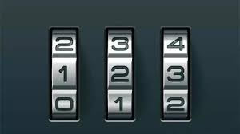

> 图中三个输入密码，从左到右分别表示为CBA

我们知道表示数字的字符有10种，分别是0123456789

那么问题来了，在十进制下：

如何理解9这个数字？

> 看A，密码锁从0开始，滚动数字为9的那个数字

**注：你可以把「9」看作是「000…0009」**

如何理解10这个数字？

> 看A和B，A从「9」滚回到0，B从「0」滚动1，这样「BA」就是「10」了

同理，如何理解100这个数字都是一样的道理，即你把每一位（如A就是个位）都当作是一个「**圈圈**」，随着数值的增大，如从10到100，必然有「位」发生「圈圈旋转」

同样，在二进制里边，它只有01两个数字字符，这意味着从「0」转动到「1」，再转回到「0」只需要两下即可！

具体如下：

```
// 十进制一位需要旋转10下回到原位置
0 -> 1 -> 2 -> 3 -> 4 -> 5 -> 6 -> 7 -> 8 -> 9 -> 0

// 二进制一位需要旋转2下回到原位置
0 -> 1 -> 0
```

话又说回来，如何从10进制转换成2进制？

具体点来说，如何让10进制的「66」转换成数值大小为「66」的2进制表示姿势？

方法一：

用工具算就好了

方法二：

```
// 把8个位的二进制数看成是这样子的：
128 64 32 16 8 4 2 1

// 那么66可表示为：
0100 0010
```

➹：[进制转换的原理是什么？ - 知乎](https://www.zhihu.com/question/20993504)

➹：[进制及计算机表示 - 知乎](https://zhuanlan.zhihu.com/p/24313237)

➹：[二进制、十进制和十六进制数](https://www.shuxuele.com/binary-decimal-hexadecimal.html)

## 165、我看到了这样一句话「这世界本就没有任何一句话可以让你醍醐灌顶。真正叫你醍醐灌顶的，只能是一段经历。而那句话，只是火药仓库内划燃的一根火柴。」？

给了我很大的感触，按照自己的理解：

火药就是「一段经历」，如果没有这么「一段经历」，那么这就意味着你在没有火药的仓库里边划燃了一根火柴，而这显然毫不起眼……

讲真，这句话确实让我醍醐灌顶了，但它只是划燃了我的引火线而已，真正让我「爆炸」的是我自身的一段段经历……

➹：[《一句顶一万句》经典语录_经典名句语句摘抄赏析-名言通](https://www.mingyantong.com/article/%E4%B8%80%E5%8F%A5%E9%A1%B6%E4%B8%80%E4%B8%87%E5%8F%A5)

➹：[有没有一句话影响你很多年？ - Unique111清欢的回答 - 知乎](https://www.zhihu.com/question/362280797/answer/1140986913) 

## 166、关于大起大落？

来自「匿名用户」的回答：

高考前最后一次模考 考了698（我是重点中学文科生 满分750） 年级第一 老师说冲清北保人大复旦

高考考了598 只上了一个211

当时因为没考好 心里不高兴 跑到家门口的subway打工 知道成绩的时候正在骑着电动车送外卖 走了一路逆行我想着别活了算了

不知不觉现在大四了 过了开心充实的四年 交到许许多多好朋友 保研到一所C9 非常非常舍不得离开母校

我想起前年去越南旅行的时候 在餐厅遇到过一个以色列人 聊的很愉快 我说你们犹太人智商最高了 为什么都这么有智慧 她告诉我 他们每当遇到什么 都会想 你三年后回过头来看 会是怎么样 这样 任何起落都没有什么 与大家共勉o(^o^)o

> 遇到困难？ -> 穿越未来，来到三年后的今天，仔细回想三年前的今天所遇到的那个困难 -> 也就那样，这终究会过去！时间会冲刷一切，不管是具象的东西，还是抽象的东西！

有追求就会有起落，没有人一生都是完美的！当然，所谓的完不完美，得看自己怎么看！

只有大起大落和饱经沧桑之后，才能做到看淡世俗，宠辱不惊

➹：[大起大落是一种怎么样的体验？体验？ - 知乎](https://www.zhihu.com/question/29686885/answer/45802283) 

➹：[人的一生一定会有大起大落吗？有没有人一生都很完美？ - 知乎](https://www.zhihu.com/question/62777285)

➹：[人生该选择看淡世俗、宠辱不惊，还是应该大起大落，饱历沧桑？ - 知乎](https://www.zhihu.com/question/38793841?sort=created&page=4)

## 167、公口、母口？

最早是谁形容公头母头的已经无从考证。不过英语里面也是这么叫的，公头Male，母头Female。

为什么叫公头母头呢？因为凡事与性联系起来，就会产生无穷的想象力创造力和传播力

针与孔， 凸与凹，公与母，插与被插。。。就酱紫。


以上是从外观上区分

从字面上来看是这样子的：

- 公口是plug（插头），母口是receptacle（插座）
- Male pin（大头针）和Female socket（凹处）
- Female to male jumper wire

总之，仿生学原理嘛，公的凸出来，母的凹进去，然后你应该懂了

➹：[为什么各种线材的接头（口）要叫公、母头？ - 知乎](https://www.zhihu.com/question/22606710)

## 168、我想买个移动机械硬盘？

一定要买移动硬盘盒+独立硬盘。不建议买合体的移动硬盘。

我之前买了这样一个硬盘：

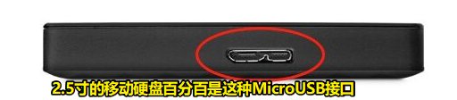

[【东芝新小黑A3系列】东芝(TOSHIBA) 1TB USB3.0 移动硬盘 新小黑A3 2.5英寸 兼容Mac 轻薄便携 稳定耐用 高速传输 爆款 商务黑【行情 报价 价格 评测】-京东](https://item.jd.com/6461405.html#none)

上图这种接口（MicroUSB）的硬盘盒其实还分两种：

1. 一种外壳MicroUSB，内部是SATA口硬盘转接
2. 一种外壳MicroUSB，内部没SATA口

第一种还好，大不了买个盒子加装好就可以继续用，但是这不是浪费钱嘛，所以我也不推荐

而第二种是USB口直接焊在主控板上的，一体式的，而之所以这样做是为了厂家减少成本，但是维修成本增高了，目前主流的移动硬盘都是这样的，这种口很容易坏，如果硬盘故障了就GG了（这种口对应的主控板相对稀少，恢复数据找匹配很难，一般需要找到同一批次的一模一样的板才能修好，毕竟主控板和硬盘一般都是一一绑定的），而且现在又更好的type-c口了，我们买这样的硬盘就是在清库存……所以，我之前买的这个1T的硬盘就是被割韭菜了……

如果是第一种这样的SATA口硬盘，同型号的主控板是比较好找的，专业数据恢复机构是比较便宜的

一般硬盘故障是因为：


这种设计很不好，容易接触不良，如果供电断断续续的，就很容易伤害主控版，导致其烧掉，最后硬盘故障

我们用硬盘盒这个方案，本身也是一种转接板，但是这种转接板很大、非常牢固，即插入不会晃动的很厉害，而且支撑性也非常好，而下边这种转接板方案就是不好的：

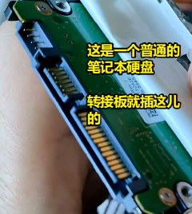

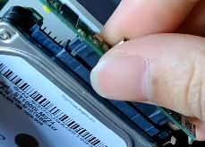

> 图中这个手上拿着的就是不好的转接板 -> 该转接板比我们单独买个转接板要小巧得多

以上就是「笔记本硬盘+转接口」的方案了

Type-c接口的好处 -> 容错机制牛逼，可以起到很好的保护，大大降低主控板被烧的情况

Tips：

如何正确使用移动硬盘？

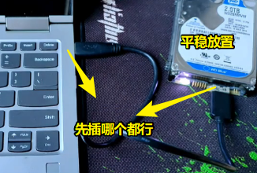

硬盘弹出，不要直接插拔，而是选择硬盘那个符号，右击「安全弹出」，这样才会安全断电，停止硬盘旋转

查看硬盘的健康程度：

使用 「CrystalDiskInfo 8.4.0 x64」

如果你在淘宝上看到一些硬盘很便宜，那么这很有可能是翻新盘，而这些盘来自于收购的故障盘，毕竟这些故障盘的收购价格也是还可以的

7200转的硬盘一定比5400快吗？

脱离了存储密度谈转速是没有意义的。在同样的存储密度下，转速越高，越快。但不同存储密度的时候，就要具体分析了。（类比，用电动车和单车送外卖送的单数，如果送的小区很稀疏，那么转速快（电动车）也没用，如果送的小区很密集，那么转速慢（单车）也有春天）

现在有了10000RPM甚至更高转速的硬盘，但往往用在高端的服务器等SAS硬盘中。笔记本硬盘大多数还是5400RPM转，这和价格以及耗电有关。

不要买叠瓦式磁性记录 (SMR)的硬盘，而是垂直磁性记录 (PMR)

买硬盘需要考虑转速、缓存、存储量、价格……

硬盘盒子选择绿联的type c转接口盒子

购买这个机械硬盘，以及硬盘盒：

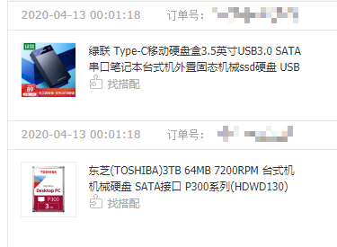

硬盘装好后，在电脑里边使用，要自行分区：

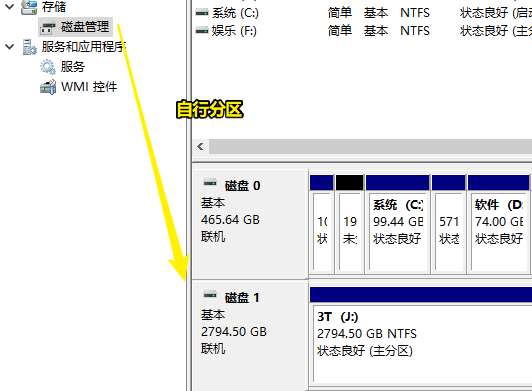

➹：[西部数据移动硬盘插电脑上不显示？ - 知乎](https://www.zhihu.com/question/46979578)

自己新买这个硬盘的测试情况：

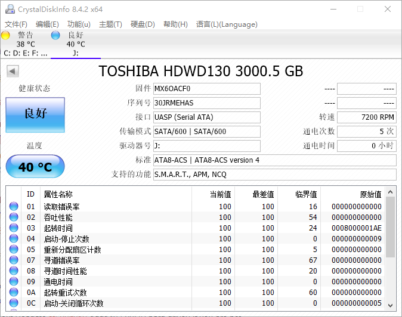

目前笔记本内置的硬盘情况：

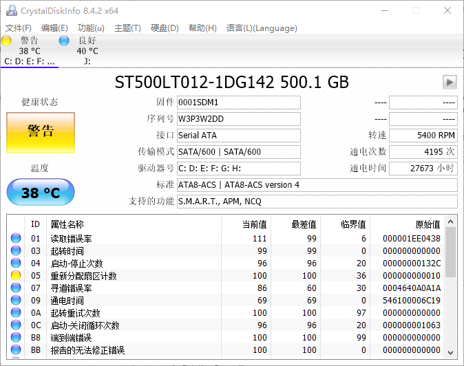

> 要备份数据了……

➹：[硬盘出现“重新分配扇区计数”怎么办？_百度知道](https://zhidao.baidu.com/question/689492265418635324.html)

➹：[想买一个移动硬盘，有哪些推荐？ - 知乎](https://www.zhihu.com/question/27516350)

➹：[移动硬盘买了没多久就坏了，可能你没选对接口_哔哩哔哩 (゜-゜)つロ 干杯~-bilibili](https://www.bilibili.com/video/av91379739?pop_share=1)

➹：[移动硬盘的那些事儿「视频」 - 知乎](https://zhuanlan.zhihu.com/p/108850572)

➹：[如何选择移动硬盘.pdf](https://docs.qq.com/pdf/DQnRJak5OYW51eW1D)

➹：[为什么硬盘转速是5400或者7200这么奇怪的数字？7200转的硬盘一定比5400快吗？ - 知乎](https://zhuanlan.zhihu.com/p/38847308)

➹：[PMR 和 SMR 硬盘分别是什么？哪个好？(站长已挂一个SMR盘，怒更：赠送常用PMR硬盘型号)_技术笔记-IT密码](https://www.itpwd.com/378.html)

## 169、不可漂白和不可干洗？

有人说「衣服上写着不可漂白就是不能用洗衣粉洗吗？」

1、不是的。就是说**不能用任何带有增白性质的洗涤剂**：如84漂白液，彩漂，漂白粉，增白皂等所有能够给衣服增白的产品。

2、不可漂白：一般的漂白剂，都带有一定的腐蚀性，非常的拿颜色，证明此种衣料受到漂白剂的腐蚀非常容易掉色，到时衣服就报销了，所以不可以漂白。但请您注意,一般真丝或毛料衣物最好不用洗衣粉,因为洗衣粉的碱性较高,对真丝和毛料衣物负面影响比较大,应选用**中性洗涤液**。

3、不能用任何带有增白性质的洗涤剂：如84漂白液，彩漂，增白皂等所有能够给衣服增白的产品。洗衣粉是一种碱性的合成洗涤剂，洗衣粉的主要成分是阴离子表面活性剂:烷基苯磺酸钠，少量非离子表面活性剂，再加一些助剂，磷酸盐、硅酸盐、元明粉、荧光剂、酶等，经混合、喷粉等工艺制成，现在大部分用4A氟石代替磷酸盐。

知识拓展：

1、洗衣粉在使用过程中并**不能完全溶解，残留物容易导致衣物损伤，并且不易漂洗**；而洗衣液能够完全溶解且溶解速度快，易漂易洗，不会伤及皮肤和衣物。

2、洗衣粉都是强碱性的(PH值超过12)，在使用过程中需要戴手套，以减少对皮肤的刺激；而洗衣液PH值偏中性，配方温和不伤手。

3、洗衣液的技术含量更高，便于添加各种有效成分，洗后会另衣物蓬松、柔软、光滑亮泽，并且具有除菌和持久留香的功效。使用综合成本低，正被人们广泛的接受。

结论：

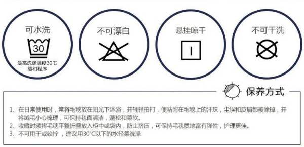

使用中性洗衣液……我那件Polo衫因为用洗衣粉太多，导致褪色了……

➹：[男式精梳棉经典POLO衫 - 甄选面料，经典百搭版型 - 网易严选](https://you.163.com/item/detail?id=3408050&_stat_area=2&_stat_referer=search&_stat_query=polo&_stat_count=81&_stat_searchversion=vec_model-1.0-1.0)

➹：[洗碗的洗洁精、洗衣液、洗手液中，哪个是中性洗涤剂？ - 知乎](https://www.zhihu.com/question/29506975)

➹：[洗碗的洗洁精、洗衣液、洗手液中，哪个是中性洗涤剂？ - 知乎](https://www.zhihu.com/question/29506975)

➹：[衣服上写着不可漂白就是不能用洗衣粉洗吗？_百度知道](https://zhidao.baidu.com/question/444657087.html)

## 170、关于「横看成岭侧成峰」？

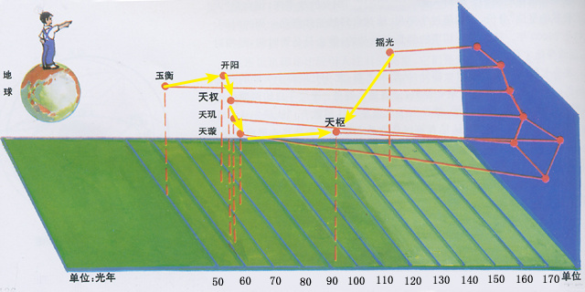

这张图你正面看的投影是勺子，但是你侧面看，你就会发现这就不是勺子了，你想象一下你正面悬浮着里7颗球，离你远近不一，你侧面投影一下，就会发现这不是勺子了……

那么「横看成岭侧成峰，远近高低各不同。不识庐山真面目，只缘身在此山中」是啥意思呢？

「横」：横亘、横穿、横陈等等词语，横在里面都有正面的意思。可以意会为横放在眼前的样子。山势是躺着的……

译文：

从正面看庐山山岭连绵起伏，从侧面看庐山山峰耸百立，从远处、近处、高度处、低处看庐山，庐山呈现各种不同的样子。之所以辨不清庐山真正的面目，是因为我人身处在庐山之中。

➹：[苏轼《题西林壁》“横看成岭侧成峰，远近高低各不同”全诗翻译赏析](http://www.exam58.com/ssssc/798.html)

➹：[横看成岭侧成峰，远近高低各不同．不识卢山真面目，只缘身在此山中．的诗意_百度知道](https://zhidao.baidu.com/question/45119602)

➹：[战导 的想法: 横看成岭侧成峰，如果你能从另一个方向看… - 知乎](https://www.zhihu.com/pin/1121651568998633472)

➹：[小熊星座、大熊星座、北极星、北斗七星，到底啥关系? - 知乎](https://zhuanlan.zhihu.com/p/31517700)