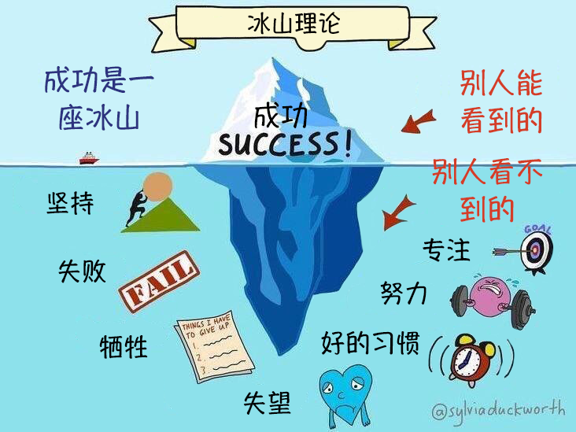

# 181~190

## 181、金线论？

> 文学的标准的确很难量化，但是文学的确有一条金线，一部作品达到了就是达到了，没达到就是没达到，对于门外人，若隐若现，对于明眼人，一清二楚，洞若观火。“文章千古事，得失寸心知”。虽然知道这条金线的人不多，但是还没死绝。这条金线和销量没有直接正相关的关系，在某些时代，甚至负相关，这改变不了这条金线存在的事实。

➹：[冯唐的文学「金线论」有道理吗？ - 知乎](https://www.zhihu.com/question/20255177)

## 182、CIS （computer information system）和 CS？

你好，感谢邀请，除了偏商科方面的不同，CS和CIS的最大的区别是**CS注重科学和数学的原理**，而**CIS专注于系统本身**。现在请你在抽象地考虑这个问题，把所有系统想成由代码和硬件组成。 CS专注于怎么样从细节中组成和处理代码和硬件功能，而CIS则专注于将不同的应用程序和工具组合在一起来形成整个系统。

在一个公司里，CIS团队通常是为多个系统开发数据库，但CS 员工也可以在系统级别工作。

如果你喜欢编码或解决详细的算法，那么CS就是一条很好的道路。如果你希望为组织修复信息系统的大型集成问题，那么CIS会更好。希望回答可以帮助你。

➹：[CIS 和CS 怎么选择？ - 知乎](https://www.zhihu.com/question/314763311)

## 183、如何判断一个程序员是不是真得牛逼？

java的编译器跟这两个人都没什么关系

别一天到晚鄙视这个鄙视那个

java的编译器在学术范畴里面有正经的工作在做

[https://github.com/oracle/graal](http://link.zhihu.com/?target=https%3A//github.com/oracle/graal)

graal有六七所大学提供奖学金

[https://www.graalvm.org/community/internship/](http://link.zhihu.com/?target=https%3A//www.graalvm.org/community/internship/)

这是真编译器的项目和研究

然后关于什么透明协程的那玩意，这个也是有正经project在做

[https://github.com/openjdk/loom](http://link.zhihu.com/?target=https%3A//github.com/openjdk/loom)

没听说这两人对这些东西有什么贡献，别张嘴就是这牛逼那吃透的

有本事去贡献代码，都是开源的，贡献了所有码农都感谢贡献者

直接贴出链接来我们瞻仰一下

没有贡献，一天到晚这个牛逼那个牛逼，烦不烦啊？

真牛逼落实一下行不行啊？别老是停留在口头上

没贡献出来谁知道是不是真牛逼啊？

如果要走学术路线，那论文甩几片出来啊？

如果要走码农路线，那开源项目甩几个出来啊？

什么都没有，一天到晚blablabla也就当个娱乐圈看笑话了

## 184、编译器课件？

➹：[CIS 341 Spring 2020](https://www.cis.upenn.edu/~cis341/current/)

➹：[如何评价阿里 P10 赵海平对王垠的面试？ - LESSuseLESS的回答 - 知乎](https://www.zhihu.com/question/360622233/answer/944141354) 

## 185、狡猾的狐狸？

有一个大数学家（高斯还是欧拉？）被称为狡猾的狐狸。狐狸的特点是在雪地上行走时，会用尾巴扫掉足迹~~~这位伟大的数学家，会把自己思考的过程藏起来

高斯吗？有听闻高斯不公布自己的思考笔记一类，不过我看到的原因是因为他不认为那些有价值，所以只公布自己认为有价值的研究

➹：[王垠的「40 行代码」真如他说的那么厉害吗？ - 知乎](https://www.zhihu.com/question/20822815)

## 186、关于总线（bus）这个概念？

> 搜索「IO总线设计思想 site:zhihu.com」

总线是指计算机组件间规范化的交换数据的方式，即以一种通用的方式为各组件提供数据传送和控制逻辑。从另一个角度来看，如果说主板是一座城市，那么总线就像是城市里的公共汽车，能按照固定行车路线，传输来回不停运作的比特。这些线路在同一时间内都仅能负责传输一个比特。

> bus既是总线也是公共汽车，这是由公共汽车形成的线路，即你把公共汽车看成是一条线路……你说是道路成全了公共汽车，还是公共汽车成全了道路……还是而这互相成全

➹：[计算机漫游 - 知乎](https://zhuanlan.zhihu.com/p/27169360)

➹：[简介：总线、接口、存储、封装 - 知乎](https://zhuanlan.zhihu.com/p/54029324)

➹：[【重学计算机】计算机组成原理 - 知乎](https://zhuanlan.zhihu.com/p/60958907)

## 187、原生家庭？

一个人的成长环境会影响到自己的新生家庭，当然这种影响，在客观上是有好有坏的……

➹：[到底什么是原生家庭？ - 失望的人的回答 - 知乎](https://www.zhihu.com/question/278351258/answer/400444994) 

➹：[如何评价电视剧《不要和陌生人说话》？ - 知乎](https://www.zhihu.com/question/29428415)

## 188、什么是「冰山理论」？

有关‘冰山一角’的图片和理论相信大家都不陌生。它指一个人就像一座冰山一样，我们能看到的只是表面很少的一部分——行为，而更大一部分的内在世界(包括行为、应对方式、感受、观点、期待、渴望、自我)却藏在更深层次，不为人所见，恰如冰山。其实这个理论亦适用于成功之路。一个人人生事业的成功，往往只是旁人看到的外在的很小一部分，被隐藏在‘成功’这一冰山一角下的是努力，专注，好的习惯，失败，牺牲，失望以及坚持。 

**在之前推送的有关职业发展的一门课程中，我们强调实现个人目标的秘笈是：**

- 了解自己的工作职责，对自己有合理的期待
- 保持耐性，职业发展需要时间
- 保持积极的态度，并找到方法做出成绩
- 面对挑战时，不要放弃
- 一步步为自已创造机会
- 为自已的将来定下清晰且实际的目标，并寻求帮助

俗话说「不经一番寒彻骨，怎得梅花扑鼻香？」没有一蹴而就的成功，天上也不会掉馅饼。台上一分钟，台下十年功！让我们一起看下世界上从失败到成功的典型案例：

史蒂夫乔布斯被苹果公司解雇。这次解雇让他意识到他对工作的热情远超过失败带来的沮丧。最终他以CEO身份重回苹果公司。（）

哈利波特的作者克罗林获得成功前，只是一个离婚的，失业的单身母亲，挣扎着维持生计。

迈克尔乔丹曾经说过：“我的职业生涯中有9000多个球没有投中，输掉了差不多300场比赛。还有26次，队友把决定比赛的最后一球传给我，结果我没投中。我的人生中失败过一次又一次，这才是我成功的原因"。

➹：[冰山理论_百度百科](https://baike.baidu.com/item/%E5%86%B0%E5%B1%B1%E7%90%86%E8%AE%BA)

➹：[微助（WeSupport）](http://m.ccrcsr.com/young/infoview.php?ID=152&SortID=3)

➹：[乔布斯为什么选择现在辞职？- 果壳 科技有意思](https://www.guokr.com/article/60608)

➹：[1985年乔布斯被赶走冤不冤？ - 知乎](https://zhuanlan.zhihu.com/p/19961969)

➹：[如何更深刻的理解冰山理论？ - 知乎](https://www.zhihu.com/question/22717178)

➹：[冰山理论（上）：一句话就是一篇故事 - 知乎](https://zhuanlan.zhihu.com/p/25381086)

➹：[冰山理论 - 知乎](https://zhuanlan.zhihu.com/p/53655174)

➹：[每日分享：什么是萨提亚的冰山理论？ - 知乎](https://zhuanlan.zhihu.com/p/83918767)

## 189、关于「怒江」？

➹：[云南怒江州少数民族的生活状况如何？ - 知乎](https://www.zhihu.com/question/21192186)

➹：[《走路上学》是真实故事改编的吗？ - 知乎](https://www.zhihu.com/question/354226862)

## 190、承认自己的平凡？

在观看创造营2020（第一集）的过程中，我真觉得她们是「神仙」，从101位女生里边选取7人，这难度真得忒难了……我从2009年看快乐女生到现在的创造营2020，我从13岁到现在的24岁，我发觉这出道的标准越来越高了……

人只有不断学习，才能不被时代所抛弃……

我愈发意识到自己的平凡了，我想创造营2020里边的101位女生，她们也会有这样的感受，一个人从一个小地方出来，而在那个小地方她受到了很多称赞，当她来到这个舞台之后，看到这么多优秀的人，心中难免会有一种挫败感……

人活着是为了什么？

老实说，这个答案是动态的，随着你接触到的事物越来越多，这个答案会越来越接近你心中那个最正确的答案……

少年，承认自己的平凡吧！

➹：[你用了多久愿意承认自己是平凡的人？ - 知乎](https://www.zhihu.com/question/56694653)

