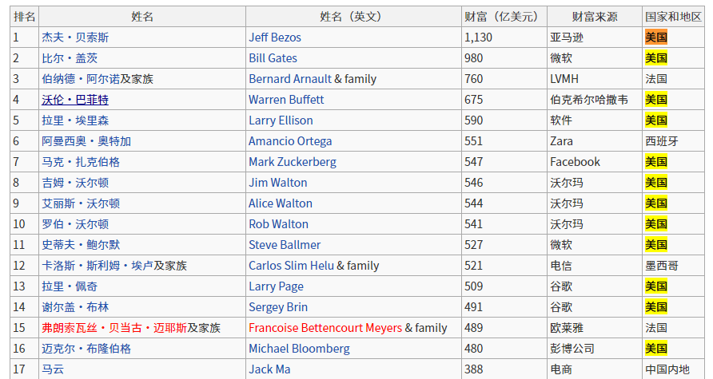

# 191~200

## 191、大城市有什么好的？

➹：[去一线大城市的意义到底是什么？ - 知乎](https://www.zhihu.com/question/48148522)

## 192、充分条件？必要条件？充要条件？

- `p -> q`：p这个条件能否推出q这个结果，就像是我要去商店买到这个东西，足够的钱就是我要买到这个东西的充分条件……像是我长得丑不卖给我显然是不可能的……当然，也不是非得要有钱才能买到这个东西的，我可以抢劫呀！只是付钱买更好……充分条件很强，有了这个条件意味着你一定有结果，虽然这个充分条件不是必要的，也不是唯一的……
- `p <- q`：p是q的必要条件，确定p是不是q的必要条件，很简单，只需要用逆向思维反证法就好了，即**无p必无q**。如「大学生是学生的必要条件？」这个命题正确吗？反证法一下，**不是大学生必不是学生**？显然不可能，我是中学生也可以是学生呀！我是小学生也可以是学生呀！（生活中我们常用正向思维，很少会用到逆向思维，因为这有点多此一举……） -> 必要条件很「弱」，因为即便有了p，也不一定能推出q，如初试和复试，过了初始 -> 上岸，不一定上岸，因为还有复试，你复试的是骂老师显然上不了岸了，但你不过初试就一定不能上岸……

我要的结果「xxx时间内达到中级前端」

得到这个结果所需要的条件：

- 必要条件：早睡早起、坚持……学习中级前端具备的知识点……不早睡早起，咩有精力学习，学不好……不坚持，学不好……学的东西不对头，学不好……
- 充分条件：……

➹：[★充分条件VS必要条件_哔哩哔哩 (゜-゜)つロ 干杯~-bilibili](https://www.bilibili.com/video/BV1Fx41167Vx/?spm_id_from=333.788.videocard.2)

➹：[科学网—科研：可别忘记“充要条件”哦 - 秦四清的博文](http://blog.sciencenet.cn/blog-575926-1112181.html)

➹：[充分条件和必要条件 - 哔哩哔哩](https://www.bilibili.com/read/cv479227/)

 ➹：[充分条件和必要条件怎么区分 ？ - 知乎](https://www.zhihu.com/question/30469121)

➹：[Necessity and sufficiency - Wikipedia](https://en.wikipedia.org/wiki/Necessity_and_sufficiency)

## 193、模态词？

模态词分为[可能性](https://baike.baidu.com/item/可能性/3411242)和[必然性](https://baike.baidu.com/item/必然性/3637380)两种。

用这些词表达人们[认识](https://baike.baidu.com/item/认识/8581906)的确实性程度

> 想想前端里边的模态框……

➹：[模态词_百度百科](https://baike.baidu.com/item/%E6%A8%A1%E6%80%81%E8%AF%8D)

➹：[什么是模态判断（广义）？ - 知乎](https://zhuanlan.zhihu.com/p/89559925)

➹：[什么是模态判断？ - 知乎](https://zhuanlan.zhihu.com/p/63426737)

➹：[什么是模态三段论？ - 知乎](https://zhuanlan.zhihu.com/p/65635371)

➹：[谈汉语模态词的分布与诠释之对应关系](https://www.1xuezhe.exuezhe.com/Qk/art/428355?dbcode=1&flag=2)

## 194、最近看了创造营2020，我在想她们唱歌、跳舞也忒厉害了吧，但最终出道红火的终究是少数人，可每年都有那么多艺术生，那么没有红火的艺术生她们是继续从事自己热爱的工作，还是转行了？

➹：[请问这两年，艺术生的就业情况如何？ - 知乎](https://www.zhihu.com/question/48637226)

## 195、按压穴位是否真得有效？

➹：[人体的穴位有什么用？穴位的本质又是什么？ - 知乎](https://zhuanlan.zhihu.com/p/42042505)

➹：[穴位和经络是怎么发现的？ - 知乎](https://zhuanlan.zhihu.com/p/32516352)

➹：[《40个常见病穴位按摩大全》送给你，超百万人已收 - 知乎](https://zhuanlan.zhihu.com/p/51519212)

## 196、记忆点？

搜索「记忆点 site:zhihu.com」

➹：[产品背后：你产品的记忆点在哪里？ - 人人都是产品经理](http://www.woshipm.com/pmd/791240.html)

➹：[你用什么样的记忆点来留住顾客？ - 知乎](https://zhuanlan.zhihu.com/p/40470080)

## 197、什么是理论上？

关于理论的定义，网友们有这么几种看法：

> 基于相同客观事实的不同主观解释，所衍生出来的看法、信念、指导原则、行为方式等……

> 既然问及“理论”，我觉得并不能再用理论来说明这个概念，否则就等于已经定义了“理论”。
>
> 以下是我的看法：人类社会的进步需要权威来进行思想或行动上的指导，所谓的权威就是具有说服力，并且在大众中被广泛认可的人（往往大众和媒体认可的是人）。那么“权威”发表的具有指导性意义的言论，被称为理论。

> 就是说明书啦。不会有超出理论的东西，那是新理论。解释不了的尚未整理出来，叫做超出现有理论。

> 在现实中代替真实的虚构

> 数学模型

我们知道图灵机是理论上的计算模型 -> 是用来描述数学问题的，解决数学问题的 -> 图灵模拟人的计算过程，所以就构想出了这个假想机器，即图灵机

冯诺依曼结构的计算机则是这个理论模型的实现……

关于实践和理论：

> 有些人喜欢看理论的东西，对实践一点兴趣都没，像我就是不喜欢敲代码
>
> 但只有理论，没有实践的话，这理论是走不远的，而且很有可能这理论不能称作理论，即这个理论的提出本就是错误的，只是当初未被发现而已
>
> 理论这东西就像是在我们的心里边种下一颗种子，当我们在实践中犯了错，我们才会想起这颗种子，并且这颗种子也会随着发芽生长，而当这颗种子长成参天大树时，我们才算真正明白，它为何会称之为理论了……
>
> 即所谓的「知之真切笃实即为行，行之明觉精察即为知」「知到极处即是行，行到极处即是知」

话又说回来，什么叫理论上？什么叫实际上？

理论意义，是根据规律，经验，常识等总结出来的一种可能性。

现实意义，是实际的情况。

两者的区别，前者是发生在某个事情之前的预计，后者是发生在某个事情以后的总结。

比方说：

某工程队，一天可以建一个房子，理论意义上来说，他们一年可以建365个房子出来。

实际上，他们一年只建了200个房子。

因此得出现实意义，做房子 ，也要看天的，下雨天就无法施工了。即在工程实际中，忽略了一些次要因素得出的结果，为理论上。

➹：[什么是“理论”？ - 知乎](https://www.zhihu.com/question/36695838)

➹：[实践和理论是怎样的关系？哪个更重要？ - 知乎](https://www.zhihu.com/question/22203272)

➹：[什么叫理论上？什么叫实际上？_百度知道](https://zhidao.baidu.com/question/551914211074794172.html?qbl=relate_question_1)

➹：[“理论上”是什么意思_百度知道](https://zhidao.baidu.com/question/133241152.html)

## 198、财富榜排名？

我看到有35位美国人在财富榜排行前100，其中前10位有8位是美国人

我在想我们一生如果都在看自己赚了多少钱？这真得有意义吗？

这让我想起了那句话「生亦何欢，死亦何苦」

他们都是人，为何我们要让他们制定的规则决定我们的生活方式呢？

➹：[2020年《福布斯》全球亿万富豪排行榜 - MBA智库百科](https://wiki.mbalib.com/wiki/2020%E5%B9%B4%E3%80%8A%E7%A6%8F%E5%B8%83%E6%96%AF%E3%80%8B%E5%85%A8%E7%90%83%E4%BA%BF%E4%B8%87%E5%AF%8C%E8%B1%AA%E6%8E%92%E8%A1%8C%E6%A6%9C)

➹：[如何读懂生亦何欢？死亦何苦？这句话？ - 知乎](https://www.zhihu.com/question/268283901/answer/335739994)

➹：[生亦何欢，死亦何苦，认识到底有什么意义？ - 知乎](https://www.zhihu.com/question/66416597)

## 199、此路不通，寻它路？

> 多学几门语言能够更好理解很多基本感念，会发现很多地方相通的。在学一门语言不理解的地方，也许在学另外一门语言时顿悟了，原来这么回事。多学才能有自己的评判，自己的选择。流行编程语言无绝对的好坏，看你用在什么地方。

我深有感触，我之前学JavaWeb不了解Web，现在学了Node，我就比较容易懂Web了

➹：[是有点冷清 - D语言新手问题 - D语言中文社区](https://forums.dlangchina.com/thread/10068)

## 200、末法时代？认识？

认识：

- 确定某物 -> 认识某人 -> 确定某人，而不是他人
- 知晓;认明 -> 感到人能够认识客观真理 -> 感到人能够「知晓」客观真理
- 头脑对客观世界的反映 -> 感性认识 -> 对看到的引起了自己的情绪性变化，如看到他人的表演，哭泣了

认识是认知知识，即人脑反映客观事物的特性与联系、并揭露事物对人的意义与作用的思维活动。从广义上讲，认识包含人的所有认知活动，即为[感知](https://baike.baidu.com/item/感知/10752910)、记忆、思维、想象、语言的理解和产生等心理现象的统称。认识是一种信息加工过程，可以分为刺激的接收、编码、存储、提取和利用等一系列阶段。从狭义上讲，认识有时等同于记忆或思维。

> 有些词语就是个函数

另一种解释：

> 认知或认识（英语：cognition）在心理学中是指通过形成概念、知觉、判断或想象等心理活动来获取知识的过程，即思维进行信息处理的心理功能。认知过程可以是自然的或人造的、有意识或无意识；认知使用现有知识并产生新知识。
>
> 语言学、麻醉学、神经科学、心理学、人类学、生物学、哲学、系统学、逻辑学及计算机科学在分析认知时，其**分析的角度是不同的**。这些方法在认知科学这一逐渐发展的自治学科领域中得到了综合。

> 由19世纪的英国心理学家摩根认为：
>
> 如果能够以心理进化和发展的规模较低的过程准确地解释动物活动，则决不能以较高的心理过程来解释动物活动。

如果你是真得认识 -> 那么你就能够用简单的话语来概括它！

➹：[认识_百度百科](https://baike.baidu.com/item/%E8%AE%A4%E8%AF%86)

➹：[Cognition - Wikipedia](https://en.wikipedia.org/wiki/Cognition)

