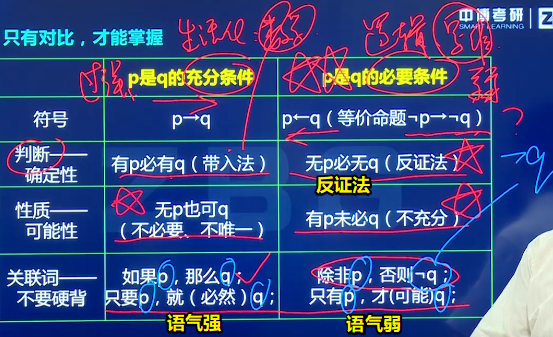

# 191~200

## 191、大城市有什么好的？

➹：[去一线大城市的意义到底是什么？ - 知乎](https://www.zhihu.com/question/48148522)

## 192、充分条件？必要条件？充要条件？

- `p -> q`：p这个条件能否推出q这个结果，就像是我要去商店买到这个东西，足够的钱就是我要买到这个东西的充分条件……像是我长得丑不卖给我显然是不可能的……当然，也不是非得要有钱才能买到这个东西的，我可以抢劫呀！只是付钱买更好……充分条件很强，有了这个条件意味着你一定有结果，虽然这个充分条件不是必要的，也不是唯一的……
- `p <- q`：p是q的必要条件，确定p是不是q的必要条件，很简单，只需要用逆向思维反证法就好了，即**无p必无q**。如「大学生是学生的必要条件？」这个命题正确吗？反证法一下，**不是大学生必不是学生**？显然不可能，我是中学生也可以是学生呀！我是小学生也可以是学生呀！（生活中我们常用正向思维，很少会用到逆向思维，因为这有点多此一举……） -> 必要条件很「弱」，因为即便有了p，也不一定能推出q，如初试和复试，过了初始 -> 上岸，不一定上岸，因为还有复试，你复试的是骂老师显然上不了岸了，但你不过初试就一定不能上岸……

我要的结果「xxx时间内达到中级前端」

得到这个结果所需要的条件：

- 必要条件：早睡早起、坚持……学习中级前端具备的知识点……不早睡早起，咩有精力学习，学不好……不坚持，学不好……学的东西不对头，学不好……
- 充分条件：……

➹：[★充分条件VS必要条件_哔哩哔哩 (゜-゜)つロ 干杯~-bilibili](https://www.bilibili.com/video/BV1Fx41167Vx/?spm_id_from=333.788.videocard.2)

➹：[科学网—科研：可别忘记“充要条件”哦 - 秦四清的博文](http://blog.sciencenet.cn/blog-575926-1112181.html)

➹：[充分条件和必要条件 - 哔哩哔哩](https://www.bilibili.com/read/cv479227/)

 ➹：[充分条件和必要条件怎么区分 ？ - 知乎](https://www.zhihu.com/question/30469121)

➹：[Necessity and sufficiency - Wikipedia](https://en.wikipedia.org/wiki/Necessity_and_sufficiency)

## 193、模态词？

模态词分为[可能性](https://baike.baidu.com/item/可能性/3411242)和[必然性](https://baike.baidu.com/item/必然性/3637380)两种。

用这些词表达人们[认识](https://baike.baidu.com/item/认识/8581906)的确实性程度

> 想想前端里边的模态框……

➹：[模态词_百度百科](https://baike.baidu.com/item/%E6%A8%A1%E6%80%81%E8%AF%8D)

➹：[什么是模态判断（广义）？ - 知乎](https://zhuanlan.zhihu.com/p/89559925)

➹：[什么是模态判断？ - 知乎](https://zhuanlan.zhihu.com/p/63426737)

➹：[什么是模态三段论？ - 知乎](https://zhuanlan.zhihu.com/p/65635371)

➹：[谈汉语模态词的分布与诠释之对应关系](https://www.1xuezhe.exuezhe.com/Qk/art/428355?dbcode=1&flag=2)

