# webpack的使用，处理各类型文件

> Webpack4的基础使用

## ★为什么我们要使用webpack？以及如何安装它？

### ◇为啥要使用它？

**1）什么是前端工程化？**

在15、16年的时候，前端基本上没有使用webpack的需求，毕竟那个时候的绝大多数公司都是使用MVC这一套路去写代码

那么为啥现在18、19年要突然使用上了webpack呢？——原因简单，因为我们前端开始越做越大了，而做的内容也越来越复杂了！说白了，前端要干的活越来越多了！因此，我们必须用上webpack，而这也是我们之所以使用webpack的一个重要原因！

至此，前端开始工程化了！

那么工程化又是什么呢？

> 工程化是系统化、模块化、规范化的过程。即，让开发变得越来系统，越来越分模块，然后对规范也越来越重视。而工程化的目的主要是为了解决“**如何提高整个系统生产效率**” 的问题

总之，**我们可以把webpack理解成是一个可以帮助我们把项目做得更轻松的这么一个工具**。（想想柴火煮饭，与用电饭煲煮饭，如果有电饭煲煮饭为啥还要用柴火呢？难道用柴火是为了让饭煮得更香些吗？更能体现纯朴的味道吗？当然，如果没有电、电饭煲，那就用柴火呗！反正也是能吃到饭！只是这样效率并不高，如需要砍柴生火，还得看看火势是否过旺，不然会煮糊……总之，把煮饭的整个过程看做是一个系统，同样一个淘米输入，如果用上电饭煲，那么就能很快且稳定的吃上香喷喷的米饭，而如果用柴火的话，那么就费时费力了！总之，得到一碗米饭，电饭煲的存在可以让我们不用去干砍柴生火的活儿！）

> 注：想想软件工程、包工头承包工程（如如果只招来2、3个人显然工期会很长）……

**2）前端工程化的主要改变会发生在哪些方面？**

- 工具（没有webpack之前，前端做一个项目，只要一个编辑器，一个PS即可搞定！而现在则需要用到各种各样的东西，如webpack、node、Nginx等等，而这是第一方面的改变）

- 人员（第二方面的改变是在人员上的改变，在前端比较早期的时候，基本上都是一个人一个项目，毕竟只要写个静态页面甚是简单！然而，现在，前端它变成一个工程了，它不在是一个人就能解决得了的存在了！因此，现在人员多了，那我们就必须使用webpack，把不同人员所写的代码进行一个打包来生成最终的上线代码！）

- 写代码的方式（以前写代码，一上来就是一顿操作，直接撸起一大串JS代码，而现在则是要分模块化开发，分模块化做各种事情！）

总之，我们之所以使用webpack的终极原因就是为了「**工程化**」哈！

既然webpack的存在是为了「工程化」，那这webpack该怎么使用呢？——请往下看

### ◇使用webpack之前，先安装它

**1）安装node**

> webpack是依赖于node的，所以你在安装webpack之前，必须保证自己的电脑里边已经安装了node！毕竟webpack的源码也是基于node环境的，说白了，就是用跑在Node.js 环境下的 JS 写的！总之，webpack是鱼，没有Node这个水，那么鱼只能是木鱼了。

**2）通过 `npm install webpack –g` 全局安装Webpack**

> 在webpack4x之前，即1x、2x、3x版的webpack，直接使用 `npm install webpack –g`即可！然而现在的webpack4x还需要安装 `webpack-cli`才行，而这就类似于 vue 和 vue-cli的关系哈！ 总之，项目里边可以不安装webpack，但全局必须得安装一个！
>
>在学习webpack的使用过程中，推荐安装全局的，因为在写一些小demo练手的时候，就可以不用局部安装webpack了（也可以使用parcel来搞，毕竟它是零配置的，甚是方便！），当然，这并不会影响已有项目里边局部安装的webpack哈！

**3）输入`webpack –v` 能看到版本号，则表示安装成功**

**4）自己测试**

全局安装（耗时250s左右）：

``` bash
yarn global add webpack webpack-cli
```

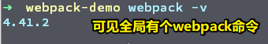

局部安装（耗时106s左右，有缓存会快一点）：

``` bash
mkdir webpack-demo
cd webpack-demo
yarn init -y
yarn add webpack webpack-cli -D
```

该webpack-demo目录下的package.json：

``` json
{
  "name": "webpack-demo",
  "version": "1.0.0",
  "main": "index.js",
  "license": "MIT",
  "devDependencies": {
    "webpack": "^4.41.2",
    "webpack-cli": "^3.3.10"
  }
}
```

➹：[npm和yarn的区别，我们该如何选择? - 掘金](https://juejin.im/post/5ab89cc4f265da237506e367)

➹：[Npm vs Yarn 之备忘详单 - 晚晴幽草轩](https://www.jeffjade.com/2017/12/30/135-npm-vs-yarn-detial-memo/)

> 注：全局得有一个webpack，但打包项目的时候一般用的是局部的webpack！

---

## ★Webpack的一些概念？

### ◇入口（Entry）与出口（Output）

- entry：打包的起点，webpack必须有一个入口知道从哪开始处理

- output：处理完成后，结果文件输出到哪

这两个东西在webpack里边是非常重要的，一个webpack配置里边绝对会有这两个东西，而像loader、plugin可以没有，但entry和output必须要有。

为啥这样说呢？——因为entry是告知webpack从哪里开始打包，不然，webpack怎么知道自己应该从哪里开始打包呢？而与之相对应的output，则是告知把打包好的东西存放到哪儿！总之，一个用webpack打包的系统需要一个入口和出口（似乎可以把webpack看做是一个函数哈！）

---

在项目里边测试它们俩：

1）构析webpack配置文件，而这配置叫做 `webpack.config.js`，默认webpack会对这个webpack配置文件进行打包，当然，如果你不叫这个 `webpack.config.js` 这个名字也是可以的，不过这就得额为指定了！

2）配置文件的基础架构：

``` js
module.exports = {
  // 写你的配置
}
```

如果涉及到配置的合并，那么这其实就是把上边这个暴露出去的对象进行一个合并罢了！

注意，如果你直接这样做：

``` js
var xxx = {
  //你的配置
}
```

没有 `module.exports`一个对象，那么webpack是拿不到这个配置文件的，毕竟这对象没有暴露出去哈！

**3）简单的测试：**

> 一定要 `yarn init -y`一下，因为要用webpack打包，这个项目必须得是个npm包才行！说白了，你得有个 `package.json`文件才行！

在webpack.config.js里边写上以下代码：

``` js
module.exports = {
  // 写你的配置
  // entry是打包的起点，它的值的形式非常之多，如简单的就是直接指定一个字符串路径哈！
  // 这是最简单的单文件入口形式
  entry: './xxx.js', 
  // 这是最简单的出口形式，即直接指定一个filename属性，而该属性它指定打包完成之后，webpack输出的这个文件叫啥名字
  output: {
    'filename': './[name].js'
  }
}
```

有了一个简单的入口和出口即可开始打包（这是用全局姿势打的包）：

``` bash
#定位到项目webpack-demo目录，直接webpack一下即可
webpack
```

结果多了一个dist目录，并且其旗下还多了一个叫 `main.js`的文件：

```
G:\git-2019\webpack-demo
├── dist
|  └── main.js
├── package.json
├── webpack.config.js
├── xxx.js
└── yarn.lock
```
**4）一些常见问题？**

<mark>1、`mode`属性是个怎样的存在？</mark>

在webpack4.x里边，额外多了一个叫 `mode`属性（mode，模式）

mode属性它有两个值：一个是默认值 `production` （不写mode属性直接打包，webpack会有警告说你没有写mode属性，然后建议你写上，当然，最终默认会以production模式打包），还有一个是 `development`。

那么它们俩有啥区别呢？

> 一个是以生产模式打包，一个则是以开发模式打包（方便我们阅读打包出来的代码）！

<mark>2、关于webpack3.x和webpack4.x的差别？</mark>

webpack升级到版本4之后，它就有一个理念，即「**我要减少webpack的配置文件**」，所以webpack就推出了 `mode`这么一个属性，如果你把mode的值置为 `development`，那么webpack默认就不会去压缩我们的代码，而且你不需要做任何的配置！

测试打包结果如下：

``` js
// 开发模式：打包出来的main.js无压缩

/******/ (function(modules) { // webpackBootstrap
/******/ 	// The module cache
/******/ 	var installedModules = {};
//……

// 生成模式：打包出来的main.js有压缩

!function(e){var t={};function n(r){if(t[r])return t[r].exports; //……
```

而在webpack3.x里边，如果你不去配置压缩的话，那么打包出来的 `mian.js`是咩有经过压缩的哈！

总之，在webpack4.x里边，把mode置为 `production` ，除了帮我们解决压缩配置以外，还有 tree-shaking等等的功能！

总之，生产模式必备的一些配置，我们用上webpack4.x之后就不用我们自己去写了！

<mark>3、全局下的webpack与局部下的webpack有啥区别？</mark>

测试前提：全局安装个最新版的webpack4.x，然后在项目里边局部安装个3.x（如3.6.0）

开始测试：

在项目的package.json里边添加 `scripts`字段：

``` json
{
  "scripts": {
    "build": "webpack" 
  },
}
```

然后局部打包项目：

``` bash
yarn build

# 全局打包直接输入webpack即可
```

> 如果局部没有安装webpack，那么就会去找全局的webpack，总之优先查找局部的！

结果报错了，而错误内容大概是「在配置里边有个未知的mode属性」哈！说白了，webpack3.x不认识mode这个属性！

话又说回来，webpack为啥会有全局和局部之分呢？

简单来说，全局里边，webpack只能有一个（假设是4.x的），而在局部里边的webpack版本，有些项目是使用3.x的打包的，有些则是4.x的。举栗子来说，如果你在github里边，clone了一个xxx项目，而这个xxx项目是用3.x打包的，而这意味着webpack配置文件是针对3.x版的webpack，而你秉持着「使用最新版工具」原则，而且也不想局部安装webpack，于是你就注释掉了package.json里边有关webpack的开发依赖，然后使用webpack4.x全局去打包这个项目，那么结果就会出现各种各样的版本问题了，因此我们需要在局部里边安装3.x的webpack版本去处理相应的webpack配置！

总之，使用局部指定的webpack版本打包，保证了打包的正常运行！如果一股脑的用全局的webpack打包，那么不管是打包旧项目还是新项目，或多或少会发生不可预知的错误！

<mark>4、指定webpack配置文件？</mark>

我们在项目，如 `webpack-demo`的根目录里边，创建了一个叫 `webpack.config.js`，那么webpack默认就会以该配置文件来打包！即直接输入 `webpack` 即可打包

那么问题来了，假如我们把webpack配置文件改成 `xx.js`呢？

如果你还是按原来的直接 `webpack`去打包项目的话，那么大概会报「没有找到任何配置文件」这样的错误，更进一步说应该是没有找到任何的入口模块！

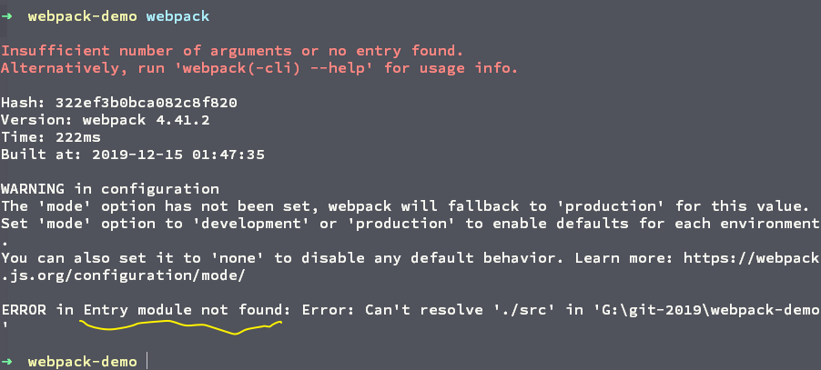

所以我们该如何指定webpack配置文件来进行打包呢？——很简单，直接这样即可：

``` bash
webpack --config xx.js
```

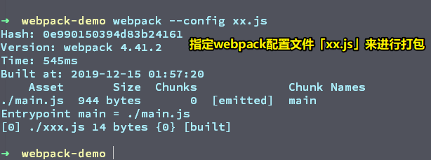

> 通常在 Vue 项目里边，你会发现在打包项目的时候，都是通过 `--config` 来指定webpack配置文件来进行打包的，而不是直接运行webpack来进行打包！

总之，写个`webpack.config.js`，可以让我们在打包项目时少敲几个字符！

**5）解析entry的值？**

<mark>数组值：</mark>

``` js
module.exports = {
  mode: 'development',
  entry: [
    './xxx.js',
    './yyy.js'
  ],
  output: {
    'filename': './[name].js'
  }
}
```

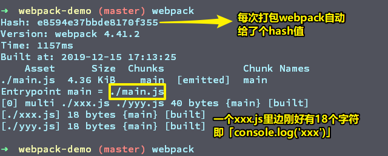

结果文件里边，即 `main.js` 里边，你会发现 `xxx.js`和 `yyy.js`这两个文件混合在一起了！

总之这种入口文件的形式，即你给entry一个数组值，那么就会把你在数组里边指定的这些文件全部打包到一起去！

<mark>对象值：</mark>

这是一种对象形式，通常当我们写多入口的时候，都会把entry指定为对象的形式。而对象里边的键名就是output里边的 `[name]`，之前我们用字符串和数组形式时，是咩有指定 `[name]`的值的，于是webpack用了一个叫 `main`的名字作为默认名字！除了有 `[name]`以外，还有一个 `[hash]`，它的值正是我们使用webpack命令打包，然后终端所打印的日志 里边的第一行的`Hash`的值，如果你嫌它太长的话，你可以截取头几个字符，如 `[hash:6]`表示只截取hash值前6个字符！

如果对象只有一个键值对，大可看做是单入口，如果2个至多个，那么可看做是多入口。

在多入口里边，你有几个入口文件，那么最终就会输出几个结果文件

``` js
module.exports = {
  mode: 'development',
  entry: {
    'xxx': './xxx.js',
    'yyy': './yyy.js'
  },
  output: {
    'filename': './[name].[hash:6].js'
  }
}
```

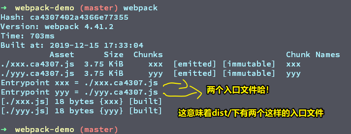

当前目录结构：

```
G:\git-2019\webpack-demo
├── dist
|  ├── xxx.ca4307.js
|  └── yyy.ca4307.js
├── package.json
├── README.md
├── webpack.config.js
├── xxx.js
├── yarn.lock
└── yyy.js
```

问：

<mark>1、Hash是哪儿来的？</mark>

> Hash是webpack自动生成的，webpack每次打包它都会生成一个hash，而这是根据每次打包的文件名自动生成的，而且每次都是不一样的！（一个不成熟的理解，根据我简单测试出来的结果，入口文件不变，配置文件更改，这个Hash值不会变，而入口文件更改了，那么这个Hash值就会变，Hash它的这个值就像是整个webpack打包过程的全局Hash！）

<mark>2、在多入口打包时，用[hash]打包出来的结果文件都有着同一个Hash值？</mark>

> 可以使用 `[chunkhash]`，它是根据模块文件的内容计算所得的hash值，所以只要文件没有修改，那么每次打包出来的结果文件就不会让在用户浏览器下的缓存文件给失效了！

➹：[Webpack中hash与chunkhash的区别，以及js与css的hash指纹解耦方案 - 寒月十八 - 博客园](https://www.cnblogs.com/ihardcoder/p/5623411.html)

说完入口和出口之间的关系之后，接下来说loader和plugin这两个重要的概念！

> 22:15

### ◇Loaders 与 Plugins

> 简单区分它们俩：一个看文件，一个扩展webpack的功能

我想你现在应该知道了，没有loader和plugin也是可以打包的，但是，这只能进行一个最简单的JS 打包，即把你的JS 文件打包一下，如做一些把JS代码压缩一下之类的事情！

如果我们要引用CSS等，使用webpack各种丰富多彩的功能，那么这个时候我们必须得使用loader和plugin了。

问：

<mark>1、Loader和Plugin之间有啥关系，以及有啥差别？</mark>

Loader：

> webpack只认识JS ，而且webpack除了把JS 打包之外，它不会做任何的处理，说白了，webpack本身的功能就是把JS 打个包而已，它不认识CSS、HTML等其它东西。
> 
> 而在一个前端项目里边，显然不可能只有JS哈，必然会有HTML、CSS、图片等这样的文件资源，因此，如果我们项目里边要用到别的内容，那我们就必须使用到loader了！
> 
> 所以，loader的意义就是「定义对某种文件的处理」！说白了，只要被打包的内容里边，有除了JS之外的东西，那么你就必须要定义相应的loader了。总之，如果出现「我要对某种文件进行一种处理」这样的字眼，那么就需要派loader上场了，而loader的功效（功能，效果）也就在于此了！
> 
> 总之，如果我要对JS进行处理，那么我就需要用babel-loader来完成；如果我这个项目需要引入CSS，并且还要对CSS进行一定的处理，那么我们就需要引用css-loader和style-loader。
> 
> 不管怎样，loader它就是对于某种类型的文件进行一个统一的处理，它相当于是一个统一处理装置（构造复杂、具有某种独立功能的机器或组件），只要你是xxx类型的文件，那么你就得到我这个xxx loader 装置里边处理一下！

Plugin：

> plugin它不限定于某种特别的文件，webpack除了自身自带的一些功能以外，我们经常还会用到一些可能webpack自身没有提供的功能，那么这个时候我们就要用到插件了！

它们之间的差别：

> Loader是对于某种类型文件的处理。plugin是在webpack的整体上提供某个功能

如果你理解loader和plugin这两个概念以及它们俩的差异，那么这对webpack的学习是非常有意义的！

<mark>2、检测你是否理解了loader和plugin这两个概念？</mark>

1）项目要使用到flash，那么这是loader的事情，还是plugin的事情？

显然是loader事情哈！毕竟我们使用flash，那么就得引入flash相关的文件，如 `.swf`文件，那么我们打包这样的文件（即JS之外的文件），显然需要用到相应的loader装置哈！

2）我希望在项目打包的过程当中，进行一个CSS提取，如把CSS提取成一个文件或两个文件之类的？

显然是plugin。因为webpack不具备我们想要这样做的功能，而且这也不是对某种类型的东西进行处理！

> loader：提供文件处理，类似gulp里边的task；plugin：提供webpack不具备的功能。

<mark>3、怎么写loader和plugin？</mark>

loader书写格式：所有的loader都会写在 `module`旗下的 `rules`里边，rules它是一个数组，每个数组元素就是一个对象，一个对象即一个loader！

plugins书写格式：与 `module`同级，值为数组，一个数组元素即一个plugin。

目前webpack配置模式如下（请记住它）：

``` js
module.exports = {
  mode: 'development',
  entry: {
    'xxx': './xxx.js',
    'yyy': './yyy.js'
  },
  output: {
    'filename': './[name].js'
  },
  module: {
    rules: []
  },
  plugins: [

  ]
}
```

可见，这种模式有5个属性，分别是mode、entry、output、module、plugin，然后我们的loader写在rules里边，plugin则写在plugins里边！

记住以上这种格式，而这会方便你去总结配置规律！

每一个loader处理都是一个对象，即你定义一个loader，那就放在rules这个数组里边：

loader是对于某种类型文件的处理，那么我们得告知webpack是针对哪种类型文件进行处理，所以每个loader对会有一个test属性，而该test的键值则会接收到一个「正则」，表示我们要对哪种后缀名的文件进行处理，如处理JS，那就这样：`test: /\.js$/`，然后还得告诉webpack处理这种文件，需要使用哪个loader，如这样：`loader: 'babel-loader'` or `ues: 'babel-loader'`

添加loader之格式规律总结：

> 添加一个loader，那么就往rules里边添加一个对象元素，然后指定我要对哪种文件后缀名进行处理，然后再添加我要用哪个loader即可！（几乎所有loader都是这么写的！）

如果我们只是简单使用loader，直接 `ues: 'babel-loader'`即可，然而，我们有些时候，不可避免的要对loader进行配置，那么此时 `use`的值，就得是一个对象了，如：

``` js
{
  test: /\.js$/,
  use: {
    loader: 'babel-loader',
    options: {}
  }
}
```

所有的loader配置都写在options里边，而这是一个规律（普遍性、必然性，客观存在的，不以人们的意志为转移的写法，说白了，就是写死的）哈！究其原因，webpack的node源码就是去拿options的！

--- 

以上就是loader和plugin的概念，以及它们的基础写法！

> 31:17

### ◇Module 和 Chunks

<mark>Module：</mark>

> 每一个被处理的文件都是一个module，即模块！如一个CSS文件是一个模块，一个图片也是一个模块，总之，任何一个单独的文件都是一个模块！而这就是在webpack里边的Module概念了！

<mark>Chunks：</mark>

> 最终产出的文件被称为chunks，如我们webpack打包之后产出了一个CSS文件，两个JS文件，那么这3个东西就是我们所产出的chunks，即最终产出的代码块！

把Module一打包，就产生了chunks！（一个结果文件就是一个chunk！chunks有s表示有多个结果文件）

讲完以上这些概念之后，接下来就来说说各种类型文件的处理！

> 32:25

## ★各种资源的处理？

> 记住配置loader的规律，即是一个怎么样的配置形式（如定义要处理什么样类型的文件，然后下载对应的loader，引用一下loader，然后配置即可！），而不是死记某个loader是怎么写的。

### ◇JavaScript的处理与编译？

对于JS ，其实并不需要额外处理，因为webpack本身就是认识JS文件的！

但是，webpack它本身是不会去编译JS的，而我们为了一些兼容性问题，我们往往需要去把JS 进行一个编译！

所以，与之相对应的就会有个babel-loader来对我们的JS 进行一个编译！

babel-loader它有个核心库，叫babel-core，即babel-loader依赖于babel-core来进行一个编译的！

**1）安装babel-loader和babel-core（一起安装用了71s）：**

``` bash
yarn add @babel/core babel-loader -D
```

当前安装的是7x的babel/core，8x的babel-loader

> 划重点：你安装的babel-core是什么版本，决定了你后面的各种东西是什么样的版本，如在这里安装的是 `@babel/core`版本，那么后边安装的 `preset-env`、`polyfill` 等都要加上 `@babel/`，如这样 ` @babel/preset-env`、`@babel/polyfill`

问：

<mark>1、为啥安装babel-core需要用@符合，而babel-loader则不需要？</mark>

> 自打 Babel 7以来，Babel团队就已经切换到scoped packages了，因此我们现在必须使用@babel/core，而不是babel-core
>
>当然，本质上来说，有@符的@babel/core仅仅只是babel-core的最新版，而之所以添加@符是为了更好地区分哪些包是官方的，哪些包是第三方的。
>
>babel-loader是第3方的！所以咩有@符，这一点，你可以到[npm官网](https://www.npmjs.com/package/babel-loader)搜索一下。而且你还可以搜索一下`babel-core`，你会发现它是两年前的包：

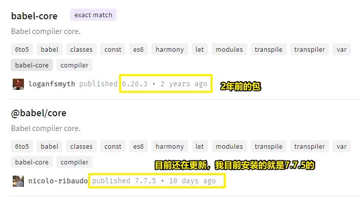

所以，现在只要我们在用Babel团队出的包，那么都得加上 `@`

➹：[babeljs - What is the difference between babel-core and @babel/core? - Stack Overflow](https://stackoverflow.com/questions/53380741/what-is-the-difference-between-babel-core-and-babel-core)


<mark>2、安装好@babel/core和babel-loader之后，然后打包JS，结果并没有把es6代码编译成es5代码？</mark>

当前的loader配置是这样的：

``` js
{
  test: /\.js$/,
  loader: 'babel-loader'
}

// 当然，也可以这样：

{
  test: /\.js$/,
  use: {
    loader: 'babel-loader'
  }
}
```

虽然我们定义了babel-loader去处理我们的JS文件，但是与之相对应的是，我们必须得还有一个编译标准，即我们要告知webpack，我们这JS代码应该编译成啥样子，这样webpack才敢去编译，不然，webpack是不敢轻举妄动的，毕竟万一webpack编译成你不想要的样子，岂不是GG了！

因此，我们还得依赖一个叫 `Babel-preset-env`的包，它包含了JS 一系列的标准。

总之，我们必须安装这个包，然后告诉webpack我们所写的JS 代码应该编译成什么样的版本，即我们要把我们的编译目标要告知给webpack才行，然后webpack它才敢动！（类似于告知webpack入口文件，然后它才会去打包）

通常，我们会安装babel-preset的env版本（environment，预设目标环境），除了这个版本以外，还有es2017、es1016、es2015等这样的版本。env这个版本是个合集版本，它可以根据开发者的配置，按需加载插件

所以我们需要安装preset-env（别忘了要加上`@babel`，不然会出错的。用了80s安装）:

``` bash
yarn add @babel/preset-env -D
```

安装好之后，就需要把preset-env配置上去，之前说到，对所有loader的配置，都写到use旗下的options里边去！

``` js
{
  test: /\.js$/,
  use: {
    loader: 'babel-loader',
    options: {
      presets: [
        [
          '@babel/preset-env',
          {
            targets: {
              browsers: ["> 1%", "last 2 versions", "not ie <= 8"]
            }
          }
        ]
      ]
    }
  }
}
```

解析一下这个配置：

options的值是个对象，该对象旗下有个`presets`属性，然后它是个数组，其中数组元素是一个个数组，数组的第一个元素是定义我们要用哪一个标准来让webpack去编译！通常，我们用的是 `preset-env`版本，而数组的第二项则是 `preset-env`的配置，而这个配置里边最核心的就是 `targets`属性，即告知webpack我们编译的目标是怎样子的，关于这个编译目标配置，可具体参考老师的某个Vue项目的 `.babelrc` ：


解释目标配置：以浏览器为目标进行配置，那么衡量浏览器的标准又是怎样的呢？——如占有率大于1%的浏览器都要兼容，还要兼容所有浏览器的最后两个版本，而且不需要兼容ie8及以下的ie浏览器！

配置好浏览器的标准之后，babel-loader它才会真正的生效！

webpack打包之后，结果，ES6语法的代码编译成了ES5代码！

> 再次强调：请记住一个loader的配置规范是怎样的，如options是个对象，然后该对象有个presets属性，该属性是个数组，其中第一个元素是个数组，然后该数组元素的第一个值是编译标准，第二个值是配置编译目标对象！

接下来测试一下，以node为编译目标（这叫targets编译）：

我电脑里边的node是 `v10.15.3`，那么targets：

``` js
targets: {
  node: '10.15.3'
}
```

webpack打包一下，你会发现原先的es6的代码，居然没有编译成es5代码，那为啥会这样的呢？——因为我们指定的编译目标node `v10.15.3` 是支持ES6的语法的哈，既然该node认识这样的JS语法，那么webpack就不用去编译它了！

除了以node为目标之外，还可以以具体的浏览器为目标，如 `chrome: '59'`，该版本的chrome也是支持es6的，所以webpack也是不会去编译es6语法的JS代码的！

➹：[babel-preset-env使用指南 - 程序猿小卡 - 博客园](https://www.cnblogs.com/chyingp/p/understanding-babel-preset-env.html)

以上就是presets和targets的作用了！

---

<mark>小结：</mark>

> 如果我们要编译JS ，那么就必须得配置对应的presets，以及配置好我们所需要的targets才可以！如果targets写得不对，那么webpack可能就不去编译了，因为webpack会默认认为目标环境会认识你的JS代码！

**2）安装 babel-polyfill/ babel-transform-runtime-es6**

<mark>为什么需要？</mark>

> babel只负责语法转换，比如将ES6的语法转换成ES5。但如果有些对象、方法，浏览器本身不支持，如全局对象：`Promise`等、全局静态函数：`Array.from`等、实例方法：比如 `Array.prototype.includes` 等，因此，需要引入`babel-polyfill`来模拟实现这些对象、方法。


我们知道babel它本身只能处理诸如let等这样的JS语法，而相对于ES6等新出的方法和对象就无能无力了，如Promise、async等

所以对于这些东西的处理，就需要用到babel-polyfill或者是babel-transform-runtime-es6

总之，它们俩是针对JS的方法和对象的编译

<mark>babel-polyfill：</mark>

它是如何生效的？

> 生成一个全局垫片，在全局垫片里边去实现诸如promise、Array.from等这样对象和方法，这样一来，这些对象和方法就不需要让webpack编译了，直接打包到代码里边去即可！

总之，把babel不认识的方法和对象，全部都在babel-polyfill里边实现一次，然后把babel-polyfill加到代码里边去，然后就var一个全局垫片，而这个全局垫片实现了所有ES5不兼容的方法，这样一来我们用到的Promise等这样的对象，就无须去编译了，直接打包即可！

问：

<mark>1、有人说「babel-polyfill」被弃用了？</mark>

> 并咩有被弃用，它现在用的还是非常多的，而且是项目几乎离不开的！总之，一般，在写项目的时候推荐使用它！

<mark>2、「babel-transform-runtime-es6」与「babel-polyfill」之间的区别？</mark>

「babel-transform-runtime-es6」它生成一个局部垫片。

最简单的区别：

> babel-polyfill它是把所有东西都实现一遍，而babel-runtime则是生产一个局部的，它不会污染全局，而且是用了哪个就实现哪个，如用了Promise对象，那就实现一个Promise对象！

<mark>3、什么叫垫片？</mark>

可以简单理解为全局对象里边实现了各种各样的方法，总之垫片就是一个对象，然后这个对象里边，把所有的方法都给实现了一遍，然后用的时候，实际上用的是这个对象里边的方法！这样就可以模拟到达编译这么一个效果了！

<mark>4、二者分别怎么用？</mark>

<mark>①「babel-polyfill」：</mark>

安装（137s）：

``` bash
yarn add @babel/polyfill -D
```

使用：

``` js
// xxx.js
import '@babel/polyfill'
console.log('xxx')

var arr = Array.from('foo');
console.log(arr);  // [ 'f', 'o', 'o' ]
```

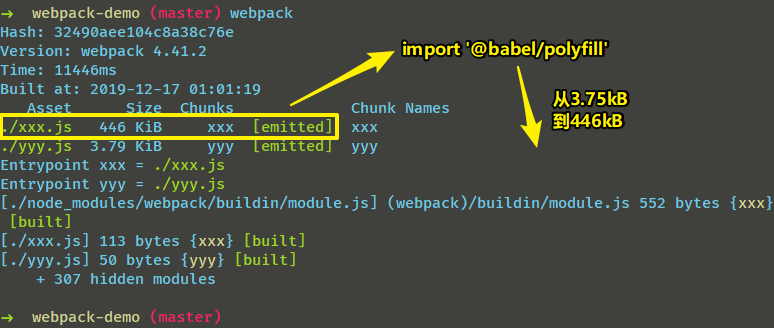

可见，一个import操作，就往结果文件里边注入了很多代码，而这些代码正是用ES5实现的兼容性代码，这样一来，我们所写的JS 的代码也能在落后的浏览器里边使用了！

除了通过import注入以外，还可以在配置里边写，如这样：

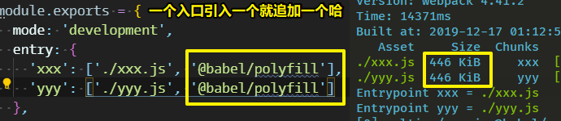

> 在老师的讲解里边，直接安装了`babel-polyfill`，没有添加 `@babel/`，最终也能正常打包！因为，这个包并不关心 `babel-core`是什么版本，说白了，babel-polyfill它与babel-core是独立开的！总之，`@babel/`可加可不加，随你便哈！

➹：[babel-polyfill使用与性能优化 - 程序猿小卡 - 博客园](https://www.cnblogs.com/chyingp/p/understanding-babel-polyfill.html)

<mark>②「babel-transform-runtime-es6」：</mark>

这个包必须关心版本问题，因为它是作为babel-core的插件放进来的，即它与babel-core是息息相关的！

用法：

用它之前，需要安装两个包，而且需要指定 `@babel/`版本的：

``` bash
yarn add @babel/runtime @babel/plugin-transform-runtime -D
```

之前说到，polyfill只是在代码里边放一个对象，而我们的transform-runtime则是作为一个插件，因此我们必须把它写在我们的babel配置里边！而这也是它们俩写法上的差别！

与presets的同级，添加个plugins属性：

``` js
{
  test: /\.js$/,
  use: {
    loader: 'babel-loader',
    options: {
      presets: [
        [
          '@babel/preset-env',
          {
            targets: {
              browsers: ["> 1%", "last 2 versions", "not ie <= 8"]
            }
          }
        ]
      ],
      plugins: [
        ['@babel/transform-runtime']
      ]
    }
  }
}
```

结果：

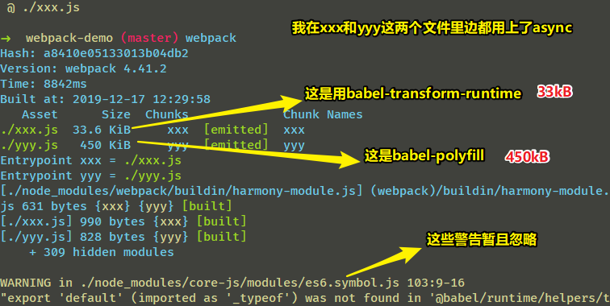

> 我在测试的时候，发现Promise对象，在transform-runtime的yin威之下，然后打包出来的结果居然咩有注入一丝一毫的垫片代码！而async则有，真是无语了！

可见，transform-runtime是你用了什么就给你编译什么，而不是像polyfill那样，把所有东西全都实现完，然后一起给你！

总之，transform-runtime是你用什么，就给你实现什么，而这也就意味着使用它打包出来的结果文件相较于用polyfill的，要小很多哈！

<mark>5、babel-loader的配置文件太长了？</mark>

我们知道每一个loader都有配置文件，那么如果所有的配置文件都挤在同一个webpack.config.js里边的 `rules`里边，这未免也太影响阅读了吧！

因此，我们可以把babel-loader的配置移到 `.babelrc`里边去，注意，必须得叫 `.babelrc`这个名字！

总之，配置文件越写越长，那就用 `.babelrc`来代替它！

> 这是json的格式，所以都要用双引号

``` json
{
  "presets": [
    [
      "@babel/preset-env",
      {
        "targets": {
          "browsers": [
            "> 1%",
            "last 2 versions",
            "not ie <= 8"
          ]
        }
      }
    ]
  ],
  "plugins": [
    [
      "@babel/transform-runtime"
    ]
  ]
}
```

用了.babelrc之后，运行webpack，控制台的log日志居然没有警告信息！

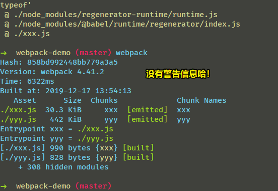

---

<mark>小结：</mark>

- babel只负责语法的编译，而像是新出的对象和方法之类的，则需要通过babel-polyfill和babel-transform-runtime来实现了

- .babelrc的作用：在webpack.config.js里边，有个babel-loader，我们需要为这个loader进行一些配置，而这些配置可以移到 .babelrc里边去！需要注意的是，该文件的语法是JSON，而且文件名必须得叫 `.babelrc`

以上就是关于JS的编译内容了！而且这也足够我们去理解webpack对JS 的编译过程了！

---

### ◇处理JS的语法糖？

> 典型的有TypesCript、JSX

<mark>处理TS：</mark>

同babel-loader一样，同样需要安装一个叫typescript的核心库：

``` bash
yarn add typescript ts-loader -D
```

webpack配置：

``` js
{
  test: /\.tsx?$/,
  loader: 'ts-loader'
}
```

创建ts文件，然后在某个入口文件里边引入它，如我在 xxx.js里边 `import './test.ts'`

webpack打包一下，结果：

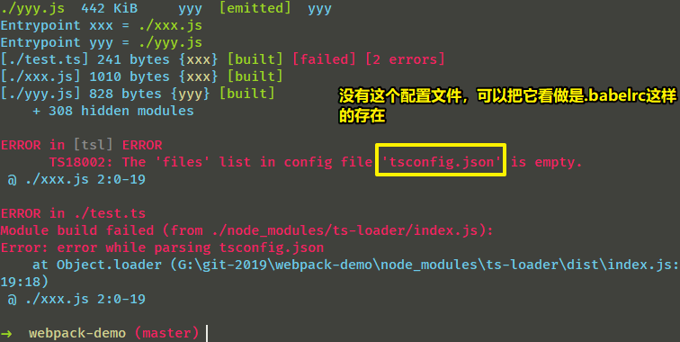

因此，我们需要创建一个叫 `tsconfig.json`文件，这样一来，ts文件才会被正常编译、打包！

该文件的简单配置如下：

``` json
{
  "compilerOptions": {
    "module": "commonjs",
    "target": "ES5"
  },
  "exclude": [
    "./node_modules"
  ]
}
```

> compilerOptions：编译选项，旗下有个module属性，该属性定义我们以什么样的规范来编译，如 `commonjs`规范！还有个target属性，该属性定义我们要以什么的语言来编译，如编译成兼容es5的代码即可！
> 
> exclude：哪些目录是不编译的，如我们指定node_modules下的这些第三方库无须编译哈！
> 
> include：哪些目录是编译的

webpack打包结果：

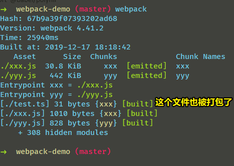

编译对比：

``` js
// 编译前
const hello: String = 'hi，我是ts!'

// 编译后
eval("var hello = 'hi，我是ts!';\r\n\n\n//# sourceURL=webpack:///./test.ts?");
```

以上就是对一些JS语法糖的处理，除了ts以外，像是jsx等各种语法糖都是这么一个处理方式，即：

1. 匹配某种语法糖的文件后缀
2. 针对这种语法糖的loader
3. 对loader进行配置

如上边的ts文件处理就是这种方式的！

总之，事实上，在webpack里边，几乎所有的东西基本上都是以上这种处理格式！即这样：

> 我要处理啥类型的文件？针对这种类型的文件，我要下载啥loader？引入了这个loader之后，我是否需要添加什么配置才能让webpack正常打包？

所有的loader都是以上所说的这么一个规律，遵循这样的规律，那么这些一个个文件东西就能够被webpack正常的打包处理了！

问：

<mark>1、为啥还要处理tsx这种文件？</mark>

因为用TypeScript写的文件有两种，一种是ts，一种则是tsx（tsx 就是 使用 typescript 书写 jsx。）

将来ts会和js平分江山，很多项目都开始使用ts了，如vue3开始用ts写源码了，用于加强对ts的支持！

总之，使用ts是未来的趋势！早学会，早涨工资！

<mark>小结：</mark>

- 如何编译JS（@babel/core、babel-loader） ？如何配置编译目标（@babel/preset-env）？如何处理新出的对象和方法（@babel/polyfill……@babel/plugin-transform-runtime、@babel/runtime）？如何处理 JS 语法糖，如ts（typescript、ts-loader）？

前端除了JS 以外，肯定少不了css哈！所以，接下来就来说说「CSS文件到底应该如何来处理」

---

### ◇css的处理与打包？

#### css-loader、style-loader？

**1）处理CSS文件**

什么都不管，直接新建一个 `css/xxx.css` 文件，然后引入到 `xxx.js` 入口文件里边，然后直接打包：

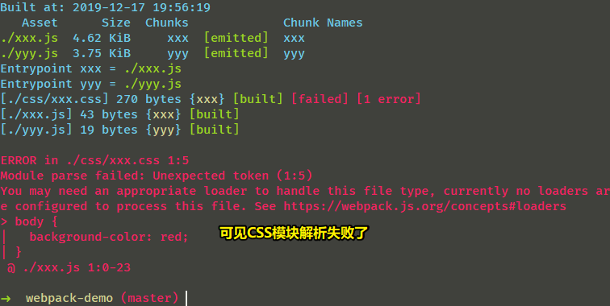

所以我们需要安装2个loader：

``` bash
yarn add css-loader style-loader -D
```

然后添加配置：

``` js
{
  test: /\.css$/,
  use: [
    {
      loader: 'style-loader'
    },
    {
      loader: 'css-loader'
    }
  ]
}
```

> 需要使用多个loader，那么use的值就是一个数组！loader的加载顺序是从下往上的，即从最后一个元素往第一个元素走！css-loader用于解析CSS文件，而style-loader则是把css挂到head里边
> 
> 总之，style-loader是将css-loader打包好的css代码以`<style>`标签的形式插入到html文件中。

webpack打包结果（css都注入到了xxx.js里边了）：

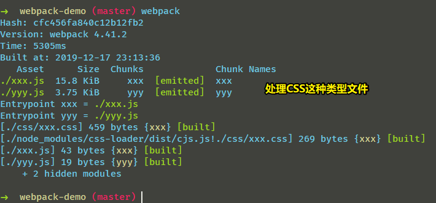

测试：

创建一个index.html，并引入 `dist/xxx.js`，结果：

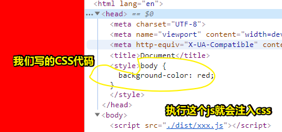

之后会说到，如何自动生成一个index.html，并且注入相应的js文件，而不是让我们开发者手动创建一个index.html，然后引入dist目录的下的js！

问：

<mark>1、对style-loader进行一些配置？</mark>

``` js
{
  test: /\.css$/,
  use: [
    {
      loader: 'style-loader',
      options: {
        'insert': 'body'
      }
    },
    {
      loader: 'css-loader'
    }
  ]
}
```

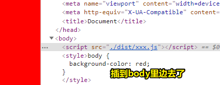

需要注意的是，现在所安装的这个style-loader，有很多配置项已经被弃用了，如transform、insertInto、insertAt等，因此，当你把项目的webpack3x升级为4x之后，那么原先的配置就会出错，毕竟有些配置项已经没用了，如前边提到的这3个选项，现在应该用insert这个选项来搞哈！

> 有些配置项，针对3x的webpack，旧版的style-loader可用，但现在4x的webpack，新版的style-loader已经不能用了，所以你把webpack升级了，那么相应webpack配置或多或少也要有所改变哈！

了解更多关于style-loader的配置请看这个：

➹：[webpack-contrib/style-loader: Style Loader](https://github.com/webpack-contrib/style-loader)

> 目前对style-loader的配置只有4个选项： `injectType`、`attributes`、`insert`、`base`

注意：通常来说，我们不会对style-loader进行配置哈！

<mark>2、关于css-loader，它有哪些被弃用的配置项呢？（</mark>

> 被弃用的配置项就是一个坑，因为webpack升级之后，引入了最新的loader（或多或少会删掉以前给定的配置项），那么原先旧版的webpack配置就会有问题了！

- minimsize：为true值，即把css进行压缩，但现在这个已经不用了，因为这个压缩已经移到webpack的整体压缩里边去了！

- modules：CSS模块化，为true，即可以让我们以模块化的方式来写CSS

- ……

<mark>3、关于CSS的模块化，这涉及到css-loader的modules配置项？</mark>

为啥需要CSS Modules？

> 学过网页开发就会知道，CSS 不能算编程语言，只是网页样式的一种描述方法。
>
>为了让 CSS 也能**适用软件工程方法**，程序员想了各种办法，让它变得像一门编程语言。从最早的Less、SASS，到后来的 **PostCSS**，再到最近的 CSS in JS，都是为了解决这个问题。

以下会介绍postcss是如何实现CSS模块化的

postcss这个骚操作的总体概述：

> 它不是将 CSS 改造成编程语言，而是功能很单纯，只加入了局部作用域和模块依赖，而这恰恰是网页组件最急需的功能，总之，它的规则少，同时又非常有用，可以保证某个组件的样式，不会影响到其他组件。(用过vue-cli都会知道，在写单文件组件的时候，scoped是多么的有用！)

目录结构：

```
G:\git-2019\webpack-demo
├── css
|  ├── xxx.css
|  └── zzz.css
├── dist
|  ├── xxx.js
|  └── yyy.js
├── index.html
├── package.json
├── README.md
├── test.ts
├── tsconfig.json
├── webpack.config.js
├── xxx.js
├── yarn.lock
└── yyy.js
```

配置：

``` js
{
  loader: 'css-loader',
  options: {
    modules: true
  }
} 
```

基础使用：

> css module 是为纯JS 搭配的

demo1：

``` css
/* xxx.css */
body {
  background-color: red;
}

:global .glo-xxx {
  color: yellow;
}

/* 注意：loc-zzz的命名，JS是拿不到的 */
:local .locZzz {
  color: palegreen;
  /* composes：组成、构成 */
  /* inh-xxx是来自于zzz.css里边的类名 */
  composes: inh-xxx from "./zzz.css";
}
```

demo2：

``` css
/* zzz.css */
.inh-xxx {
  font-size: 60px;
}
```

demo3：

``` html
<!-- index.html -->
<div id="J_testModule" class="loc-zzz">我是局部使用的class</div>
```

demo4：

``` js
// xxx.js

import test from "./css/xxx.css"

console.log(test) //{locZzz: "_14awTHO80AOEZRVHY76RtI xjac4ABGSx12UlqWhxS3u"}
document.getElementById('J_testModule').setAttribute('class', test.locZzz)
```

测试结果：

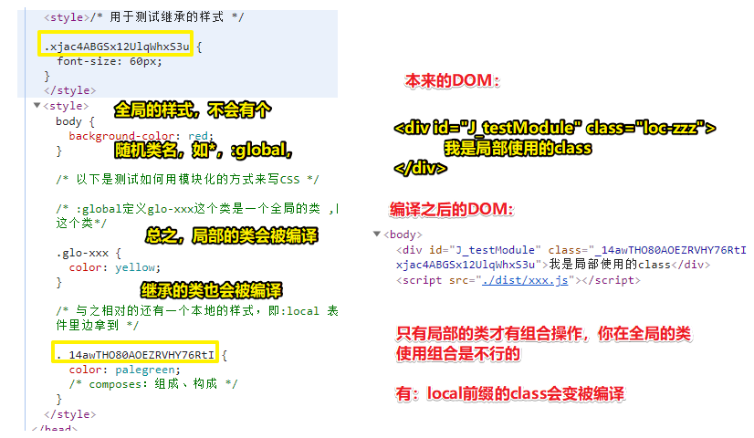

> 我打印了导入的css模块，结果它是一个对象，它的键值是一个个class（注：#id这样子的选择器也会同class这样，没有区别哈！如果一个css文件存在同名的id和class，那么这仅仅只是编译名字，不会区分这个名字是id，那个名字是class的），而且只要是class、id都会被loader编译成一随机字符串，除了`:global` 、p这样的普通标签、 `*` 不会被编译。导致这样的原因是因为我们为css-loader配置了 `modules:true`

总之，CSS Moduel 是为纯JS 搭配的，浏览器可无法解析我们上边这种 `:global`等这样的CSS写法，毕竟这是css-loader给我们提供的功能，跟我们本身的CSS规范没有一毛钱关系！

总之，你要用到CSS Moduel，那么就必须跟纯JS那种项目进行配合哈！

➹：[CSS Modules 用法教程 - 阮一峰的网络日志](http://www.ruanyifeng.com/blog/2016/06/css_modules.html)

➹：[webpack-contrib/css-loader: CSS Loader](https://github.com/webpack-contrib/css-loader#modules)

<mark>4、上个问题里边的class一长串编码并不好看，那这该如何进行美化呢？</mark> 

配置：

``` js
{
  loader: 'css-loader',
  options: {
    modules: {
      localIdentName: '[path]_[name]_[local]_[hash]'
    }
  }
}
```

测试，有这样的CSS：

``` css
#ooo {
  font-size: 80px;
}

.ooo {
  font-size: 60px;
}
```

css-loader处理结果：

``` css
#css-_xxx_ooo_8454616ff91fc3e631edd338cb82c115 {
  font-size: 80px;
}

.css-_xxx_ooo_8454616ff91fc3e631edd338cb82c115 {
  font-size: 60px;
}
```

可见，

- path：css文件相对于项目根目录的路径
- name：文件名
- local：类名 or id名
- hash：一串字符串hash编码

如果我们保持样式原命名，直接使用local即可！之前直接这样 `module:true`这样配置，就默认让 `*`、`:global`、`p`等保持原命名！

一个版本差异问题，在webpack4x之前，`localIdentName`不是写在modules里边的，而是与modules它同级的，即这样：

``` js
{
  module: true,
  localIdentName: [local]
}
```

总之，webpack里边的版本兼容坑非常多！（这一点需要注意一下哈！）

以上就是css-loader的处理了。接下来会说到less和sass的处理！(作业)

#### postcss-loader？

> 这是一个给CSS锦上添花的这么一个东西

作用：

- 本身无任何卵用，即不起任何作用

何时用？

- 它可以提供一系列的插件，帮助我们的webpack、css实现很多功能，所以当你需要xxx功能的时候，那么你就使用它，而且使用它意味着需要安装一些相关功能的插件哈！

如

1. 自动加前缀功能，用于让CSS兼容低版本的浏览器
2. postcss-cssnext：让我们可以使用下一代版本的CSS，即未来的CSS
3. 雪碧图

<mark>1、如何自动加前缀？</mark>

postcss-loader的位置放置：

> 假如有less-loader，那么postcss-loader配置需要放在less-loader上面，css-loader下面，意味着在配置时需要将less进行postcss处理后再转为css-loader。

我们知道postcss-loader它本身是不做任何事情的，它所有的功能都是通过一系列插件来完成的！因此，我们需要给它一些配置：

``` js
{
  loader: 'postcss-loader',
  options: {
    ident: 'postcss',
    // 相关的一些功能都通过plugins来实现
    plugins:[
      require('autoprefixer')() //引用进来，还得调用一下
    ]
  }
}
```

安装npm包（50s）：

``` bash
yarn add postcss postcss-loader autoprefixer -D
```

测试：

``` css
/* 处理前： */

:local .locZzz {
  color: palegreen;
  /* composes：组成、构成 */
  composes: inh-xxx from "./zzz.css";

  display: flex;
}

/* 处理后： */

.css-_xxx_locZzz_6c571b07bfe6758fca2480c8eb0d2a44 {
  color: palegreen;
  /* composes：组成、构成 */
  display: -webkit-box;

  display: flex;
}
```

可以看到，CSS代码是加了前缀，但是加的不全啊！

如 `-moz-box`、 `-o-box`、`-ms-box` 这些并没有添加呀！

为啥会这样呢？——很简单，这和我们的babel-loader是一样的！

即我需要告诉babel-loader一个targets，而这加前缀也要告诉一个目标

总之，像是为了版本兼容而进行的编译基本上我们都必须指定一个目标，而这是一个规律哈，所以请记住它！（**所有为了版本兼容的向下编译，我们都得指定一个目标**）

对于给css加前缀配置目标，是很简单的，即不需要安装其它npm包了，直接配置一下目标即可。

但是，有很多东西我们都是需要兼容的，如果我们每一个地方都写一次差不多的兼容，那么这是很麻烦的！如在.babelrc里边写一次，在webpack.config.js里边写一次……

因此，我们可以把所有的编译目标全部的定义在package.json里边去：

``` json
"browserslist": [
  "> 1%",
  "last 2 versions",
  "not ie <= 8"
]
```

结果：

``` css
.css-_xxx_locZzz_6c571b07bfe6758fca2480c8eb0d2a44 {
  color: palegreen;
  /* composes：组成、构成 */

  display: -webkit-box;

  display: -ms-flexbox;

  display: flex;
}
```

> 特别古老的前缀不会加！目前不需要编译到moz

这就是所谓的「化整归一」操作啦！


<mark>2、postcss-cssnext？</mark>

> 可以使用下一代的CSS语法，同样是个骚操作！

配置：

``` js
{
  loader: 'postcss-loader',
  options: {
    ident: 'postcss',
    plugins: [
      require('autoprefixer')(),
      require('postcss-cssnext')()
    ]
  }
}
```

安装：

``` bash
yarn add postcss-cssnext -D
```

测试：

``` css
/* 处理前： */

:local .locZzz {
  color: palegreen;
  /* composes：组成、构成 */
  composes: inh-xxx from "./zzz.css";

  display: flex;

  background-color: var(--mainColor);
}

:root {
  --mainColor: yellowgreen;
}

/* 处理后： */

.css-_xxx_locZzz_6c571b07bfe6758fca2480c8eb0d2a44 {
  color: palegreen;
  /* composes：组成、构成 */

  display: -webkit-box;

  display: -ms-flexbox;

  display: flex;

  background-color: yellowgreen;
}
```

> :root处理后消失了！

<mark>3、关于插件引进来为啥要执行？</mark>

require进来的插件是个方法呀，你只有调用它，这个插件才会生效！

以上就是postcss常用的两个功能哈！

#### 如何提取CSS？

> 目前你会发现，一个CSS文件会被以style标签的方式插入到html里边去！如果有两个css文件，那么在head里边就会出现两个style标签！如果加载的第一个css文件里边，还有其它css，那么其它的css会先添加到head标签里边去！说白了后来的css先进入head！

那么问题来了，如何把这些style标签里边的CSS提取成一个单独的CSS文件呢？（这个需求是很常见的）

这时，插件终于要登场了！

提取（extract）CSS的插件有两个（webpack插件的名字又臭又长，很难记）：

<mark>1）extract-text-webpack-plugin</mark>

安装：

``` bash
yarn add extract-text-webpack-plugin -D
```

配置：

``` js
const extracss = require('extract-text-webpack-plugin')
module.exports = {
  module: {
    rules: [
      {
        test: /\.css$/,
        use: extracss.extract({
          fallback: "style-loader",
          use: [
            {
              loader: 'css-loader',
              options: {
                modules: {
                  localIdentName: '[path]_[name]_[local]_[hash]'
                }
              }
            },
            {
              loader: 'postcss-loader',
              options: {
                ident: 'postcss',
                plugins: [
                  require('autoprefixer')(),
                  require('postcss-cssnext')()
                ]
              }
            }
          ]
        }),
      }
    ]
  },
  plugins: [
    new extracss({
      filename: '[name].mini.css'
    })
  ]
}
```

webpack打包报错了！

解决错误：

``` bash
yarn add extract-text-webpack-plugin@next -D
```

安装最新的包即可！（有@next，一般安装的是Beta版）

结果：

```
G:\git-2019\webpack-demo
├── css
|  ├── xxx.css
|  └── zzz.css
├── dist
|  ├── xxx.js
|  ├── xxx.mini.css
|  └── yyy.js
├── index.html
├── package.json
├── README.md
├── test.ts
├── tsconfig.json
├── webpack.config.js
├── xxx.js
├── yarn.lock
└── yyy.js
```
style标签里边的样式都被提取到了 `xxx.mini.css`里边去了，所以，对index.html 需要link 样式进来！

➹： <https://github.com/webpack-contrib/extract-text-webpack-plugin>

问：

<mark>1、如果报出信息出现`instanceof …… instead`？</mark>

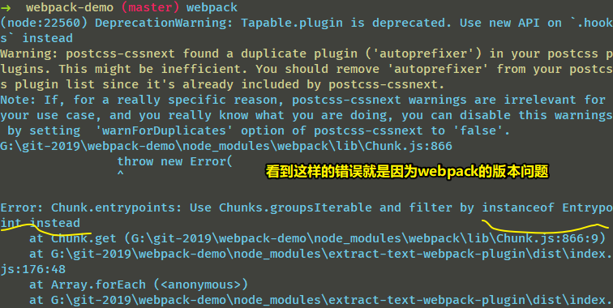

这一般是现在webpack这个版本不支持的问题！

> 这个插件要配合webpack4使用的话，请安装它的 `@next` 版本！

<mark>2、new 一下插件？</mark>

所有的插件都要new一下，不然，这是不会生效的！

<mark>2）mini-css-extract-plugin</mark>

用法上同 `extract-text-webpack-plugin` 没啥区别，只是它可以加hash！（这是唯一区别哈！毕竟前者对css文件的命名无法加hash哈！而hash对于浏览器本地缓存css是极为重要的！）

配置上区别：

1. 需要用自己的xxx.loader去代替style-loader，而 extract 则是把fallback设置为style-loader

安装：

``` bash
yarn add mini-css-extract-plugin -D
```

配置：

``` js
const MiniCssExtractPlugin = require('mini-css-extract-plugin');

module.exports = {
  module: {
    rules: [
      {
        test: /\.css$/,
        use: [{
          loader: MiniCssExtractPlugin.loader
        },
        {
          loader: 'css-loader',
          options: {
            modules: {
              localIdentName: '[path]_[name]_[local]_[hash]'
            }
          }
        },
        {
          loader: 'postcss-loader',
          options: {
            ident: 'postcss',
            plugins: [
              require('autoprefixer')(),
              require('postcss-cssnext')()
            ]
          }
        }
        ]
      }
    ]
  },
  plugins: [
    new MiniCssExtractPlugin({
      filename: '[name].min.css'
    })
  ]
}
```

➹： <https://github.com/webpack-contrib/mini-css-extract-plugin>


以上就是对css的基本处理了，接下来会说到对HTML的处理

---

### ◇html处理？

> 99:55


### ◇图片等其他资源的处理？


## ★作业

1、实现以上所提到的所有功能

2、并且再此基础上加上对less的编译

3、加上对于字体图标的处理-iconfont

## ★总结

- 我一直认为使用个webpack就是在做工程化了，没想到这只是工程化的一部分！如开发规范、模块化开发模式、人员配置、git等工具使用等等都是工程化的一部分！

- 在学习webpack使用的过程中，请回顾以前直接copy的webpack配置文件！


## ★Q&A

### ①垫片是啥？

通俗来讲，JS垫片就是，在低级环境中用高级语法时，在低级环境中手动实现的高级功能，模拟高级环境

打个比方， 你写的的JS代码是一张桌子，有4个语法腿。但4个腿都是用的es3，一样长，这时候桌子非常稳当。
但如果四个腿不一样长（一个腿是es5），桌子就有随时倒塌的可能，甚至不可用。这个时候你就需要垫片，把es3腿垫平，与es5一样高，你的桌面才能稳当的使用。

示例：

es5中的关于数组的forEach功能，在es3中不可用，你可以在es3中用`Array.prototype.forEach=fn()`来实现，此时，你自己实现的这个forEach就属于垫片

总之，shim或polyfill都是为了解决兼容性问题（，有时候还会为了抹平浏览器差异）而存在的。

比如最近ES6标准中新出的promise对象，有些老的浏览器没有这个对象，或者各个浏览器的实现可能不一致，那就需要引入polyfill来解决兼容性问题。（对应的polyfill为es6-promise）。

当然你也可以自己实现一个。

其它的示例，可以看一下babel-polyfill，core-js。算是比较有名的库。

➹：[javascript - 何为垫片？垫片是一种什么概念在js中？ - SegmentFault 思否](https://segmentfault.com/q/1010000007256959)