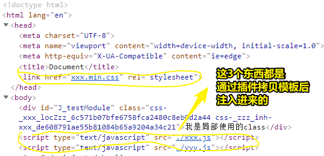
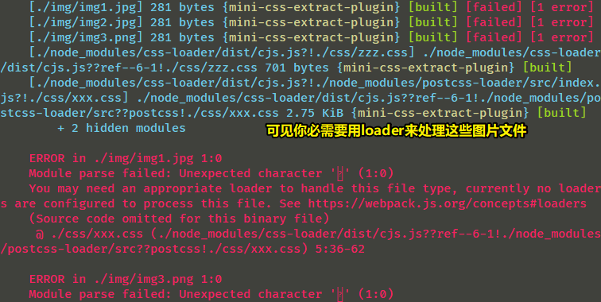
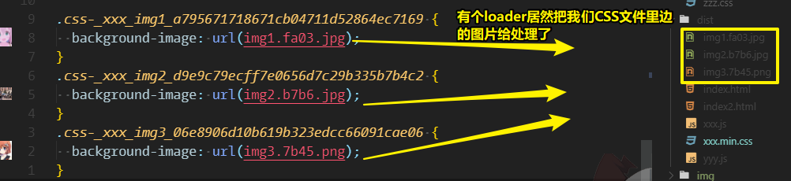
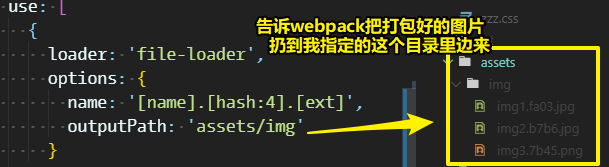
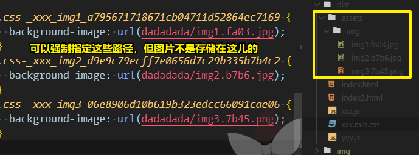
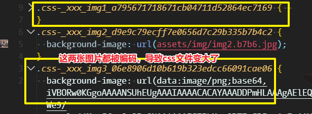
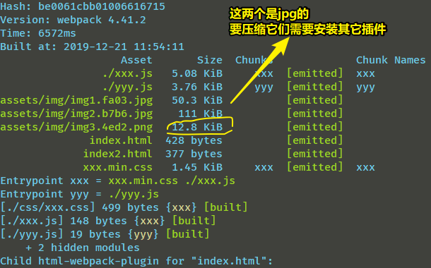
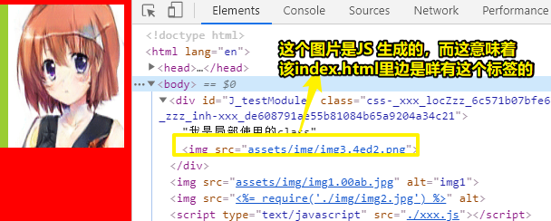
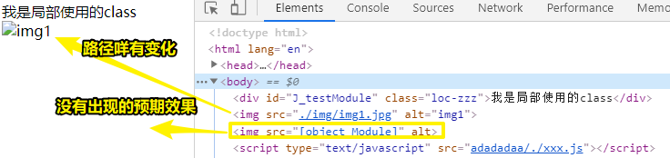
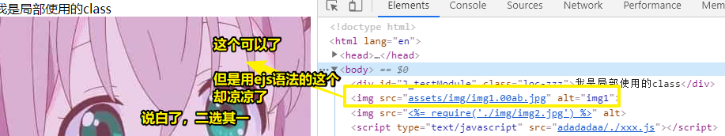

# 各种文件类型的处理

> 在 VS Code 里边，一个文件的内容写得过多，会很卡，如删除内容时贼慢，所以我把上篇笔记剩余的 3 个点写到这儿了

## ★html 处理？

为什么需要它？

> 之前我们是自己手动创建一个 html，然后手动引入一个 script 标签和 link 标签，那么有咩有什么办法可以自动引入 script 标签和 link 标签呢？——显然是有的哈！

安装插件：

``` bash
yarn add --dev html-webpack-plugin
```

配置：

``` js
const HtmlWebpackPlugin = require('html-webpack-plugin')
{
  plugins: [
    new HtmlWebpackPlugin({
      template: 'index.html', 
      filename: 'index.html'
    })
  ]
}
```

> template：指定以哪个文件作为模板，如果没有模板的话，那该如何创建一个html文件并且注入相应的代码呢？
> filename：打包出来的index.html叫啥名字哈！

webpack打包结果：



> 这个index.html是在dist目录下生成的，其结果和我们之前手动引入是一样的！

总之，使用了这个插件之后，可以自动加css文件和js文件到index.html里边去！

由于，我们设置了多入口，即entry对象旗下有多个键值，那么我们就需要new多几次插件：

> 有多个入口，意味着这是一个多页面应用，说白了，就是在告诉webpack「你要打包的是一个多页面应用」

总之，一个入口js就要对应一个页面，而不是两个入口js，都搞到同一个页面里边去了，因此，可有以下配置：

``` js
{
  plugins: [
    new HtmlWebpackPlugin({
      template: 'index.html', 
      filename: 'index.html'
    }),
    new HtmlWebpackPlugin({
      template: 'index.html', 
      filename: 'index2.html'
    })
  ]
}
```

打包之后，生成了两个页面，但是，这每个页面都引入了两个入口文件哈！可见，这依旧不是我们想要的！

目前，我们希望的是：一个页面有个xxx.js入口，另一个页面则是有个yyy.js入口

那么如何做呢？

很简单，设置一个chunks即可，如果不设置它的话，那么就会把所有的打包结果引进到一个index.html里边去了！

``` js
{
  plugins: [
    new HtmlWebpackPlugin({
      template: 'index.html',
      filename: 'index.html',
      chunks: ['xxx']
    }),
    new HtmlWebpackPlugin({
      template: 'index.html',
      filename: 'index2.html',
      chunks: ['yyy']
    })
  ]
}
```

> chunks的元素，是没有.js后缀的，不然会不起效果！即找不到一个叫如xxx.js的文件，然后就会把该文件引入进去，说白了，chunks识别的是不加后缀的文件名！

webpack打包的结果：

``` html
<!-- index.html -->
<head>
  <link href="xxx.min.css" rel="stylesheet">
</head>

<body>
  <div id="J_testModule" class="loc-zzz">我是局部使用的class</div>
  <script type="text/javascript" src="./xxx.js"></script>
</body>

<!-- index2.html -->
<head>
  <link href="xxx.min.css" rel="stylesheet">
</head>

<body>
  <div id="J_testModule" class="loc-zzz">我是局部使用的class</div>
  <script type="text/javascript" src="./yyy.js"></script>
</body>
```

> 之后，我会介绍如何处理多入口，毕竟多一个入口，就得多一个new，而这显然忒麻烦了！

<mark>小结：</mark>

1. 对HTML的处理，是通过插件来完成的！
2. 可以制定一个方法，来针对配置多入口时，需要new好几个页面这种繁琐操作！
3. 如果做多页面，如做两个页面，那么就得 new HtmlWebpackPlugin 两次才行
4. 如果不指定chunks，那么就会把所有的chunks（如js文件、css文件）都加到页面里边去！除非你指定了chunks，不然你自己看着办吧！

以上就是对HTML的处理了！接下来会说到如何处理图片。

➹： <https://github.com/jantimon/html-webpack-plugin>

## ★图片等其他资源的处理？

关于图片的处理，这又是一个比较有意思的东西！

添加图片：

``` css
/* xxx.css */
.img1 {
  background-image: url("../img/img1.jpg");
}
.img2 {
  background-image: url("../img/img2.jpg");
}
.img3 {
  background-image: url("../img/img3.png");
}
```

可见，我们引入了新的类型文件，如果你不对这些文件进行处理，即直接打包，那么就会这样：



而处理图片的loader有：

- file-loader – 让webpack可以引入其他文件
- url-loader – 包含了file-loader，可以代替file-loader
- img-loader – 可以对图片进行多种处理，包括压缩等等

注意：图片和所有资源一样，都可以使用同一个loader来处理，说白了，就是有一个「万金油」loader，它可以处理mp3、mp4、图片等各种各样的资源，而这个loader就是file-loader啦！

安装loader：

``` bash
yarn add file-loader url-loader img-loader -D
```

> 一次性安装3个loader

### ◇file-loader

配置：

``` js
module.exports = {
  module: {
    rules: [
      {
        test: /\.(png|jpe?g|gif)$/i,
        use: [
          {
            loader: 'file-loader',
            options: {
              name: '[name].[hash:4].[ext]'
            }
          },
        ],
      },
    ],
  },
};
```

> 关于optionss旗下的属性，注意是name，而不是filename。[name]表示图片本来的名字，[ext]则是图片本来的文件后缀

webpack打包一下：



问：

<mark>1、我想把打包好的图片指定到某个目录下？</mark>

往options旗下，添加一个叫 `outputPath` 的属性，该属性可以指定目标文件（即打包好的图片）放在哪个目录，如这样：

``` js
outputPath: 'assets/img'
```

webpack打包结果：



``` css
.css-_xxx_img1_a795671718671cb04711d52864ec7169 {
  background-image: url(assets/img/img1.fa03.jpg);
}
.css-_xxx_img2_d9e9c79ecff7e0656d7c29b335b7b4c2 {
  background-image: url(assets/img/img2.b7b6.jpg);
}
.css-_xxx_img3_06e8906d10b619b323edcc66091cae06 {
  background-image: url(assets/img/img3.7b45.png);
}
```

可见，我们指定了输出路径，如`assets/img`，那么就会把图片扔到 `dist/assets/img`下！

还有，与之相对应的还有一个 `publicPath`属性，该属性的作用「为目标文件指定自定义公共路径」

这个属性非常重要，如果遇到文件找不到的时候，可以通过该属性强制指定目标文件的存放路径！

该路径会吃掉，`outputPath`的路径，所以当你这样配置时：

``` js
{
  outputPath: 'assets/img',
  publicPath: 'dadadada'  
}
```

其打包结果：



所以，我们通常会把这两个属性的值设为一样的路径！

与之类似的是，在output旗下也有这样一个 `publicPath` 属性，如果我们这样配置了：

``` js
{
  output: {
    'filename': './[name].js',
    'publicPath': 'adadadaa'
  }
}
```

那么其打包的结果就会这样：

``` html
<!-- index.html -->
<html>
<head>
<link href="adadadaa/xxx.min.css" rel="stylesheet">
</head>

<body>
  <div id="J_testModule" class="loc-zzz">我是局部使用的class</div>
  <script type="text/javascript" src="adadadaa/./xxx.js"></script>
</body>

</html>
```

当然，这并不会影响图片的路径，图片的路径依旧是我们用 `publicPath` 指定的那个路径

总之，几乎所有的路径问题，即当你打包之后，遇到「找不到文件」「路径不对」等这样的问题，都可以通过 `publicPath` 来解决！

<mark>2、css、html这些资源能否用file-loader来搞？</mark>

➹：[webpack - css-loader和file-loader的关联 - SegmentFault 思否](https://segmentfault.com/q/1010000012539780)

---

➹：[webpack-contrib/file-loader: File Loader](https://github.com/webpack-contrib/file-loader)

### ◇url-loader

话说，url-loader与file-loader是啥关系呢？

关系就是：url-loader包括file-loader，说白了，你可以用url-loader替代file-loader！

总之，url-loader 是在file-loader 的基础上增加了很多功能（如把图片转成base64编码），相当于是file-loader的超集！

通常，我们都会使用url-loader，而不是file-loader

配置：

> file-loader怎么配置的，url-loader就怎么配置

``` js
{
  test: /\.(png|jpe?g|gif)$/i,
  use: [
    {
      loader: 'url-loader',
      options: {
        name: '[name].[hash:4].[ext]',
        outputPath: 'assets/img',
        publicPath: 'assets/img',
        limit: 60000
      }
    },
  ],
}
```

> limit的默认值是无限的（单位是Byte），即不管图片多大都会搞成是base64编码的，我们在这里搞为60000个字节，而我测试的图片，有3个，分别是111kiB、50Kib，40Kib的大小，这样就会有两个图片被搞成是64编码的，说白了，小于58Kib的文件都会被编码！

webpack打包结果：



> 注意：被base64编码的图片，不会被打包到 `assets/img`路径下，说白了，此刻该路径下只有一个未被base64编码的图片！

为啥需要limit呢？

我们知道这是为了节省网络请求，可是这图片并咩有消失，也没有所谓的缩小了，说白了，css文件的大小增加了：

```
咩有编码图片时：

xxx.min.css   1.45 KiB

编码了两张图片之后：

xxx.min.css   122 KiB

两张图片合计为90Kib，可见凭空多了30Kib的数据！
```

所以，如果我们对大图片进行编码的话，那么这css文件显然无比巨大，那么这就意味着浏览器加载css资源时会变得特别慢哈！

由于，图片是可以异步加载的，即用户是可以先看到没有图片的网页内容的，但是，由于css巨大无比，那首页加载css会变得很慢

因此，我们一般会把小图片，如5000Byte的图片，设置为base64编码的，这样一来，css的体积不会变得忒大，而且这基本上是可以忽略首页加载css贼慢的影响！

> 官方推荐8192Byte大小的图片，即8Kib大小的图片

总之，我们可以把xxx大小之下的图片设置成一个base64编码的！

问：

<mark>1、什么叫base64编码？</mark>

我们知道，每个图片都是一个网络请求，所以有的时候，我们为了节省网络请求，那么我们就会把这些小的图片变成64编码

<mark>2、关于字节单位？</mark>

```
1KB = 1,000 Byte
1MB = 1,000 KB
1GB = 1,000,000 KB
1TB = 1,000,000,000 KB


1KiB = 1,024Byte
1MiB = 1,024KiB
1GiB = 1,024MiB = 1,048,576 KiB
1TiB = 1,024GiB = 1,073,741,824 KiB
```

> K与 Ki 分别表示 Kilo-（千） 与 Kibi-（二进制千） 。作为前缀使用时， K表示 1,000，Ki 表示1,024。这是两种标准的不同所致：二进制IEC、十进制SI。

➹：[KB / KiB，MB / MiB，GB / GiB，… 的区别是什么？ - 知乎](https://www.zhihu.com/question/24601215)

---

➹：[webpack-contrib/url-loader: A loader for webpack which transforms files into base64 URIs](https://github.com/webpack-contrib/url-loader)

### ◇img-loader

是什么？

> 顾名思义，是专门用来处理图片的！

之前了解到file-loader和url-loader可以处理任何类型的文件，即至少可以让你引进来的任何文件不会报错！

而专门处理图片的则是叫「img」的loader

该loader最最最重要的作用就是图片压缩

img-loader 同 postcss-loader 一样，本身不做任何事情，它所有的功能都是通过插件来完成的，因此，就会有一系列的插件来压缩我们的图片

而这一系列的插件有个统称叫「imagemin」

然后基于这个「imagemin」，有各种针对不同图片后缀压缩的插件，如：

- [imagemin-gifsicle](https://github.com/imagemin/imagemin-gifsicle)
- [imagemin-mozjpeg](https://github.com/imagemin/imagemin-mozjpeg)
- [imagemin-optipng](https://github.com/imagemin/imagemin-optipng)
- [imagemin-svgo](https://github.com/imagemin/imagemin-svgo)

#### imagemin-pngquant

安装：

``` bash
yarn add -D imagemin
yarn add -D imagemin-pngquant
```

配置：

``` js
{
  test: /\.(png|jpe?g|gif)$/i,
  use: [
    {
      loader: 'url-loader',
      options: {
        name: '[name].[hash:4].[ext]',
        outputPath: 'assets/img',
        publicPath: 'assets/img',
        limit: 8192
      }
    },
    {
      loader: 'img-loader',
      options: {
        plugins: [
          require('imagemin-pngquant')({
            speed: 2
          })
        ]
      }
    }
  ],
}
```

> speed这个属性决定了我们可以把图片压缩到什么程度，默认是4，取值有1（暴力压缩）到11（最低的压缩水平，我测试了一下，也压缩到了13.6Kib的大小），总之，不要为了减少图片的体积，而不图片压缩到最小，这样图片显然会让图片变得很模糊，因此图片的清晰度程度与体积大小是需要权衡的！
> 
> 总之，我们一般把图片压缩到原图的一半大小即可，毕竟这相对于清晰度和体积大小来说是比较平衡的！（speed会根据不同的图片，会有不同的压缩效果，即假如speed设置了一个2值，如果xxx图片为50kib，被压缩成了10Kib，而yyy图片同样是50Kib，但是它被压缩成了20Kib大小！）

webpack打包一下：

> 我有一张png图片，其大小是40Kib，压缩之后，变为12.8Kib




问：

<mark>1、我似乎明白了为啥使用「imagemin-pngquant」这样的插件时，需要先安装个「imagemin」了</mark>

因为这些插件都需要用到「imagemin」这个npm包提供的API呀！

说白了，「imagemin」跟webpack没啥关系，同样，「imagemin-pngquant」等这样的插件同webpack也没啥关系。

如果把webpack看做是墙壁，那么「img-loader」就是粘钩，粘钩可以挂载任何东西，如「imagemin-pngquant」(pngquant是「什么时候」之意)这样的东西……

➹：[imagemin/imagemin: Minify images seamlessly](https://github.com/imagemin/imagemin)

➹：[keywords:imageminplugin - npm search](https://www.npmjs.com/search?q=keywords:imageminplugin)

<mark>2、在安装「imagemin-pngquant」的时候，报错了？</mark>

安装：

``` bash
yarn add -D imagemin-pngquant
```

报了这样的错误：

```
……
error G:\git-2019\webpack-demo\node_modules\pngquant-bin: Command failed
……
Error: pngquant failed to build, make sure that libpng-dev is installed 
```

于是只能google大法了：

方案一：

``` bash
yarn add -D pngquant --msvs_version=2019
```

安装到最后，卡住了。所以这个方案GG了

➹：[png - How to install libpng-dev on windows? - Stack Overflow](https://stackoverflow.com/questions/26522310/how-to-install-libpng-dev-on-windows)

方案二（Linux平台下的）：

由于我的是windows平台下的，所以GG了

➹：[NodeJS Imagemin - 知乎](https://zhuanlan.zhihu.com/p/91035613)

方案三：

使用npm来安装：

``` bash
npm install -D imagemin-pngquant
```

结果安装成功：


既然这个npm可以安装，那我从新打开cmder，再次：

``` bash
yarn add -D imagemin-pngquant
```

结果，居然安装成功了，而安装时间是367s！

或许是我切换了yarn为淘宝源然后重启了cmder，或许是方案一的安装日志一直卡到最后一点，或许……我TM真不知道为啥yarn又能安装成功了！

<mark>3、为啥这些插件都有imagemin的前缀？</mark>

因为这些插件都是通过牛津大学里边的一个工作室一起开发出来的

#### imagemin-mozjpeg、imagemin-gifsicle

> 用于压缩jpeg、gif

安装（930s）：

``` bash
yarn add -D imagemin-mozjpeg imagemin-gifsicle
```

配置：

``` js
{
  loader: 'img-loader',
  options: {
    plugins: [
      require('imagemin-pngquant')({
        speed: 2
      }),
      require('imagemin-mozjpeg')({
        quality: 10 //1-100，1是压缩到最狠的
      }),
      require('imagemin-gifsicle')({
        optimizationLevel: 3 //1、2、3，3是最狠的！ 
      }),

    ]
  }
}
```

webpack打包一下，结果发现40Kib那张jpeg图片，被转成base64编码的，而110Kib那张则没有（因为压缩后的图片没有小于limit的值），可见，我们处理图片的顺序是，先让img-loader的imagemin-pngquant等这些插件压缩图片，然后再交给url-loader！

> 记住不同的图片，可能会需要不同的speed，有些图片可以用最狠的，而有些则不能！

### ◇如何在JS 、CSS、HTML里边引入图片？

在CSS里边引入图片（直接创建一个css文件，然后通过background属性引入即可）：

``` css
.img1 {
  background-image: url("../img/img1.jpg");
}
```

---

JS引入图片：

``` js
import img1 from "./img/img3.png"
console.log(img1) //assets/img/img3.4ed2.png
var img = new Image()
img.src=img1
document.getElementById('J_testModule').appendChild(img)
```

打包结果：



> 这种import图片的方式只适用于webpack哈！

---

那么如何在HTML里边引入呢？如img元素的src属性：

``` html
<!-- 在index.html这个模板里边 -->

```

由于我们配置了打包后图片的存放路径为 `assets/img` ，因此如果我们像上边这样写图片的路径是没有效果的，因为打包后，该img元素的src路径依旧是这个！

当然，你可以设置打包后图片的存放路径为 `img`，不过这样一来，就很不灵活了！

所以在我们HTML里边引入图片的话，有两种处理方式：

<mark>1）模板字符串（ejs的语法）：</mark>

``` html
" alt="">
```

打包结果：



为啥会这样呢？

究其原因是版本的问题，那么是谁的版本问题呢？——flile-loader哈！

```
"file-loader": "^5.0.2"
```

因此，我们对它降版即可解决！

``` bash
yarn add -D file-loader@4.1.0
```

打包结果：


> 这是一个坑，请记住！

<mark>2）通过html-loader来搞：</mark>

安装：

``` bash
yarn add -D html-loader
```

配置：

``` js
{
  test: /\.html$/,
  use:{
    loader: 'html-loader'
  }
}
```

测试代码（还是一样的代码）：

``` html

" alt="">
```

打包结果：



问：

<mark>1、html-loader有哪些常用配置项？</mark>

如果我们需要对图片进行懒加载的话，那么我们的图片地址，可能会放在 `data-src` 属性里边去！

那么这个属性我们要处理的就是「data-src」里边的图片地址了，而不是 「src」里边的

> 也可是新出的srcset属性

因此，面对这种情况，我们该如何处理呢？

对html-loader进行配置：

``` html
{
  test: /\.html$/,
  use:{
    loader: 'html-loader',
    options: {
      attrs: [
        'img:data-src',
        "video:src"
      ]
    }
  }
}
```

> 除了图片，音视频等这些资源都可以交给html-loader来处理，如果不配置的话，那么是拿不到这些资源的！当然你可以用file-loader，但是这需要用模板字符串语法哈！总之，这两种方式二选其一！如果都不选择，那么这些往HTML里边引入的资源，打包之后就会找不到！

测试代码：

``` html
<!-- 处理前 -->

" alt="">

<!-- 处理后 -->

" alt="">
```

➹：[webpack-contrib/html-loader: HTML Loader](https://github.com/webpack-contrib/html-loader)

<mark>小结：</mark>

- 不管你在HTML里边引入的是图片、音视频、flash、pdf，还是其它类型的文件，都可以通过html-loader来配置一下，这样一来，它们都可以被正确的引入了！如果你既不写模板字符串和html-loader的话，那么webpack是拿不到这些文件的！

### ◇雪碧图

雪碧图有两种用法：

1. postcss里边有个雪碧图的插件
2. webpack自身自带处理雪碧图的插件

#### postcss-sprites

> 雪碧图：把全部图片合成为一张图片，然后通过背景定位去给背景图定位，作用就是减少http请求

文档：[2createStudio/postcss-sprites: Generate sprites from stylesheets.](https://github.com/2createStudio/postcss-sprites)

安装：

``` bash
yarn add -D postcss-sprites
```

在不开代理的情况下，这个包的安装是贼慢的，因为它需要向github.com发送请求下载这个东西：

```
https://github.com/Medium/phantomjs/releases/download/v2.1.1/phantomjs-2.1.1-windows.zip
```

而这就是为啥之前安装一些其它包很慢的原因所在了！

配置：

```js
{
  loader: 'postcss-loader',
  options: {
    ident: 'postcss',
    plugins: [
      require('autoprefixer')(),
      require('postcss-cssnext')(),
      require('postcss-sprites')()
    ]
  }
}
```

测试：

``` css
/* 打包前： */
.img1 {
  background-image: url("../img/img1.jpg");
}
.img2 {
  background-image: url("../img/img2.jpg");
}
.img3 {
  background-image: url("../img/img3.png");
}

/* 打包后： */
.css-_xxx_img1_a795671718671cb04711d52864ec7169 {
  background-image: url(assets/img/sprite.af8b.png);
  background-position: -900px 0px;
  background-size: 1300px 600px;
}
.css-_xxx_img2_d9e9c79ecff7e0656d7c29b335b7b4c2 {
  background-image: url(assets/img/sprite.af8b.png);
  background-position: 0px 0px;
  background-size: 1300px 600px;
}
.css-_xxx_img3_06e8906d10b619b323edcc66091cae06 {
  background-image: url(assets/img/sprite.af8b.png);
  background-position: -900px -400px;
  background-size: 1300px 600px;
}

```

不过，这打包出来的精灵图并没有压缩哈，而且体积大小是367KiB，并不是简单的110+40+50=200Kib的大小


总之，使用这个插件的效果是：

1. 把背景图片都拼在了一起
2. 追加一写CSS属性

该插件可以自动帮我们合成雪碧图，而且又自动的帮我们进行了定位，看起来很牛逼，但目前来说，是没啥用的！

因为目前市面上，所有的雪碧图插件都是根据原图大小进行定位的，而不是我们想要的根据设置背景图的那个容器，如div的大小来进行定位的

我们一般使用背景图，基本上都得控制它的大小，所以这插件显然是非常鸡肋的

但它存在了，就有它存在的意义，即只要我们的背景图是定制的，那么用这个插件还是很舒服的！

<mark>小结：</mark>

- 你在css里边用了哪些图，不管要不要拼，都会给你拼接成雪碧图，然后自动修改CSS
- 有些时候我们并不希望拼成雪碧图，因为这可能会造成定位错乱，如果这雪碧图插件不管三七二十一就把图片搞成了雪碧图，显然我们要说声「操」了！

#### webpack-spritesmith

> 它可以指定某个目录下的图片生成雪碧图，而不像postcss-sprites那样无厘头的把只要引入了背景图的CSS都给整成雪碧图了！

文档：[mixtur/webpack-spritesmith: Webpack plugin that converts set of images into a spritesheet and SASS/LESS/Stylus mixins](https://github.com/mixtur/webpack-spritesmith)

安装：

``` bash
yarn add -D webpack-spritesmith
```

配置：

``` js
var path = require('path');
var SpritesmithPlugin = require('webpack-spritesmith');

new SpritesmithPlugin({
  src: {
    // 图片来源文件夹
    cwd: path.join(__dirname, './img'),
    // 处理什么图片
    glob: '*.*'
  },
  target: {
    // 打包到哪儿
    image: path.join(__dirname, 'dist/sprites/sprite.png'),
    css: path.join(__dirname, 'dist/sprites/sprite.css')
  },
  apiOptions: {
    cssImageRef: "./sprites/sprite.png"
  }
})
```

打包结果：

``` css
/* dist/sprites/sprite.css */

/*
Icon classes can be used entirely standalone. They are named after their original file names.

Example usage in HTML:

`display: block` sprite:
<div class="icon-home"></div>

To change `display` (e.g. `display: inline-block;`), we suggest using a common CSS class:

// CSS
.icon {
  display: inline-block;
}

// HTML
<i class="icon icon-home"></i>
*/
.icon-img1 {
  background-image: url(./sprites/sprite.png);
  background-position: -900px 0px;
  width: 400px;
  height: 400px;
}
.icon-img2 {
  background-image: url(./sprites/sprite.png);
  background-position: 0px 0px;
  width: 900px;
  height: 600px;
}
.icon-img3 {
  background-image: url(./sprites/sprite.png);
  background-position: -900px -400px;
  width: 128px;
  height: 128px;
}

```

打包出来的精灵图有1.14M，相较于上一种姿势的367Kib，大概多了3倍大小这个样子！

我们拿到这个sprite.css文件直接引入使用即可！（打包的那个css文件没有变化，即没有修改图片的url为雪碧图，也咩有添加背景定位）

问：

<mark>1、关于glob 的匹配规则？</mark>

不同语言的 glob 库支持的规则会略有不同。下面是 [node-glob](https://link.jianshu.com?t=https://github.com/isaacs/node-glob) 的匹配规则。

- `*` 匹配任意 0 或多个任意字符
- `?` 匹配任意一个字符
- `[...]` 若字符在中括号中，则匹配。若以 `!` 或 `^` 开头，若字符不在中括号中，则匹配
- `!(pattern|pattern|pattern)` 不满足括号中的所有模式则匹配
- `?(pattern|pattern|pattern)` 满足 0 或 1 括号中的模式则匹配
- `+(pattern|pattern|pattern)` 满足 1 或 更多括号中的模式则匹配
- `*(a|b|c)` 满足 0 或 更多括号中的模式则匹配
- `@(pattern|pat*|pat?erN)` 满足 1 个括号中的模式则匹配
- `**` 跨路径匹配任意字符

➹：[glob 介绍 - 简书](https://www.jianshu.com/p/ce7cf53274bb)


<mark>小结：</mark>

- 以上两种都是比较主流的雪碧图的写法，但是都不完美，即它们都是根据原图大小去定位的，除非我们是定制图片，不然这个雪碧图功能没什么用！


## ★作业

1、实现以上所提到的所有功能

2、并且再此基础上加上对 less 的编译

3、加上对于字体图标的处理-iconfont


### ◇sass 处理

> 不使用node-sass，因为它已经过时了，而现在推荐使用的是dart-sass

文档：[webpack-contrib/sass-loader: Compiles Sass to CSS](https://github.com/webpack-contrib/sass-loader)

安装：

``` bash
yarn add -D sass-loader sass
```

配置：

``` js
{
  test: /\.(sa|sc|c)ss$/,
  use: [
    {
      loader: MiniCssExtractPlugin.loader
    },
    {
      loader: 'css-loader',
      options: {
        modules: {
          localIdentName: '[path]_[name]_[local]_[hash]'
        }
      }
    },
    {
      loader: 'postcss-loader',
      options: {
        ident: 'postcss',
        plugins: [
          require('autoprefixer')(),
          require('postcss-cssnext')(),
          // require('postcss-sprites')()
        ]
      }
    },
    {
      loader: 'sass-loader',
    }
  ]
}
```

> postcss-loader在sass-loader的上边，在css-loader的下边

测试代码：

```scss
/* style.scss */

$body-color: red;
$h1-color: yellow;

body {
  color: $body-color;
}

h1 {
  color: $h1-color;
}

.scss {
  color: $h1-color;
}
```

``` js
// xxx.js（再次强调这是入口文件）
import zzz from './style.scss';
console.log(zzz)
```

打包结果：

zzz的输出是：`{scss: "_style_scss_42aedde1cb0d6fbace533035fa92acc0"}`

打包出来的css：

```css
/* xxx.min.css */

body {
  color: red;
}

h1 {
  color: yellow;
}

._style_scss_42aedde1cb0d6fbace533035fa92acc0 {
  color: yellow;
}
```

配置dart-sass，即使用fiber来提高性能：

安装：

``` bash
yarn add -D fibers
```

配置：

``` js
const Fiber = require('fibers')

{
  loader: 'sass-loader',
  options: {
    implementation: require('sass'),
    fiber: Fiber
  }
}
```

打包结果：

```
options has an unknown property 'fiber'. These properties are valid:
   object { implementation?, sassOptions?, prependData?, sourceMap?, webpackImporter? }
```

解决这个错误（查看sass-loader的[配置选项](https://github.com/webpack-contrib/sass-loader#sassoptions)即可）：

修改配置即可：

``` js
{
  loader: 'sass-loader',
  options: {
    implementation: require('sass'),
    sassOptions: {
      fiber: require('fibers'),
    },
  }
}
```

或者也可以安装低版本的sass-loader：`"sass-loader": "^7.2.0"`，目前我安装的是`"sass-loader": "^8.0.0"`

➹：[Compatibility with sass-loader 8.0.0 · Issue #2206 · JeffreyWay/laravel-mix](https://github.com/JeffreyWay/laravel-mix/issues/2206)

➹：[vue-cli and sass-loader@8 incompatibility · Issue #4513 · vuejs/vue-cli](https://github.com/vuejs/vue-cli/issues/4513)

➹：['fiber' option not in schema · Issue #762 · webpack-contrib/sass-loader](https://github.com/webpack-contrib/sass-loader/issues/762)

问：

<mark>1、peerDependencies是啥？</mark>

`peerDependencies`的目的是提示宿主环境去安装满足插件peerDependencies所指定依赖的包，然后在插件import或者require所依赖的包的时候，永远都是引用宿主环境统一安装的npm包，最终解决插件与所依赖包不一致的问题。

➹：[探讨npm依赖管理之peerDependencies - wonyun - 博客园](https://www.cnblogs.com/wonyun/p/9692476.html)

➹：[npm-package.json - npm Documentation](https://docs.npmjs.com/files/package.json#peerdependencies)

---

参考：

➹：[webpack中的sass-loader - jsweibo](https://jsweibo.github.io/2019/07/09/webpack%E4%B8%AD%E7%9A%84sass-loader/)

➹：[webpack node-sass 改为 dart-sass · Issue #54 · klren0312/daliy_knowledge](https://github.com/klren0312/daliy_knowledge/issues/54)


### ◇字体图标处理

> 我不知道为啥要处理这个，打开阿里的iconfont的，然后使用svg图标不就行了么，况且这引入的是js文件！


## ★总结

- 如果loader需要配置，那么就用use，否在直接用一个loader属性，然后跟一个xxx-loader的字符串！
- 默认node_modules下的东西，Babel是不去处理的，如果你非要编译，那么就强行指定include选项让Babel去编译。如 `include:['./node_modules/elementui']`