# 开发模式深入、代码分割、结果文件阅读

> 视频时长115分钟，所以我得在345分钟，即5.75个小时之内把它看完！（14个番茄）

## ★模式区分

### ◇为什么要分模式

因为在不同的场景下可能需要不同的配置，所以需要区分环境。

比如:

- 开发阶段：会额外用到一些调试功能，但为了快速打包和调试，可能不会使用压缩、tree-shaking、编译之类的功能。
  
- 上线阶段：生产模式下，为减少打包体积，必须使用压缩、tree-shaking、编译等功能，但不需要eslint等帮助开发调试的功能。

话说，就只有两种模式吗？即只有生产模式和开发模式这两种？

并不是的，大型点的项目还有测试模式等，除此之外，模式并不是webpack独有的概念，举例来说，同一份代码，在公司开发是一种模式，在家里开发也是一种模式，同样，在星巴克里边找个位置坐着也是一种开发模式！

➹：[前端架构设计3：测试核心 - axl234 - 博客园](https://www.cnblogs.com/axl234/p/9430277.html)

### ◇如何指定模式

有两种方式指定，但在这里只了解一种即可：

1）`webpack --env envname`：webpack会拿到envname这个值！envname可以是任意值，如生成模式「production」、在家开发模式「home」等

话说，我们的webpack配置文件如何才能拿到「envmae」这个值？

1. 把 `module.exports = {}` 改为 `module.exports = env => {}`，env就是webpack拿到的环境变量
2. 需要引入webpack-merge

做法：

创建3个文件，然后给上相应的配置即可：

```
webpack.common.js //通用配置，如处理js、css、html、图片等，总之什么地方都要用到的就抽离出来
webpack.dev.js 
webpack.pro.js
```

一个坑：

> 在开发模式下，如果你把CSS提取为单独的文件，那么会使得CSS无法live-reload和热更新，所以在开发模式就不能单独提取CSS文件了！

一个思想：

> 一定要把webpack配置文件当作是一个程序，而不是简单的一个填充数据的配置文件。因此对于我们的模式区分来说，完全可以用一个函数来搞！

合并规则：

> 根据不同的模式，往common配置里边添加 dev or pro，假如dev有处理js的，common也有处理js的，那么dev下的js配置，就会顶掉common下的js配置。总之一个新的配置，即合并出来的配置就是，common+dev or pro!

开发模式和生产模式下分别有什么？

开发模式：

- HotModuleReplacementPlugin（热更新）
- NamedModulesPlugin（在热加载时直接返回更新文件名，而不是文件的id，与HMR相关）

➹：[webpack插件之NamedModulesPlugin - 简书](https://www.jianshu.com/p/8499842defbe)

生产模式：

- 压缩（webpack4里边指定mode即可，如果不这样做，可以把 `optimization.minimize` 指定为true即可压缩）
- 代码分割等

配置scripts：

``` json
{
  "build": "webpack --env production --config webpack.common.js",
  "dev": "webpack-dev-server --env development --config webpack.common.js --open"
}
```

> 指定webpack打包的配置文件为 「webpack.common.js」，然后webpack就会读取该配置文件返回对象，而这个对象会根据「production」or「development」会有所不同，即会生成一个最终配置哈！而这也是 `npm run build` 和 `npm run dev` 的这么一个模式区分原理哈！

### ◇Webpack-dev-server常用配置

> 这是我们开发项目的核心配置！

开启开发模式，使用的是 `webpack-dev-server`（需要安装）来执行打包，而不是生产模式的`webpack`。

常用配置：

- inline：服务的开启模式，默认为true，因此一般删掉这个属性，如果显示设置为false，那么打开页面的时候，就会页面地址就会这样：`localhost:9001/webpack-dev-server`，总之为false，会把打包的进度条显示到页面，而不是console控制台里边！

- port：代理接口，把我们启动的服务开在哪个端口下

- historyApiFallback：路径重定向
- Hot：热更新
- lazy：懒编译
- overlay：错误遮罩
- proxy：代理请求

详解，即展示每个配置项会有什么效果：

<mark>1）热更新：</mark>

> 所谓热更新指的是无刷新更新页面，而不是修改代码保存，页面自动刷新！

有刷新和无刷新的区别：

有刷新即页面里边的状态会被重置，如定时器和计时器等，说白了所有的程序都会开始重新运行

而无刷新则是在保证页面的状态下能够更新我们的所更改的代码（热更新）

而自动的刷新得更新页面，则是「live-reload」

如果不配置热更新，那么默认情况下就是live-reload，即你修改个css，js等保存后，都会刷新页面

> 更改业务代码不需要重新打包，但如果更改了webpack配置，那就得重新打包！

开启热更新做法：

1. 只使用HMR插件是不行的，你还得配置，如：
2. 设置hot为true
3. 设置hotOnly为true，表示只允许热更新！

不管怎样，热更新才是我们真正想要的，它的效果在CSS体现上类似于我们直接在浏览器的控制台的Elements面板里边直接修改DOM元素的样式！

当然，目前这个热更新是不完美的，因为在日常开发中，除了修改CSS以外，还得修改JS哈！总之，目前这个热更新对CSS来说是完美的，但对JS来说是鸡肋！

要对JS进行热更新，得进行一些配置才行，不然是无法热更新的，它可不像CSS那样简单配置个hot和hotOnly就可以热更新了。

所以，如何对JS进行热更新呢？

很简单，往模块JS文件里边的最后添加这段代码即可：

``` js
if(module.hot) {
  module.hot.accept()
}
```

> module是这个模块文件的全局变量！

举例来说，入口文件是app.js，然后把上边这代码扔进去，只要app.js里边的代码修改了，就会热更新，而且假如你在app.js里边import了其它的js模块，如app2.js，那么app2.js假如发生代码更新，也会产生热更新的效果，说白了，上边的配置代码是有个作用域的，即顶级作用域搞了这段代码，那么子孙后代发生了代码更新都会热更新，即便import进来的js模块也是如此！

当然，我们也可以针对某个函数进行热更新，即把上边的代码写到函数里边去，毕竟函数它有它自己的局部作用域哈！

<mark>2）historyApiFallback</mark>

这是一个比较好玩的而且很有用的配置项

为什么需要它？或者说它是用来解决什么问题的？

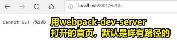

如果你往url里边追加其它无效的path，那么显然这是找不到这个页面的，既然找不到这个页面，那么作为一个成熟的网站来说，这理应是呈现个404页面，而不是「Cannot Get /xxx」

而「historyApiFallback」正是用来解决这种问题的！

做法：

简单使用：

把historyApiFallback的值设置为true，那么即便输入无效的路径也会保证是原来有效的index页面！

更深层次的配置使用：

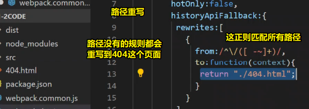

> 输入找不到的路径都会跳到404页面

除了给定规定死的404页面，还可以根据路径匹配其它页面：

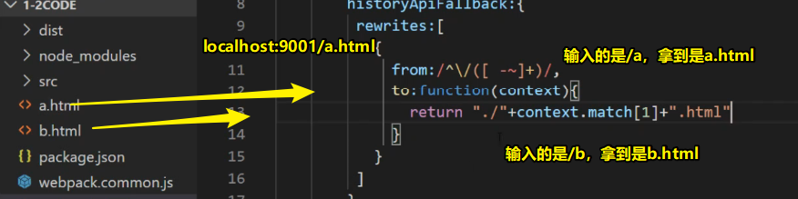

> 关于是否能拿到路径参数，可以看看match拿的值

不过需要注意的是，千万不要把这种操作姿势作为我们正式上线的404页面，因为上线之后，这配置项就管不到我们的项目了，所以这只能开发模式下使用

总之，所有在开发模式里边写的东西，在上线之后都没有用了，即GG了！

问：

<mark>1、fallback是啥？</mark>

fallback即退路之意，如果没有找到页面，那么就回到有效的那个页面

总之它表示「当一旦不成功的时候，提前预备的用来兜底的东西」

类似的有「polyfill」，它表示将不完善（缺失、不正确）的功能填，然后按照标准API完善之，说白了，这是为了兼容性而实现的API统称！

➹：[polyfill和fallback到底是什么？ - 知乎](https://www.zhihu.com/question/46701527)

<mark>3）proxy</mark>

> 这是个核心的、常用的配置项，用于路径代理转发。（用于解决跨域的问题，不过项目上线后，就GG了，毕竟在生成模式里边这是webpack自己开的服务哈！当然项目上线后你可以直接叫后端CORS即可，而这是最简单的允许跨域做法！）

用法：

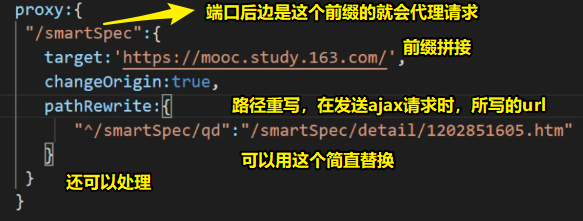

注意，一旦要改变Origin为true，不然发请求会有500这样的错误信息！

> 了解了这个配置项，那么对于vue-cli的那一套代理配置也就很简单了！

<mark>4）overlay</mark>

> 错误遮罩，用过vue-cli你就会知道，报错时有页面有个黑色的遮罩，然后页面内容是错误信息，如果你把这个值设置为false，那么就会把错误提示log在控制台里边！

### ◇Source-map

> 在开发模式下，这个就不得不提了

为方便调试，我们需要知道打包后的代码对应于原文件的位置。

如果代码有一处错误，无source-map只能追踪到错误发生在打包后文件的哪个位置，但是打包后的文件不方便阅读。

有了source-map，就可以查看错误发生在原模块的哪个地方。

做法（开启这个source-map是非常简单的）：

``` js
{
  devtool: 'cheap-module-source-map'
}
```

source-map小结：

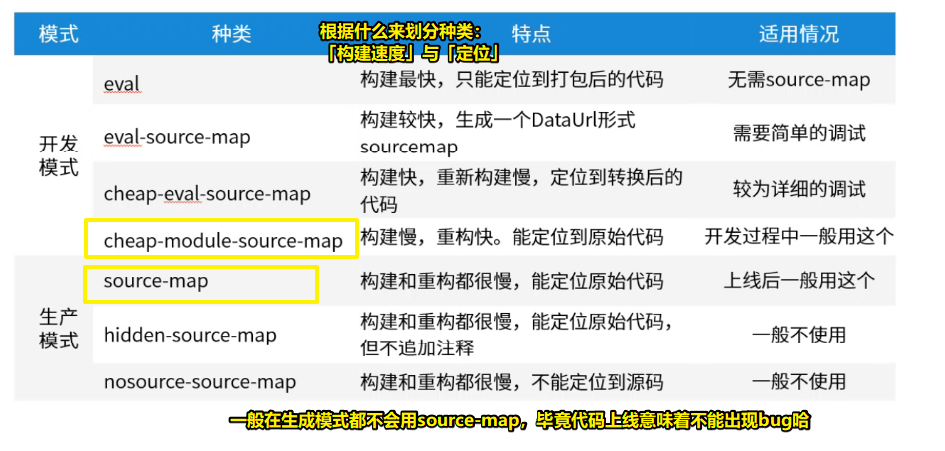

以上就是开发模式的详解啦！接下来会说到一些比较骚的操作！

### ◇自己手动搭建

关于webpack-dev-server，原理、代码都很简单！所以搭建起来毫不费力！

可既然有了这个工具为啥还要自己搭建呢？

因为，如果我们的项目做的比较精细而且是大型的项目，那么往往我们会自己手动搭建！总之，这是为了能够让我们有更高度的自定义哈！

我们所下载的这个webpack-dev-server包，其实其组成就是express+中间件（webpack-dev-middleware、webpack-hot-middleware）

这个包为我们做了一些预设配置，但如果我们的项目大起来了，这些预设显然就不够用了！因此我们需要高度的自定义才行，即需要自己使用express加上一些中间件去搞一个开发服务器！

> webpack它就是个方法，可以在某个文件里调用 `webpack(config)`去打包项目，也可以在终端里边使用命令行webpack打包！

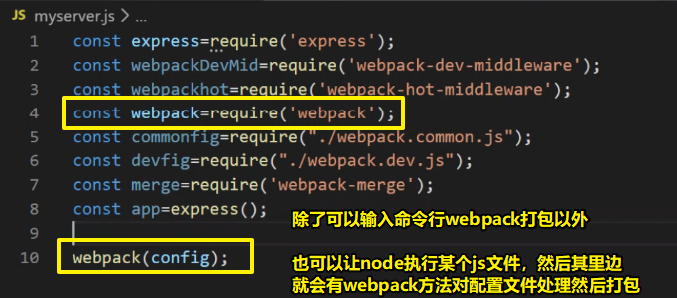

如何搞一个webpack server 以及热更新？

``` js
// webpack-dev-server.js
const express=require('express');
const webpackDevMid=require('webpack-dev-middleware');
const webpackhot=require('webpack-hot-middleware');
const webpack=require('webpack');
const commonfig=require("./webpack.common.js");
const devfig=require("./webpack.dev.js");
const merge=require('webpack-merge');
const devcommon=commonfig('development');
const config=merge(devcommon,devfig);

// 这行代码是为了客服端和服务端开启websocket。这样一来才会有热更新！
// 这代码是往入口文件['app.js']前边（末尾也行）追加一个元素哈！即['app.js','webpack-hot-middleware/client?noInfo=true&reload=true']
Object.keys(config.entry).forEach((name)=>{
  config.entry[name]=['webpack-hot-middleware/client?noInfo=true&reload=true'].concat(config.entry[name]);
})
 
const app=express();
const complier=webpack(config);
app.use(webpackDevMid(complier,{}));
app.use(webpackhot(complier,{
  overlayStyles:true //热更新CSS
}))
app.listen(2007);
```

> node运行以上代码即可开启服务

具体配置可看官网哈！

> websocket的最大特点是服务器可以主动向客户端推送信息，客户端也可以主动向服务器发送信息，是真正的双向平等对话，属于服务器推送技术的一种。

## ★代码分割

> 这个功能是webpack自我标榜（夸耀；吹嘘）的一个非常重要的功能

为啥这东西会存在呢？——很简单，无非是为了优化而已！

### ◇多页面应用

在多页面应用里边，为啥会需要代码分割呢？

因为这是为了「提取公共依赖」，即「把几个页面之中都用到的依赖给打包为一个单独文件。」

假设

A页面依赖C，B页面同样依赖C

那么

我们加载A页面和C页面的时候，都需要下载C

所以

我们把所有页面公有的依赖都给提取出来，然后搞成一个单独的文件（假设为D）

这样

A页面加载完D，那么B页面加载D的时候，直接拿缓存即可！


### ◇单页面应用

对于单页面应用来说，「代码分割」是为了「减少文件体积，拆分应用」

说白了，就是「把需要异步加载的内容改成异步加载。」

举栗来说：

假如A页面有C、D这两个模块，而C、D我们并不是马上就用到它的，为了减少文件体积，提高首屏响应速度，于是我们就把C、D这两个模块异步地拆分出来，然后需要C、D模块的时候，再加载进来，这样一来，首屏的加载速度就会快很多！

这个东西的应用场景：路由懒加载，或者说是按需加载！

### ◇所以一般这么打包

1）多页面应用

> 主业务代码+公共依赖（C模块、D模块……）+第三方包（jQuery、lodash……）+webpack运行代码

2）单页面应用

> 主业务代码+异步模块+第三方包+webpack运行代码

我们所知的打包：

vue-cli：app.js是入口文件，vendor.js是第三方包，mainfest.js 则是webpack运行代码，如果做了路由的异步加载，那么还会有异步包！

> 注意：单页面应用里边不存在公共模块的问题，只存在异步的问题，毕竟就只有一个页面，然后这些模块都只加载一次！

回顾之前的内容，说到了「为什么拆分」，「怎么拆分的思路」

接下来说到如何拆分

### ◇版本差异

- webpack3拆分姿势：通过「commonChunksPlugin」来拆分

- webpack4拆分姿势：通过「SplitChunksPlugin」来拆分

分析一下webpack3：

vendor提取：

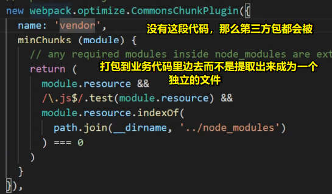

没有这段代码，第三方包不会被打包到一起！

mainfest和app

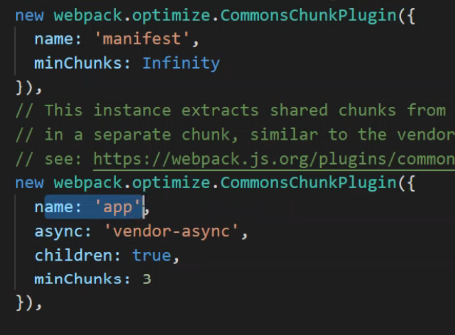

mainfest用于打包webpack自身的运行代码，而这是必不可少的，如果你的项目里边报了「webpack JSOP is not defined」 或者 代码没有执行起来，那么这就是「mainfest」没有加上去哈！

而app则是用于提取业务代码的！

总之，你要打包出第三方依赖、业务代码以及mainfest（打包出来的那个入口文件里边注入的一大串webpack自动生成的代码），那么就得在webpack3里边new 3 个 `webpack.optimize.CommonsChunkPlugin`

> 代码分割的本质是为了缓存，即所谓的性能优化！

➹：[webpack 、manifest 、runtime 、缓存与CommonsChunkPlugin - 简书](https://www.jianshu.com/p/95752b101582)

而在webpack4里边，进行代码分割是异常的舒服的！

先来看看单页面的代码分割：

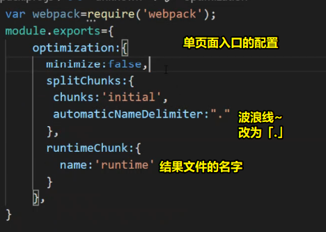

异步代码写法，即webpack里边的异步代码系统写法（有两种写法）：

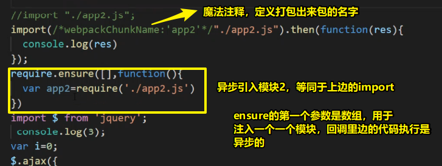

一个坑：

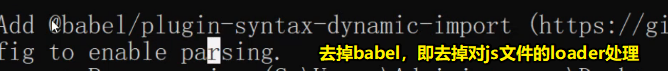

> 如果我们有异步处理代码，然后我们需要用babel对它进行处理，那么我们还需要引入其它的包！

以上就是把代码拆分成异步的两种方式哈！而且需要注意的是，这两种方式都是webpack来提供的哈！


多页面代码分割：

``` js
var webpack = require('webpack')
 
module.exports={
   optimization:{
     minimize:false,
     splitChunks:{
       name:true,
       chunks:'initial',
       automaticNameDelimiter:".",
       minSize:0,
       cacheGroups:{
         modulea:{
           test:/modulea/,
           priority:-10
         },
         vendor:{
           test:/[\\/]node_modules[\\/]/,
           priority:-10,
           name:'vendor'
         }
       }
     },
     runtimeChunk:{
      name:'runtime'     
     }
   },
	plugins:[
     	
	]	
}
```

➹：[webpack提取公共js代码 - 他乡踏雪 - 博客园](https://www.cnblogs.com/ZheOneAndOnly/p/11111992.html)

### ◇压缩

> 设置mode为true即可自动压缩和 `tree-shaking`，而webpack3x则需要new一些插件！

题外话：

关于对CSS的分割，只有import一个模块才有分割的资格，当然一般不会分割CSS，不管是单页还是多页

> 老师把import一个模块这种姿势当作是文档流操作！


## ★自己测试

index.html无法热更新！

➹：[webpack优化之玩转代码分割和公共代码提取 - ChampYin's Blog](https://champyin.com/2019/11/15/webpack%E4%BC%98%E5%8C%96%E4%B9%8B%E7%8E%A9%E8%BD%AC%E4%BB%A3%E7%A0%81%E5%88%86%E5%89%B2%E5%92%8C%E5%85%AC%E5%85%B1%E4%BB%A3%E7%A0%81%E6%8F%90%E5%8F%96/)

➹：[看完这篇还搞不懂webpack，求你打我 - 掘金](https://juejin.im/post/5e01de37f265da33ab637daf#heading-6)

➹：[webpack提取公共代码，提取基础库，提取业务公共代码-sau交流学习社区-power by saucxs(程新松)](https://www.mwcxs.top/page/822.html)

## ★总结

- 作业：看看vue-cli的配置（可以看看2的配置）

## ★Q&A

### 1、bundle指的是什么？

如果你把output的filename设为「bundle.js」，那么这个就表示根据入口js文件捆绑出来的js文件！

➹：[从bundle.js认识webpack - 知乎](https://zhuanlan.zhihu.com/p/28475988)

### 2、关于tree-shaking？

假设你在入口文件里边，import了一个JS模块，而这个JS模块里边export了10个方法

而你import的时候，只用到了这10个方法里边的一个

那么当你设置mode为true打包时，这9个方法就会被摇走了，就不会被打包到最终生成的结果文件里边去！


