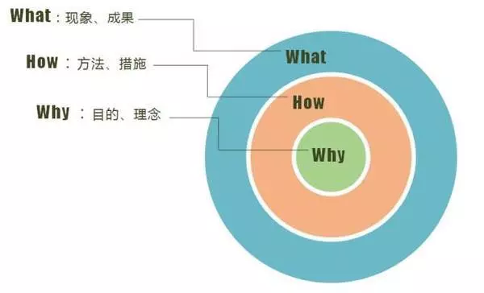
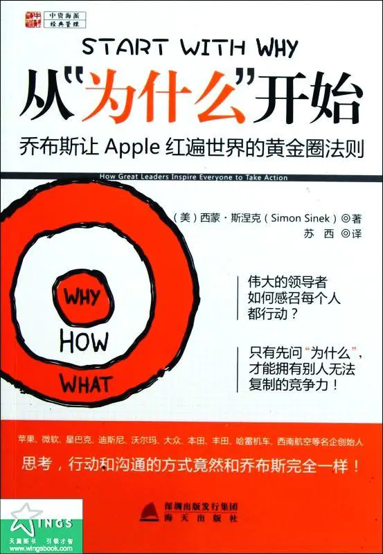
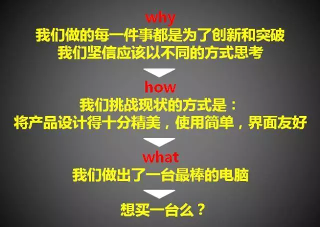

# 01-黄金圈法则

> 原文：[黄金圈法则 - 简书](https://www.jianshu.com/p/857b63f2b752)

我们大多数人的思考、行动和交流的方式，都是从做什么开始，然后是怎样，结尾是为什么。我们在学习演讲时，会有一种演讲结构：2wh。比如项目启动大会的发言。会从以下三方面去准备我的发言稿：

1、这个项目是什么 

2、怎样完成此项目 

3、为什么是我负责此项目。

在我了解黄金圈法则后，才明白它才是最有力，让人最信服的表达方式，能够极大的调动他人的积极性，让他人积极主动的配合我的想法、思维，去完成自己努力实现的事情。

 西蒙·斯涅克在他的《从“为什么”开始》一书中提出了“黄金圈法则”的概念。他发现，人们一般向别人表达或者激励时，常规路径是：先现象，而后措施，最后是结果，这种路径收效甚微。而真正能动人心的路径应该是：先理念，而后措施，再到现象，最后是结果。

下图中的非凡模式中采用的就是这样的路径。先要跟人讲“为什么”，而后是“如何做”，最后才是“是什么”。

《从“为什么”开始》中有个苹果公司的例子是对“黄金圈法则”的完美诠释。

电脑厂家在宣传自己的产品时，一般会这么讲：我们做了一台最棒的电脑，用户体验良好，使用简单，设计精美，买一台吧！

而苹果公司在推介他们的产品的时候，则选择了非凡路径：

Why，我们做的每一件事情，都是为了突破和创新。

How，我们坚信应该以不同的方式思考。我们挑战现状的方式是通过把我们的产品设计得十分精美，使用简单，和界面友好。

What, 我们只是在这个过程中做出了最棒的电脑。

想买一台吗? 没有比较就没有伤害，那些接受苹果理念的果粉，买他们的产品，自然是顺理成章的。

黄金圈法则第一步，思考Why

从内向外思考，在最里面的Why圈层思考为什么：你为什么接手此项目？你为什么要制作飞机？你怀着什么样的信念？你的机构为什么而存在？你每天早上是为什么而起床？

想一想马丁路德金的著名演讲“我有一个梦想”，如果变成了“我有一个计划”，还会有那么多的人去听吗？

> 我有一个梦想，所以我要去做这件事，如果说「我有一个计划」就烂大街了，就像是告诉我第一步做啥，第二步做啥……

黄金圈法则第二步，思考How

只有想明白了最内圈层的Why，第二步才是思考中间圈层的How，也就是怎么做。How这个圈层就是要梳理如何实现Why，用什么方式落实你的理念、价值观。

黄金圈法则第三步，思考What

如果Why和How梳理得清晰，那What圈层的做什么就是水到渠成的结果了。

> 结果，是自动出现的，并咩有强制它出现！

从外向内、从清晰到模糊（即what->how->why）是普通人的思考、行动和交流的模式。

而那些非凡的领袖和组织，无论他们在什么领域，其思考和行为方式都是从内向外的（即why->how->what）。改变思维模式，什么时候开始都不晚，聪明睿智的你Get到了吗？

