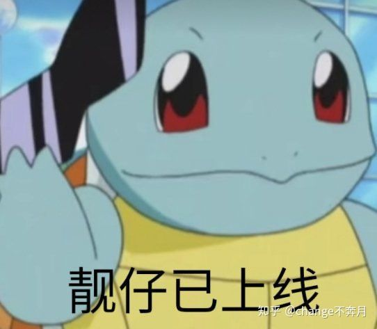

# 学霸那些学习方法

> 原文：[你身边的学霸都有怎样的学习方法或习惯？ - change不奔月的回答 - 知乎](https://www.zhihu.com/question/54265751/answer/1046382960) 

全篇5000字，写作+删改耗时6个小时，融合多位学霸的学习方法，帮你打通任督二脉，错过真的血亏！！不信你先花1分钟，往下看500字试试～当然文末也为你准备了太长不看版本～

回想我在大学里，什么时候开始才被称为学霸的…是大一上期末考试成绩出来之后，我考了全年级第一

因为我这个人

> 又爱睡觉（早上起不来，上课还打盹...）
>
> 还有点拖延症（作业在规定时间当天教，提前完成是不可能的）
>
> 还爱玩游戏（菜归菜，仍然热爱：-）
>
> 还特别逗比（活宝一个）
>
> 平时完全没点高冷学霸的影子……

而在别人频繁用学霸称呼我之前，我也压根意识不到自己还算个伪学霸：-（

后来我开始思考自己到底怎么学习的，也观察身边学习好的同学， 在自身总结和明中（哈哈哈～）观察之后，我发现了以下几点：

**1、学霸分为很多类型**（就好像厉害的游戏玩家有法王/野王/射手爹一样）。

**2、学霸只制定最简单的计划清单。**

**3、学霸改进拖延症有绝招。**

**4、学霸会找到属于自己的番茄工作法。**

**5、学霸在享受学习，就像你在享受游戏。**（坚持看到最后，我悄悄告诉你，怎么快乐学习～）

## 【01】找到自己最适合的学习模式
学霸有自己的学习偏好，他们找到了最适合自己的学习模式。学习者主要分为以下几种：

> 视觉型学习者——喜欢使用图片、图像帮助理解
>
> 听觉型学习者——喜欢使用音乐、声音，比如学习的时候听一些轻音乐，或者比起看视频，更喜欢听录音
>
> 动觉型学习者——喜欢通过使用身体的触觉，比如动手写
>
> 逻辑型学习者——喜欢使用推理、逻辑和系统总结，比如喜欢做思维导图而不是长篇的笔记
>
> 语言型学习者——喜欢在做笔记时用详细的文字而不是简短的关键词，学习时也偏爱接受文字
>
> 社交型学习者——喜欢与他人或群体学习
>
> 孤独型学习者——喜欢独自学习

以上几种典型的学习者特点可以同时具备，拿我自己举栗子，我就是动觉+语言+孤独型。

**能看到这，说明你是个愿意深度思考的优秀者，如果内容对你有启发，不妨点个赞再继续阅读，这样你就可以在你的主页随时翻看到这篇答案了～我收到了你的鼓励，也会写出更好的东西分享给你！**

**了解自己适合什么学习模式很重要。**

就拿社交/孤独型举栗子，

多人学习的好处就是可以相互提醒，组团学习，热热闹闹的，有问题随时可以找到小伙伴讨论；缺点就是要考虑集体，大家要一起行动，比如有的人11:30就饿了，而有的人习惯12:30吃午饭，很多小细节需要磨合。

独自学习的好处就是在学习的时候不会被打扰，行动自如；缺点就是需要自觉，没人叫你一起去图书馆，而且有什么问题需要先记下来，之后再找时间和同学讨论。

那么你就要对比哪种模式更适合自己。

**在找到自己最合适的学习模式之后，就运用这种模式进行知识吸收和内化。**

我想这大概就解释了，为什么我有时候上课会打盹儿但是不影响学习成绩，可能是老师PPT上放的那张图勾不起我的学习兴趣，所以我（动觉+语言+孤独型）选择自己课后手动做笔记总结。

## 【02】如何制定计划

很多人不惜花上半天制定计划，幻想着自己提升后厉害的样子。结果却因为计划制定太满，实际完成的太少，而产生挫败感，第二天就把计划抛到脑后了。

学霸们从来不会把时间浪费在计划上，他们只会列出最简单的计划清单，几分钟就写好了。清单有以下特点：

**1、清单的任务一般不超过5项，而且都是很具体的任务**，比如“记100个英语单词”，而不是“学英语”

**2、重要任务在前，紧急任务在后**。

**3、清单是动态的**。

第一条很容易理解，第二条，如何区分「重要任务」和「紧急任务」呢？

> “我把问题分成两类：重要的和紧急的。紧急的问题不重要，重要的问题从来不紧急。”第 34 任美国总统艾森豪威尔于1954 年发言。

举个栗子，

现在是周三上午，

你是学生会某部长，辅导员让你去打印嘉宾名单，晚上的交流会议要用；

你的课程需要提交一份两千字小论文，这周五下午上课交，你已经写了500字，打算今天写1000字，明天周四再写500字，然后检查格式，后天周五打印，上课带去交。

很显然，前者是「紧急任务」，后者是「重要任务」。

> 重要任务是贡献于长期目标的，紧急任务则要求人们立刻注意。

如果你为了安慰自己今天不是无所事事，确实有完成任务，而选择先应付一些紧急任务，比如去跑腿打印之类的，那么事后你会产生已经完成任务的成就感，而放弃重要任务写论文。

那么今天少写的1000字就会累积到明天，明天你将有1500字的论文要写，任务就变得既艰巨又紧急。

因此，在列清单时，要把「重要任务」放在前，「紧急任务」在后。

第三条，清单是动态的，意思就是多多益善嘛～你要是能提前完成，那么就可以再加任务，这样总比你一上来就给自己列10项任务要好得多。

**一是没那么大心理压力，二是不会分散注意力**，当你列出的清单任务过多时，就会有种不知所措的感觉，一会儿做做这个，觉得太难，又去干别的，到头来一项也没完成。**不如就专注眼前这5项**。

**都看到这里啦～不妨点个赞mark一下再接着看**

## 【03】关于拖延症

开头就说啦，我也有拖延症，每个人的拖延程度不同。

很多人大学考试前开始抱佛脚，有的人甚至到了前一晚上才开始着急，这个时候你的注意力是最集中的，毕竟都火烧眉毛了嘛。

我仔细思考后，发现我拖延是因为我喜欢**那种和时间赛跑、高度专注的感觉**。

于是就有了解决方案：**把目标细分，并规定时间，细分到能燃起你的斗志为止**。

举个栗子，

今日清单里有一条，记100个单词，你给自己规定时间2小时之内完成，这时你可能还没什么感觉。

1小时50个，可能还是没有和时间赛跑的感觉。

那么你就这样细分，如果10分钟10个的话，50分钟就能记完50个，这样1小时里还能余出10分钟巩固之前记过的50个，是不是很有成就感！最终你就给自己规定了1分钟记1个单词。

当然我这里分到1分钟有点夸张啦～毕竟也不可能一直盯着时间看1分钟到了没，只是想告诉你，这样进行细分，能帮助你高度集中注意力。

这样做，我就能主动找到和时间赛跑、高度专注的感觉，而不是等到deadline前被迫地和时间赛跑。

## 【04】找到属于自己的番茄工作法

番茄工作法，这个太多人说过的～简单来说就是25分钟高度集中学习时间+5分钟休息时间交替进行。

这个方法受到全世界的检验，但并不意味着适用于每个人。

本伪学霸 [@change不奔月](https://www.zhihu.com/people/ba6f7b0cd9e75514d1ad5994cb959230) 和若干名真学霸的体会是：

1、不一定要按照25+5的模式，**合适的时间安排需要自己摸索**，可以是30+5，45+10等等。

2、在5min休息时间里，可以闭目养神，看看风景，发呆放空，站起来去接杯水，活动活动，上个厕所，**但是不要玩手机…**

3、**几个番茄时间之后（视情况而定，主要看你的疲劳程度），你可以切换一些轻松的任务**。比如Change我爱英语而不爱数学，就可以从数学切换到英语，以此避免过度的脑力消耗，也避免学习任务太难，而产生厌恶情绪。

## 【05】重头戏来了！怎么像学霸一样在学习中找到快乐？

之前有人问我怎么把书看进去的，我说学的好就很快乐很有成就感啊！然后对方说：

“快乐？我没听错吧，我一翻开书就觉得困，你还和我说快乐？”

好吧ORZ

> 注：Orz 是失意体前屈的缩写，○|￣|_，这个形状好像是一个人被事情击垮跪在地上的样子，是用来形容被事情打败或者很郁闷的，表示失意或沮丧的心情。

当时我没办法解释我为什么会在学习中找到快乐，于是对话不了了之。

直到我发现一个理论：

> 峰终定律：如果在一段体验的高峰和结尾，体验是愉悦的，那么对整个体验的感受就是愉悦的。

说人话，就是：

干一件事情的时候，

你最开心（正向高峰值）/最沮丧（负向高峰值）的感受——「**峰值**」，

你结束干这件事情的时候，你的感受——「**终值**」。

这两个值决定了你事后回忆的整体感受，如果两个值都是正向的（感受愉悦），事后的感受也是愉悦的。

**没懂没关系，我再给你拿游戏举个栗子**，

你有没有想过自己为嘛那么爱玩王者荣耀？

打游戏就想赢，想赢就得练操作；而排位赛为了万无一失，你把把都选自己最擅长的的英雄，这其实也是一个特别枯燥的事情。

但是你今晚一口气上了王者，你的体验出现了正向的「峰值」。

如果你最后一把在峡谷杀得酣畅淋漓，13-0-1 MVP，那么恭喜你，你体验的「终值」也是正向的。

所以哪怕中间的过程有些枯燥，但是下次你还想玩，因为你事后回忆起来的游戏体验非常好。

你再回想一下之前的学习情景，是不是感觉很糟糕很痛苦？

比如学高数的时候，你碰上一道非常难解的高数题，死磕了半小时也没算出正确答案，你气的半死，把草稿纸揉成一团丢进垃圾桶，去tmd！不学了！

这个时候，你出现了负向的「峰值」。

至于「终值」，就更不用说了，每次学到最后都是落荒而逃，巴不得赶紧收拾收拾去吃饭。

**负向的「峰值」和「终值」决定了你的学习体验也是负向的。因此，一提起学习你就觉得头疼**。

我就不说学霸是怎么爱上学习的了，他们简直是出现了良性循环。越学越好，越好越学。回忆起学习脸上都是幸福甜蜜的笑容……（我瞎说的嘻嘻）

想在学习里找到快乐，你需要做的就是让自己的学习体验出现正向的「峰值」和正向的「终值」，即使学习过程是枯燥的，但是没关系，反正事后你的记忆是取决于峰终值。

**我先和你唠唠，如何创造正向的「峰值」。**

如果你有自己喜欢的科目，那就非常好办，在学习过程中及时穿插自己喜欢的科目。

比如Change我喜欢英语，讨厌数学，当我碰见一道难解的数学题，没有思路的时候，我绝对不会死磕！我会立马换英语，一来避免出现负向的「峰值」，二来英语会带给我成就感，比如做几道听力题全对，这就创造了正向的「峰值」。

你也可以给自己规定时间，比如学一小时数学之后，不管任务完成是否，也立刻转换成英语，避免产生厌烦情绪。

啥？你是大学渣？完全get不到学习的乐趣，科科都厌恶，一翻开书就头疼，根本high不起来？

没关系。

**给自己定个小小小小小小小目标。**

**有多小？小到一道题，一个单词。**

只要你做到了，那你也是牛逼的。

学渣很容易陷入自暴自弃。今天又玩了一天手机，干啥啥不行，吃饭第一名。

那就从改变一小小小小小小小步开始。

就像我刚刚说的，哪怕一个单词，你也进步了。

想玩游戏了？没关系，玩去吧，但是不要把单词书扔远了，就放在手边，玩两个小时玩累了，再拿起来接着看。

1个单词，2个单词，3个单词……最后一做题，哎呀还是对了不少嘛，自己也不是一无是处，还是学的会的嘛。

对自己有信心，不和别人比，只和昨天的自己比，**一点小进步也是正向的「峰值」，从而改变你对学习的厌恶印象。**

正向的「终值」就很好创造了，简单讲，就是见好就收。

学的有成就感的时候，就打住吧，别逼着自己学的想吐了才放手。

## 【06】总结

总结一下～太长不看版本：

1、找到自己最合适的学习模式，并运用这种模式进行知识吸收和内化。

2、不把时间浪费在计划上，只列出最简单的计划清单。

3、清单的任务一般不超过5项，而且都是很具体的任务，比如“记100个英语单词”，而不是“学英语”。

4、重要任务在前，紧急任务在后。

5、清单是动态的。完成后，就可以向清单内添加任务，专注眼前这5项。

6、把目标细分，并规定时间，细分到能燃起你的斗志为止。主动找到和时间赛跑、高度专注的感觉。

7、找到属于自己的番茄工作法。不一定要按照25+5的模式，可以是30+5，45+10等等。

8、在番茄工作法5min休息时间里，可以闭目养神，看看风景，发呆放空，站起来去接杯水，活动活动，上个厕所，但是不要玩手机。

9、几个番茄时间之后，你可以切换一些轻松的任务。以此避免过度的脑力消耗，也避免学习任务太难，而产生厌恶情绪。

10、想在学习里找到快乐，就要让自己的学习体验出现正向的「峰值」和正向的「终值」。

11、如果你有自己喜欢的科目，那就非常好办，在学习过程中及时穿插自己喜欢的科目，创造正向的「峰值」。

12、学渣要对自己有信心，不和别人比，只和昨天的自己比，一点小进步也是正向的「峰值」，从而改变你对学习的厌恶印象。

13、创造正向的「终值」——见好就收。学的有成就感的时候，就打住。

**如果你觉得有帮助的话～不妨左下角点个赞，这样你就可以在主页动态里随时翻看到这篇回答。我收到了你的鼓励，也会有动力写出更好的东西分享给你。**

答主 [@change不奔月](https://www.zhihu.com/people/ba6f7b0cd9e75514d1ad5994cb959230) ，香港大学理科硕士，爱琢磨成长干货和表情包～

