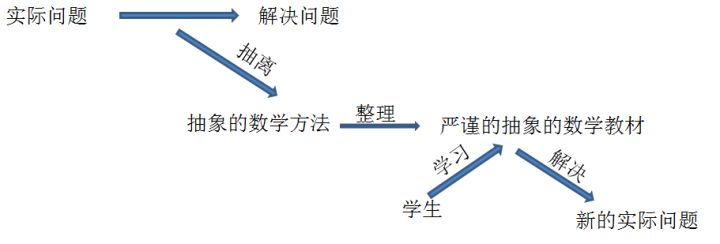

# 03-无法理解高等数学怎么办？

写篇贴，为大学生送一波助攻。

方法论：1，要把数学当成形象的学科来学。2，倒着学。

**1，要把数学当成形象的学科来学。**

学习数学最忌讳的莫过于把数学当成抽象的数字游戏来学，到头来，不断埋怨着自己抽象思维不行，最终放弃数学。

大学有棵树，叫高数，很多人挂在上面。

你看，我们一代代人栽在微积分上面，学都学不懂，当年牛顿老爷子是怎么创立微积分的？牛顿是是神吗？当然不是，数学的开创并没有我们想象的那么不可思议。

先思考一下，数学是怎么产生的。当人们遇到一个问题，最终用了某种方法，把这个问题解决了，很棒。然后，把这种解决问题的方法和思想提取出来，于是就有了数学。为了给更多的人恩惠，就需要把这种方法整理成抽象的，严谨的数学理论，传递给他人，别人看完，学习到理论，然后去解决新的问题。

简而言之：

1，祖先遇到**具体的实际的问题**，解决问题，提取方法，整理成抽象的严谨的理论。

2，后人学习**抽象的严谨的**理论，利用这些理论去解决新的具体的实际的问题。

看出差别来了吗？祖先创立数学的时候，入手点是具体的实际的问题，很形象。后人们学习数学的时候，入手点是抽象的严谨的理论。这就是困难所在。

上图总结一下以上内容：

如果不理解，我再举两个例子吧。

1，牛顿小时候，姑妈完全不懂数学，就问牛顿，你有几个手臂啊？牛顿第一次接触到这个问题，伸出左边的，看了看，又伸出了右边的，看了看，告诉姑妈，我有两个手臂。姑妈满意了。

但是牛顿不满意啊，他想着让世界上所有的人都得学会这种理论，不然，人类太无知了。于是，他把自己的计算过程展示出来，左边1个，右边1个，加起来，等于2个。牛顿兴奋的发表了一篇论文：

人们抱着这篇论文，日夜研究`1 + 1 = 2`这个公式，最后懵哔了，这特么什么鬼。功夫不负有心人，终于所有人搞明白了`1 + 1 = 2`。

明白了这个公式，人们知道了一个猴子加一个猴子等于两个猴子，一棵树加另一棵树等于两棵树……

然而，有一批学不会`1 + 1 = 2`的人气势汹汹的去找牛顿：你特么的装什么装，你直接告诉我一个手臂加一个手臂等于两个手臂不就得了？干嘛非得整个`1 + 1 = 2`，让人看不懂。

牛顿抽一口烟，缓缓说道：

**抽象，是为了用途更广。**我告诉你一个手臂加一个手臂等于两个手臂，你也就只知道这个。如果我告诉你`1 + 1 = 2`，你学起来很困难，但是你一旦学会了，就立刻明白了一棵树加一棵树等于两棵树，一个猴子加一个猴子等于两个猴子。

**严谨，是为了保证传播的更准确**，免得以讹传讹。有人看了我的理论，就说：一棵树加一片森林等于两棵树。这显然是错的，所以，我必须得说很多话，保证严谨。

众人退去。

2，牛顿当年在解决天体运动，验证开普勒定律的过程中，创作出了一首《微积分之歌》，非常伟大的一首歌，无奈，没有录音机，没有播放设备，为了传播这首歌，他把这首歌写在了纸上，有歌词，有旋律，有节奏，有休止符，有五线谱，还有一系列的线和点……于是《微积分之歌》的谱子，流传下来，谱在歌在。

我们进入大学，学习《微积分之歌》，老师上课就开始讲基本的乐理知识，整天都是教你打拍子，教你什么叫G大调，教你什么是四三拍……你整个人都不好了，根本就不知道老师在跟你说些个啥。

正确的学习微积分的姿势是：**所有的数学都是从实际中抽离出来的抽象的东西，别钻进去，你要联想到实际应用，首先理解，再去扣理论。**

举个例子（原谅我喜欢举例子，因为举例子能把话说清楚，你高数学不会就是因为你老师不给你举例子）

来来来，映射和函数的定义：

看看数学书上是怎么定义的。

映射：设X,Y是两个非空集合，如果存在一个法则![[公式]](assets/img/equation-1589777004678.svg),使得对X中每个元素![[公式]](assets/img/equation-1589777004688.svg)，按法则![[公式]](https://www.zhihu.com/equation?tex=f)，在Y中有唯一确定的元素![[公式]](assets/img/equation-1589777004786.svg)与之对应，那么称![[公式]](https://www.zhihu.com/equation?tex=f)为从X到Y的映射，记作![[公式]](assets/img/equation-1589777004791.svg),其中![[公式]](https://www.zhihu.com/equation?tex=y)称为元素![[公式]](https://www.zhihu.com/equation?tex=x)(在映射![[公式]](https://www.zhihu.com/equation?tex=f)下)的像，并记作![[公式]](assets/img/equation-1589777004799.svg)。而元素![[公式]](https://www.zhihu.com/equation?tex=x)成为元素（在映射![[公式]](https://www.zhihu.com/equation?tex=f)下）的一个原像；集合X成为映射![[公式]](https://www.zhihu.com/equation?tex=f)的定义域，X中所有元素的像所组成的集合称为映射![[公式]](https://www.zhihu.com/equation?tex=f)的值域。

函数：设数集![[公式]](assets/img/equation-1589776591306.svg),则称映射![[公式]](https://www.zhihu.com/equation?tex=f)：![[公式]](assets/img/equation-1589776591377.svg)为定义在D上的函数，其中![[公式]](https://www.zhihu.com/equation?tex=x)称为自变量，y称为因变量。

就问你，刚开始没接触过函数的时候，直接看到这俩定义怕不怕！

拗口，抽象。越把自己陷进去，越看不懂。

怎么办？

如果我要这么跟你说，你肯定就懂了。而且理解的会很深刻。

函数英文名好像叫function，功能。好了，函数的实际的具体的形象的含义就是一个具有某种功能的**机器**，放入一只猪，生产出一个火腿肠。映射就是这台机器的内部**工作原理**。

找到了这个类比，你就明白了：

原材料就是定义域：这台机器里面你只能塞进去猪，不能塞牛，或者马。

产出就是值域：这台机器你只能产出火腿肠。

你塞进去一头猪，产生一个火腿肠，塞进去不同的猪，产生的火腿肠可能一样大，也可能不一样大，但是，对于任意一个火腿肠，只可能有来自于某一头猪，不可能来自好几头猪。

何为真正理解，**不是能记住概念，而是反推概念**。你把函数想象成加工火腿肠的机器，再倒回去看函数与映射的概念，是不是很轻松就理解了？

所以，学习微积分的过程中，不要仅仅局限于抽象拗口的定义定理中，要多找一些例子加深自己的理解。

你可能会有疑问：我是初学者，对微积分没有任何了解，我怎么才能找具体的例子呢？问得好！下面我来说说第二点：倒着看。

**2倒着学**

有个很有意思的现象，大家也都知道，中式思维和西方思维的差别。中式思维的特点是：在表达某一个关键词之前，喜欢不断的加定语来铺垫，经过一连串的修饰，最后才讲出最关键的部分。但是西方思维呢，特点是简单直接，先说出最关键的信息，然后再不断补充。

中式思维：微积分是有趣的，实用的，有一定难度的，奠定近代工业基础的，学科。

西方思维：微积分是一门学科，that实用的，that有趣的，that有难度的，that奠定了近代工业基础。

两者的区别在于，第一种表达方法中，出现“学科”这俩字之前，一直处于一种迷茫的状态，根本没有清晰的整体的逻辑结构，很容易迷茫。第二种表达方法中，一开始就立刻写明了这句话最核心的内容，最整体的结构，学习起来不容易迷茫。

绝大多数教科书，都是按照中式思维的逻辑编写，先讲一堆基础的知识，做一些铺垫，最后才讲最关键的部分。按理说，降到最后关键部分的时候，学生应该恍然大悟才对，但实际情况往往不是这样，因为学生已经在前面的铺垫中迷失了自己。**按照这种逻辑学习，又赶上老师上课喜欢照本宣科的话，大部分学生半途就学不懂了，真正坚持到最后的人，也仅仅是会做题罢了，鲜有能够真正领会微积分真谛的。**

工程师教一帮小弟盖一个大楼。有两种方案。

方案一：工程师命令小弟去搬砖，小弟们日夜刻苦搬砖，按照工程师的引导砌砖，两个月以后，终于有了地基的模样。而此时的小弟们，已经有很多人迷茫了，因为他想学盖楼，结果每日搬砖。另外一半还在坚持的小弟，虽说没有放弃，但是一直处于无感的状态。第三个月，继续命令小弟搬砖……**对于这帮小弟来说，他们不是在学盖楼，只是在按照要求搬砖。他们搬砖搬的很迷茫。**

方案二：工程师动员小弟们，我们要盖一座这样的大楼，小弟们看到大楼的效果图，异常兴奋。工程师问小弟们，我们要盖这样的大楼应该先怎么做？“先修地基”然后呢？“修一楼，再修二楼……”很好，修地基应该怎么修呢？“搬砖！”好，那就去搬砖吧。按照这种方案，小弟们脑海了始终有一个清晰的逻辑：想盖楼，先修地基，再修一层，二层……修地基需要搬砖，修一层也需要搬砖，但是搬砖与搬砖还是有区别。小弟们每天干的热火朝天。

**啰嗦这么一大堆无聊的例子，无非就是想表达一个理念：倒着学。**

微积分的核心是解决诸如：位移=速度*时间，当速度连续变化的时候，如何准确的求解位移。首先学习这块知识，学完就会理解微积分是干什么的了。当然，学完这块肯定会有所疑问：如何验证积分的科学性。那就再去看看极限和微分，因为极限和微分是支撑定积分的依据。学完极限和微分，你可能还有疑问：极限是如何推导来的？答案是函数和数列。再去看看函数和数列。看完这些，**就会对微积分有一个清晰的网络结构，逐本溯源，不断反问，会令你有更深刻的体会。**