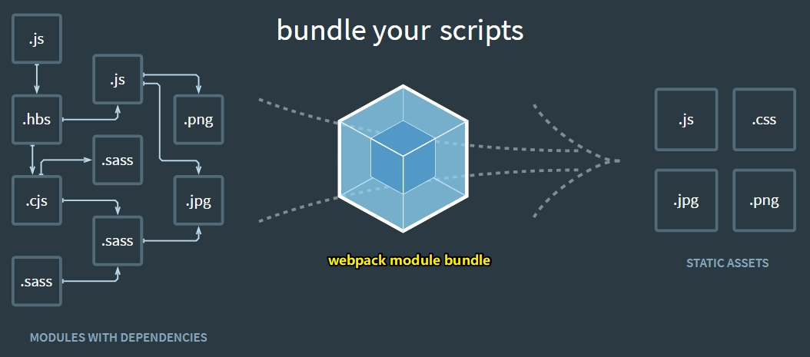

# webpack课程介绍

## ★什么是webpack？

什么时候会扯到「webpack」这个东西？

- 在日常开发里边，它甚是重要
- 面试的时候回经常性的被问到

那么什么是webpack呢？

> WebPack可以看做是模块打包机：它做的事情是，分析你的项目结构，找到JavaScript模块以及其它的一些浏览器不能直接运行的拓展语言（Scss，TypeScript等），并将其打包为合适的格式以供浏览器使用。

> 我们所写的模块通过webpack打包之后，就成了一个个的静态资源

## ★webpack可以做哪些事？

使用Webpack作为前端构建工具，可以干以下这些事儿：

- 代码转换：ES6 转化成 ES5、TypeScript 编译成 JavaScript、SCSS 编译成 CSS 等。
- 文件优化：压缩 JavaScript、CSS、HTML 代码的体积，压缩合并图片等。
- 代码分割：在开发多页面应用的时候，提取多个页面的公共代码、提取首屏不需要执行部分的代码让其异步加载、还有路由懒加载等这样的功能
- 模块合并：在采用模块化的项目里会有很多个模块和文件，需要构建功能把模块分类合并成一个文件（按照功能分类模块，然后打包成一个文件）
- 自动刷新：监听本地源代码的变化，自动重新构建、刷新浏览器。（让webpack启动一个本地服务，当代码更新后，有热更新这样的效果）
- 代码校验：在代码被提交到仓库前需要校验代码是否符合规范，以及单元测试是否通过。
- 自动发布：更新完代码后，自动构建出线上发布代码并传输给发布系统。

关于「构建」这个概念：

> 构建其实是工程化、自动化思想在前端开发中的体现，把一系列流程用代码去实现，让代码自动化地执行这一系列复杂的流程。 构建给前端开发注入了更大的活力，解放了我们的生产力。

自己对「bundle」这个东西的理解：

> bundle：有捆东西的味道，就像是古装戏里边，捆着个包袱就仗剑走天涯一样。同样，在哆啦A梦里边，有个叫「时间包袱皮」（时间布、时光布）的东西，一样东西被覆盖之后，那么这样的东西会呈现出未来或过去的状态，类比webpack，webpack就类似「时间布」这样的东西，webpack覆盖上了我们所写的源码，那么我们的源码就发生了变化！

在webpack应用中有两个核心：

1. 模块转换器，用于把模块原内容按照需求转换成新内容，可以加载非 JS 模块
2. 扩展插件，在 Webpack 构建流程中的特定时机注入扩展逻辑来改变构建结果或做你想要的事情。

## ★需要掌握哪些内容才能学习webpack？

- 由于webpack是基于node来编写的，所以需要node基础，以及npm的使用
- 掌握es6语法，因为我们写代码的时候需要采用ES6语法！

只要掌握这两个技能就可以学习webpack啦！

## ★本课程主要掌握webpack哪些东西，或者说学完本课程之后自己能达到什么目标

- webpack常见配置
- webpack高级配置
- webpack是怎么优化的，即webpack的优化策略是咋样的
- AST抽象语法树，即webpack是怎么去解析语法层面的东西
- 掌握webpack里边的Tapable事件流，毕竟webpack主要靠的是各种各样的钩子，而钩子主要靠的是Tapable库来实现的
- 为了掌握webpack流程，需要去手写webpack，并且还要去实现常见的loader，以及常见的plugin

至此，学完本课程之后，就会对webpack有一定的了解了！

> 我看完珠峰这个webpack课程后，我就会去看极客时间推出的webpack课程！

