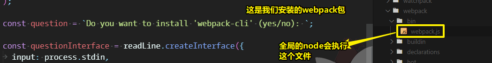
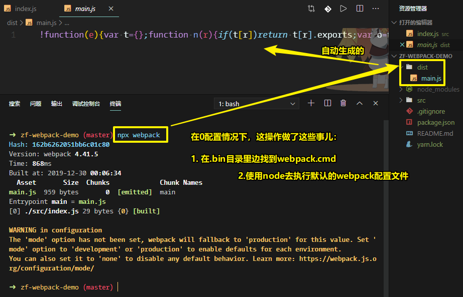
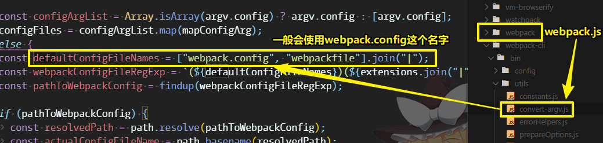
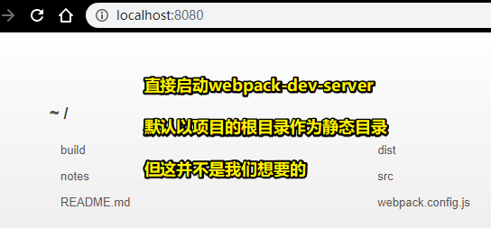

# 基础篇

## ★TPR

**1、在Node.js里边，如何去解析一个绝对路径？**

很简单，使用Node.js 的核心模块path即可，注意它是内置模块，不需要我们去安装

做法如下：

1. require path 模块
2. `path.resolve('./xxx.js')`，resolve是解析之意，可以把相对路径解析成绝对路径

测试：

``` js
let path = require('path')
console.log(path.resolve('dist')) //g:\git-2019\zf-webpack-demo\dist
```

不过，我们一般会加上个 `__dirname`参数，表示「在当前目录下，产生个dist目录」

``` js
path.resolve(__dirname, 'dist') //结果同上
```

说白了，`resolve`会将参数中的路径或路径片段的序列解析为一个绝对路径，`__dirname`表示当前文件模块（即webpack.congfig.js）所在的完整的绝对路径，这样即使项目迁移，地址变更，只要保证相对路径正确即可。

``` js
console.log(path.resolve()) //g:\git-2019\zf-webpack-demo
console.log(path.resolve(__dirname)) //同上
```

> 加上 `__dirname` 代码的语义化更好——能更好地知道当前这个文件是在哪个目录里边的


## ★webpack基础配置

<mark>1）初始化项目，webpack本地安装</mark>

``` bash
mkdir zf-webpack-demo
cd zf-webpack-demo
yarn init -y
yarn add -D webpack webpack-cli
```

> -D 表示的是开发依赖，项目上线的时候不需要！

<mark>2）webpack可以进行0配置</mark>

> 只要是0配置，那么这就意味着它的配置肯定是很弱的！

我们知道webpack是打包工具，即它可以把我们的源码进行打包，然后打包出输出后的结果

而且它默认识别的是所谓的「JS模块」

它会从入口文件开始，然后把所有的JS 进行打包，最后进行一个输出！

webpack需要一个被打包的目录，而这一般都会是 `src`目录，因为这是源码存放的地方

做法：

1、创建 `src/index.js` 文件

2、对index.js这个文件进行打包，直接 `npx webpack`即可

> `npx` 是 5.2版本之后npm提供的命令，它可以执行.bin下的可执行文件。当然，你也可以配置 `scripts`脚本！

`npx webpack`这个操作默认会去找 `node_modules/.bin/webpack.cmd`：

``` bash
@IF EXIST "%~dp0\node.exe" (
  "%~dp0\node.exe"  "%~dp0\..\webpack\bin\webpack.js" %*
) ELSE (
  @SETLOCAL
  @SET PATHEXT=%PATHEXT:;.JS;=;%
  node  "%~dp0\..\webpack\bin\webpack.js" %*
)
```

该文件里边有个判断，如果当前目录下有node.exe，那么就会用到前这个bin目录下的node.exe，来执行webpack.js这个文件

显然，bin目录咩有这个node.exe，于是就走到了else里边的代码：



可见，webpack4叫我们去安装webpack-cli

而这就是webpack和webpack-cli这两个模块之间的关系啦！

执行结果：



> 图中的标注第二点标注有错误，是node执行webpack.js

在node执行webpack.js的过程中，内部会调用webpack-cli解析用户参数进行打包。而且默认会以 `src/index.js`作为入口文件。

如果你把index.js的名字改为app.js，那么执行 `npx webpack`，就会报这样的错误：

```
ERROR in Entry module not found: Error: Can't resolve './src' in 'G:\git-2019\zf-webpack-demo'
```

言归正传，我们可以看到打包出来的main.js是压缩过后的结果，而这是因为webpack它具有优化的功能，即可以把打包的文件进行优化产出！

注意，打包出来的运行main.js是可以直接运行的，结果跟没打包之前的index.js一样，这一点你可以通过「Code Runner」这个插件来测试一下

话说，我们只写了这样一行代码：

``` js
console.log('hello webpack!')
```

可是打包出来的main.js却有一大串代码，而这是为什么呢？

我们知道webpack的功能就是打包，而它默认的功能就是支持我们的js的模块化

既然说到模块化，那么这也就意味着我们可以在js文件里边写一些模块化代码，如CommonJS 规范require语法……

可我们知道遵循CommonJS 规范这样的语法，在我们浏览器里边是不能跑的，但是经过webpack打包后所产出的文件，是可以在浏览器里边跑的！

总之，webpack帮我们实现了这么一个功能：

可以帮我们去解析js文件里边的模块，并且可以找到当前js文件所依赖的模块，然后把这些模块打包成一个文件，而且还帮助我们解决了浏览器不支持require的问题，即相当于webpack它自己实现了一套模块化机制！

之前，我们说到0配置的webpack，打包能力是非常弱的，即：

1. 入口文件必须在src目录下，且叫index.js
2. 打包出来的目录叫dist目录，而且旗下有个结果文件叫main.js

而目前，我们希望更改这个dist目录，即不想把结果文件输出到这个dist目录里边去

<mark>3）手动配置webpack</mark>

之前打包的时候，终端出现过这样的警告：

```
WARNING in configuration
The 'mode' option has not been set, webpack will fallback to 'production' for this value. Set 'mode' option to 'development' or 'production' to enable defaults for each environment.
You can also set it to 'none' to disable any default behavior. Learn more: https://webpack.js.org/configuration/mode/
```

这句话的意思是说「默认的打包模式是生产模式，而生产模式意味着会优化了你的代码，如压缩体积、tree shaking……」

做法：

1、默认配置文件的名字是「webpack.config.js」

2、配置参数有mode、entry、output

话说「webpack.config.js」这个名字改么？

是可以改的！

可为啥要叫「webpack.config.js」这个名字呢？

1. node执行webpack包里边的webpack.js
2. webpack.js里边默认会调用webpack-cli
3. webpack-cli里边有个模块用于解析导出的参数对象，即那个有mode，entry，output的对象



如果要强制指定webpack的配置文件，直接 `npx webpack --config xxx.js`即可

## ★webpack打包出的文件解析

```js
// index.js 依赖了一个 a.js 模块，

// index.js
let str = require('./a.js')
console.log(str)

// a.js
module.exports = '我是模块a'
```

webpack打包 -> 化两个模块为一个 -> bundle.js

打包出来的bundle.js是可以在浏览器里边跑的，即便我们的源码用的是CommonJS 规范来做的模块化，当然，在Node里边，这bundle.js肯定是能跑的！

可为啥浏览器可以识别require语法呢？webpack到底做了什么？

webpack做的事很简单，就是自己实现了CommonJS 规范，即自己实现了require方法

至于我们在一个a模块文件里边 `module.exports`，然后在index模块文件里边require了a这个模块，其实require的返回值正是a模块文件`module.exports`的值！（`module.exports`的默认值是一个空对象）

很多时候，我们在一个模块里边，可以直接用exports，但其实其本质是 `var exports = module.exports;`，而这行代码并没有在a模块里边体现出来，说白了，这是node它自己解析注入进来的！（自己脑补猜测的）

以上就是webpack处理模块的一个大致流程了。

总之，webpack的主要功能就是「帮我们把所有的模块解析成一个对象」，然后通过一个唯一入口，即如`index.js`这样的，然后去加载所有依赖的模块

注意，这是递归加载依赖模块的，也就说通过入口文件的运行，然后加载执行所有的模块，最后又回到了入口文件

> 之后，会实现一个简易的webpack！

问：

<mark>1、如何指定特定的webpack配置文件？</mark>

做法一：手动指定配置文件

``` bash
npx webpack --config xxx.js
```

缺点，命令行太长了，根本记不住

做法二：一般情况下，会在package.json里边配置一些脚本，然后通过这些脚本来执行webpack以及webpack-cli

``` json
{
  "scripts": {
    "build": "webpack --congfig xxx.js"
  }
}
```

> 一般打包的关键字叫build，当然，这名字可以随便起哈！之前我们需要写npx，但现在不需要写了，因为脚本会自动去找当前node_modules目录下的webpack命令

使用：

``` bash
npm run build
# or
yarn build
```

假如，我希望把这一坨 `--congfig xxx.js`拿出来作为参数，然后这样做：

``` json
{
  "scripts": {
    "build": "webpack"
  }
}
```

``` bash
npm run build --congfig xxx.js
```

> 注意，yarn是可以的，即`yarn build --config xxx.js`  <=> `webpack --config xxx.js`

结果，你会发现，这命令行执行的是 `webpack xxx.js`，即少了 `--config`

官方说到，如果你要传参的话，直接加 `--`就好了，即这样：

``` bash
npm run build -- --congfig xxx.js
```

npm会认为 `--congfig xxx.js`是个字符串参数！

总之，这等价于（字符串里边以空格来划分多个参数）：

``` bash
webpack "--congfig" "xxx.js"
```

> `npm run build -- --config xxx.js` <=> `webpack "--config" "xxx.js"`

总之，我们可以通过 `--config` 来指定webpack的配置文件

接下来，会讲到其它的一些配置，毕竟，目前这个配置实在是太弱了，即只能去打包我们所谓的JS 文件哈！

➹：[解析打包出来的文件、配置scripts · ppambler/zf-webpack-demo@3138f09](https://github.com/ppambler/zf-webpack-demo/commit/3138f093dc9a32c4276f4b23d4b0ac563193cc8d)


## ★HTML插件

我们之前是如何测试bundle.js的？

> 我们想要让打包出来的bundle.js在浏览器里边运行，于是就在打包的目录下手动创建了一个index.html，然后再往index.html里边引入了这个bundle.js，最后就启动一个http-server（开发模式下很鸡肋），或者直接双击这个index.html（file协议的）

一般来说，我们在开发的时候，希望用localhost或者是ip地址的方式，来访问index.html，而且index.html不需要我们手动创建

webpack内置了一个开发服务，其内部是通过express来实现的静态服务：

``` bash
yarn add -D webpack-dev-server
```

> 使用这个服务的好处：不会真实的去打包文件，而是只是生成一个在内存里边的打包，说白了，就是把打包好的文件写到内存里边去，而不是写到硬盘里边去。

使用：

``` bash
npx webpack-dev-server
# or 自己配置scripts
```

结果（自己找到webpack配置文件，然后打包到内存里边去）：



> webpack-dev-server 与 webpack 的区别：前者打包到内存，后者打包到硬盘。相同点在于，它们都读取了webpack配置文件

我们希望进入到build目录里边去

那么，我们就得这个server进行配置一下

做法：

1. 在entry的同级下，搞个 `devServer`属性
2. 往该属性旗下，添加个contentBase属性，值为 `'./build'`

服务启动，结果：


> 图里边的3000端口，是我配置了port为3000的缘故。以上之所以有响应内容出现是因为，我们是有build目录。如果没有build目录，那么你就得配置html插件，然后生成一个index.html到内存里边的build目录里边去，不然，会报cannot……这样的错误

我们希望webpack自动创建一个HTML，然后打包到内存中去：

> 借助一个插件  `html-webpack-plugin` 即可干这件事！

``` bash
yarn add -D html-webpack-plugin
```

关于插件的用法：

首先你得知道，webpack本身就是用各种插件堆叠起来的，而关于插件的用法是很简单的：

1. 安装插件
2. require插件
3. 在plugins这个数组里边 push 一个 「new 插件」（插件是个类哈），如 `new HtmlWebpackPlugin({})`
4. 传入的 `{}` 即是用来配置选项参数的，通过配置这些参数，new出来的实例，才能按照我们所期望的效果运作起来

> 再次强调，使用webpack-dev-server，是咩有在硬盘里边生成build目录以及结果文件的，因为这一切都是在内存里边读取的！

我们希望压缩HTML模板，就像配置mode为生产模式之后，打包出来的bundle.js是压缩的那样！

于是我们对打包出来的index.html，做了一下操作：

1. 去掉没有必要的属性值的引号（规则是属性值有逗号、等号等就不需要去掉了）
2. 去掉无用的空格

为了保证缓存：

1. 对打包出来的index.html里边引入的bundle.js添加hash戳，如 `bundle.3644631f.js?3644631feca7eca5217e` 里边的问号这一坨 `?3644631feca7eca5217e`
2. 对打包出来的bundle.js也添加了hash戳，一旦js文件更改了，那么就是从服务器里拿bundle.js，而不是在本地缓存！总之，之所以添加hash戳，是因为每次更改js文件之后，希望打包出来的bundle.js是一个新的文件，而不是旧的！

以上 就是html-webpack-plugin这个HTML插件的大致用法了，接下来会说到如何让webpack支持css模块，js模块的转换，图片，以及各项的优化、配置等……

➹：[添加html插件 · ppambler/zf-webpack-demo@bcc12dd](https://github.com/ppambler/zf-webpack-demo/commit/bcc12dd8d30be62890295ed829e90f59cd3aa9ba)

## ★样式处理（1）


## ★样式处理（2）

## ★转化es6语法

## ★处理js语法及校验

## ★全局变量引入问题

## ★图片处理

## ★打包文件分类


## ★总结

- `npx webpack`做了什么？
  - 如果是0配置，那么就会找到.bin目录下的webpack.cmd，然后执行它，它是个脚本文件，它识别到当前.bin目录下咩有node，于是就找到全局的node，然后 `node webpack.js`
  - webpack.js这个文件来自于我们安装的webpack包，该文件里边会去调用webpack-cli里边的一些模块去读取我们传入的配置参数
  - 如果没有咩有写配置文件，那么就会读取默认的，如规定入口文件是 `src/index.js`，出口为 `dist/main.js`（这与在package.json里边写的main为index.js无关）
  - 如果写了配置文件，即不是0配置的，那么你在 `npx webpack`的时候，不需要指定webpack的配置文件，webpack默认会找到项目根目录下的 `webpack.config.js`，然后读取导出的对象（配置参数），然后进行打包！

- build是把源码打包上线，dev则是在开发模式写下启动一个webpack-dev-server来写代码！
- 老师讲课的姿势：我期望什么样的效果，于是我就去配置什么样的参数！


