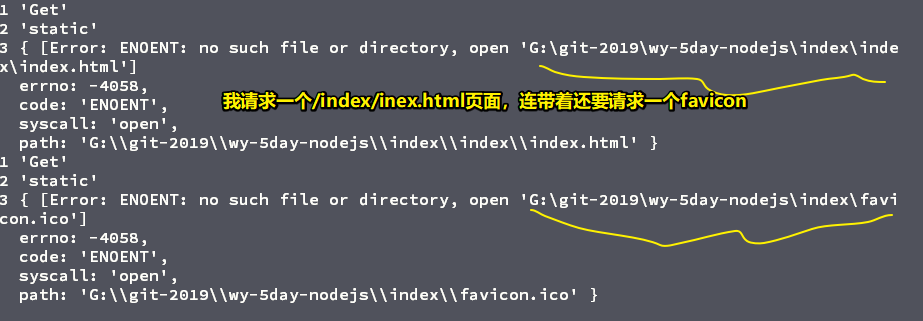

# 原生nodejs的基础使用

## ★TPR？

### <mark>1）什么是Node？</mark>

* 一个让JS运行在服务端的开发平台
* 2009，5月份发布
* 其本质是v8引擎（一个由Google开发的开源的高性能JavaScript引擎）的封装

Node它不是一门独立的语言，也不是一个JS 框架，而是一个JS 的运行环境。我们在前端页面写的JS 是由浏览器负责执行的，而我们这次要学的Node，其实是在后台运行的JS 。

目前，还没有一家公司完完全全用Node.js 来做服务端，说白了，Node.js 目前是打辅助的，一般它在工作中的用途是这样的：用来做中间层（从架构上理解中间层和中间件的区别）、小型服务（一些促销活动，如果后台忙不过来的话）、构建一些小工具（如webpack这样的自动化工具）

简单来说，中间层就是这样：


> 中间层是一个常见的web架构。构建：构想并建立（多用于抽象事物）

注意，一个观点：「目前，没有哪家公司可以用Node.js 来独当一面的来做后台服务」

### <mark>2）为啥Node那么火？换句话说，它有啥优势？</mark>

* 便于前端入手，毕竟写的都是JS代码
* 性能出众
* 利于和前端代码整合（如数据校验，数据入库，旧姿势是前台一套，后台一台（Java/php），而现在有了Node.js之后，就写一套就好了）

### <mark>3）DOM 和 BOM是存在于哪儿的？</mark>

它们俩只在于浏览器，在node里边是咩有它们俩的！而这意味着，你写Node.js 代码的时候，就不能用dom对象和bom对象了

### <mark>4）IO？</mark>

简单来说，IO就是读写文件，如输入输出、请求响应等等

程序在执行的过程中，必然会进行很多的IO操作，注意IO不是并发，而是读写！

IO操作很费时，如你要正常去读写一个文件，这样整个线程就会暂停下来，等到这个文件读完后，再继续执行，可见，IO换句话说就是阻塞了代码的执行，而这样一来就导致了整个程序的效率降低

阻塞IO会等待，而非阻塞IO则不会等待，即在程序的执行过程中，IO操作不会去阻塞程序的执行，即在IO操作的同时，继续会执行其它的代码！

得益于Node.js 的事件循环机制，让node环境下的IO操作是非阻塞的！

### <mark>5）nodejs的好？即为啥那么多公司喜欢用它？</mark>

1、nodejs依赖于v8引擎进行代码解释，所谓的v8引擎是一种JS 引擎的实现，而JS 引擎又是什么呢？它是一种用来执行JS 代码的解释器。v8引擎它是开源的，底层是c++，号称是最快的JS 引擎

2、nodejs是基于事件驱动的，所谓的事件驱动，可以理解为一种模型，其实，像「模型」这样的东西，是很抽象的，如在js里边有个叫onclick事件，这个事件代表鼠标按下，而鼠标驱动模型的大体思路是怎样的呢？——在内部会有个事件或者说是消息队列，当我们按下鼠标，会往这个队列里边增加一个点击事件，同时还会有一个循环，而这个循环的形式是 `while(true){}` ，可见这是死循环，通过这种方式不断地去从事件队列里边取出事件，然后根据不同的事件去调用不同的函数！由于保存着一个事件对应着一个函数地址，这样就保证了每个事件都有一个独立的处理函数！而nodejs它也是采用事件驱动的运行方式，它的内部会有一个主线程来维护一个事件循环！

3、非阻塞I/O

4、基于单线程的

### <mark>6）进程和线程？</mark>

* 进程：系统里边正在运行的一个应用程序，如QQ、网易云音乐等这些程序，一旦运行，就是一个进程
* 线程：进程内独立执行的一个单元流，换句话说，就是「程序执行流的最小单元」，如我们的qq在执行的时候，是可以语音和视频的，而这个时候的语音和视频就可以理解为QQ进程里边的一个线程在执行

Node.js 之所以那么牛逼，很大原因是因为它的性能牛逼

举栗来说：

你开了一个大保健，最开始的时候你聘了很多技师，每来一个客户就让一个技师去服务，有一天，同时来了好几百位客人，甚是火爆，于是，你就派了几百位技师一对一的为这几百位客人服务，看起来这一天会赚大钱，但是聘请的技师太多了，所以最后也没挣到啥钱……

总之，以上是一种传统姿势——客户多了，技师就得多，不然，技师都在服务，剩下的客人在排队等候的话，下次就不来了……这样一来二去的，生意自然就惨淡了，逐渐地，就等着关门吧……

为了防止这种情况发生，于是你只聘请了一个技师，而这位技师贼牛逼——漂亮，服务好，技术好，简直是技师界里边的王者

有了这样一位技师，客人们自然心甘情愿地来等

话说，这个栗子跟Node.js 有啥关系呢？

我们知道在传统的Java、PHP里边，它们会为每一个客户端的连接创建一个新的线程，而每一个线程所耗费的内存大概是2M，所以理论上一个8G的内存的服务器，它可以同时连接的最大用户数，大概是4000个

由于业务的拓展，我们的web应用程序会支持更多的用户，那么这就需要去增加服务器的数量了，如果不增加，那么这就意味着你的服务器的服务就会被挂掉

然而，服务器是很贵的，可在java、php这样的语言下，如果要扩展业务，只能加服务器了，毕竟这是由java和php的语言本质所决定的，只要来一个用户，就得创建一个线程

然而，在Node.js 里边，它不会为每个用户连接创建一个新的线程，而是仅仅使用一个线程来做这件事，所以Node.js 它是单线程的

当用户连接了，就会触发内部的一个事件，通过「非阻塞I/O」、「事件驱动机制」，然后就会让程序看起来也像是并行的那样

如果你使用Node.js 来搞，那么一个8G的内存服务器，就可以同时处理4万个用户请求

可见，4000与4万，显然选择后者哈！

可以看到，使用单线程会有这样一个好处哈！（所谓的单，就是一个线程完成所有的任务，并不是多个单线程完成多个任务，然后看上去每个线程都在单独完成一个任务那样）

换言之，Node.js 的承载、负载是非常不错的

当然，单线程它也有一个坏处，那就是当用户的那个线程崩溃以后，那么整个服务都会崩溃

不过，现在这也没啥关系了，因为我们的服务器基本会配置pm2（带有负载均衡功能的node应用进程管理工具）——进程守护工具（服务崩溃后，可以平滑无缝启动服务），除了pm2（用得比较多）以外，还有forever等

总之，Node.js 的性能很牛逼，而这一点最简单的体现就在于它是单线程的！（8G内存，java只能处理4000个，而nodejs能处理40000个）

➹：[PM2简易使用手册 - 掘金](https://juejin.im/post/5be406705188256dbb5176f9)

> 一般服务器的部署用的是Nginx

### <mark>7）作为一个服务器，一般会有哪些功能？</mark>

1. 处理静态资源
2. 处理请求，如get、post

### <mark>8）express和koa有什么区别？</mark>

处理异步方式的不同

### <mark>9）nodemon？</mark>

热启动，类似于webpack-dev-server，当我们修改了启动http服务的nodejs文件，就会自行启动，不需要我们再次node xxx.js一下。

### <mark>10）Buffer？</mark>

buffer是一个对象，是一个二进制对象，代表一个缓冲区，主要用于操作二进制的数据流，其用法跟数组差不多！

> 一般log一个buffer的时候，打印出来的是16进制的数据，即2个东东为一个字节，如 `<Buffer 75 6d>`

### <mark>11）服务器的作用？</mark>

1. 处理请求，如Get、Post等
2. 处理静态资源，如根据请求拿到某个文件的数据等（即读某个文件的内容）

## ★基础知识

### <mark>1）Node.js 安装</mark>

下载LTS版的：[Node.js](https://nodejs.org/en/)

### <mark>2）管理npm包的下载源</mark>

安装nrm就好了：

1. `nrm ls` ：查看有哪些源
2. `nrm use taobao` ：使用哪个源，如这里使用的是淘宝源

> nrm是一个管理源的工具

不过一般会推荐你使用yarn去安装npm包，因为它很快哈！

> 镜像：如果你了解过docker，你就会知道镜像有点像是拷贝，总之，可这样理解 镜像 -> 拷贝

### <mark>3）测试「非阻塞I/O」</mark>

``` json
{"name":"我是你大桃哥啊！"}
```

``` js
const fs = require("fs");

fs.readFile("./data/name.json", (err, data) => {
  if (!err) {
    setTimeout(() => {
      console.log("我要等3s才执行");
    }, 3000);
    console.log(data.toString());
  }
});

console.log("我要最后才执行");
```

log 结果：

``` 
我要最后才执行
{"name":'我是你大桃哥啊！'}
我要等3s才执行
```

fs.readFile是个IO操作，由于Node.js 是非阻塞IO的，所以不会等它读完文件后再去执行最后那行log！

不管怎样，IO就是读写，如读写文件、操作数据库等都是基本的IO操作

### <mark>4）建立http服务</mark>

> 测试nodejs的单线程是如何体现出来的，即建立一个服务端

1、安装[nodemon](https://github.com/remy/nodemon)（监视node.js应用程序中的任何更改并自动重启服务器-非常适合开发）

➹：[nodemon使用简介 - 掘金](https://juejin.im/post/5b5005f7f265da0f66401fe7)

2、启动一个最基础的http server：

``` js
const http = require("http"); //系统内置的模块，如果使用第三方模块，需要用npm或yarn安装

let server = http.createServer((request, response) => {
  response.write("hello world!");
  response.end();
});

server.listen(3000);
```

### <mark>5）处理静态资源</mark>

``` js
const http = require("http");
const fs = require("fs");
let server = http.createServer((request, response) => {
  // 处理静态资源
  let url = request.url;
  // url  -> http://localhost:3000/index.html -> /index.html -> index/index.html
  fs.readFile(`index${url}`, (err, buffer) => {
    if (err) {
      response.write("this page is not found");
      response.end();
    } else {
      response.write(buffer); //字节流  -> index.html
      response.end();
    }
  });
});
server.listen(3000);
```

> 如果请求的index.html咩有写utf-8，那么就会出现乱码；如果write出去的内容是中文，且没有写设置utf-8的响应头，那么这中文也会乱码

### <mark>6）处理请求</mark>

> 前后端的简单数据交互，前端发起请求，后端进行处理（如拿到前端的数据进行验证判断入库等）

**1、Get请求处理**

用form表达做前后端数据交互：

``` html
<!-- index.html -->
<body>
  <form action="http://localhost:3000/get">
    用户：<input type="text" name="username"><br>
    密码：<input type="password" name="password">
    <input type="submit" value="提交">
  </form>
</body>
```

> 该页面用VSCode的Liveserver打开，端口号是5500

前端页面，点击「提交」，发起「`http://localhost:3000/get?username=dada&password=dadad`」这样的请求

处理用户输入的数据：

``` js
// 3000端口
let { path, query } = url.parse(request.url, true);
//path -> /get?username=dada&password=dada
//query -> { username: 'dada', password: 'dada' }
```

> node开启了一个服务，用于处理前端发过来的请求，而这请求是通过http协议发过来的，而这就是服务端的作用哈！之前了解过，用户与前端界面的交互（如事件），而现在则了解了前端和后端的交互（如http请求）

**2、Post请求处理**

> 56min

Post请求的数据来自于请求体，而这意味着post的数据要比get的数据要大很多，而且在Node.js 里边post请求发送的数据是**分段提交**的，当然，如果post过来的数据贼鸡儿少，那么一次性就能接收完

> post和get在Node.js 里边处理数据的不同：post需要把分段好的一个个数据push到数组里边然后拼接起来，而get，则是拿到querystring，然后用url的parse转成对象

``` html
<!-- 5500端口打开该页面 -->
<body>
  <form action="http://localhost:3000/post" method="POST">
    用户：<input type="text" name="username"><br>
    密码：<input type="password" name="password"><br>
    <input type="submit" value="提交">
  </form>
</body>
```

``` js
const http = require("http");
const queryString = require("querystring");
let server = http.createServer((request, response) => {
  let arr = []; // 很多时候传输的是文件 -> 所以用的是数组而不是字符串 -> 如果传过来的是字符串，那就用字符串拼接就好了

  // 开始接受数据 -> do -> callback
  request.on("data", data => {
    arr.push(data);
    console.log(1, arr); //[ <Buffer 75 73 65 72 6e 61 6d 65 3d 64 61 64 61 26 70 61 73 73 77 6f 72 64 3d 64 64> ]
  });
  // 数据接收完（数据不可能一直在接收，所以总有结束的时候） -> do -> callback
  request.on("end", () => {
    console.log(2, Buffer.concat(arr)); //<Buffer 75 73 65 72 6e 61 6d 65 3d 64 61 64 61 26 70 61 73 73 77 6f 72 64 3d 64 64>
    let buffer = Buffer.concat(arr); // post是分段传送，传递过来的是碎片，我们需要重新组装
    console.log(4, buffer.toString()); //'username=dada&password=dd'
    // 把数据解析成有意义的数据
    let post = queryString.parse(buffer.toString());
    console.log(3, post); //[Object: null prototype] { username: 'dada', password: 'dd' }
    console.log("走了几次这个end"); //  -> 2次，第一次就把数据走完了呀，为啥还要再走，而且第二次走的结果是「[Object: null prototype] { username: 'dada', password: 'dd' }「2，<Buffer>」「4，''」「3，[Object: null prototype] {}」，而这意味着执行了两次end()，但第一次end()的时候，意味着浏览器不会再旋转logo了
    response.end();
  });
});

server.listen(3000);
```

> 之所以走了两次是因为要拿到「favicon.ico」




### <mark>7）同时处理Get请求和Post请求</mark>

> 一般来说，服务器都同时具备处理Get、Post等这样的请求，还有获取静态资源

- 在get和post里边添加一个xxx函数调用，该xxx函数判断路径，然后根据路径让前端页面得到相应的资源、数据

demo：[同时可处理get和post的请求 · ppambler/wy-5day-nodejs@aac4647](https://github.com/ppambler/wy-5day-nodejs/commit/aac464735945c3dc11ce4dfe38f60c14e7d3aa71)

测试：

1. 打开 <http://127.0.0.1:3000/index.html>，这意味着处理静态资源
2. 点击登录，发送get的ajax请求，可访问登录页面
3. 点击注册，发送post的ajax请求，可访问注册页面

以上，就是一个很基础的服务器了，即可以：

1. 读取静态文件
2. 可处理get请求
3. 可处理post请求
4. 根据不同的url访问作出不同的响应

进一步了解以上这种做法：

如果存在很多个页面请求，即需要判断路径很多次，如这样：

``` js
if(path === 'reg'){
  // do……
} else if(path === 'login') {
  // do……
} else if(path === 'xxx') {
  // do……
} //……
```

可见，这显然忒繁琐了，而且写起来形式上有点复杂

于是这个时候，就出现了一个叫「Koa」的东西

> 在node里边，不是让你去写原生的，用框架才是王道！

## ★总结

## ★Q&A

### 1、程序执行流是啥？

> 很简单，你读书是怎么读的？一行一行读的对不对？那么这个就叫读书流。源码也一样，被执行的时候是一行一行走的，当前执行到哪里，就叫流到哪里。整个过程又被称为执行流。

➹：[“程序执行流”是什么意思?_百度知道](https://zhidao.baidu.com/question/401410292.html)

➹：[进程与线程的一个简单解释 - Corwien - SegmentFault 思否](https://segmentfault.com/a/1190000005884656)

### 2、jQuery，发ajax请求的dataType？

指定后端服务器应该响应回一个什么样的数据给前端，如后端响应回一个json数据，那么就能得到正常的json数据

➹：[Jquery ajax请求中datatype的含义_Jquery ajax请求中dataty_乐在其中-CSDN博客](https://blog.csdn.net/u013476542/article/details/61414401)

### 3、`:text Selector`？

➹：[:text Selector : 选择所有类型为文本的元素。 - jQuery API 中文文档 - jQuery 中文网](https://www.jquery123.com/text-selector/)


### 4、url.parse？

➹：[URL - Node.js v13.6.0 Documentation](https://nodejs.org/api/url.html#url_url_parse_urlstring_parsequerystring_slashesdenotehost)

➹：[node.js中的url.parse方法使用说明 - 简书](https://www.jianshu.com/p/1564a3288102)
