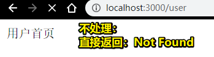

# Koa的基础使用


> Koa框架是对原生Node.js进行了封装

## ★TPR ？

### <mark>1）router是啥？</mark>

在koa里边有个叫「router」的概念，简单理解它的话，它就是一个函数哈！

如我们发起一个请求，就会有相应的方法去处理它，换言之，就会有相应的router去处理它

总之，route并不是一个高大尚的概念！

### <mark>2）企业一般用哪个框架？</mark>

一般koa用的比较多，当然，egg.js也有一些公司在用，而express基本上很少用了，毕竟有koa在！

### <mark>3）Koa与原生哪个更简单？</mark>

显然，用框架肯定要比原生简单得多。原生姿势让人写得很累，而且需要兼顾这儿兼顾那儿的……

或许你会疑问「原生姿势还需要去了解吗？毕竟用了koa之后，不需要自己引入http、url、fs等这样的模块了」

作为一个前端开发人员，原生姿势还是需要去了解的，而且，当你在使用koa等这样的框架的时候，最好想想其内部是怎样一个运行原理……

总之，你只有知道原生，才能知道框架的原理。之后，会了解到koa的底层是如何实现的

## ★koa之基础使用

### <mark>1）koa安装</mark>

``` bash
yarn add -D koa
```

### <mark>2）require -> koa</mark>

koa也是一个模块，因此也需要require进来

### <mark>3）router安装</mark>

koa本身不带router，所以我们需要去下载安装router

``` bash
yarn add -D koa-router
```

### <mark>4）router使用</mark>

``` js
// koa.js
const Koa = require("koa");
const Router = require("koa-router");

// 建立实例
const app = new Koa();

// 没有路由，直接敲个url访问是没有意义的，即拿不到任何东西
const router = new Router();

// 定义一个路由
router.get("/user", ctx => {
  ctx.body = "用户首页";
});

// 定义了路由，就要使用它
app.use(router.routes());

app.listen(3000);
```

测试，访问 <http://localhost:3000/user>：



### <mark>5）对比之前原生写的</mark>

你会发现，我们用原生姿势，需要写一大堆代码，而使用了「koa+koa-router」之后，就短短的几行代码就可以了

而这其中涉及到什么样的原理，用到了什么东西，之后会讲到！


## ★作业

1. 用原生JS 实现服务端（支持Get、Post、静态资源）
2. Koa安装和基本使用

写完原生之后，你才会明白为啥我们要用框架去开发，如这是为了加快开发效率哈！


