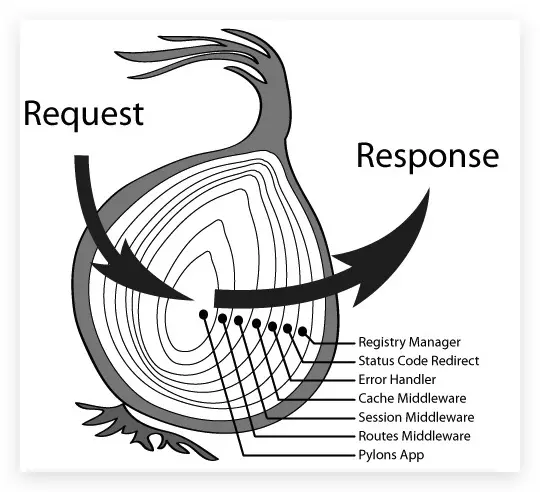
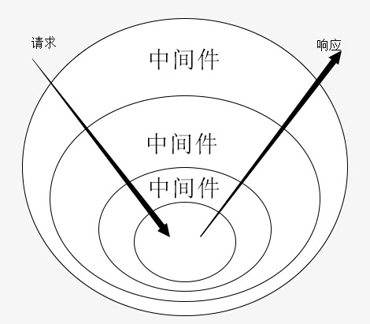

# Koa的原理 & 如何利用koa进行中间件开发

> 掌握Koa的原理和中间件开发

## ★讲什么

1. 把「中间件」这个概念讲清楚
2. 注册 -> 登录 -> SQL
3. 下一节课会把web架构里边的中间层给讲清楚

## ★TPR

### <mark>1）学会一个知识点？</mark>

1. 眼到 -> 看视频
2. 手到 -> 动手写
3. 心到 -> 思考为啥要这样写

### <mark>2）前后端的交互？</mark>

前端 -> 发数据 -> 后端 -> 处理数据 -> 返回数据（正常来说会返回数据） -> 前端

这个流程一定要搞清楚，后台其实并咩有那么神秘哈！

### <mark>3）讲什么？</mark>

1. 中间件
2. 用koa实现一个登陆功能（涉及到koa-ejs这个模板东西）

### <mark>4）洋葱模型</mark> 



➹：[洋葱模型 - 简书](https://www.jianshu.com/p/dce0727002a6)

### <mark>5）ctx？</mark> 

是一个上下文对象，koa内置的对象

``` js
const Koa = require("koa");
const Router = require("koa-router");
const app = new Koa()
const router = new Router();
router.get('/user',(ctx)=>{})
// ctx <=> app.context
app.context
```

### <mark>6）ejs模板？</mark> 

ejs -> 使用嵌入式语法，是一种 温和的、非侵入式的、若依赖的模板引擎 -> 语法：<%= js代码 %>

用来搞程序嵌套，让页面不是死的，类似的有php的smarty、Java的jsp……在Node.js 里边除了ejs模板引擎以外，还有pug（老名字叫jade，侵入式）

➹：[关于nodejs的模板引擎，如何选择 EJS 和 Jade？ - 知乎](https://www.zhihu.com/question/20355486)

➹：[【模板引擎】Ejs的使用 - 小昱个人网站 - 昱之家](https://www.xiaoyulive.top/categories/front-end/ejs.html#%E6%96%87%E4%BB%B6%E5%8C%85%E5%90%AB)

### <mark>7）所谓的渲染？</mark> 

简单来说，就是生成HTML页面的过程。于是就有了csr和ssr这两个概念

客户端渲染，生成HTML页面是在浏览器发生的，而服务端渲染，顾名思义，页面是在服务端渲染的——页面拼装好，才把页面发给前端去渲染！

服务端渲染 -> 首屏速度快，利于SEO，但每次渲染需要到服务器里边拿

客户端渲染 -> 首页白屏，但渲染一次之后就没啥问题了

总之，选择哪个，得看你的业务需求来！

> SEO：搜索引擎对静态页面友好，对JS 代码不友好，即浏览器读不出JS 文件的内容

### <mark>8）去哪儿找HTML登录模板？（表示不想自己写，毕竟目前只关注前后端整个过程的交互是怎样的）</mark> 

谷歌搜索 -> 「html登录模板」or 「html login template」

1. [html网站静态模板源码,jquery特效动画js插件网站模板 - 代码库](http://www.dmaku.com/) -> 很有可能是付费的 -> 到codepen找免费的

➹：[大气报紫色渐变登录页面静态页面模板源码 - 代码库](http://www.dmaku.com/moban-2081.html)

➹：[59 Free HTML5 And CSS3 Login Form For Your Website 2019 - Colorlib](https://colorlib.com/wp/html5-and-css3-login-forms/)


## ★中间件

在koa里边中间件是一个非常重要的概念，结合这个中间件，还会讲到一个洋葱模型！

### <mark>1）什么是中间件？</mark>

我们可以把router理解为一个中间件，当然，在官方的定义里边是这样说的：

> 对用户请求进行过滤和预处理的东西

总之，就是把处理的结果传递下去，而不是说「对客户端进行什么响应」

听起来，「中间件」似乎很复杂的样子，但简单理解起来它就是个「函数」哈！

我们知道「函数」就是实现某种功能的，所以「中间件」也是为了实现某种功能的！

同样，我们定义一个中间件，就写成是一个函数就好了

``` js
let test = ()=>{
  console.log('我是你大桃哥啊！')
}
```

在koa里边，我们koa的实例的use方法，来注册一个中间件

``` js
const app = new Koa()
app.use(test)
```

当前端发起请求的一瞬间，这个中间件函数就会被调用

以上就是关于中间件最基础的雏形了！

### <mark>2）进一步理解中间件</mark>

如果接触过express是很好理解中间件的，不过，一般新人都会直接用koa，所以通过koa来理解中间件是首要选择

`new Router()`其实是一个中间件，虽然我们说中间件是个函数，但是也可以把它理解为一个插件哈

可插件又是用来做啥的呢？——显然是用来扩展功能、丰富功能的

像在koa里边，它本身是没有router这个功能的，所以我们需要require一个koa-router进来，然后通过 `new Router`来扩展koa它有这个路由功能

总之，我们可以把中间件理解为一个实现某种特定功能的插件，但，正如我们前边所提到的，它其实就是一个函数哈！

### <mark>3）中间件具备哪些特点？</mark>

1. 封装了一些处理「完整事件」的功能函数（函数是用来处理某个事情的）
2. 非内置的中间件 -> 安装 -> require进来
3. 封装了一些或许很复杂但肯定是通用的

之前，接触到http等这样的内置的系统模块，其实也可以简单理解成中间件，但一般不会这样说

其实，代码写到最后，你会发现koa、express等它们无非就是去调用各种中间件去实现功能

总之，中间件是一个函数，用来实现某种功能。

总之，中间件就是实现某些功能的封装

### <mark>4）中间件和中间层？</mark>

中间层是一个涉及现代web架构的概念！

### <mark>5）在正儿八经的开发里边，中间件是怎么写的呢？</mark>

之前不正经的写法：

``` js
let test = ()=>{
  console.log('我是你大桃哥啊！')
}
const app = new Koa()
app.use(test)
```

> 不管前端发送啥样的url，都会调用这个test方法

正经的写法，是写成一个匿名函数

``` js
app.use(()=>{
  console.log('我是一个中间件哈')
})
```

> 在实际开发里边，中间件是一个匿名函数哈！

### <mark>6）实现多个中间件？</mark>

我们知道中间件的作用是实现某种功能，那么这就意味着在一个系统里边，需要很多个中间件，于是我们就这样做了：

``` js
app.use(()=>{
  console.log('中间件1')
})
app.use(()=>{
  console.log('中间件2')
})
app.use(()=>{
  console.log('中间件3')
})
// ……
```

然而测试，即随便访问一个url，后台只调用了第一个定义的「中间件1」，其余的中间件并没有调用。

所以在这个时候，引入了 `ctx`、 `next`这俩个东西

这两个东西，是koa封装好的，它们分表代表着：

- ctx -> 上下文对象
- next -> 指向下一个中间件函数（中间件是一个函数，所以可以直接调用）

那么此时的做法：

``` js
app.use((ctx,next)=>{
  console.log('中间件1')
  next()
})
app.use((ctx,next)=>{
  console.log('中间件2')
  next()
})
app.use((ctx,next)=>{
  console.log('中间件3')
  next()
})
// ……
```

再次测试，结果，这三个中间件都被调用了！

可见，use默认可注册多个中间件，但在没有使用next的情况下，是只执行一个中间件的！如果，你要执行多个中间件，那么你就得next一下

总之，默认情况下，koa执行第一个中间件，而如果要执行后续的中间件，那么则需要开发者自己next调用一下

### <mark>7）写个稍微复杂点的中间件？</mark>

> 猜测执行顺序

``` js
app.use((ctx,next)=>{
  console.log('1')
  next()
  console.log('2')
})
app.use((ctx,next)=>{
  console.log('3')
  next() //指向的下个中间件是null，即木有，于是就执行 log 4了
  console.log('4')
})
```

测试结果：1 -> 3 -> 4 -> 2

这个执行顺序的原因分析：洋葱模型

### <mark>8）洋葱模型</mark>

看到洋葱，就会想到要把它一层一层地撕开。

而所谓的洋葱模型，就长这样：



分析：

- 洋葱最外层，就是处理第一个中间件，如果有next，那么就会往下一层走……如果没有，那就到洋葱中心，然后往外层走

- 什么时候会到洋葱中心？
  - 遇到一个咩有next的中间件
  - 遇到中间件报错

  之后，就会往外扩散

不管这样，如果第一个中间件没有next，那么就不会有所谓的洋葱模型！毕竟一层就到芯了。

### <mark>9）next()的返回值是啥？</mark> 

``` js
const Koa = require("koa");
const app = new Koa();
app.use((ctx, next) => {
  console.log(1);
  next().then(res => { //next() -> 同步代码
    console.log(res);
  });
  console.log(2);
});

app.use((ctx, next) => {
  console.log(3);
  next();
  console.log(4);
  return "我是你要的数据"; //这个是promise的值
});
```

log结果：

```
1 -> 3 -> 4 -> 2 -> "我是你要的数据"
```

可见，next()的返回值是个Promise实例哈！

然而，这个log顺序，并不是我们想要的，我们想要的是：

```
1 -> 3 -> 4 -> "我是你要的数据" -> 2
```

为此，我们需要严格控制程序的执行流程

那么这个时候，「async+await」就派上用场了！

### <mark>10）async+await</mark> 

我们知道它们俩是配套使用的，是用于管理异步的

了解它们俩，首先要确定await的作用：

1. 求值 -> `await 100+100`
2. 会阻塞线程 -> 如读取资源、文件、发送http请求、操作数据库等操作都会阻塞线程 -> 代码从上往下执行 -> 等结果

代码测试验证这两点：

``` js
const axios = require("axios");
const app = new Koa();

app.use(async (ctx, next) => {
  // 求值
  let a = (await 1000) + 1000;
  console.log(a);

  // 阻塞线程
  console.time("time1");
  let b = axios.get("http://taobao.com");
  console.timeEnd("time1"); //time1 -> 2.684ms

  console.time("time2");
  let c = await axios.get("http://taobao.com");
  console.timeEnd("time2"); // time2 -> 791.079ms
});
```

可以看到，所谓的阻塞线程就是需要去等结果

既然使用「async+await」可以去等待异步调用的结果，那么我们可以把非常难以处理的结果，以同步的方式管理起来

不过需要注意的是，await它阻塞线程并不意味着「业务卡住」，**await的阻塞只在该函数作用域里边有效**，其本质是异步回调的调用

而且，「async+await」并不是JS 独有的概念，它们俩的存在只是为了让我们的异步代码写起来更像同步那样！

总之，我们一般都会对中间件用上「async+await」，用于严格控制程序的执行流程！

话又说回来，async的作用呢？

可以让我们调用一个async函数，返回一个promise对象，说白了，就是可以 把一个普通函数 -> 转化为 -> 一个返回promise对象的函数

### <mark>11）一个小小的业务场景 -> 结合「async+await」</mark> 

> 通过这个业务场景，你才能知晓「async+await」到底有啥用哈！

我们知道nodejs是后台的，而这意味着，它可以操作数据库

所以，我们来实现一个很常见的登录功能

### <mark>12）登录功能</mark> 

1、在正式开发里边，需要把路由单独拎出来，以此来更好地管理路由

2、目录结构：

```
mkdir libs router public template www 
touch config.js app.js
```

3、创建两个路由 -> admin、login -> 二级路由 -> /admin/login

4、引入ejs中间件 -> koa-ejs -> 搞模板文件 -> 登录页面 login.ejs

5、配置config -> 渲染模板文件 -> login.ejs

6、处理静态资源 -> koa-static（也是一个中间件） -> css、js、img -> ejs语法处理 login.ejs -> 修改静态资源的请求路径

7、login页面 -> username、password -> post请求 -> /admin/login -> 后台 -> 登录逻辑处理 -> 后台校验数据库是否存在用户名和密码 -> 存在则登录成功，否则则登录失败

8、后台拿到前端数据 -> 原生？koa-bodyparser -> 解析拿到的数据

9、数据（用户名+密码） -> 把数据放到数据库里边匹配 -> 如果查询结果存在则用户名和密码有效，否则GG -> 连接数据库 -> 操作数据库

10、操作数据库 -> 连接数据库 -> config.js（配置有关数据库的信息，如登录数据库需要用户名和密码等） -> libs -> 安装mysql、co-mysql -> libs/database.js -> require mysql+co-mysql -> CRUD -> /data -> 查数据 -> 密码是经过md5处理的

11、admin/index.js -> md5 -> 序列化 -> 安装md5-node -> SQL语句要大写，这是严谨的做法 -> 如果异步操作有问题，请用try……catch捕获，如sql语句写错了，如果没有try……catch，那就会报服务器内部错误，如果写了，就会说明sql语句写错了，然后页面返回not found -> try……catch也可以写成全局的中间件

> 把这个登录功能的思路连起来，不要孤立的去看具体某个问题，如查询sql语句是怎么写的，一旦你这样看了，那就是有问题了，所以你得用全栈工程师的角度、思维去看，用完整的角度去看

小结：

/admin/login -> 前端页面 -> form表单处理用户输入 -> post提交 -> 交给/admin/login路由中间件处理 -> 拿到前端页面发送过来的数据 -> 根据拿到的数据，使用sql语句查询 -> 查询结果 -> 判断登录是否成功

数据流的走向：

前端 -> 后台（Node，js语法） -> 数据库

### <mark>13）try……catch中间件</mark> 

以下是统一处理错误的思路：

1、mkdir middleware -> touch err.js -> 统一处理出错情况

2、app.js -> require err.js -> use err.js（第一个use的中间件，因为需要先try……catch，再`next()`）

3、测试 -> 没有err.js、try……catch -> sql故意写错 -> 浏览器地址栏输入<localhost:3000/admin/login> -> 页面显示「Internal Server Error」，即服务器宕掉了 -> 如果咩有err.js，但有try……catch -> 页面显示「Not Found」 -> 如果咩有try……catch，但用中间件处理了 -> 页面显示用中间件处理的信息，如 `{'status':'服务器出错'，'error': 报错原因}`

## ★作业

1. 完成中间件 -> error -> 用于同一处理出错 -> 现实中也会经常用到
2. 完成登录功能 -> 数据库，老师会公开连接

数据库：

``` js
module.exports = {
    DB_HOST: '106.54.210.212',
    DB_USER: 'root',
    DB_PASS: 'root',
    DB_NAME: 'user',
    URL_PATH: 'http://localhost:3000',
};
```

登录名 -> admin -> 密码 -> 123456

## ★总结

- 不是内置的模块，就需要下载，然后require进来
- 这个训练营的目的 -> 构建基本的前后端思维 -> 对开发工作更加的得心应手（如为一个接口问题前后端互相刷锅） -> 大部分的精力，不再是为接口返回什么样的数据去争论了 -> 此时的焦点，是如何推进项目 -> 知道前端要做这个，后端要做那个，一旦有了这样的思维，自己就会知道如何在它们俩的中间选择一个最优的方案 -> 前后端全栈
- 项目思维 vs 代码演示，前者写的代码好维护，而后者则是为了演示这个东西的功能而已，如写个router，之前都是把router写在同一个文件里边的，即为了演示router这个功能，而现在要做一个「登录功能」，就用到项目思维了，即把router抽离成一个个文件
- 如果在vscode里边，对Node.js 代码启用了调试模式，那么当你nodemon xxx.js的时候，会报错！
- 程序员要做的三件事情：
  1. 数据从哪儿来 -> 前端工程师完成的，从前端页面获取
  2. 数据怎么办 -> 后台要做的事儿
  3. 数据去哪儿 -> 塞到数据库或者还是其它地方，当然这也是后台要干的活儿

- 建议使用MongoDB，因为类似操作JSON对象这样操作数据
- cookie、session -> sequelize 
- 如果说作为一个程序员，你能够自己去处理后台，你会发现自己会具备一个构建项目、构建系统的能力
- 「async+await」 -> 依然是异步操作，只是让我们不用写then罢了 -> await这个关键字只在它所在的函数作用域里边有效 
- 在后台渲染ejs模板 -> 让我感到挺不爽的 -> 还是前后端分离爽


