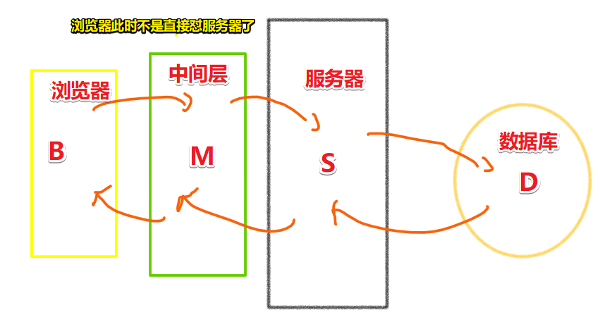
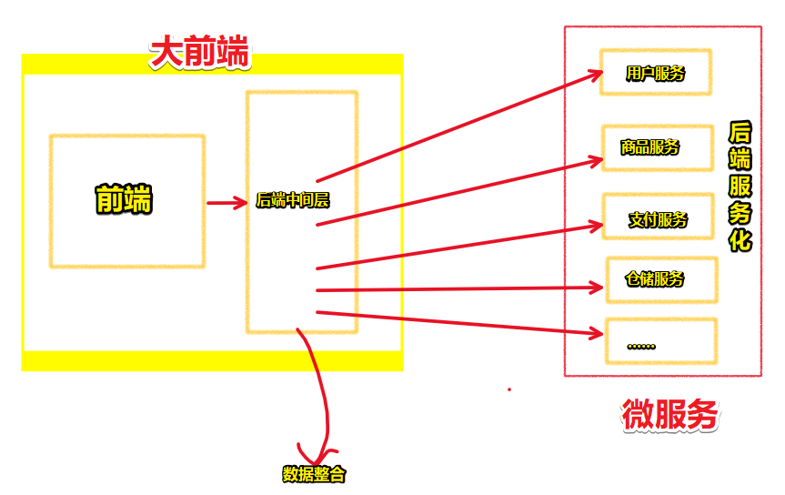

# 使用koa实现中间层以及分析现代前端架构

## ★TPR

### <mark>1）关于C#？</mark>

只要微软不GG，那么学习C#这门语言还是有口饭吃的……

➹：[C# 的前景如何？ - 知乎](https://www.zhihu.com/question/36993859)

### <mark>2）关于坚持？</mark>

学习要坚持，追女朋友也要坚持……

### <mark>3）关于全局安装和局部安装？</mark>

全局安装 -> nodemon、npm、yarn、nrm等这样的工具

局部安装 -> 看上边，非黑即白（webpack同样是推荐局部安装……）

### <mark>4）接口测试或者说是调试工具？</mark>

安装：

- REST Client -> VS Code自带 -> 当然，也可用Postman

使用：

- 根目录 -> touch .http -> .http用于测试接口 -> 变量：`@xxx` -> 使用变量 {\{xxx}}

有了这个工具，可以让我们不用写页面去测试接口，直接：前端数据 -> url请求 -> 响应数据接口

### <mark>5）在Node.js 里边写的SQL语句？</mark>

一定要大写哈，虽然写小写也没事，但这是一种规范哈！

VS Code快捷键 -> `ctrl k ctrl s` -> 搜索「upper」即可 -> 我配置的快捷键 -> `ctrl j u`

一般用持久化来保存数据的话，不会选择MongoDB来搞，而是使用MySQL、Oracle来搞持久化数据存储

### <mark>6）关于SQL语句？</mark>

SQL -> 关系型查询语句 -> 使用sql语句与数据库通信

### <mark>7）axios的transformResponse参数？</mark>

transformResponse -> `transformResponse`方法允许在数据传递到`then/catch`之前修改response数据。此方法最后也要返回数据。

而 `transformRequest` -> 顾名思义 -> `transformRequest`方法允许在请求发送到服务器之前修改该请求，此方法只适用于PUT、POST和PATCH方法中。而且，此方法最后必须返回一个string、ArrayBuffer或者Stream。

``` js
querystring.stringify({ foo: 'bar', baz: ['qux', 'quux'], corge: '' });

// 'foo=bar&baz=qux&baz=quux&corge='
```

➹：[Vue乱搞系列之axios发起表单请求 - 简书](https://www.jianshu.com/p/b22d03dfe006)

➹：[querystring - Node.js API 文档](http://nodejs.cn/api/querystring.html#querystring_querystring_stringify_obj_sep_eq_options)

### <mark>8）0day漏洞是什么？</mark>

**0day漏洞，又称“零日漏洞”(zero-day)，是已经被发现(有可能未被公开)，而官方还没有相关补丁的漏洞**。通俗地讲就是，除了漏洞发现者，没有其他的人知道这个漏洞的存在，并且可以有效地加以利用，发起的攻击往往具有很大的突发性与破坏性。

➹：[【科普贴】0day漏洞是什么？ - 知乎](https://zhuanlan.zhihu.com/p/30044629)

### <mark>9）白屏和闪动是啥？</mark>

➹：[解密白屏和 FOUC - 知乎](https://zhuanlan.zhihu.com/p/33448591)

### <mark>10）php现在什么框架比较火？</mark>

比较流行laravel框架，不过国内用的最多的是thinkphp，还有比较火的swoole

框架只是个工具 -> 关键是掌握框架底层的思想

## ★讲什么

1. API接口怎么去实现？
2. 中间层
3. 分析现代的web架构

经过前两次课的学习，你会发现今天讲的内容是多么的合理，就像是黑格尔说的那句话那样「存在即合理」。说白了，对比这三次课，你会发现当你一步一步、一个阶梯一个阶梯这样不断地解决各种问题，这其实就是一种进步哈！

收获 -> 思维从纯前端到一个具备初级的全栈思维

浏览器 -> 通信（url） -> 服务器

demo： [node作为服务层搞纯api接口，node作为中间层搞数据整合 · ppambler/wy-5day-nodejs@a7b3d9b](https://github.com/ppambler/wy-5day-nodejs/commit/a7b3d9b35f8722a4d4e2c4ecb73a202a6922b336)

## ★接口

> 一个正常的服务器肯定是能处理接口的……

### <mark>1）搞个接口首页</mark>

1、mkdir api -> touch api/user.js

2、user.js -> require koa-router -> require md5-node -> 注册index路由，并暴露它 -> 在app.js文件里边使用该路由

### <mark>2）注册接口</mark>

1、user.js -> /register  -> 拿到前端用户名和密码数据 -> 数据库匹配数据，看看该用户是否存在 -> 存在，则不注册 -> 不存在，则注册之，即入库之

2、拿到前端数据 -> md5一下密码 -> await一下查询语句，等待data的结果 -> 判断data的长度 -> 大于0则返回数据给前端说「code:100，用户名已存在」 -> 小于0，则注册用户，即入库

3、注册用户 -> 数据格式校验（这里简单起见就不做了） -> sql -> insert语句 -> await insert语句结果res -> 判断res.affectedRows是否大于0 -> 大于0，则返回「code:200，message:'注册成功'」 -> 反之，报其它错误（如服务器内部错误等）或者什么也不做

## ★中间层

> 中间层是什么？ -> 先实现它，再来说说它到底是什么

### <mark>1）一个简单的中间层</mark>

> 画一个中间层

1、传统的开发模式 -> 浏览器与服务器通信 -> 前端 -> 发数据 -> 服务器 -> 查数据 -> 数据库 -> 返回数据 -> 服务器 -> 处理返回数据 -> 返回数据 -> 前端 -> 如登录功能 -> 前端输入用户名和密码 -> 把输入的数据交给后端的login路由 -> login路由拿到数据 -> 查询数据，看看数据是否已存在于数据库里边 -> 返回数据库处理的结果 -> 数据匹配，则返回登录成功 -> 否则，GG


> 这是两层结构，不算数据库哈

2、有中间层的样子 -> 浏览器与服务器之间多了一层 -> 可谓是3层的样子



> 以上就是中间层模型啦

### <mark>2）实现中间层</mark>

原先做法：

user.js -> 充当服务层去操作数据库

添加中间层做法：

user.js -> 添加中间层，即所谓的添加一段使用axios发送请求的代码 -> 如在`router.post('/reg', async ctx => {}`这所谓的中间层里边发送axios请求，需要注意的是这代码在这里可不是充当中间件的作用哈 -> 拿到请求响应回来的数据 -> 一般该数据就只有一个code，code的值可取0或1 -> 中间层改造从数据库返回的数据 -> 如从 `{code:0}`改为 `{code: 0,
message: '用户名已经存在'}` -> 这样一来前端拿到的响应数据就是可读性好的数据 -> 一般前后端撕逼就是因为后端给的数据很low

有了中间层 -> 让我们不用去写SQL语句 -> 直接在node层通过axios请求把数据传给后台去处理，即交给php做的服务层去处理，而不是在node层处理

### <mark>3）使用中间层的好处</mark>

1. 从安全问题的角度来说 -> 把服务器真实的ip地址给隐藏了 -> 黑客如果要攻击，那么拿到的ip地址是来自于中间层的，而服务器那边还是安全的

2. 从性能问题的角度来说 -> 客户端渲染页面，即CSR -> 会出现短暂的白屏、闪动，毕竟需要等资源到齐后才开始渲染 -> 当用户网速体验不佳的时候，这种糟糕的体验尤为明显 -> 回过头来看传统的开发 -> 前端使用MVC模式 -> 通过后台提供的接口发送ajax请求 -> 前端拿到全部的数据之后才开始在客户端里边渲染页面 -> 这样会出现短暂的白屏和闪动 -> 尤其页面是由JS 生成的，而且网络体验不好的情况下，白屏和闪动尤为突出，即便你用了cdn加快了请求速度，但由JS 生成页面这一部分就有点GG了 -> 因此，我们需要SSR

3. 从开发效率问题的角度来说 -> 在传统开发姿势里边做表单校验 -> 前端一套校验，后端一套校验，毕竟数据要入库是非常严谨的 -> 有了用node做中间层之后 -> 前端一份用JS 写的校验，扔到用node层里边用也是可以直接拎起来用的，这样显然有少写了一份代码了 -> 不然，让php、java等这样的传统后台开发语言来搞的话，显然性能不好、开发效率不高，毕竟node天生异步、非阻塞、单线程，性能杠杠的，如8G内存，java做服务层理论上支持4000个用户，而用Node做服务层或中间层则是40000个用户

以上就是从安全、性能、开发效率方面分析，为啥要选择用Node来做中间层的原因所在了。

需要注意的是，不是说只有Node.js 才能做中间层，php等也可以做中间层。中间层只是一种开发模型、开发架构而已，我们之所以用nodejs来做，是因为它真得很牛逼！

### <mark>4）使用Node.js做中间层的优势？</mark>

1. 可以跨系统、跨终端、可重用的页面数据校验 -> 保证了团队整体的开发效率，毕竟后台不用做数据校验了，而是交由前端来做，而前端可以复用同一套校验代码

2. 处理数据逻辑 -> 解放了前端既要做页面渲染，又要写复杂逻辑，使得页面开发人员专注于页面渲染 -> 分工更为明确、项目协作更高 -> 更重要的是可以快速响应页面，用户体验更好，毕竟所有的页面渲染都是在中间层完成的，用户拿到的是拼装好的页面

3. 解决前端跨域问题 -> 跨域是浏览器的安全机制 -> 服务器端的请求不涉及跨域 -> 跨域是因为浏览器的同源策略所导致的 -> 前端发送的ajax请求是非同源的，那么GG -> node中间层发送ajax请求，那么随便搞，然后把响应回的数据处理一下之后，转手给前端

4. 方便前后端分离 -> 后台传统MVC开发模式 -> UI设计图 -> 切图 -> 前端做带有动效的静态页面 -> 后台使用smarty或jsp往页面嵌套程序 -> 由于后台需要用到模板，所以这并不是真正完全的前后端分离 -> 有了Node.js做中间层 -> 后台直接定义一个接口，并告知类似「code为0」这样的数据为何意即可 -> Node.js 中间层处理后端接口响应回来的数据，如数据变得可以让前端开发者读懂的数据 -> SSR渲染页面 或 简单的json数据 -> 客户端拿到想要的数据

后端不用做view层了，而且后端提供的接口数据如果不是前端想要的，也可以让nodejs中间层去重新定义接口，如 `data.code === 0`就dosomething，`data.code === 1`又dosomething

目前，简单的项目开发基本上都是两层结构，即米有用到中间层，就是直接的B端和S端，而复杂的项目，如天猫、微博等的业务就非常复杂了，而且访问量非常大，而在这种情况下两层结构就有点应付不过来了

### <mark>5）微服务架构？</mark>



后端服务化 -> 把一个大系统拆分成很小很细的小服务，如用户服务、支付服务等 -> 把传统的后端开发模式搞成是微服务了 -> 单块开发、单块服务 -> 但早期部署麻烦，毕竟不同的环境可能会导致一些无法预料的问题 -> 容器技术 -> docker -> 类似web容器 -> 有了docker之后部署很方便 -> 但一般中小型的公司玩不起这种架构 -> 毕竟后端服务化这种东西很耗钱啊 -> 讲真，这种架构了解后就咩有想象中那么牛逼了 -> 大公司常用的架构

大前端 -> 前端+后端中间层 -> 中间层不单只只有nodejs可以做，php也可以做 -> 前端后台化，后端服务化 -> 后端只给数据接口，前端随意折腾接口数据 -> nodejs中间层是交由前端来做的 -> 站在前端负责人的角度来看，这种架构对团队的开发效率提升杠杠的

前后端 -> 前端逐渐后端化 -> 后端逐渐服务化

一些很早期、很老的东西 -> 正向代理、反向代理、负载均衡、集群、分布式等  -> 大型的web架构

现在流行后端服务化 -> 微服务 -> 把一个系统拆分成很小很小的微服务 -> 这是架构层面的东西，但很难实现，毕竟一般的中小型公司玩不起哈！


### <mark>6）一些疑问？</mark>

1、中间层部署在哪儿？ -> 一般看项目服务，项目不大，web服务、数据库服务都放到一台机器上 -> web服务、数据库服务分离 -> 中间层服务蹦了 -> 使用pm2进程守护


## ★作业

1. 实现一个注册接口
2. 理解中间层 -> 理解之后 -> 你会发现原来从一个大局观去考虑这个项目的协同开发是一件很有必要的事儿
3. 完成中间层开发

## ★三次课小结

1. 原生写服务端 -> 很麻烦 -> 引入了框架，如koa -> 引入了两个概念：中间件、async/await -> 把koa里边的中间件洋葱模型以及async/await搞懂之后，剩下的对koa的使用难度并不大，直接查文档即可

2. Node在大型架构里边做中间层 -> 起到数据整合的作用

3. 每次课都是下一次课的前奏 -> 一步一步，紧紧相扣 -> 网易的web前端高级工程师课的试听课

4. 转变思维 -> 思维编程 -> 前端思维 -> 初级全栈思维 -> 更高级的全栈思维？ -> 买课程

## ★网易高级前端课介绍

1. JS基本功 -> 堆栈、内存、闭包 -> 面向对象 -> 异步编程（理解JS 的运行机制） -> 掌握这三点 -> JS 基本功扎实

2. 设计模式 -> 写出好代码

3. 计算机网络 -> ……


