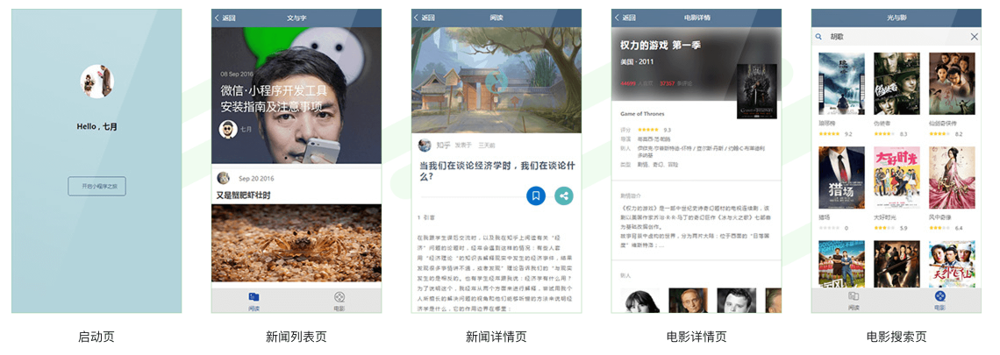
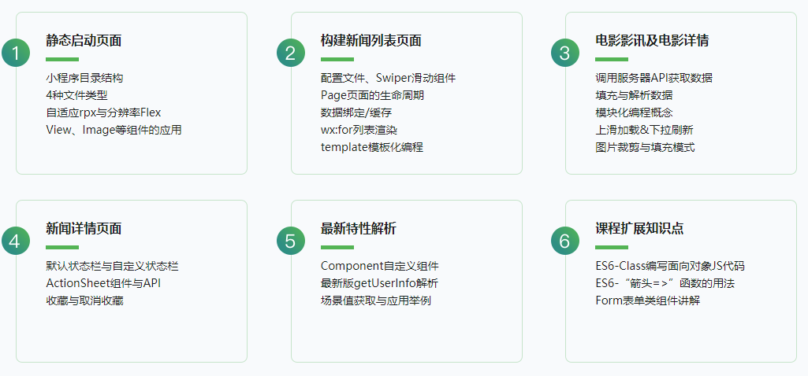

# README

> 微信小程序入门与实战——从0到1进行细致讲解 涵盖小程序开发核心技能

## ★引子

慕课网有个1元购的活动 -> 不过，这学习有效期只有45天 -> 不过，这课程是2016年末录制的……

## ★资料

**➹：**[实战课程_慕课网](https://coding.imooc.com/class/424.html?mc_marking=4655172e1a62839eea65105dbf244230&mc_channel=sjkctjpc)

**➹：**[小楼昨夜又秋风 - 知乎](https://zhuanlan.zhihu.com/oldtimes)

## ★目录

- [草稿](./draft.md)
- **第1章 什么是微信小程序？**
  * 1-1 序：十几个小时的课程就这节最重要 (05:47)
  * 1-2 升级重录说明（重要） (08:06)
  * 1-3 开篇及课程特色介绍 (17:16)
  * 1-4 直观感受一下微信小程序 (13:47)
  * 1-5 小程序适合做什么样的应用 (11:40)
  * 1-6 对开发者的影响 (04:34)
  * 1-7 学习基础 (02:32)
  * 1-8 新版开发工具UI说明 (01:50)
  * 1-9 新版小程序务必勾选“不校验TLS、HTTPS” (02:07)
- **第2章 小程序环境搭建与开发工具介绍**
  * 2-1 小程序进阶——新课程指南
  * 2-2 申请appid
  * 2-3 下载并安装微信开发者工具
  * 2-4 微信开发工具UI简介与小程序调试方法
- **第3章 从一个简单的“欢迎“页面开始小程序之旅**
  * 3-1 本章内容简介
  * 3-2 官方种子项目与小程序页面
  * 3-3 应用程序级别文件
  * 3-4 小程序的页面层级结构
  * 3-5 新建welcome欢迎页面
  * 3-6 我的第一个页面
  * 3-7 认识小程序的rpx
  * 3-8 使用flex（弹性盒子）快速布局
  * 3-9 制作项目启动页之小程序app.json基础配置
  * 3-10 章节扩展（可选观看1）移动端分辨率精讲
  * 3-11 章节扩展（可选观看2）小程序的自适应单位RPX精讲

## ★课程介绍

随着小程序生态的逐渐形成，小程序越来越多的出现在万千百姓的生活中，日活用户量高达两亿。门槛低、更易学、对个人开发者更加包容开放的特点也吸引了越来越多的人加入到“小程序程序员”的行列，尤其是解决“**跨系统开发**”这个难题之后，小程序也更多的吸引到了国内外更多的开发者。在本课程中，讲师带你**从0开始构建一个功能齐整的小程序，跟进当前潮流技术点，先人一步实现小程序开发组件化**。

## ★为什么更多的人在学习微信小程序？

> 不管你想不想做，小程序都已是市场刚性需求！

### <mark>1）带来更多就业机会，发展空间广阔</mark>

> 小程序开发已成为新兴职位，甚至很多专门的“小程序员”诞生 -> 小程序应用覆盖游戏、信息流应用、电商、O2O等各种行业

### <mark>2）突破限制 塑造全新开发生态</mark>

> 荣获第五届世界互联网大会“世界互联网领先科技成果”，对小程序开发者来说，更是一支有力的强心针 -> 打破了过去受限的开发环境，构建出一个新的开发环境和开发者生态，为“跨系统开发”给出解决方案

### <mark>3） 小程序方便好用</mark>

> 不像传统App那样需要高成本和大内存，甚至有望取代App -> 不用安装 用完就走，不占手机内存，节省时间流量

## ★这门课的特点

### <mark>1）上手就是实战</mark>

> 开始就以项目为出发点，不会讲一大堆枯燥的语法再补充两个案例了事，将带你快速熟悉小程序基础知识，然后直接进入实战开发环节，将小程序的知识点贯穿在整个项目中

### <mark>2）经典编程思想</mark>

> 课程不仅仅讲解小程序开发，更会通过实际的编码来传递一些编程的经典思想，例如，组件式开发、重构、复用等，让你学会举一反三

### <mark>3）快速学会新技术</mark>

> 新技术缺少材料、案例、教程，但为什么有的开发者就能第一时间快速上手，还能做出不错的项目呢？通过这门课程的学习，你也可以掌握这种能力

### <mark>4）课程一直紧跟微信官方进行维护</mark>

> 讲师像维护产品一样维护课程，保证课程的项目顺利运行，无论您什么时候打开这门课程，都可以完整有序的学习小程序的项目实战

### <mark>5）不怕你对前端不熟悉</mark>

> 开发小程序不需要学习AngularJS、Vue或React等复杂的前端框架及类库，学习曲线相当的平滑 -> 通过小程序入门前端，再反向学习其它前端框架 -> 对于0基础开发者或想进军前端的开发者是一条非常好的捷径

## ★实战做的是什么？

> 从0开始 构建一个集阅读和电影资讯为一体的小程序

## ★项目里边的每个页面都有啥知识点？

> 项目的每个页面都是干货，让你学到小程序的核心技术

## ★适合人群

> 有一定JavaScript和CSS基础，不需要你精通JavaScript和CSS -> 了解JavaScript和CSS的基本语法即可

## ★技术储备要求

> JavaScript和CSS基础，有兴趣开发小程序的都可以学习

