# 浏览器渲染HTML页面的过程

## ★资源

➹：[【果冻公开课】CSS教程第四课：浏览器渲染HTML页面的过程（上）_哔哩哔哩 (゜-゜)つロ 干杯~-bilibili](https://www.bilibili.com/video/av37944774)

➹：[【果冻公开课】CSS教程第五课：浏览器渲染HTML页面的过程（下）_哔哩哔哩 (゜-゜)つロ 干杯~-bilibili](https://www.bilibili.com/video/av71436681/?spm_id_from=333.788.videocard.5)

## ★浏览器渲染HTML页面的过程

上网浏览网页对普通人来讲是非常简单的操作

而对于程序员来说，这件事的背后发生了什么事情呢？

输入的网址在通过DNS解析后得到服务器地址

浏览器向服务器发起http请求，经过TCP/IP三次握手确认链接后，服务器将需要的代码发回给浏览器。

浏览器接收到代码后进行解析，经过三大步骤：

DOM构造、节点布局以及绘制页面，最终展现为人人都能看懂的网页。

### <mark>1）第一步，DOM构造</mark>

浏览器首先将收到的html代码，**通过html解析器解析构建为一颗DOM树。**

数据结构中有许多的树

（此处植入洗髓换骨营的广告，详情可以去**腾讯课堂**去看修真院的**洗髓换骨营**）

而DOM树就像是一颗倒长着的大树，这样的对象模型决定了节点之间都有一定的关联

它们关系可能有父子、有兄弟，我们可以顺着这颗树做出许多操作。

接着将接收到的css代码，**通过css解析器构建出样式表规则**

将这些规则分别放到对应的DOM树节点上，得到一颗带有样式属性的DOM树。

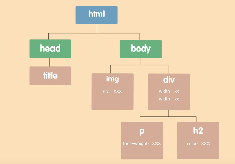

### <mark>2）第二步，布局</mark>

**浏览器按从上到下，从左到右的顺序，读取DOM树的文档节点**，顺序存放到一条虚拟的传送带上。

传送带上的盒子就是节点，而这条流动的传送带就是文档流。

如果我们读取到的节点是属于另一个节点下的子节点，那么在放入传送带的时候，就应该按顺序放到该节点盒子的内部。

如果子节点下还有子节点，在传送带上的时候就继续套到子一级的盒子内部。

根据它在DOM树上的结构，**可以嵌套的层级没有限制**的哦。

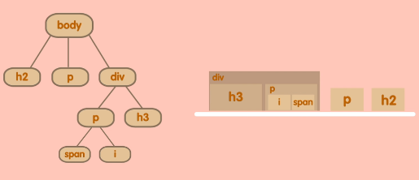

> normal flow是针对于盒子模型来说，而Text flow则是针对文字段落来说的。

**文档流排完之后，开始获取计算节点的坐标和大小等CSS属性，作为盒子的包装说明。** 

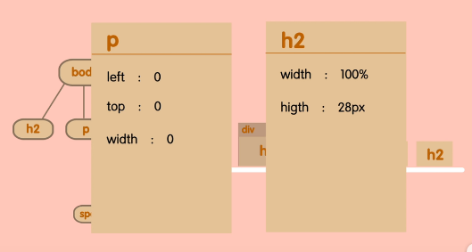

然后把盒子在仓库里一一摆放，这就将节点布局到了页面。

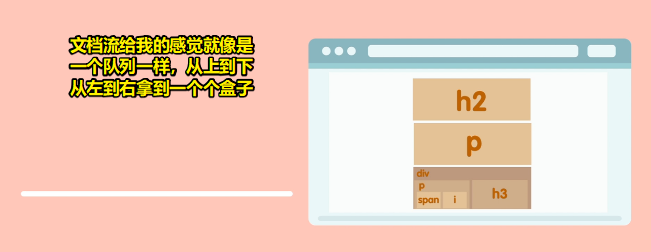

### <mark>3）第三步，绘制页面</mark>

**布局完成之后**，我们在页面上其实是看不到任何内容的

浏览器只是计算出了每一个节点对象应该被放到页面的哪个位置上，但**并没有可视化**。

因此**最后一步就是将所有内容绘制出来，完成整个页面的渲染。**

### <mark>4）举个栗子</mark>

道理都讲过了，不如……举个栗子

浏览器获得一些代码：

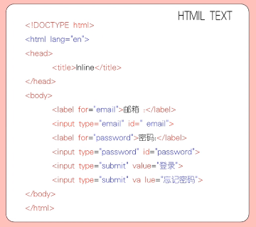

它们最终会渲染成这样。

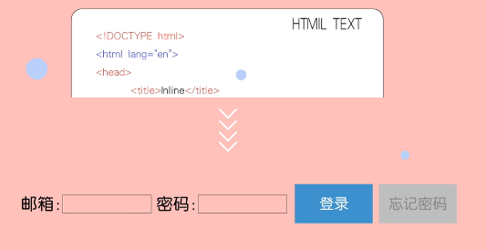

第一步是将代码解析为一颗DOM树

按从上到下，从左到右的顺序，将树上的节点压入文档流然后布局

我们看看**从body节点开始**

然后是body节点下的**input节点**，**label节点**，一个接一个的被压入文档流

布局的时候因为是行内元素无法占满一行，会在同一行里挨个排列

如果调整页面宽度让它变窄，行内元素会因为一行放不下而换行

最后将它们渲染就完成了这个页面

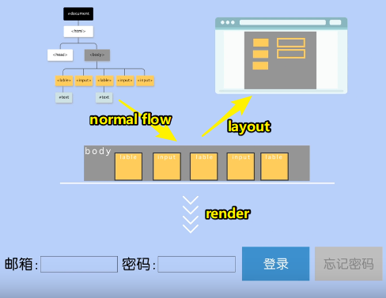

### <mark>5）再举一个栗子 </mark>

一个登录页面，页面中登录表单的元素很多，那么可以打个包，把需要提交的表单元素放到一个黑盒中

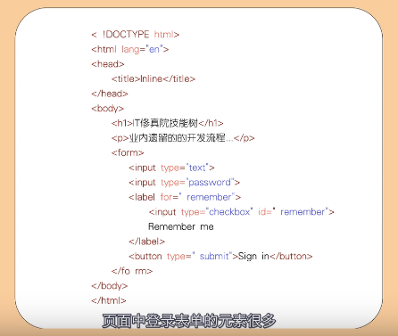

这个黑盒可以是form或者是div或者是其他元素，这里我们选择form。

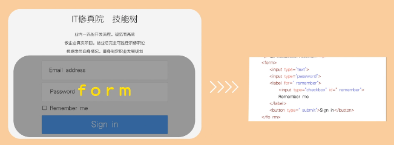

在文档流中从h1到p到form挨个压入，布局的时候因为它们都是块级元素每个盒子都会独占一行

因此**从上到下依次放入到页面中，form作为一个大黑盒不需要去管它的内部有什么只要做好自己就行。**

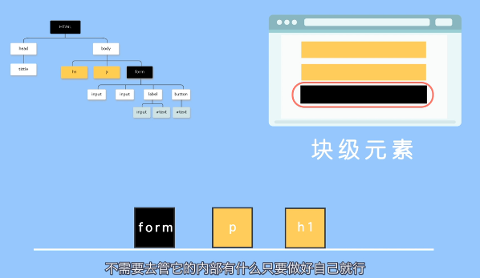

> layout时，我们可以先大后小，即先完成整体的大布局，然后再处理小布局

再看向form的子级元素：

它们在文档流中从input，到label，到button，挨个放入form黑盒内部，映射到布局页面上以form作为舞台进行排列。

如果这些子元素有行内元素，将排列在一行直到碰到form的边界才会换行

如果这些子元素有块级元素，它会独占一行宽度与form同宽。

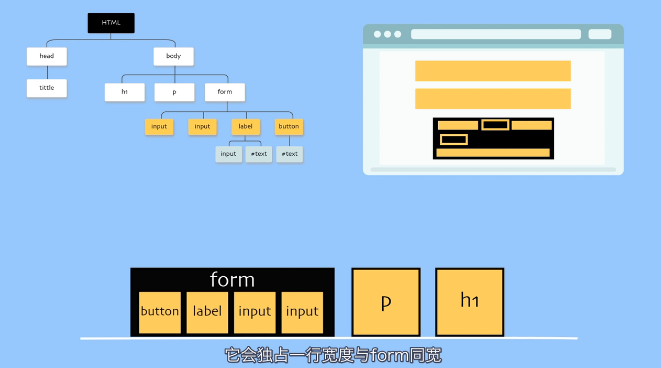

### <mark>6）再来个复杂点的栗子</mark>

吃了这两个栗子后，我们再来看一个完整的页面

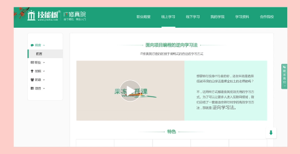

它的代码多了一些

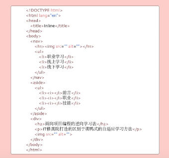

DOM树也更复杂

body下的子元素有三个nav，aside和div

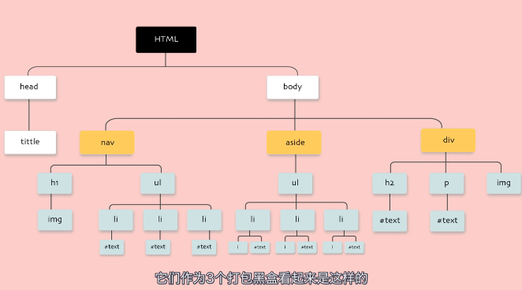

它们作为3个打包黑盒看起来是这样的 

然后将它们的子元素分别放到各自的黑盒当中

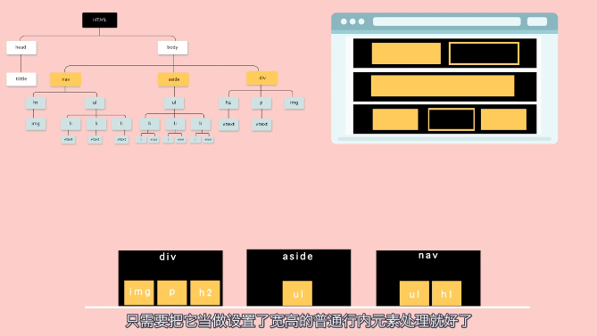

如果遇到图片只需要把它当做设置了宽高的普通行内元素处理就好了

当然你也可以设置它的属性为块级元素，改变图文混排时布局的效果。 

> inline元素 -> 设定宽高、margin-top和margin-bottom无效
> 
> ➹：[css - 是不是inline元素就不能设置宽高margin，padding？ - SegmentFault 思否](https://segmentfault.com/q/1010000000694623)

### <mark>7）总结 </mark>

由此我们可以知道文档流与网页之间的关系，其实就是将一维节点映射到二维空间的关系。

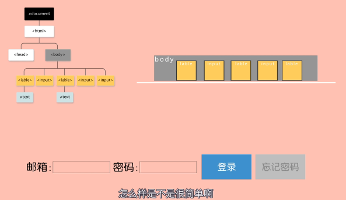

### <mark>8）Q&A</mark>

> 什么是http请求？

一种网络传输信息的协议

> 怎么在浏览器中显示html协议？

浏览器能直接显示html的内容，但不显示协议

> 如何在浏览器渲染前，修改dom？

把js代码放在body标签之前

> html代码都加载了，浏览器却没有立即渲染显示怎么肥四呀？

被css代码阻塞了

> 什么是样式表规则？

只有按照这个规则，浏览器的引擎才能读懂的样式代码

> dom树的作用是什么？

便于API去操作

> 什么是DNS解析？

查询网址对应的IP地址

> 所以目前的页面都是一块一块的？

emmmm。。。。也可以这么理解

> 有些网页在手机上打开和电脑上打开是不一样的页面，是这些块又重新排布吗？

按不一样的样式计算渲染的。已经渲染好的页面改变dom样式倒是可能导致重排

> tcp三次握手是啥意思？

相互确认双方的发信和收信能力都没有问题后，才开始正式发送信息

> DOM构造是什么意思？

是一种访问和操作 HTML 文档的标准

> CSS解析器是干嘛用的？

解析样式的

> TCP是什么东西，有什么作用？

是一种协议，用于传输虚拟字节流的

> 浏览器向服务器发起http请求怎么理解？http请求是什么东西？

浏览器：喂，服务器，这是我的http申请表，请求看一下某宝网站

> DNS是什么东西，有什么作用？

把网址转换为确定无疑的IP地址

> 一个页面可以有多个body吗

小果冻只能说：喂喂您不按套路出牌呀！不按标准写的话。。。可以写，有的老浏览器会崩，有的浏览器则当没事儿人一样输出。但是这样真的不好哟

> 浏览器渲染页面这句话怎么理解？

让字节流可视化

> 标签本身是块级元素还是行内元素？

很抱歉滴告诉您一个坏消息，都有。。。比如：div是块级，a是行内

> 每个浏览器的渲染效果相同吗？

很抱歉滴告诉您一个坏消息：完全不同

> 不同大小显示屏显示效果一样吗？

这个。。。真的没办法一样，如果老板要一样的话。。。嘘，前端er又在摔键盘了

> 行内元素和块状元素有什么区别？

挤着坐和独占一排的区别

> 什么是行内元素？

常见行内元素有：

字体大小要加粗，

组合图像输入框，

锚准斜体的菜单，

强调换行上下标

> 这里面黑盒的定义是什么啊？

看不到里面运行规则，只管输入输出的功能块

> div和form有什么区别？

它们有各自的语义，一个义是容器，一个是表单

> DOM树上的文档节点能重复吗？如果重复了浏览器自上而下读取的顺序是后面覆盖前面的吗？

这里不是很理解耶，多个一样的节点，比如多个p，那就顺序渲染咯

> 浏览器渲染页面这一操作，仅靠前端就可以完成吗？

不考虑数据的话，是这样的哟

> DOM是什么单词的简称，英文是什么意思？

Document Object Model(文档对象模型)，文档的结构化表述

> DOM树有什么作用？

让我想一想。。。应该会方便动态脚本操作网页

> 元素之间我看有包含有互斥,具体怎么在代码中体现他们的关系呢?

互。。。互斥？这个果冻也不是很明白呢。css里倒是有一些属性互斥

> 浏览器发送请求到服务器这里说是http请求,我去百度了,http请求和http协议有什么关系吗?

浏览器君按照http协议规定的格式写了份文书，派小h拿着文书去服务器请求了一座矿山资源。什么？你说不按协议规定去取？人家根本就不带搭理你滴

> 网页设计的标准规范有哪些

设计的规范不同公司会有不同标准。通常来讲都会考虑到色彩、尺寸、栅格、字体、控件这些方面啦 ^_^

> 这个其实不难，自己试一试就好理解很多。

是的，复杂的问题简单化，知识分享小动画

> 有道理，样式就是包装，没毛病

言简意赅，不讲虚的！吼吼

> 渲染过程中遇到JS文件怎么处理？

> async和defer的作用是什么？有什么区别?

> 渲染页面时常见哪些不良现象？

> .什么是阻塞渲染？

> URL从输入到页面展示的过程就是浏览器渲染页面的过程吗?

> 如何减少回流、重绘？

> 浏览器渲染页面的原理是什么？

