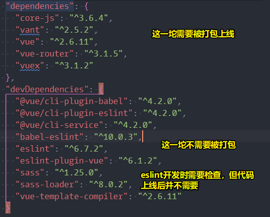

# 02-首页布局及 Vant

## ★Vant

1）Vant使用

- [Vant - 轻量、可靠的移动端 Vue 组件库](https://youzan.github.io/vant/#/zh-CN/home)
- `yarn add vant` or `npm i vant -S`
- 导入所有组件
- 按需导入组件（推荐）`npm i babel-plugin-import -D`

2）需求

1. NavBar -> 不会因为滚动条往下走而看不见，而是一直杵在哪儿的
2. 轮播图 -> touch触摸滚动
3. 热门商品 -> 电商网站里边常有的模块 -> 滚一下滑动三个商品
4. 推荐商品 -> 类似「猜你喜欢」，像淘宝、京东这样的大型网站，都会经过大数据来分析你的操作习惯和行为，从而推送一些你感兴趣，对你有用的信息

3）为啥用组件库？

很多公司都会有个叫组件组的组，顾名思义，这是造轮子的，它们会把造好的轮子供给其它开发组使用，以此来加快开发效率，毕竟有些东西不需要重头开始写的哈！而市面上存在一些人家开源的组件库，以供广大开发者使用，我们站在巨人的肩膀上，即使用他们开源的组件库，来增加自己的开发效率，从而让自己更多关注与业务需求上！

4）为啥用Vant这个组件库？

市面上有很多UI组件库，为啥要用它的呢？

因为Vant它是：

- 基于Vue的
- 基于移动端的
- 对移动端电商网站支持得很好，如有优惠卷、地址、购物车卡片、省市区、产品导航等这样的组件
- 测试覆盖率90%以上，可见代码质量是过关的！

5）推荐几个其它的组件库？

> 学会使用一个组件库之后，那么学其它组件库，那就是 so easy了

1、推荐的UI组件库？

- vux：[VUX - Vue 移动端 UI 组件库](https://vux.li/)
- element：[Element - 网站快速成型工具](https://element.eleme.cn/#/zh-CN)，基于 Vue 2.0 的**桌面端**组件库
- iView：[iView - 一套高质量的UI组件库](http://v1.iviewui.com/)，那我们做的这个农机商城来说，界面是给买家用的，而卖家呢？显然需要一个管理系统，即用于管理店铺、商品信息上传、介绍什么的，总之，一个完整的项目，肯定会有个管理系统的，当然，界面UI要求没有那么高。总之，其生态好
- iview-admin：[iview/iview-admin: Vue 2.0 admin management system template based on iView](https://github.com/iview/iview-admin)，老师之前做项目的时候有用过，而且特别好用
- Muse：[Muse-UI](https://muse-ui.org/#/zh-CN)，好看，简洁

每个技术生态，都会有相应的组件库，如React 也有基于React 的组件库

总之，不管怎样，只要你会一个，那么其它的都很容易上手！

2、什么叫i18n？

什么叫国际化？如果我们的项目不仅要支持中文，还得支持英文等，那么我们的页面顶部就会有一个切换语言的菜单，而vue就有个叫i18n的国际化插件——[介绍 - Vue I18n](https://kazupon.github.io/vue-i18n/zh/introduction.html) 来做这件事！

6）接触一项新的技术，该如何去学呢？如学习对Vant的使用

> 问题如何分析，以及如何解决

1、

2、项目分为开发环境和生产环境？

在webpack里边，是有开发模式和生产模式之说的，而根据不同的模式，webpack会有不同的打包规则！

本地写项目，即为开发环境

项目打包上线，需要把无用的代码去掉，如注释等，这样我们上线的项目才比较小！而这为生产环境

dependencies：生产环境、开发环境都会用到的包

devDependencies：只在开发环境使用的包

## ★首页布局

- 页头 NavBar
- 页脚 TabBar
- 录播图 Swipe 懒加载 V-lazy
- 热门商品 vue-awesome-swiper
- 推荐商品