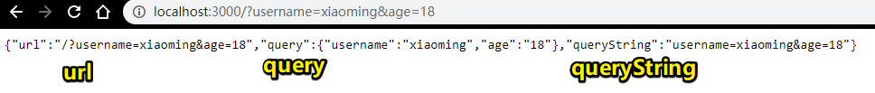
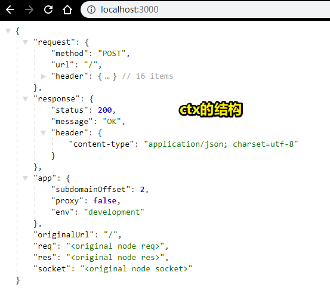
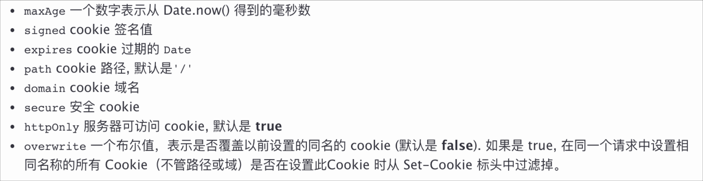
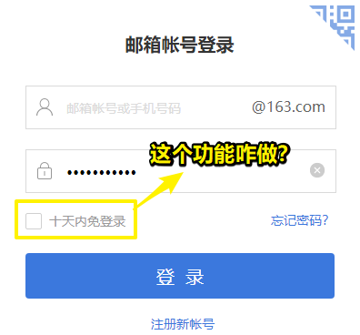
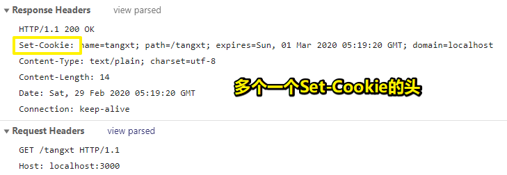

# 04-Koa2

> 真实项目 -> 数据 -> 后端 -> 查询数据库 -> 数据返回给后端 -> 后端响应回前端。所以这用的可不是 mock 数据，因此这节课就来讲讲后端的知识！

## ★Koa 安装

- 安装 node：<https://nodejs.org/zh-cn/>
- <https://koa.bootcss.com/>
- Koa 依赖 node v7.6.0 或 ES2015 及更高版本和 async 方法支持
- `npm init -y`
- `npm i koa --save`
- Hello World

### <mark>1）课程安排</mark>

这节讲koa2 -> 下节MongoDB -> 下下节，把学到的koa2+MongoDB知识完整地应用在我们的项目里边

### <mark>2）Koa</mark>

> Koa -- 基于 Node.js 平台的下一代 web 开发框架

#### 1、Koa概述

nodejs这个平台 -> 可以让JS 运行在服务端 -> 可看作是同级别的 -> Node.js 环境下的JS、Python、Php，毕竟它们都可以作为一个网站的后端去开发哈！

Koa 是一个新的 web 框架，由 Express 幕后的原班人马打造，
致力于成为 web 应用和 API 开发领域中的一个更小、更富有表现力、更健壮的基石。

通过利用 async 函数，Koa 帮你丢弃回调函数，并有力地增强错误处理。
Koa 并没有捆绑任何中间件，而是提供了一套优雅的方法，帮助您快速而愉快地编写服务端应用程序。

#### 2、为啥选择Koa2？而不是express？

koa同express都是同一个公司开发的，而现在的koa有两个版本，即1和2，显然用最新的2哈！

#### 3、基于koa的，有两个企业级框架？

- 阿里：[egg - Born to build better enterprise frameworks and apps](https://eggjs.org/)
- 360：[ThinkJS - 使用 ES6/7 特性开发 Node.js 项目，支持 TypeScript](https://thinkjs.org/)

如果掌握好koa的基础知识，那么以上那两个框架，学起来是很简单的!

#### 4、安装koa？

koa是基于node，所以需要安装node，node的安装路径，用默认的或者自定义的无中文路径！

node版本支持：7.6.0及以上，不然，你就升级吧！

koa是脱离我们这个前端项目的，所以我们需要新建一个目录，然后 `yarn init -y` 一下

``` bash
cd am-shop
mkdir src/koa2
cd src/koa2
yarn init -y
yarn add koa
```

安装好后，就写个Hello World！（当你使用一个新东西的时候，你都得写个Hello World！）

require方法，是Node.js 旗下加载模块的方法

而这种模块规范是CommonJS 规范

模块化开发，有很多规范，如：

- requirejs -> amd规范
- seajs -> cmd规范
- es6规范
- node -> CommonJS 规范

node服务需要通过命令行来执行，可不是在浏览器执行js文件


## ★async await

- Js 异步操作解决方案
- async 函数返回 Promise 对象
- await 只能在 async 函数内部使用

### <mark>1）异步解决方案</mark>

- ES6：promise、generator
- ES7：async、await

在koa1里边，generator用得比较多，而koa2则是async和await了

- async函数返回的是promise对象
- 要获取promise的值，用then方法
- 一般来说，async和await是配合起来使用的
- async和await的作用 -> await等待异步任务结束，才会走接下来的同步代码


## ★get/post 请求接收

- get & post 区别
- query & querystring 区别
  - query：返回的是格式化好的参数对象
  - querystring：返回的是请求字符串
- get 接收参数
- post 接收参数

- koa-bodyparser
- `npm i koa-bodyparser --save`

### <mark>1）如何用koa实现一个get和post请求？</mark>

#### 1、get发请求，koa如何接收请求以及如何拿到参数？

``` js
app.use(ctx => {
  let url = ctx.url;
  let query = ctx.query; // 对象
  let queryString = ctx.querystring; // 字符串

  ctx.body = {
    url,
    query,
    queryString
  };
});
```



> 注意key值是唯一的，如果参数这样的 `xxx=15&xxx=16`，那么后边的xxx 16就会覆盖掉前边的xxx 15
> 
> ctx是个形参，koa会传个参数过来作为实参，里边有很多信息，如请求的是方法？请求头是怎样的？等等，总之它是上下文，
> 
> `localhost:3000?username=xiao` -> 浏览器自动补`/` -> `localhost:3000/?username=xiao`

#### 2、那post呢？

> 稍微麻烦点

1. 创建一个html页面，里边有个form表单
2. action -> 服务器地址；method -> 咩有s，即不是methods，不然，发的是get请求，那么输入的表单数据都在url那里了
3. 后端接收前端发送的post请求，如表单，都是通过name属性接收的！
4. 不管是get还是post请求，必须要有 `ctx.body`，不然会报404错误
5. 必须要解码，不然，传过来的数据有中文的话，是有问题的
6. login.html （`http://127.0.0.1:5500/src/koa2/login.html`）-> 发送请求 -> 返回页面的url `http://localhost:3000/`（与action对应）
7. 拿到的是 `username=123456&password=dada` 这样格式的数据，但这样的数据并不是我们想要的哈！我们需要一个中间件来处理这样的数据！

#### 3、koa-bodyparser？

格式化`username=123456&password=dada`这样的字符串，希望拿到对象格式的数据？

安装：

``` bash
yarn add koa-bodyparser
```

有了这个中间件，针对于post请求来说，可以让我们少写很多代码，如不需要监听了，不需要解码了等等

``` js
// 没有koa-bodyparser，koa拿到的表单数据
'username=123456&password=daada'

// 有koa-bodyparser后。拿到的表单数据
{"username":"123456","password":"daada"}
```

> 本质是洋葱模型

#### 4、我想查看ctx的值？

控制台打印了ctx的值，但是这并不好阅读，于是我把对象值直接通过 `ctx.body`返回给前端，这样得到的对象值就是JSON格式的数据，然后再用JSON工具插件格式化就好了

``` js
app.use(async ctx => {
  console.log(ctx)
  let data = ctx.request.body;
  ctx.body = ctx;
});
```



➹：[koa2中的ctx是什么？ - Rogn - 博客园](https://www.cnblogs.com/lfri/p/11936231.html)

➹：[Koa 框架教程 - 阮一峰的网络日志](http://www.ruanyifeng.com/blog/2017/08/koa.html)

## ★koa-router

- `npm i koa-router --save`
- 配置路由
- 路由前缀 prefix
- 传参

### <mark>1）后端路由</mark>

同前端路由一样，都是对url进行处理

安装：

``` bash
yarn add koa-router
```

> 这些包，在项目上线后还是要用的哈！突然有个问题，那就是后端代码需要打包吗？

➹：[为什么不把后端也交给 webpack？ - V2EX](https://www.v2ex.com/t/476935)

➹：[jaredpalmer/backpack: 🎒 Backpack is a minimalistic build system for Node.js projects.](https://github.com/jaredpalmer/backpack)


关于讲课：

- 有些代码命名，只是为了演示这个东西的用法而已，不要纠结，如使用koa-router，随便定义一个叫`/abc`的路由，而这样的路由显然在真实项目里边是没有的，但为了演示这个包的用法，就简单随意定义个路由演示一下就好了
- 很多时候只会讲应用层面的东西，而不是底层的东西，如vue原理、koa原理什么的

测试代码里边的细节：

- `app.use(router.routes())` -> `router.routes()`表示可以配很多个路由

- `app.use(router.allowedMethods())` -> `router.allowedMethods()`表示如果路由用的是get方法的话，如`router.get('/test',callback)`，那么请求`/test`这个路径时，用了post方法，是会不被允许的，即会报错

- 后端定义的路由是 `router.get`，那么前端发送请求的方法也得是get方法才行！

### <mark>2）路由模块没有规划好——增加前缀</mark>

> `/login` -> `/user/login` -> 我们需要二级路由

``` js
const router = new Router({
  prefix: "/tangxt"
});
```

``` js
// 之前你得这样访问
'http://localhost:3000/abc'

// 现在得这样，不然就是一个「Not Found」
'http://localhost:3000/tangxt/abc'
```

在公司的实际项目里边，这个操作其实用得挺多了，毕竟会有一天，我们项目的地址栏会变得更复杂，所以就得要多级导航了

### <mark>3）如何在router下边传参？</mark>

> 之前我们的get和post传参是没有用到router了，直接就是use一个中间件就好了

> 再次强调：koa基础的会用了，也搞明白了，那么高级的应用也就很简单了，同样，koa的用法搞清楚了，像什么eggjs、thinkjs也就很容易了

同样的做法哈！

``` js
router.get("/abc", (ctx, next) => {
  ctx.body = ctx.query;
});
```

## ★cookie



### <mark>1）什么叫cookie？</mark>

本意是小曲奇，举个栗子来说：

xxx要上技术论坛……，如csdn什么的，当你登录时，会提示你，xxx天之内不用登录了



这个功能的做法，简单来说，就是把用户名和密码存到cookie里边去，当然这也不是简单的存储，也许是用了sectionid来搞！不然，用户名和密码就被人盗用了

#### 1、如何设置cookie？或许说在哪儿设置cookie？

在后端设置cookie，做法如下：

``` js
app.use(async ctx => {
  if (ctx.url === "/tangxt") {
    ctx.cookies.set("name", "tangxt", {
      domain: "localhost",
      path: "/tangxt",
      maxAge: 24 * 60 * 60 * 1000,
      expires: new Date("2020-02-29"),
      httpOnly: false,
      overwrite: false
    });
    ctx.body = "cookie success";
  } else {
    ctx.body = "no cookie";
  }
});
```

发送请求：<http://localhost:3000/tangxt>

响应头：



再次发送同样的请求，你会发现请求头多了一个叫 `Cookie`的头：


而且set-cookie又会被重新设置，即cookie的元信息会重新更新！

#### 2、本地如何查看设置的cookie？


#### 3、后端如何获取Cookie？

在后端用get去获取，前端发请求会根据path自动带相应的Cookie过来，这样有了cookie之后，就不需要让用户再次输入用户名和密码来登录了！

毕竟，没Cookie前这样的请求 <http://localhost:3000/tangxt>，是咩有带敏感数据的，如用户的登录信息

当用户第一次登录之后，后台就会设置一个Cookie响应回给前端，下次用户再发这样的请求 <http://localhost:3000/tangxt> 时，就直接进入用户界面了！而不是重新再次登录，毕竟这次是带有Cookie的请求

## ★模板 ejs

- `npm i koa-views --save`
- `npm i ejs --save`

### <mark>1）什么是ejs？或者说是什么叫做模板？</mark>

ejs在项目中用得还是挺多的！

写一下代码你就知道啥是ejs了

做法如下：

1. 创建 `views`目录，注意这个目录可不是随便起的，如果你用过eggjs和thinkjs，你就会知道这个目录是干嘛的了，即用来存放界面的！ -> 即所谓的MVC
2. new `views/index.ejs` -> 模板 -> 还有其它模板，不过express和koa用的最多的模板还是ejs模板
3. 插入模板的数据，是经过一堆业务的逻辑，然后从数据库里边读取的，不过，为了方便测试，直接把数据写死了
4. 返回了index.html
5. 公司常用ejs，即便不用也要了解一下！

### <mark>2）什么是MVC？</mark>

很多框架的结构都是MVC结构，如php的thinkphp

MVC -> Model、View、Controller -> 模型、视图、控制器

Model -> 一般跟数据打交道比较多 -> 如Koa需要跟数据库连接，那么更数据连接的部分，我们就放在M层

View -> 用户能看到的界面部分

Controller -> 连接MV的纽带或桥梁，如前端发请求 -> 后端需解析参数或者业务逻辑处理，那么就可以在这个C层去处理 -> 业务逻辑处理好之后，需要插入数据库，那么就得调用Model层操作数据库的部分了 -> 操作数据库成功或失败，就得把结果返回给前端界面

前后端分离架构：

前端界面相当于View层 -> ajax通信 -> 后端项目相当于是C层和M层

总之，MVC是一种代码组织模式

同样的，Vue是MVVM模式 -> VM替代了C层

不管学Java、php、Node.js 什么的，MVC这种模式一定是需要去了解的！

总之，用到了MVC架构，项目就会有个views目录

### <mark>3）没有用async、await？</mark>

如果有业务逻辑，即需要操作数据库，那么数据库的处理也是需要时间的，那么此时我们就可用await了，即我们要等操作数据库这个异步任务完成后，才让接下来的代码继续走

更多koa用法，请看官网（没有很多内容），毕竟koa的源文件是很小的！

下次课 -> 非关系型数据库 -> nosql -> 没有sql语句的数据库 -> MongoDB -> 有了前后端数据库，就可以做一个完整的项目了

## ★demo

➹：[koa hello world · ppambler/am-shop@eea8f72](https://github.com/ppambler/am-shop/commit/eea8f72ca0ceced7552050890e5c32a0cbce032c)

➹：[koa 如何处理get、post请求 · ppambler/am-shop@45956c3](https://github.com/ppambler/am-shop/commit/45956c3cebc9f3f62dab01107e74cda306a171aa)

➹：[router使用、前缀、接受参数 · ppambler/am-shop@63af9e3](https://github.com/ppambler/am-shop/commit/63af9e3e9d0a16cd63c51cea964122e51fda23dc)

➹：[cookie & ejs 使用 · ppambler/am-shop@1ecf0e8](https://github.com/ppambler/am-shop/commit/1ecf0e830e5b9dfa5f0857d7d605ecafdb33854a)

## ★扩展阅读

- [你真的懂前后端分离吗？ - 云+社区 - 腾讯云](https://cloud.tencent.com/developer/article/1160815)
- [如何部署前端代码](https://www.shymean.com/article/%E5%A6%82%E4%BD%95%E9%83%A8%E7%BD%B2%E5%89%8D%E7%AB%AF%E4%BB%A3%E7%A0%81)