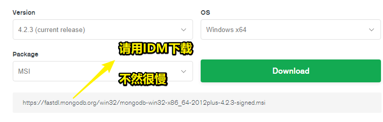
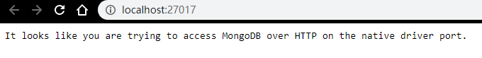
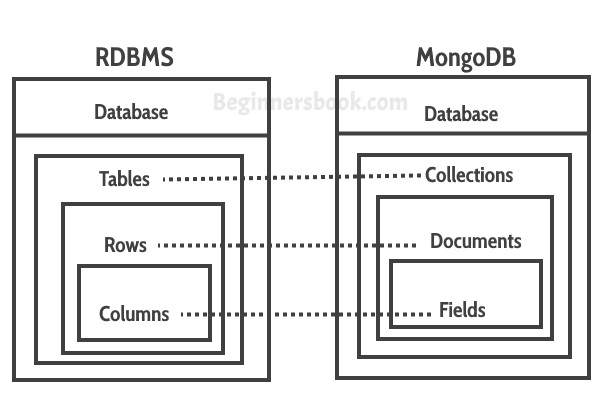
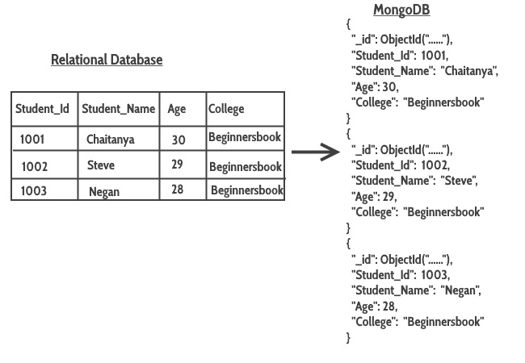
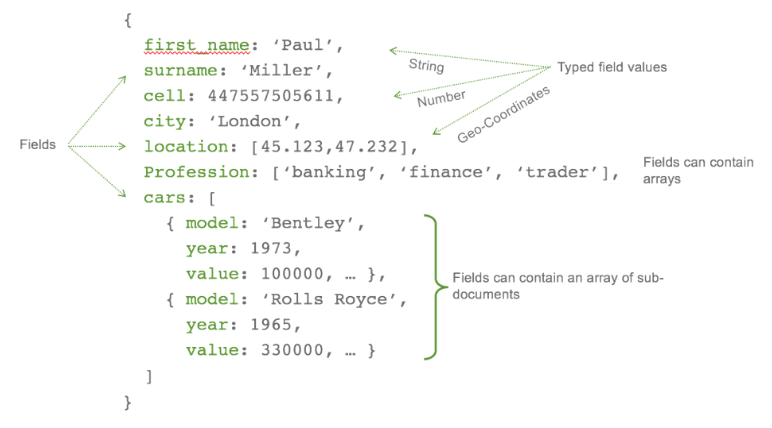
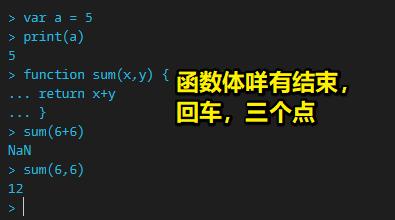

# 05-MongoDB

## ★MongoDB 安装

- <http://www.mongodb.com/>
- 环境变量 bin
- 命令 mongod
- 新建：`C://data/db`

### <mark>1）前置知识</mark>

了解一个网站、app、微信小程序等，是由前端+后端+数据库组成的！

### <mark>2）什么叫关系型数据库？</mark>

类似于 excel 表格 -> 有行有列 -> 一行即是一条数据，一列即是一个字段

我们通过 SQL 语句来 CRUD 数据库

### <mark>3）非关系型数据库——MongoDB</mark>

#### 1、是什么？

基于分布式的文件存储的数据库，是一个数据库，但它相当于是一个文件存储

简单来说，它是 nosql，即没有 sql 语句的数据库

总之，使用它，就不需要我们去学习 sql 语句了

引入官网的话：

> MongoDB（来自于英文单词“Humongous”，中文含义为“庞大”）是可以应用于各种规模的企业、各个行业以及各类应用程序的开源数据库。

### <mark>4）适用场景</mark>

- MongoDB：基于文件、存储空间比较大
- 如果很多表之间需要级联、关联查询这样，是不适合用 MongoDB 的，而是使用关系型数据库
- 如果是频繁的读写操作，MongoDB 相对来说，性能会更高一些
- MongoDB 不支持事务操作，所以频繁读写，没有多关联，那就用 MongoDB

### <mark>5）啥叫事务？</mark>

事务具有原子性，即要么全做，要么全不做，如果中间失败的话，那么就会回滚回去

### <mark>6）如何安装 MongoDB？</mark>

#### 1、安装

[下载](https://www.mongodb.com/download-center/community)：



安装：

1. 双击运行下载下来的文件
2. 不用自定义目录，当然，你也可以自定义目录（路径千万不要用中文），除非你是高级用户
3. 然后一直下一步，下一步就好了
4. 注意，"Install MongoDB Compass" 不要勾选，否则可能要很长时间（好几个小时）都一直在执行安装。MongoDB Compass，它是一个图形界面管理工具，所以你可以自行下载一个图形界面管理工具，如 [Robo 3T - Free, open-source MongoDB GUI (formerly Robomongo)](https://robomongo.org/)

#### 2、配置环境变量

> win10：直接在本地搜索「环境变量」就好了

系统属性 -> 高级 -> 环境变量 -> 系统变量 -> Path -> 编辑 -> 新建：


确定 -> …… -> 退出系统属性

#### 3、创建数据库文件的存放位置

如果你的项目是在 G 盘的，那么你就在该目录下创建 `G:\data\db`，然后定位到项目，打开终端，输入指令 `mongod`，回车，如这样：


出现以下信息，即说明数据库是安装成功的：


数据库是个服务，默认运行在 27017 这个端口上边去！

另一种检测方式：



## ★MongoDB里的那些概念

### <mark>1）关系型数据库 vs MongoDB</mark>



> Fields (key and value pairs) are stored in document, documents are stored in collection and collections are stored in database.
> 
> 键值对 -> `{}` -> `{键值对}` -> Collection -> database
> 
> 字段（多个字段，列） -> 对象（多条数据，行） -> 数组（多张表） -> 数据库（多个数据库） -> MongoDB（非关系型数据库，一个像是系统之类的东西）

### <mark>2）Rows (一行数据、一条数据) vs Documents (一个文件、一条记录)</mark>


### <mark>3）Table vs Collection</mark>



- columns <=> key-value pairs（JSON format）
- rows  <=> documents
- MongoDB自动为每个document插入一个字段：unique `_id`(12-byte field) field -> 这是每个文档的主键「primary key」
- MongoDB很酷的地方：支持 dynamic schema -> one document of a collection can have 4 fields while the other document has only 3 fields -> 而这一点，在关系型数据库中是不可能的 -> 我的理解是假如在一个集合中，有两个对象，如A和B，A有5个字段，而B可以有1个、2个、3个等等，而关系型数据库则是让用户事先自定义好一张表到底有多少个字段，然后每行数据都有那么几个字段，不会出现「第一行比第二行多了3个字段」这样的这种情况

➹：[Mapping Relational Databases to MongoDB](https://beginnersbook.com/2017/09/mapping-relational-databases-to-mongodb/)

> 这是让我感到惊为天人的教程

### <mark>4）关于字段的详细描述</mark>



➹：[Getting Started with Python and MongoDB — SitePoint](https://www.sitepoint.com/getting-started-with-python-and-mongodb/)


## ★常用命令 1

- mongo
- 变量 var
- 函数 function
- 输出 print
- 显示数据库 show dbs
- 进入/创建 数据库 use shop
- 显示集合 show collections
- 显示当前数据库 db

### <mark>1）如何使用 MongoDB？（part1）</mark>

正常的数据库都会有 CRUD，同理，MongoDB 也是如此，而这节课，也主要是讲如何在 MongoDB 里边 CRUD……之后的课程里边会讲到如何用代码把前端、后端的 koa、MongoDB 整合起来

#### 1、`mongo`：进入 MongoDB shell


> 注意，一定要先启动MongoDB服务，不然你进入的shell是咩有 `>`的，就如上图所示

#### 2、var、print、function



在关系型数据库里边，数据库如excel表格一样，有行有列，每一张表都是数据库的表，而在MongoDB里边，不叫数据库的表，而是集合。

关系型数据库：每一行数据，就是数据行

MongoDB：每一行数据，相当于是一个文件，而其里边的数据格式非常像json格式，当然，这不是json，而是bson

#### 3、show dbs

展示所有数据库，目前有：

``` js
> show dbs
admin   0.000GB
config  0.000GB
local   0.000GB
```

#### 4、use xxx

``` js
> use tangxt
switched to db tangxt
```

> show dbs，可以看到没有tangxt这个数据库，如果有，那么就直接进入，如果没有，那就会创建tangxt这个数据库，然后进入

再次`show dbs`一下：

``` js
> show dbs
admin   0.000GB
config  0.000GB
local   0.000GB
```

没看到刚才新创建的数据库，那么为啥会没看见呢？——因为现在tangxt这个数据库，还是空的哈！只要不是空的，就能看见了！

#### 5、db

查看当前杵在哪个数据库，类似pwd（当前在哪个目录下）

``` js
> db  
tangxt
```

查看tangxt这个数据库里边有哪些表，关系型数据库叫表，而非关系型，则是叫集合，所以正确地说法是「tangxt这个数据库里边有哪些集合」

#### 6、show collections

collection -> 相当于是关系型数据库里边的tables

``` js
> show collections
> 
```

啥也没打印，那么为啥会这样呢？——因为tangxt这个数据库是空的呀！

所以，我们得往里边插入数据哈！

## ★常用命令 2

- 插入 `db.user.insert({"name":"weichuang"})`
- 查询 `db.user.find()`
- 查询 `db.user.findOne()`
- 修改 `db.user.update({查询},{修改})`
- 删除 `db.user.remove(条件)`
- 删除集合 `db.user.drop()`
- 删除数据库 `db.dropDatabase()`

- 加载 js 文件 `load('./xx.js')`

### <mark>1）如何使用MongoDB？（part2）</mark>

#### 1、`db.user.insert({"name":"weichuang"})`

- db -> 固定语法
- user -> 集合名字，相当于是表名

> 不需要创建user表即可直接插入数据，总之，同 `use tangxt`一样，咩有就自动创建之

``` js
> db.user.insert({"name":"xiaoming"})
WriteResult({ "nInserted" : 1 })
```

> 插入一条数据：`{}` -> 插入多条数据：`[{},{},…,{}]`

查看我们是否插入数据成功，所以我们需要查询user这个表，嗯，应该说是这个集合

#### 2、`db.user.find()`

``` js
> db.user.find()
{ "_id" : ObjectId("5e5a7f9308e0f4e3a1ed778b"), "name" : "xiaoming" }
```

> `_id`是MongoDB自动生成的唯一的一个值，可不是我们自己写入生成的！ -> 可以认为是关系型数据库的主键 -> 唯一的值

再插入一条数据，并且查询：

``` js
> db.user.insert({"name":"xiaohong"})
WriteResult({ "nInserted" : 1 })
> db.user.find()
{ "_id" : ObjectId("5e5a7f9308e0f4e3a1ed778b"), "name" : "xiaoming" }
{ "_id" : ObjectId("5e5a80d608e0f4e3a1ed778c"), "name" : "xiaohong" }
```

此时查询得到了2条数据，可见，`db.user.find()`是查询user这张表所有的数据！

#### 3、`db.user.findOne()`

``` js
> db.user.findOne()
{ "_id" : ObjectId("5e5a7f9308e0f4e3a1ed778b"), "name" : "xiaoming" } 
```

返回user这张表的第一条数据！

话说，我不想要第一条数据了，即「xiaoming」这条数据

#### 4、`db.user.remove(条件)`

- 需要跟查询条件，如name叫「xiaoming」的数据

``` js
> db.user.remove({"name":"xiaoming"})
WriteResult({ "nRemoved" : 1 })
> db.user.find()
{ "_id" : ObjectId("5e5a80d608e0f4e3a1ed778c"), "name" : "xiaohong" } 
```

话说，user这张表里边的数据，我都不想要了，即我想清空这张表里边的数据

#### 5、`db.user.drop()`

``` js
> db.user.drop()
true
> db.user.find()
> 
```

`db.user.find()` -> 啥也没输出，所以这张user表目前是空空如也哈！

话说，我想删除数据库跑路


#### 6、`db.dropDatabase()`

- db一下，定位目前是在哪个数据库

``` js
> use test
switched to db test
> db
test
> db.dropDatabase()
{ "ok" : 1 }
```

### <mark>2）加载js文件？</mark>

啥意思？——就是我们之前在MongoDB shell里边写的代码，可以写在js文件里，然后再通过MongoDB shell来load js文件了，注意，假如你在mongodb目录打开的shell，那么你就基于这个目录找js文件

做法如下：

``` js
// mongodb/1.js
var userName = "xiaoming";
var time = Date.parse(new Date());
var data = {
  username: userName,
  registerTime: time
};
// 连接tangxt这个数据库
var db = connect("tangxt");
db.user.insert(data);
print("insert success");
```

效果：

``` js
> db
tangxt
> load('./1.js')
connecting to: mongodb://127.0.0.1:27017/tangxt
Implicit session: session { "id" : UUID("……") }
MongoDB server version: 4.2.3
insert success
true
> db.user.find()
{ "_id" : ObjectId("5e5b65b4d082afd9b3c459e9"), "username" : "xiaoming", "registerTime" : 1583048116000 }
> 
```

## ★数据更新 update

- 数据更新
- `$set`
- `$unset`
- `upsert`
- `multi`
- `$push`
- `$addToSet`
- `$each`
- `$set`
- `findAndModify`

### <mark>1）为啥要单独拎出来讲更新？</mark>

插入、删除 -> 是很简单的 -> 即insert和remove

而更新、查询、「当数据很大的时候，如何检索则」是这节课的重点内容

### <mark>2）如何更新tangxt这个数据库？</mark>

#### 1、先让数据库有点数据？

1. 清空tangxt数据库里的user集合的数据，`db.user.drop()`
2. 检查是否已经清空了：`db.user.find()`
3. js -> 造3条数据
4. 插入数据，一个数据就写一个对象，一对数据就写一个数组
5. MongoDB是NOSQL的，CRUD操作，就是用js的语法来搞！并没有用到所谓的SQL语法！

#### 2、更新数据库？

update(条件,改成啥样的数据) -> 改写一个字段的数据，会把其它字段都给覆盖掉，即原先假如有5个字段的，现在你只改一个，结果数据只剩下一个你改的那个字段了 -> 我们想要的就是还是5个字段，只是某个字段的数据被改掉了

解决方案：

方案一：

目前tangxt数据库，有这样一条数据：

``` js
var user1 = {
    name: "xxx",
    age: 26,
    hobby: ['敲代码', '篮球', '喝茶'],
    pc: {
        brand: 'apple',
        price: 10000
    }
};
```

我们要修改这条数据，得这样来：

``` js
db.user.update({name:'xxx'},{
  name: 'xxx',
  age: 18,
  hobby: ['白piao'],
  pc: {
    brand: 'apple',
    price: 9999
  }
})
```

虽然可以实现我们的需求，但是这并不好呀！因为我咋知道user1它有哪些字段和值呢？况且，假如有100个字段，岂不是GG呢？

所以，对于这样的更新需求，我们该咋办呢？

这个时候，修饰符出马了！

#### 3、$set

方案二：

修改指定的值：

``` js
db.user.update({name:'xxx'},{
  $set: {
    age: 21
  }
})
```

> 很多人把MongoDB看作是k-v数据库
> 
> k-v的v，在shell里边操作，假如v是字符串，那么单双引号都是可以的，而k可加引号，可不加，反正就跟写js一样

假如，xxx工作忒忙了，所以他现在咩有爱好了，因此我们要删掉爱好，所以，这该咋办呢？

删掉数据，其实也可以说是更新数据

#### 4、$unset

``` js
db.user.update({name:'xxx'},{
  $unset: {
    'hobby': ''
  }
})
```

结果，hobby这个字段从user1里边消失了，即由原先的4个字段，变为3个字段了！

总之，`$unset`的作用是删除一个key值，以及对于的value值

#### 5、upsert？

长得有点奇怪，像是update和insert的结合体

它的作用：如果当前找不到这个字段值，那就插入新的字段值，否则，就更新字段所对应的值

我想要update数据，那update谁的数据呢？——update那个叫「xxx」的数据，如xxx工作繁忙，经常熬夜加班，导致看起来像是50岁的样子，所以更新它的age为了50

``` js
db.user.update({name:'xxx'},{$set:{age:50}},{upsert:true})
```

由于xxx它存在age这个字段，所以会直接更新age的值，反之，如果没有age这个字段，那就会插入age这个值

所以，`upsert = field ? update : insert`

#### 6、multi？

user1没有hobby，而user2和user3有爱好

> 不写查询条件，即直接 `{}`，表示查询所有数据
> 
> 不加true，即为false，那么这只对第一条数据加，而不是所有

作用：用来统一所有用户都有某个字段，如所有的男性用户，都有性别为男这样的k-v，如所有的程序员，都有敲代码这一hobby

``` js
// 如果这样做，所有user的hobby都为`['敲代码']`
db.user.update({},{$set:{hobby:['敲代码']}},{multi:true})

// 如果这样做，所有user的hobby字段都为空数组`[]`,如果是空字符串，则会让hobby字段消失
db.user.update({},{$set:{hobby:[]}},{multi:true})
```

#### 7、$push？

作用：可以给一个字段为数组这样的数据，增加一个数据，如hobby是数组，其中有一个元素为 `'敲代码'`，那么我们push一个 `'吃鸡'`，就会变成这样 `hobby:['敲代码','吃鸡']`

``` js
db.user.update({name:'xxx'},{$push:{hobby:'吃鸡'}})
```

#### 8、$addToSet？

作用：同 `$push`，只是它会检查数组是否存在相同的元素，如果要add的元素，已经在数组里边存在了，那么就不会追加进去，而 `$push`则不管三七二十一直接把数据push进数组里边去了

可看做这样：`isExistElement ? noModified : push`

``` js
db.user.update({name:'xxx'},{$addToSet:{hobby:'睡觉'}})
```

> 类似数组去重！

#### 9、$each？

作用：把一堆的东西，然后一个个地插入到为数组的字段里边去

``` js
var newHobby = ['吃鸡','叫人起床','学习']
db.user.update({name:'xxx'},{$addToSet:{hobby:{$each:newHobby}}})
```

#### 10、$set？

作用：修改某个字段的值

代码敲多了，眼睛不行了，所以不敲代码了，改行健身

``` js
db.user.update({name:'xxx'},{
  $set: {
    'hobby.0':'健身'
  }
})
```

> 可以直接修改，数组字段里边的某个元素值

#### 11、findAndModify？

啥意思？——顾名思义，查找并且修改

话说，它的作用是啥？

它是应答式的，有返回结果，然后可以取到值 -> 在js文件进行

而之前的update是非应答式的 -> 只告知 `WriteResult()`结果，而这些数据无法用于我们编程 -> 在MongoDB shell进行

``` js
var modify = {
    findAndModify: 'user',
    query: {name: 'xxx'},
    update: {$set: {age: 29}},
    new: true
};

var result = db.runCommand(modify);
// 可不能用console.log()
printjson(result);
```

返回结果的结构：

``` js
{
  lastErrorObject:{
    n:1,
    updatedExisting: true
  },
  value: {
    // ……字段
  }
}
```

如果我们是 `new:true`，那么返回的value值，就是更新后的结果数据，否则就是更新前的旧数据

我们根据 `updatedExisting`这个值的true or false来做 `if……else……`编程，即如果更新成功就……，否在……

findAndModify 与 update的区别：

- findAndModify：应答式的，即数据是否更新成功，得告诉我一声
- update：非应答式的，即无法在代码里边知道数据是否更新成功，当然，你可以在MongoDB shell里边，肉眼观察是否更新成功

## ★数据查询 find

- `$lt`、`$gt`、`$lte`、`$gte`
- `$in`
- `$or` `$and` `$not`
- 数组 `$all` `$in` `$size`
- 分页 limit skip sort
- js forEach

有哪些用于测试的数据：

``` js
var user1 = {
    name: "xiecheng",
    age: 32,
    hobby: ['敲代码', '篮球', '喝茶'],
    pc: {
        brand: 'apple',
        price: 10000
    }
};

var user2 = {
    name: 'xiaowu',
    age: 25,
    hobby: ['敲代码', '聊天', '篮球'],
    pc: {
        brand: 'IBM',
        price: 8000
    }
};

var user3 = {
    name: 'laofeng',
    age: 20,
    hobby: ['敲代码']
};
```


### <mark>1）啥叫find？</mark>

find -> 查找之意

``` js
// 查找user下所有的document
db.user.find()

// 按条件查找
db.user.find({name:'xxx'})

//  <=> sql语句
// select * from user where name='xxx'
```

### <mark>2）年龄在`[20,30]`的数据，且只看name字段和age字段</mark>

``` js
db.user.find(
    {age: {$gte: 20, $lte: 30}},
    {name: true, age: true, _id: false}
)
```

> `gte`：大于等于；`lte`：小于等于

> 不写 `_id`的话，会自动显示 `_id`字段，即便你只说明要显示name和age字段；如果第二个参数不写，那么整个document都会被显示出来！

### <mark>3）查找年龄在某个范围的</mark>

``` js
db.user.find(
    {age: { $in: [20, 25]}},
    {name: true, age: true, _id: false}
)
```

### <mark>4）与、或、非</mark>

#### 1、or

``` js
db.user.find({
    $or: [
        {age: { $gte: 20}},
        {'pc.brand': 'IBM'}
    ]},
    {name: true, age: true, _id: false}
)
```

只要满足一个条件，即可拿到对应的document！

#### 2、and

``` js
db.user.find({
    $and: [
        {age: { $gte: 20}},
        {'pc.brand': 'IBM'}
    ]},
    {name: true, age: true, _id: false}
)
```

找到两个条件都满足的document！

#### 3、not

``` js
db.user.find({
    $not: [
        {age: { $gte: 20}},
        {'pc.brand': 'IBM'}
    ]},
    {name: true, age: true, _id: false}
)
```

找到不满足这两个条件的document！

### <mark>5）数组查询</mark>

#### 1、Array字段值是数组

``` js
db.user.find(
    {hobby: ['篮球']},
    {name: true, age: true, _id: false}
);
```

document的hobby字段必须是 `['篮球']`，才能匹配到，如果hobby字段值多个字段，那么是查不到，一定要值一模一样才能查询到

#### 2、Array字段值是字符串

``` js
db.user.find(
    {hobby: '篮球'},
    {name: true, age: true, _id: false}
);
```

只要document的hobby字段有一个元素是 `'篮球'`即可找到该document！

#### 3、你得满足所有喜好，才要你（`$all`）

``` js
db.user.find(
    {hobby: {$all: ['篮球', '敲代码']}},
    {name: true, age: true, _id: false}
);
```

document的hobby字段，有`'篮球'`、`'敲代码'`这两个元素，即可被匹配到！

#### 4、只要满足一个喜好，就要你（`$in`）

``` js
db.user.find(
    {hobby: {$in: ['篮球', '敲代码']}},
    {name: true, age: true, _id: false}
);
```

document的hobby字段，有`'篮球'`、`'敲代码'`任意一个元素，或者两个都有，即可被匹配到！

#### 5、根据数组的长度去查询？（`$size`）

``` js
db.user.find(
    {hobby: {$size: 3}},
    {name: true, age: true, _id: false}
);
```

document的hobby字段，要有3个元素，而且少一个多一个都不行 -> 即可被匹配到！

### <mark>6）分页</mark>

#### 1、啥叫分页？

有一大堆数据，我们想要在页面中显示它们，显然我们不能一次性把它们都显示完，所我们需要异步加载它们，如先来10条数据，用户点击下一页，再来10条数据，直到没有数据了 -> 查询的姿势是第一页1-10，第二页11-20……

#### 2、limit

``` js
db.user.find(
    {},
    {name: true, age: true, _id: false}
).limit(10).skip(20).sort({age: -1})
```

- limit：说明要显示几条数据
- skip：假如查询结果有多条数据，你要跳到第几条数据，如查到了3条数据，我要第一条数据，那就是0，如果第二条数据，那就是1，总之，它就是跳过几条数据的意思，如0值，就是跳过0个数据，想想走楼梯那样，一个阶梯就是一条数据，为1值，就向上走一步 -> 值为2，那就是跳过两条数据，查第三条数据！
- sort({age: -1})：`-1`是降序，而`+1`是升序，如三条数据的age字段是30 25 20，那么是-1值，查到数据的排序就是30 25 20这样的排序，反之是+1值，那就是20 25 30 这样的排序了

> SQL也有分页查询

每次分页的结果，都是一段段的把数据交给前端，而不是一次性完整的把数据交给前端

加深对skip的理解：

**skip** -> pagesize -> 第几页 -> 显示1-10条数据，0-9（第一页），**0** -> 显示11-20，10-19（第二页），**10** -> 20-29 （第三页），**20** -> 30-39（第四页），**30** -> …… -> **跳过0条数据，开始算10条数据；跳过10条数据，开始算10条数据；跳过20条数据，开始算10条数据……**


### <mark>7）js forEach</mark>

#### 1、forEach是啥？

这家伙在JS 里边也有，即用于循环遍历的！

在实际项目中用得很多，用法如下：

``` js
var db = connect('weichuang');
var userList = db.user.find();
userList.forEach(function(user){
    printjson(user);
});
```

结果，循环遍历打印每条数据 -> 一个document -> 一个对象

> 遍历 -> 看数据

查询完成之后，我们可以做一些业务逻辑处理，然后把数据再返回给前端

> 突然明白，后端给前端的id就是来自于 `_id`这个字段的啊！然后这个id值作为 `:key`的值，如果你用vue搞 `v-for`渲染列表的话！

总之，它的作用就是读取数据 -> 业务处理


## ★索引

- 生成随机数据
- `db.collection.ensureIndex({username:1})`：创建索引
- `db.collection.getIndexes()`：看看集合里边有哪些索引
- `db.collection.dropIndex({username:1})`：不需要的索引就删之

### <mark>1）啥叫索引？为啥需要建索引？</mark>

数据库里边不可能一张表就只有几条数据 -> 一个collection不可能就只有几个document

需求：随机生成100万条电话号码 -> 插入到数据库里边去 -> 查询某条电话号码 

请问，这查询时间为几何？

- 手机号码 -> 11位
- 号段 -> 有限 -> 前3位
- 后8位 -> 随机生成

``` js
function getTel() {
    var prefixArr = ['130', '131', '132', '133', '135', '186', '187', '188', '199', '155'];
    var tel = prefixArr[parseInt(Math.random() * 10)];
    for (var i = 0; i < 8; i++) {
        tel += Math.floor(Math.random() * 10);
    }
    return tel;
}
// console.log(getTel());
var startTime = (new Date()).getTime();
var db = connect('weichuang');
var tempInfo = [];
for (var i = 0; i < 1000000; i++) {
    tempInfo.push({
        logintime: new Date(),
        tel: getTel()
    });
}
db.tel.insert(tempInfo);
var runTime = new Date().getTime() - startTime;
print('run time is ' + runTime + 'ms');
```

如何生成手机号码随机数？

- 号段是随机的，假如是10个号段，`[130,131,132,133,134,135,136,137,138,139]`，那么久随机拿到一个数组下标
- 后8位数也是随机的
- 3位随机数+8位随机数 = 11位随机数

➹：[速度收藏！国内手机号段的最全整理！ - 知乎](https://zhuanlan.zhihu.com/p/40878967)

如何计算代码的执行时间？

> 77s左右

关于数据的插入？

- 不是每循环一次，就插入一次
- 而是循环完毕后，一次性插入，这样效率才会更高！ -> 类似前端DOM操作时的文档碎片

插入了100万条数据？如果我们 `db.tel.find()`会在MongoDB shell里边，显示所有的数据吗？

> 不会的，只会显示出前边的几十条数据而已

查询某个电话号码所需要的时间？

- 随机数说不定存在重复，随意你得注意了

**0.5s**，不过这是因为一个document的字段（3个字段，其中一个字段是MongoDB给的_id）太少的缘故

如果再增加多个字段，如再加10~20个字段，那么这种百万级的查询，得要好几秒！

总之，我们测试的数据 -> 模拟查询缓慢并不是那么好 -> 不能体现使用索引的优势

总之，我们假设**查询很慢**，所以我们要**建索引**！

### <mark>2）建索引？</mark>

- 什么是索引：书有目录，根据目录，我们很快就能找到**我们想要看的内容**所对应的**页数**！
- 建索引的目的：加快查询速度 -> 提高查询效率
- 注意点：索引它也是需要占据空间的

怎么建？

- 建索引是需要时间的，毕竟你有100万条数据，那么每条数据都得建个索引

``` js
var startTime = (new Date()).getTime();
var db = connect('weichuang');

var result = db.tel.find({tel: '13518322092'});
result.forEach(res=>printjson(res));

var runTime = new Date().getTime() - startTime;
print('run time is ' + runTime + 'ms');
```

> 建完索引后，只要**4ms**就能返回我们想要的结果了 -> 相比之前的**500ms左右**，相差**125倍** -> 而且每次查询同样的东西，会越来越快！

而这就是索引的作用了

什么情况下需要建索引？

- 当前某个字段需要频繁地查询，如电商网站的商品名称就需要频繁查询了，而商品价格相对来说就咩有那么频繁了
- 因此，我们要给产品名称创建个索引，这样当我们查询的时候，才会更快哈！不然，用户直接走人，并臭骂一句「**啥破网站，搜个东西都要那么久！**」

> 数据量大，才能体会到索引的好处！

注意：

- 索引不要随意创建，建索引是有要求的，如果你就只有**100条数据**，那就咩有必要创建了，毕竟索引也是要占据硬盘空间的！
- 即便是**1000条数据**也不需要，毕竟建了索引和没建，查询时间基本没啥差异！更何况，索引还会增加硬盘的消耗哈！
- 如果每次查询的数据量，如性别，男和女，有100万条数据，其中男女比例各占50%，那么每次查询男的或女的，所返回的结果，占据数据库存量的一半了，而这时候也不建议建索引，简单来说，就是**大多数数据都满足我们查询条件的时候，就不要建索引了。**

小结：

- 索引它是好的，但只要在适当情况下去用它，才是真正的好！

### <mark>3）`db.collection.getIndexes()`</mark>

作用：获取索引

``` js
db.tel.getIndexes()
```

结果，有两个索引，结构是这样的：

``` js
[
  {
    "v":2,
    "key": {
      "_id":1
    },
    "name": "_id_",
    "ns": "weichuang.tel"
  },
  {
    "v":2,
    "key": {
      "tel":1
    },
    "name": "tel_1",
    "ns": "weichuang.tel"
  }
]
```


默认情况下，`_id`是被MongoDB自动建立了索引，而`tel`是我们开发者主动建的索引

话说，如果我们不想要tel有索引，那这该咋办呢？

### <mark>4）`db.collection.dropIndex({username:1})`</mark>

作用：删除索引

``` js
db.tel.dropIndex({tel:1})
```

- 注意，这个参数来自于，`getIndexes()`所返回的那个结果中的那个key字段（是个对象）旗下的 `'tel':1` -> 毕竟key是唯一的

## ★总结

- 以上都是MongoDB这个数据库里边最常用的知识
- 记住以上常用的这些命令
- 下节课，继续完成我们的项目 -> 打通前端、后端、数据库
- 老师讲的内容基本同这个教程一样：[MongoDB Tutorial for Beginners](https://beginnersbook.com/2017/09/mongodb-tutorial/)


