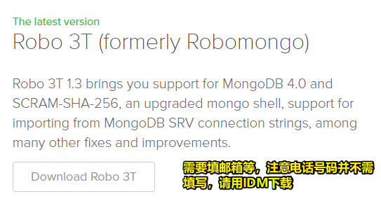
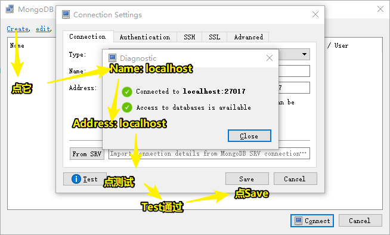
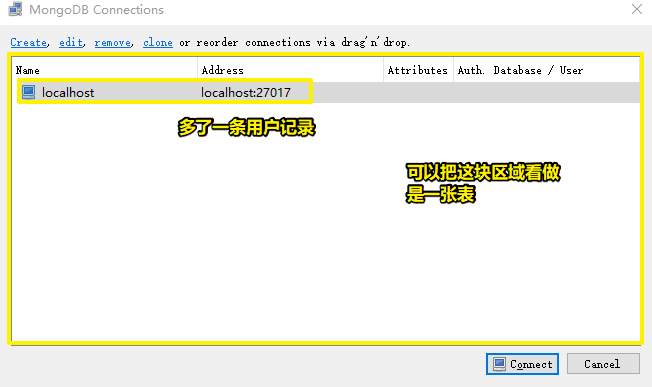
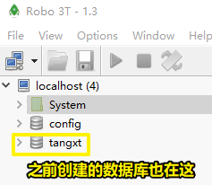
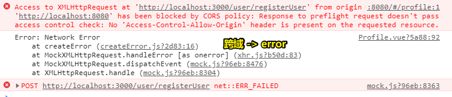
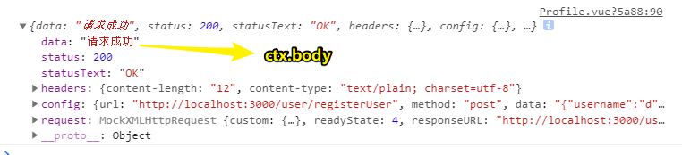
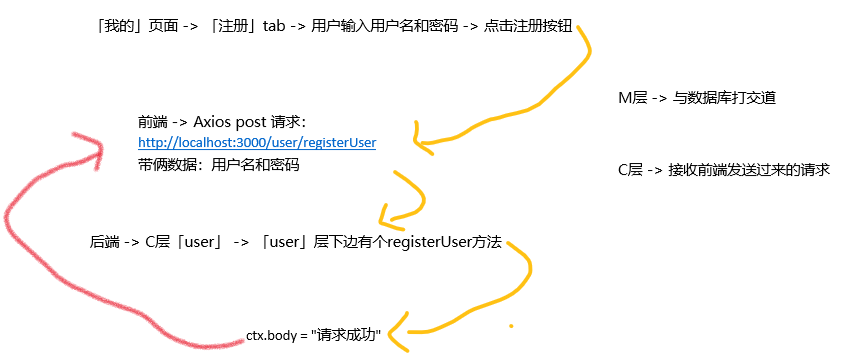
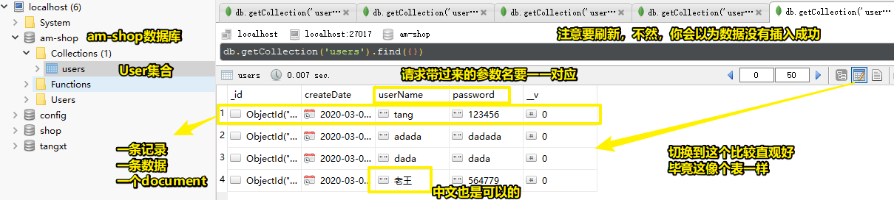

# 06-用户注册

> 这次课的内容比较复杂，因为我们要打通前端、后端、数据库这三部分

## ★注册页面编写

- van-tabs
- van-cell-group
- van-field

> 完成注册功能，先从界面写起

### <mark>1）登录 & 注册</mark>

vant -> Tab、Tabs -> 点击登录就切换到登录界面，同理，注册也是如此

由于我们都需要输入用户名和密码，所以我们需要搞个表单组件

### <mark>2）表单</mark>

van-cell-group：

- CellGroup
- Field

细节：

- v-model：提交表单数据，数据到在vm的data里边
- required：必填项，label左侧多了红色`*`
- clearable：输入东西后，会在输入框的右侧多了个 `x` 按钮
- 密码可不是明文的
- 加个button：用于登录或注册

### <mark>3）注册功能</mark>

流程：

用户输入用户名好密码 -> 点击注册按钮 -> 获取用户填的数据 -> 由前端把这两个值发送到后端 -> 后端接收数据 -> 校验、加密 -> 存入到数据库

发送ajax请求：

- 点击 -> `@click` -> registerHandler
- axios -> 提交数据到后端，然后插入数据 -> 所以用post方法，而不是get方法 -> url选择 -> 创建一个真实的后端项目来处理 -> 配置统一接口

至此，前端部分就已经完成了，接下来，来搞后端部分！

## ★后端项目——koa2

- 新建项目 shop_server
- npm init
- npm install koa --save
- node index.js

### <mark>1）如何写后端代码？</mark>

前言：

我们是前后端分离的，即前端是一个项目，后端也是一个项目

前后端通信传值等操作，都是通过axios来完成的！

开搞：

1. 创建一个叫 `shop_server`的项目
2. `cd shop_server`
3. `yarn init -y`
4. `yarn add koa`
5. `touch index.js`
6. am-shop是前端项目，shop_server是后端项目 -> 前后端分离

> 为啥 `const app = new Koa()`要叫app呢？——按照我的猜测，这就是后端应用之意！

## ★MongoDB

- 安装MongoDB
- 数据库管理工具Robo 3T：<https://robomongo.org/>

### <mark>1）环境启动</mark>

1. `mongod`
2. `mongo`

### <mark>2）图形化界面</mark>

之前，我们学习MongoDB的时候，都是在控制台里边操作的，其实MongoDB它有对应的数据库管理工具，即有图形化界面的，类似于我们用vue-cli创建项目时选择用图形化界面创建一样……

### <mark>3）安装Robo 3T</mark>

下载：



安装：

可自定义安装到非C盘

### <mark>4）使用Robo 3T</mark>

创建用户：



结果：



选中localhost，然后点击「Connect」:



通过这个图形界面，我们可以直观的查到有哪些数据库，有哪些集合，有哪些document，有哪些Field


至此，前端项目、后端项目、数据库都准备好了，那么接下来就是开发了……

## ★mongoose

- mongoose：Node和MongoDB数据通讯的数据建模库
- npm install mongoose --save
- 连接数据库 init.js
- schema 定义数据模型并引入
- npm install glob --save

- MVC：Model（模型）、View（视图）、Controller（控制器）

### <mark>1）什么是mongoose？</mark>

它其实是后端的一种技术，即「Node和MongoDB数据通讯的数据建模库」

说白了，它就是完成Node和MongoDB数据库的连接，起到纽带、桥梁作用！

### <mark>2）使用mongoose？</mark>

1. `yarn add mongoose`
2. index.js -> 对应的都是服务操作
3. 单独新建个init.js -> 表示初始化 -> 作用初始化我们的mongoose
4. init.js -> 引入mongoose -> 连接数据库 -> 数据库服务器是ip地址的 -> 不写端口号，默认就是那个**27017** -> `'mongodb://localhost/shop'` -> 如果没有shop这个数据库，会自动创建 -> 连接数据库，需要暴露出去
5. 数据库可能会连接成功，也可能会连接失败，所以mongoose提供了一些监听事件，如监听连接失败后，要做什么 -> 在一个完整的大型项目里边，可以搞一个计数器，当因为某种原因服务器宕掉了，连接3次都无法连接成功，那么这时就不要一直连了，而是给用户抛出提示「数据库连接失败哈，你得找人修一修、看一看」，有了这样提示，显然会更友好一些 -> 总之，你可以做个计数器来表示连接次数
6. 数据库连接发生错误了，所以我们需要监听 `error`
7. 监听连接成功时，应该提示一下说「连接成功了」

mongoose提供了一些API，让我们可以用JS语法来连接MongoDB数据库！

### <mark>3）如何把init.js引入到index.js里边去？</mark>

``` js
// 还有引入其它东西，所以就用了解构语法了
const { connect } = require('./init.js');
connect()
```
### <mark>4）schema 定义数据模型并引入</mark>

#### 1、什么叫定义数据模型？

这里边会讲到一个很重要的概念，那就是MVC啦！

MVC是一种模式

话说啥叫模式？

- 模式，在物体或事件上，产生的一种**规律变化**与**自我重复**的样式之过程
- 在模式之中，某些固定的元素不断以**可预测**的方式周期性重现
- 最基本而常见的模式，称为**密铺**，具备**重复性**以及**周期性**两大特征
- **找寻出固定模式**是人类基本的认知功能之一

话说啥叫认知？

> 认知是人脑接受外界信息，经过加工处理，转换成内在的心理活动，从而**获取知识**或**应用知识**的过程。它包括记忆、语言、视空间、执行、计算和理解判断等方面。

题外话：

> [认知障碍](https://baike.baidu.com/item/%E8%AE%A4%E7%9F%A5%E5%8A%9F%E8%83%BD%E9%9A%9C%E7%A2%8D/15769094)是指上述几项认知功能中的一项或多项受损，并影响个体的日常或社会能力，当上述认知域有2项或以上受累，并影响个体的日常或社会能力时，可诊断为痴呆。

所以说，MVC这所以被称之为模式，是因为它是**固定模式**，并具有**重复性**，即**很多后端项目的代码书写都是用MVC这个模式来搞的！**

> 为啥熟能生巧？——因为找规律是我们基本的认知能力之一哈！

MVC：

- M -> 模型层，大多与数据库打交道
- V -> 视图层，由于我们是前后端分离的，所以前端项目就相当于是View层
- C -> 表示M层与V层之间的纽带和桥梁 -> 作用，可接收前端发送过来的一些请求，然后根据这些请求进行一些业务逻辑上的处理，然后再连接数据库，操作数据库 -> 当数据库返回对应的操作失败或操作成功这样的结果时，就是返回到了C层 -> C层再把结果响应回给前端

所以，这个代码流通就是一种MVC模式哈！

因此，我们要把M层和C层写在后端！

目前，我们使用的是原生的koa，并没有使用基于koa的那些现成框架，如阿里的egg.js，360奇舞团的think.js

而在这些现成的框架里边，都给我们定义好了MVC每一层的文件夹了

由于我们用的是原生的koa，所以我们就得手动的去搞MVC了

### <mark>5）创建模型</mark>

1. shop_server -> model -> User.js -> 名字规范，User首字母大写，而且User这名字与我们数据库里边的集合名字是一样的，说白了，在关系型数据库里边，这叫User表哈！
2. user.js -> mongoose -> mongoose提供了Schema方法 -> 需要new的变量，请用首字母大写哈！
3. 创建User集合模型 -> 这是在搞Field的模板啊！ -> value有多个选项需要配置的话，请用 `{}`，如果就只有一个数据类型的话，那就用

``` js
// model/User.js
const mongoose = require('mongoose');
const Schema = mongoose.Schema;
const userSchema = new Schema({
    userId: Schema.Types.ObjectId,
    userName: { unique: true, type: String },
    password: String,
    createDate: { type: Date, default: Date.now() }
});
```

模型相当于是数据库里边的集合或者习惯叫法「表」，然后选项对象里边的key对应着每条数据里边的每个字段哈

简单来说，**选项对象参数就是一个document，我们要定义一个document有哪些字段，以及字段值的类型是怎样的，字段值是否是唯一的等等**

### <mark>6）发布模型</mark>

必须要发布模型，不然，后边是无法引入的

``` js
// User.js
// 发布模型
mongoose.model('User', userSchema);
```

### <mark>7）如何引入模型</mark>

模型也是mongoose的一部分

安装：

``` bash
yarn add glob
```

同连接MongoDB一样，需要初始化：

``` js
// init.js
// 引入所有的schema
const glob = require('glob');
const path = require('path');
exports.initSchemas = () => {
  // 把model旗下所有的js文件一个一个遍历地引入进来
  glob.sync(path.resolve(__dirname, './model', '*.js')).forEach(require);
};
```

``` js
// index.js
const { connect, initSchemas } = require('./init.js');
(async () => {
  await connect();
  initSchemas();
})();
```

> connect是个函数，它返回一个Promise对象，其中有个异步操作，即连接数据库是个异步操作，所以我们需要等待连接数据库成功后才去初始化一个个模型，因此我们需要用到async/await，然后自执行！
> 
> 总之，要连接数据库之后，再去初始化模型，不然数据库如果连接没成功，那么这初始化模型就没有意义了！
> 
> 异步操作自带不等结果，所以我们用async/await后，可以控制异步任务的执行流程，如可以用await这样的关键字等待异步任务返回的结果，然后再执行接下来的代码！

接下来，看看如何接收前端项目发送过来的请求


## ★注册功能

- 前端页面编写
- Axios发送请求
- koa路由：`npm i koa-router --save` 配置路由
- Post参数：`npm i koa-bodyparser --save`
- 加盐加密：`npm i bcrypt --save`
- 跨域：`npm i koa2-cors --save`

### <mark>1）路由？</mark>

前端路由 -> 单页面 -> url变 -> 组件切换

后端路由 -> 前端请求url -> 根据url找到相应的路由处理函数

安装路由：

``` bash
yarn add koa-router
```

### <mark>2）路由使用</mark>

1. 创建controller目录 -> 表示MVC的C层
2. 在controller旗下新建个user.js -> 表示用户的路由 -> **首字母小写**
3. `user/registerUser` -> 表示有个user控制器，然后user旗下有个registerUser方法 -> 我之前理解成了**二级路由**
4. 前端是用啥方法发送请求的，后端就用啥方法去接收请求，如前端post，那么后端路由也用post
5. 跨域 -> 前端项目和后端项目不是在同一个端口，即一个是8080，一个是3000 -> taobao的前端，能向京东的后台发送请求吗？——显然这是不能的！除非京东后台允许 -> 之所以会有跨域，是因为浏览器的同源策略
6. 后端发送过来的数据，被前端then里边callback所接收

> 关于中间件，你可以理解为：米（请求） -> 洗米（中间件） -> 电饭煲煮（中间件） -> 饭（响应），总之中间件就是个函数哈！

### <mark>3）跨域处理</mark>



解决跨域的方式有很多种

我们选用这一种：

``` bash
yarn add koa2-cors
```

在index.js里边配置：

- 指定哪些源头可以请求我们的后端，如只允许我们的前端项目
- credentials：设置证书

``` js
// index.js
// 解决跨域问题
const cors = require('koa2-cors');
app.use(cors({
    origin: ['http://localhost:8080'],
    credentials: true
}));
```

前端代码拿到后端的数据：



➹：[9种常见的前端跨域解决方案（详解） - 掘金](https://juejin.im/post/5d1ecb96f265da1b6d404433)

### <mark>4）前端打通后端的过程</mark>



### <mark>5）后端如何把数据存到数据库里边去？</mark>

#### 1、解析Post请求

由于发过来的数据，是post请求的，所以我们需要用到 `koa-bodyparser`这个包！

该包用来解析我们的post请求

安装：

``` bash
yarn add koa-bodyparser
```

do：

``` js
// index.js
// 接收前端post请求
const bodyParser = require('koa-bodyparser');
app.use(bodyParser());
```

> 注：`bodyParser`是个方法，需要调用一下再让app use一下！

#### 2、如何存数据？

我们知道，mongoose是MongoDB和Node之间的纽带和桥梁

- `const User = mongoose.model('User');`的`'User'`对应发布模型 `mongoose.model('User', userSchema);`的 `'User'` -> 项目复杂之后，model目录下会有很多个模型，所以你发布的模型名字得是唯一的哈！
- 模型的`userName: { unique: true, type: String }`要和请求过来的`userName`一一对应，我用的是username，但模型定义的是userName，所以我要修改我原先那个username参数
- 请求成功的状态码一般都是200；服务端错误一般返回5开头的码，如500；在前端里边，不管是返回200还是500，都是一次成功的请求，所以我们得在「成功预案」里边写个判断，用于响应用户是否注册成功！
- 在MongoDB里边，你定义的模型叫`User`，而在数据库里边生成的是 `users`，即多了一个s，而且首字母是小写！总之，你不管起什么的名字，都会加个s，而这就是MongoDB的默认操作！
- vant组件提示bug -> 如果你这样写`Toast.success("注册成功")`，那么就会报错，所以你得这样 `this.$toast.success("注册成功")`
- 注册成功后你得把输入框里边的用户名和密码给清空了
- 中文用户名注册也是ok，并没有在数据库里边出现乱码……
- 在每个公司里边，都会有个数据库管理员，即DBA，如果DBA都能很清楚的看到在数据库里边的用户名和密码的话，那么这样的数据库一定是不安全的！ -> 给密码进行特殊的处理



> 可摁`F5`刷新集合

#### 3、用户输入同样的用户名？

由于我们对userName字段搞了`unique: true`，所以userName的值是唯一的，即每条document里边的userName字段值不能出现重名的！

> 理解前后端数据库的交互，从一个简单注册功能开始，唯有这样，你才不怂其它复杂功能是咋样的

#### 4、密码加密？

如果项目很复杂，而且类似银行级的项目，按照我们上边的做法，是很容易被人破解的！

#### 5、登录功能？

登录 -> post请求 -> user控制器下loginUser方法处理，同理注册功能一样，只是，现在是查询数据库，而查到的数据是加密的，而用户则是没有加密 -> 涉及`bcrypt`这个包

登录成功后 -> 不管跳到哪个界面都会用个登录名 -> 这涉及到「session」的概念

面试题 -> session、Cookie、localStorage、sessionStorage区别？

sessionid存在Cookie里边

#### 6、小结

必须理解这次课所讲到的注册功能流程，其中如何取值，如何与数据库打交道，MVC是啥等等都得弄明白，当你去学习其它语言，如Java等做后台开发时，这些都是大同小异的！


## ★demo

- [使用mongoose连接MongoDB数据库 · ppambler/am-shop@3d86fdb](https://github.com/ppambler/am-shop/commit/3d86fdb844ecd649c57f098b67ab7416ef2420dc)
- [打通从前端到后端的请求 · ppambler/am-shop@5405eb5](https://github.com/ppambler/am-shop/commit/5405eb587ea1562f0e9dc1d09765879b5af3ce61)
- [往数据库里边存数据 · ppambler/am-shop@5ec977a](https://github.com/ppambler/am-shop/commit/5ec977afa21ee8d18a3561b7ec13a9e317e37377)

## ★更多阅读

- [Koa 框架教程 - 阮一峰的网络日志](http://www.ruanyifeng.com/blog/2017/08/koa.html)
- [ZijianHe/koa-router: Router middleware for koa.](https://github.com/ZijianHe/koa-router#module_koa-router--Router+routes)
- [koa - 廖雪峰的官方网站](https://www.liaoxuefeng.com/wiki/1022910821149312/1023025933764960)
- [编写可维护代码之“中间件模式” - 知乎](https://zhuanlan.zhihu.com/p/26063036)
- [xiaomi_mobile_pro: Koa2重构小米手机官网](https://gitee.com/jsjiajia_tishengban/xiaomi_mobile_pro)
- [全面理解 koa-router · Issue #38 · zhangxiang958/zhangxiang958.github.io](https://github.com/zhangxiang958/zhangxiang958.github.io/issues/38)
- [koa-router源码解读 - GitIssue](https://gitissue.com/issues/5a0aee8834af3d15f0ce9dc7)


