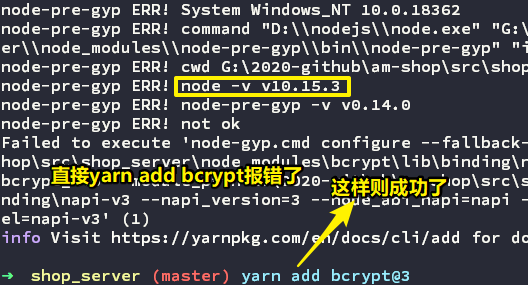
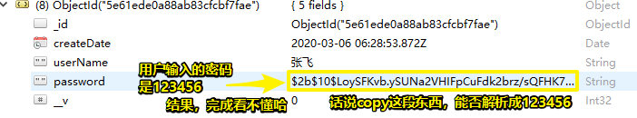

# 07-用户登录

> 多看多敲，自己才会发现问题

## ★登录页面编写

- van-tabs
- van-cell-group
- van-field

### <mark>1）密码加密</mark>

每家公司都会有个DBA，用于管理数据库，如提升数据库的查询速率等

DBA是可以看到数据库里边的数据的，所以，如果DBA看到了明文密码，那就GG了（用户名加不加密都是可以的）

有哪些加密的方式？

1. md5 -> 有32位和16位加密 -> 即可以把密码（长度[1,31]）转化成16位字符或32位字符
2. sha1
3. ……

加盐 -> 如有这样的密码 `123456` -> 加盐 -> 混淆密码成这样 `12adadad3dadada45dada6` -> 再把密码加密 -> 这样黑客破译起来就很困难了

所谓的加盐就是为密码加点料，所谓的加密就是对密码加密

密码 -> 加盐又加密 -> 会更安全

### <mark>2）跨平台的加密方式</mark>

> Java等后端语言都会有bcrypt

安装：

``` bash
yarn add bcrypt
```

bcrypt也是一个中间件

何时使用这个包？

每次保存数据之前，就得对数据加盐加密 -> 类似于vue里边的钩子函数 -> 加盐加密过后的密码 -> 保存到数据库里边去

> 粘合剂 -> mongoose是MongoDB和Node之间的粘合剂

do：

1. 在model旗下的User.js下，为啥要在这儿写呢？ -> 因为model是跟数据库打交道的哈！
2. 固定语法 -> 照抄即可 -> 如如何加盐的代码
3. 后端修改了代码一定要重启服务器
4. 包 -> 不同的版本 -> API使用、参数等可能会有所变化
5. this指向

我在测试的时候，安装bcrypt报错了

我看了一下[官网](https://www.npmjs.com/package/bcrypt)，看到这个「Version Compatibility」说到：

`10, 11 10,11` -> `>= 3`

于是猜测这样搞：



测试加盐效果：



至此，注册功能就完成了，接下来就来搞搞登录功能

- [bcrypt - 酷 壳 - CoolShell](https://coolshell.cn/tag/bcrypt)

## ★登录功能

- 前端页面编写
- Axios发送请求
- bcrypt.compare
- vuex

### <mark>1）登录功能怎么做？</mark>

同注册功能一样

点击登录 -> 执行xxx方法 -> xxx方法发送请求 -> 后端MVC C 层 -> loginUser方法 -> 解析并拿到用户请求过来的参数 -> 确定用户名是否存在（用户名是Unique的） -> 如果存在再去校验密码是否一致 

> 密码比较的方法在Model层User.js定义 -> 在Controller层的user.js的loginUser方法用new实例的方式调用！

### <mark>2）数据字典？</mark>

在公司级别的项目里边都会有个数据字典

那么啥是数据字典呢？

把各种各样的配置或者是一些常量写在一个数据字典里边，这样一来，以后想修改的话，就统一到一个文件里边修改就好了！

如200、201等，不是系统自己自动报的错误，而是我们自己规定的错误，即**自定义的**，如201表示用户名不存在，也可以规定101表示用户名不存在！

### <mark>3）关于登录功能，如何让用户输入的密码与加盐加密的密码进行比较？</mark>

在model/User.js里边定义方法，用于比较密码是否一致

### <mark>4）后端业务逻辑，前端业务逻辑</mark>

后端业务逻辑：

前端给的数据有url，其中有路径和参数，路径决定了用哪个控制器，以及用哪个处理方法，参数决定了如何去处理数据库里边的东西

然后再返回一个code，以及相应的数据

前端业务逻辑：

根据响应回来的结果，对页面进行DOM交互！


### <mark>5）再谈Promise</mark>

Promise是用于管理异步操作的，我们把异步操作扔到：

``` js
new Promise((resolve,reject)=>{
  // 异步操作
})
```

Promise这个东东的函数参数的函数体里边去

然后我们就可以用then了！

我们把异步操作成功的结果，扔到 `resolve()`的参数里边，同理，失败的结果就扔到reject里边，如

``` js
new Promise((resolve,reject)=>{
  setTimeout(()=>{
    resolve('success')
  },3000)
}).then((res)=>{
  console.log(res)
}).catch((err)=>{
  console.log(err)
})
```

> 在编程里边好多代码的写法都是固定写法的！

> 课程的项目设计 -> 把尽量多的技术扔到项目里边去 -> 这样当大家遇到复杂的真实项目时，也知道怎么用了！

### <mark>6）用户不停地点「登陆」按钮？</mark>

由于网络问题原因，响应会很慢，而用户则认为自己刚刚点的按钮是无效的

所以vant提供了一个loading按钮

### <mark>7）登陆成功后，我想在首页显示我的用户名</mark>

保存用户登录状态的做法有：

①session -> 有生命周期 -> 登陆成功session开始，退出登陆或×掉页面session结束 -> koa2-session、cookie-session

Cookie存在客户端，session则是存在服务端

session会有个sessionid -> 该id存在Cookie里边

②redis

③本地化存储 -> localStorage、sessionStorage

④Vuex

- Vuex是vue全家桶的一部分
- 它是一个状态管理
- 解决什么的？ -> 多个视图同时依赖于某个状态 -> 如某一个值，有很多个组件都要共享这个值 -> 注意，这些组件是独立的，可不是有着父子关系，兄弟关系的组件，如果用父子通信等这样传值的方式，是很麻烦的！ -> 总之，你可以把vuex看做是一个状态池，任何组件都能看到它，同时任何组件都能修改它然后被其它组件看到最新的值
- vuex同React 里边的redux差不多！

在vuex里边有4个重要的点：

- state：存储数据，相当于是个池子，连接数据的
- getters：类似vue当中的计算属性，用于修改池子里边的数据，基于state里边的数据进行二次包装，常用于「数据筛选」「数据相关性的计算」
- mutations：相当于是一个函数，它是改变state的唯一途径，啥意思呢？ -> 数据已经放在池子里边了，我们取数据可以通过state去取，但是我们如果要改变state的话，可不能直接在池子里边改，而是通过在mutations里边定义的方法去改，所以说mutations是改变state数据的唯一途径，总之，你必须得通过mutations去改，不然，可没有其它途径了。注意mutations里边不能去处理异步操作，只能处理同步的操作
- actions：作用与mutations差不了多少，但是actions就是可以做异步操作，它可以commit mutations里边的方法，然后通过mutations里边的方法再去更改state里边的数据，总之，actions它是通过commit mutations来改变state的，并不能直接更改mutations，而且可干异步的事儿

如果项目足够复杂，那就用Module了，每个Module都会有以上4部分！

言归正传，我们想把当前用户的登录状态保存到vuex里边

> 业务简单，但技术不简单

### <mark>8）vuex 保存用户状态</mark>

- userInfo为啥是对象，因为复杂了还有其它key，而不仅仅只是个userName
- 在哪儿写数据？ -> 在登录成功后写 -> 映射来自vuex的actions -> 使用actions里边的方法，就跟在本地使用一样
- 首页的「未登录」数据 -> 来自于vuex的state -> 点击它跳转到登录界面 -> 登录成功后 -> 回到首页「未登录」三字变成了「用户名」 -> 额外的优化，登录成功后，那么登录界面就是我的用户信息界面了
- 用户退出，重置vuex的userName数据就好了

### <mark>9）安装vue开发者工具，可看到vuex</mark>

### <mark>10）注册发短信？</mark>

阿里大鱼：

- [短信服务-阿里云](https://help.aliyun.com/product/44282.html)

短信猫

短信要给钱的，如10000条要多少钱，包得短信条数越多越少钱

使用方式很简单，直接拷贝一段代码直接用就好了

而且短信的发送是有模板的，如「欢迎xxx注册我们的xxxx网站，您的验证码是123456」

### <mark>12）机器人登录、注册？</mark>

验证码什么的 -> 不推荐自己动手去写 -> 网上有现成的插件可以做 -> 一般后端校验比较多

### <mark>13）小结</mark>

- 只有掌握老师所讲的这些基础的东西，你才能在这个基础的上边去增加额外的在实际项目中常用的一些功能，如短信验证登录、验证码等等什么的
- 只要掌握了基础的东西，才能去做更高级的东西
- 剩余的功能
  - 购物车 -> 首页点击农机购买，在购物车里边计算总额
  - 分类 -> 各种各样的农机 -> 涉及多少条数据渲染
  - 通过node读取json文件写到数据库里边
  - 我的页面
- 不足：
  - 对vuex的使用不是很熟悉，我只是知道了固定写法
  - 前端一些交互细节不清晰，如登录成功后，需要做什么
  - 每次请求主页都会发一次请求，能否搞缓存呢？
- 代码：
  - [bcrypt 加盐 · ppambler/am-shop@0027034](https://github.com/ppambler/am-shop/commit/00270344218b1dce48ba8778147aa843c186a76c)
  - [登录功能 · ppambler/am-shop@8f9132e](https://github.com/ppambler/am-shop/commit/8f9132e45ce97af3400044f2c1c1f631f7b6dcc3)
  - [使用vuex保存用户登录状态 · ppambler/am-shop@6ec20ad](https://github.com/ppambler/am-shop/commit/6ec20adfb6e31dc849a00ec9b4f9f76a80770d47)


