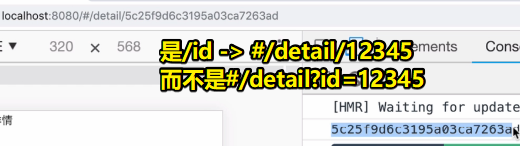

# 09-商品详情功能

> 遇到问题，一定要有自己的思考，而不是一味地直接上网搜索！当然，思考5min过后就直接搜吧！

## ★需求

在分类功能里边，我们看到的商品都是产品的缩略图，如果我们有对这个产品的消费需求的话，肯定会看看该产品的具体详情的！

## ★思路

点击产品的缩略图 -> 绑定事件 -> 每个产品都有唯一的标识，即id -> 拿到id -> 跳到详情页面组件 -> 根据产品id发送ajax请求 -> 查询数据库获取产品详情

> xxx._id -> 一般有 `_` 是私有属性之意哈！

## ★TPR

### <mark>1）JS变量命名规范？</mark>

a、变量命名必须以字母或是下标符号” `_` ”或者””为开头。

b、变量名长度不能超过**255**个字符。

c、变量名中**不允许使用空格**，**首个字不能为数字**。

d、不用使用脚本语言中保留的关键字及保留符号作为变量名。

e、变量名**区分大小写**。(javascript是区分大小写的语言)

➹：[js中定义变量名有哪些规范_JavaScript_小屋博客-CSDN博客](https://blog.csdn.net/xiaowu_hhb/article/details/52788111)

## ★详情组件

路由跳转 -> 需要配置路由

### <mark>1）如何带着id路由跳转？</mark>

传递参数有两种方式，而这两种方式有啥区别呢？请让我娓娓道来：

**路由配置：**

``` js
{
  path: 'detail',
  name: 'detail',
  component: Detail
}
```

> 有name是规范哈！

**有name：**

在push时传个对象参数，指定name属性（ `'detail'` ）和params属性（ `{id:id}` ）

在详情组件的created钩子里边接收参数，毕竟我们不涉及DOM操作！

``` js
this.$router.push({
  name: 'detail',
  params: {
    id: id
  }
});
```

``` js
this.$route.params.id
```

**另一种姿势—— `query` ：**

``` js
this.$router.push({
  path: '/detail',
  query: {
    id: id
  }
});
```

``` js
this.$route.query.id
```

> 注意：一个没有r，一个有r

区别：

后者的参数写在url里边的，如这样 `/detail?id=4547879` 

页面刷新后，还能取得参数值！ -> **像传统路由传参，get**

而前者则是这样的 `/detail` -> 页面刷新后，就不能拿到参数值了 -> **像表单传参，post**

总之，命名传参刷新页面会数据丢失，而参数传参则不会，所以请在合适的场景下，选择合适的方式！

**第三种姿势传参：**

修改路由配置：

``` js
{
  path: '/detail/:id',
  name: 'detail',
  component: Detail
}
```

> `/:` 是固定语法 -> 多个参数可以这样： `detail/:id/:name` 
>  
> 路由是 `/detail` ，参数则是 `/:id` 

那如何跳转呢？

根据path的值来跳转和传参

需要用到拼接字符串：

``` js
this.$router.push( `/detail/${id}` )
```

接收参数方式：

``` js
this.$route.params.id
```

效果：



刷新界面，还能拿到参数值

注意，参数顺序一定要跟配置的一一对应，如是id开始的，那么路由跳转时就是从id开始的，不然你这样的话：

``` js
this.$router.push( `/detail/${name}` )
```

那么根据id去读取时，读取到的数据就是name的数据了！这样一来，显然数据就混乱了呀！不利于我们的开发进行！

### <mark>2）根据拿到的参数发送ajax请求</mark>

1. 前端确定要发送的url
2. 后端处理这个url
3. 拿到数据渲染界面
4. 详情页面可返回到商品分类组件
5. 详情页面不要footer组件 -> 提取公共组件到components（footerBar） -> 在App.vue注册footerBar组件

### <mark>3）如何通过路由来确定哪些路由里边不需要footerBar组件？</mark>

说白了，就是如何指定路由不显示公共组件。该功能再日常项目里边很常见

做法：

在App.vue里边，追加一个router-view：

``` html
<router-view></router-view>
<router-view name="footer-bar"></router-view>
```

在router.js里边，用这种方式处理路由：


``` js
{
  path: '/',
  name: 'home',
  // component: Home
  components: {
    // 默认指定这个Home组件在没有name属性的router-view里边渲染
    default: Home,
    // 写了这个，意味着FooterBar组件生效
    'footer-bar': FooterBar
    // 还可以写多个
  }
}
```

总之，用到了这个公共组件就写上去，没有用到那就拉倒吧！

### <mark>4）进到详情页需要买农机，所以怎么搞？</mark>

vant提供了这样的组件

### <mark>5）如何做「添加购物车」这样的功能？</mark>

方案一：

点击加入购物车 -> 校验当前用户是否登录 -> 如果有就跳转到「我的购物车」 -> 如果没有就跳转到登录界面 -> 登录完后在添加到购物车里边去

优点：记录哪个用户把哪个商品添加都购物车里边去

缺点：提供了获取用户的成本，因为新用户看到要登录就不干了！即体验不好

方案二：

用户没有登录，能正常添加商品到购物车，数据保存到本地，结算时，再提醒用户登录 -> 京东就是这样干的！

优点：用户能一次性添加完商品，然后在合适的时机提醒用户登录 -> 用户体验好

缺点：没有登录状态，不知道当前商品应该加入到哪个购物车里边去！

这两个方案，没有说哪个好，哪个不好，都用得挺多了，这得看你们公司的产品需求定位

总之，过程不一样，但最终目的是一样的！

老师选择第一种方案

### <mark>6）后端校验用户状态</mark>

- koa-session
- redis

### <mark>7）在JS里边，如何判断一个对象是空对象？</mark>

> vuex -> 刷新界面 -> 信息消失

``` js
JSON.stringify(this.userInfo) === "{}"
```


### <mark>8）返回上一个路由？</mark>

``` js
this.$router.go(-1)
```

### <mark>8）如果项目很严谨</mark>

考虑安全问题 -> 建议判断用户状态，放在后端去写 -> koa-session、token、redis 持久化

### <mark>9）购物车集合</mark>

1. 产品id
2. 哪个用户买了这个产品
3. 产品购买数量

### <mark>10）补充</mark>

#### 1、Tabbar标签栏的route参数？

在详情页里边，点击返回，回到「商品类型」页面，可FootBar组件的焦点却是在首页

 添加个route参数即可！

do：

``` html
<van-tabbar v-model="active" route></van-tabbar>
```


