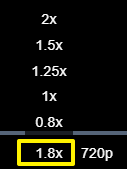
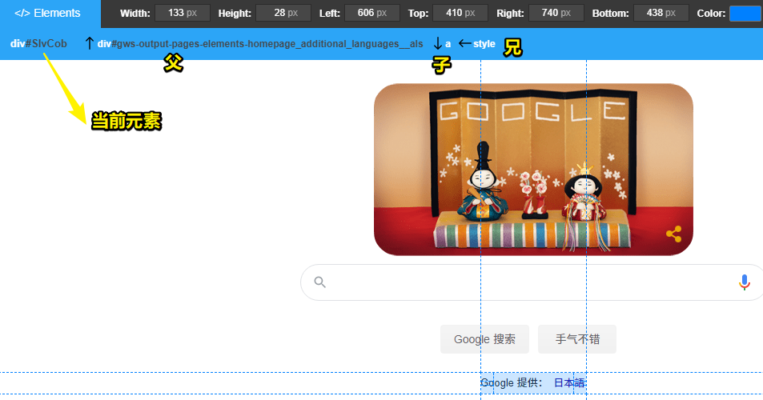
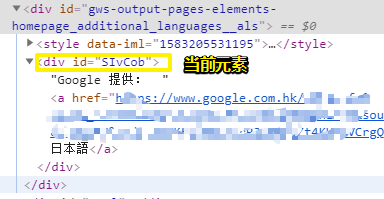

# 01-Chrome插件

## ★资源

➹：[zhaoolee/ChromeAppHeroes: 🌈谷粒-Chrome插件英雄榜, 为优秀的Chrome插件写一本中文说明书, 让Chrome插件英雄们造福人类~ ChromePluginHeroes, Write a Chinese manual for the excellent Chrome plugin, let the Chrome plugin heroes benefit the human~ 公众号「0加1」同步更新](https://github.com/zhaoolee/ChromeAppHeroes)

➹：[Chrome 网上应用店 - 扩展程序](https://chrome.google.com/webstore/category/extensions?hl=zh-CN)

➹：[工欲善其事必先利其器——产品篇 - 雪雁 - 博客园](https://www.cnblogs.com/codelove/p/9843183.html)

## ★技巧

1）装的插件过多，不想让插件出现（可右键插件 -> 隐藏）

> 我没有找到啥快捷键可以自动显隐插件栏

## ★助力学习篇

1）[《Video Speed Controller》 刷课（刷剧）神器！给网页视频加个速(最快可达16倍!)](https://www.v2fy.com/p/005_video_speed_controller/)

推荐指数：五星

推荐使用场景：看教程视频

推荐理由：腾讯课堂的视频播放调速只有5个档——`2x/1.5x/1.25x/1x/0.8x`，而我想要 `1.8x`

## ★助力开发篇

1）[Page Ruler](https://chrome.google.com/webstore/detail/page-ruler/emliamioobfffbgcfdchabfibonehkme?hl=zh-CN)

推荐指数：五星

推荐使用场景：前端开发 

推荐理由：可以快速量取网页上的盒子大小，以及知道盒子它是啥标签、啥id、啥class，还有它的爸爸是谁，它的儿子是谁，它的兄弟又是谁

校验：

