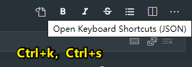

# 03-VS Code

## ★资料

➹：[关于编辑器 - 心&麓 - Xiang HongAi's Personal Website](https://xinlu.ink/tech/editor.html)

➹：[重新定义代码编辑——是时候从phpstorm转向VSCode了-pilishen.com,做全球最好的实战教程](https://www.pilishen.com/posts/maybe-its-time-to-switch-from-phpstorm-to-vscode)


## ★需求？

### 1、智能提示只能按方向键来上下选择，能不能用Tab键来选？

打开`keybindings.json`：



追加以下内容：

``` json
[
    {
        "key": "tab",
        "command": "acceptSelectedSuggestion",
        "when": "suggestWidgetVisible && textInputFocus"
    },
    {
        "key": "shift+tab",
        "command": "acceptSelectedSuggestion",
        "when": "suggestWidgetVisible && textInputFocus"
    },
    {
        "key": "tab",
        "command": "selectNextSuggestion",
        "when": "editorTextFocus && suggestWidgetMultipleSuggestions && suggestWidgetVisible"
    },
        {
        "key": "shift+tab",
        "command": "selectPrevSuggestion",
        "when": "editorTextFocus && suggestWidgetMultipleSuggestions && suggestWidgetVisible"
    }
]
```

do：

- tab、shift tab -> 循环选择
- 回车 -> 确定

➹：[如何调整vs code选择补全的快捷键? - 韦易笑的回答 - 知乎](https://www.zhihu.com/question/62743695/answer/1054302289)

### 2、我想选择单双引号里边的内容？

搜索「vscode choose string」

安装 [Quick and Simple Text Selection](https://marketplace.visualstudio.com/items?itemName=dbankier.vscode-quick-select)

do：

- `Ctrl+k` -> `'`
- `Ctrl+k` -> `"`
- `Ctrl+k` -> `{`
- `Ctrl+k` -> `(`
- 

**注：摁下`Ctrl+k`，就把这两键松手，然后直接选`{`等这样的字符，其中需要你按`Shift`键选择字符，毕竟这些字符都在一个键有两字符的上位处**


