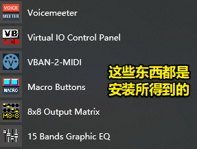
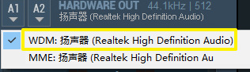
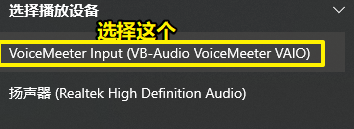
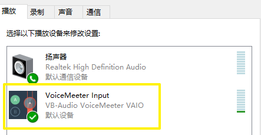
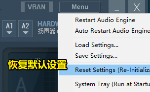
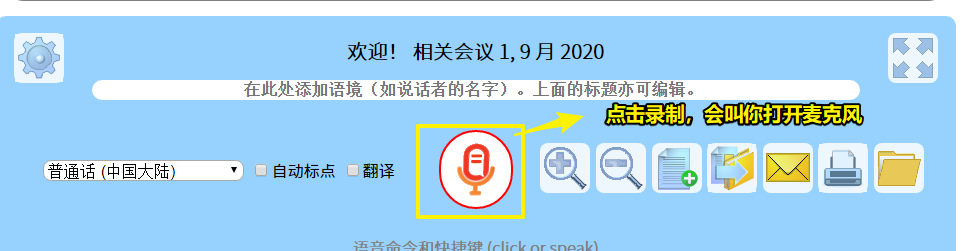
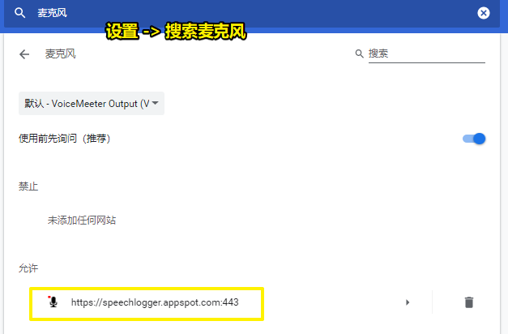
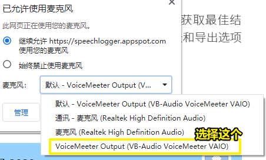
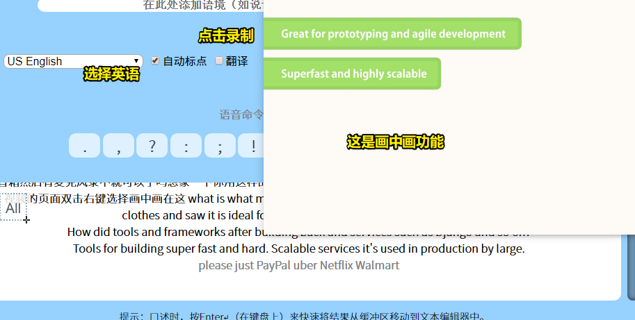

# 04-voicemeeter

## ★引子

偶然看到这个视频：

[㊙️让你听懂日本爱情动作片🔞的剧情，同声传译，双语字幕，语音转写自动生成字幕，英语电影字幕生成器，自动翻译英文视频，如何快速加字幕，电影中文字幕(第40期) - YouTube](https://www.youtube.com/watch?v=qG6KAawW1gI)

我一直想找个能实时翻译字幕的软件，类似于「彩云小译」的视频翻译功能

## ★voicemeeter

1）下载

[VB-Audio VoiceMeeter](https://www.vb-audio.com/Voicemeeter/index.htm)

2）安装

下载得到是一个压缩包，解压后，有一个exe文件，然后点击它进行安装，安装好之后就重启

安装得到了啥：

3）配置

打开VoiceMeeter这个软件

当你勾选了这个：

> 效果：ASIO > WDM > MME；这些都是用于支持声卡的驱动！

会发现听不了声音了

所以你还得选择以下几个选项：

上边这图选择了，下边这个就不用配置了，因为会自动配置！

用ev录屏这个软件测试——下录屏看看有没有声音：

- 戴耳机 -> 有声音
- 不戴耳机 -> 也有声音

如果你对VoiceMeeter这个软件界面误操作了，请重置：

设置完成后，点击最下化，而不是关闭哈！

## ★SpeechLogger

打开这个网站：

[自动语音识别和即时翻译软件](https://speechlogger.appspot.com/zh/)

如果浏览器禁止了该网站是用麦克风功能，请在浏览器的设置里边，把麦克风加入白名单，如这样：

看到地址栏最右侧那边有个像是「录像机」的图标，请点击它，然后配置一下这个：

> 该网站的作用 -> 在线将麦克风的语音转化成文字

VoiceMeeter这个软件劫持电脑的声音传递到上边这个网站上

选择一个youtube上的英语视频，右击视频选择画中画：

youtube上播放的声音会被VoiceMeeter这个软件劫持，而SpeechLogger这个网站则会把听到的东西转化成文本信息显示到一个文本框里边去

通过彩云小译可以实现双语翻译

而且这也支持本地播放！

其它教程：

➹：[英文小白都可以使用的双语字幕制作手册 - 知乎](https://zhuanlan.zhihu.com/p/28626413)

可能是自己电脑设备low的缘故，效果并没有想象的那么好！

