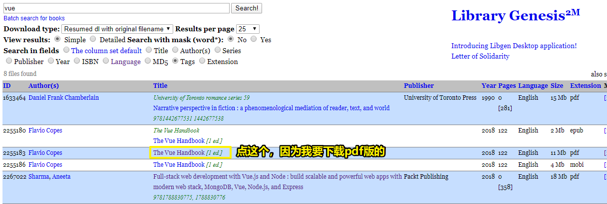
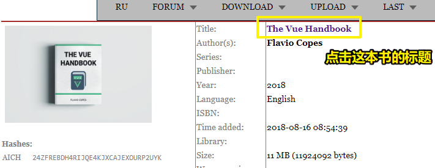
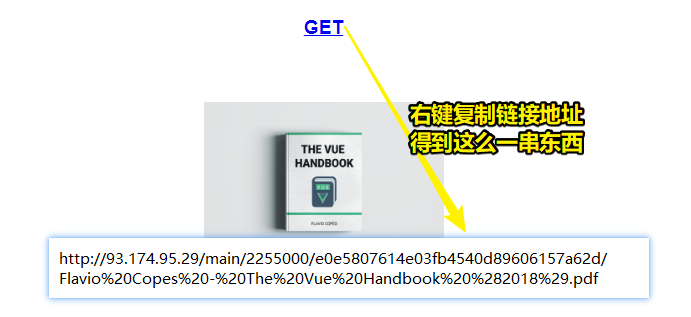
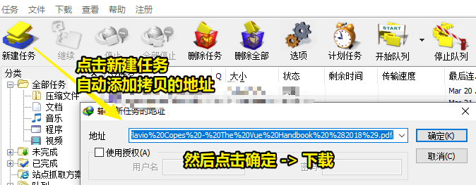
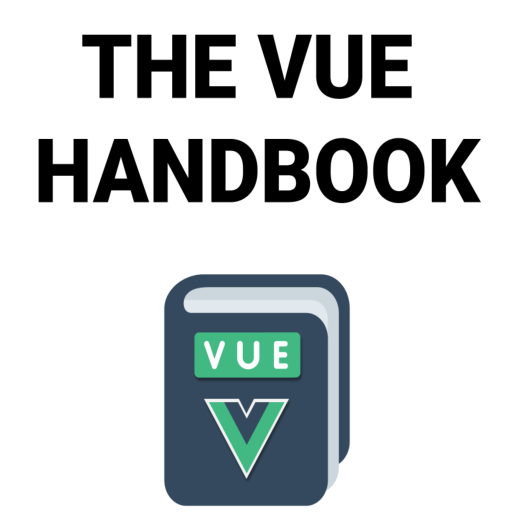

# 05-Library Genesis

## ★引子

我想找到道格拉斯在2018年出版的这本书：

[How JavaScript Works](https://howjavascriptworks.com/)

但没有找到电子版的

偶然看到编程随想最新的一篇博客：

[分享各类电子书（【英文版】专场，177本） @ 编程随想的博客](https://program-think.blogspot.com/2020/03/share-books.html)

其中，里边提到了这么一个网站：

[Library Genesis](https://libgen.is/)

于是我就在这个网站里边搜索「How JavaScript Works」这本书，结果没有找着

既然如此，那我就下载有关vue的书吧

## ★vue handbook

1）标签搜索 vue

[Library Genesis](http://libgen.is/search.php?req=vue&open=0&res=25&view=simple&phrase=1&column=tags)

2）根据搜索结果，选择你要的书籍

3）看到 vue handbook 这本书的详情

来到另外一个页面：

4）打开本地的IDM工具进行下载

> 我不知道是不是配置了代理，下载这本电子书挺快的，平均有500多kib（家里宽度电信50M）

5）打开下载下来的handbook

使用sumatra pdf打开：

