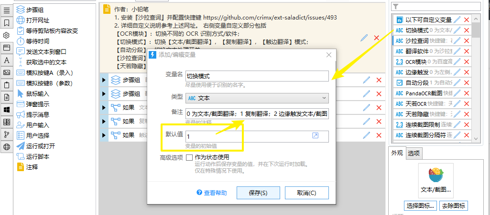

# 06-Quicker

## ★引子

看到了这篇使用沙拉查词的技巧性文章：

[技巧分享：Quicker 调用 Saladict 实现全局『文本翻译、截图翻译、复制翻译、触边翻译』 · Issue #493 · crimx/ext-saladict](https://github.com/crimx/ext-saladict/issues/493)

我们在本地看英文书，需要翻译英文，可以这样做：

1）有道词典 -> 选中即翻译

2）沙拉查词 -> 在浏览器打开pdf -> 由于是文件协议，你需要配置沙拉查词这个插件，让它支持文件协议 -> 这样可以并行多行翻译

3）还是沙拉查词 -> 需要配置快捷键：

打开这儿：[扩展程序](chrome://extensions/shortcuts)，搜索「沙拉查词」

配置快捷键：

在本地打开一本pdf，选中里边的内容，按下复制 -> alt+L -> 沙拉查词会针对剪贴板的内容进行翻译

显然，第三种方式好很多

可每次都要alt+L呀，能不能复制，就自动翻译呢？就像有道词典在本地翻译一样呢？

## ★使用

1）沙拉查词翻译配置

效果：复制文字，直接弹窗翻译，无须alt+L

做法：

1. 下载：[下载 - Quicker](https://www.getquicker.net/Download)
2. 安装：[文本/截图翻译 - 已分享的动作 - Quicker](https://getquicker.net/Sharedaction?code=b0d1a134-8284-4a44-d1be-08d746da5869)
3. 点击这个动作，运行一下即可
4. 配置复制即翻译：

➹：[文献翻译利器：沙拉查词+ Quicker，这或许是 Windows上最强的聚合翻译方案 - 知乎](https://zhuanlan.zhihu.com/p/106650743)

