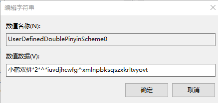
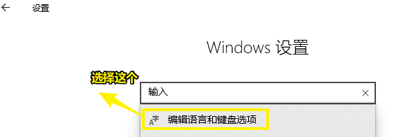
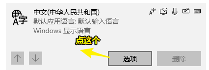
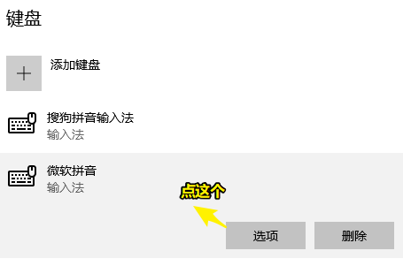
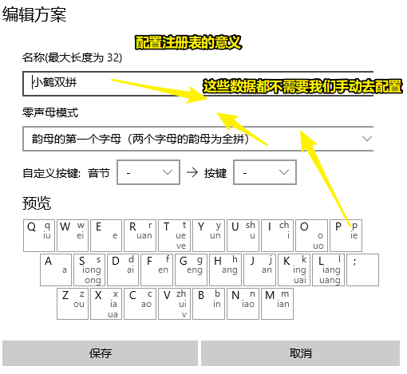
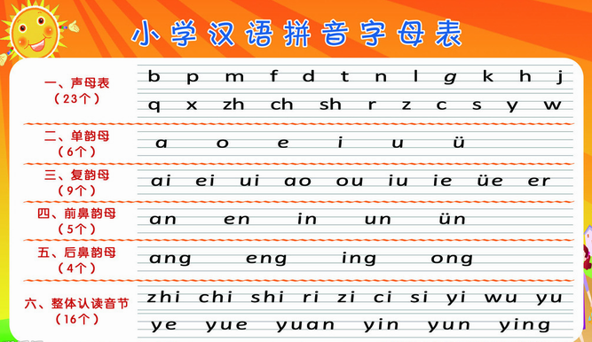
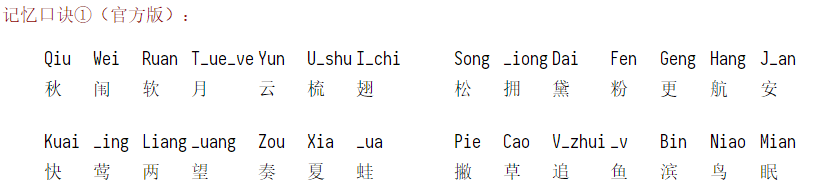

# 07-小鹤双拼

> 2020年3月26日

## ★引子

芳芳推荐用[小鹤双拼](https://www.flypy.com/index.html)

## ★如何在win10里边使用小鹤双拼

1）win + R -> 输入 `regedit`，打开注册表

2）定位到「`计算机\HKEY_CURRENT_USER\Software\Microsoft\InputMethod\Settings\CHS`」

3）右键新建字符串值：



```
key： UserDefinedDoublePinyinScheme0
value：小鹤双拼*2*^*iuvdjhcwfg^xmlnpbksqszxkrltvyovt
```

4）打开windows 设置：

找到微软拼音的选项配置：







把出现的小鹤双拼设置为默认值：


直接修改注册表的最大意义在于，不需要自己一个个去定义按键和音节的对应关系：



➹：[Win10 微软拼音添加小鹤双拼以及其他配置 - 简书](https://www.jianshu.com/p/02c4cf1e5225)

➹：[Windows 10 使用小鹤双拼_运维_张志帅-CSDN博客](https://blog.csdn.net/MrBaymax/article/details/86708350?depth_1-utm_source=distribute.pc_relevant.none-task&utm_source=distribute.pc_relevant.none-task)

## ★如何让Win10自带微软输入法的全拼双拼一键切换？

1. 打开你的quicker
2. 安装一个动作：[切换双拼和全拼 - 已分享的动作 - Quicker](https://www.getquicker.net/Sharedaction?code=23ab5997-cef0-47ff-35ca-08d6acd552e8)

## ★双拼原理？

 双拼是汉语拼音输入法的一种编码方案。 相对于全拼而言，使用双拼输入汉字时只需输入一个代表**声母**的字母，一个代表**韵母**的字母，就可以打出**任意一个**中文单字了。

## ★声母韵母是啥？



区分有咩有g -> 有g有鼻音，无g无鼻音 -> 这涉及到你的普通话标不标准

➹：[小学汉语拼音字母表（声母、韵母、整体认读音节）可打印_知识园地_中小七班_宜宾市中山街小学](http://www.zsj2016.com/news/201609/123.html)

## ★为啥使用双拼输入法？

- 少敲几个字，省力
- 减少选字所用的时间
- 有节奏感和整齐性
- 在手机上使用双拼效果杠杆的！

➹：[双拼输入法对比全拼输入法效率更高吗？ - 知乎](https://www.zhihu.com/question/20555958)

## ★为啥用小鹤双拼？

芳芳推荐用的，先用了再说

➹：[为什么小鹤双拼这么容易，但是没人学呢？ - 知乎](https://www.zhihu.com/question/50280188)

➹：[各双拼输入方案之间有明显的优劣之分吗？ - 知乎](https://www.zhihu.com/question/20191383)

➹：[想学双拼，哪一种双拼方案比较好呢？ - V2EX](https://www.v2ex.com/t/70269)

## ★如何记忆双拼的键位？

边敲边看图记忆大法：

1. 打开你的quicker
2. 安装一个动作：[双拼键位图 - 已分享的动作 - Quicker](https://www.getquicker.net/Sharedaction?code=4492bf89-32df-435a-06aa-08d76cfda368)

记忆口诀大法：



➹：[小鹤双拼——双拼方案](https://www.flypy.com/pin.html)

