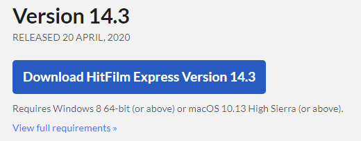
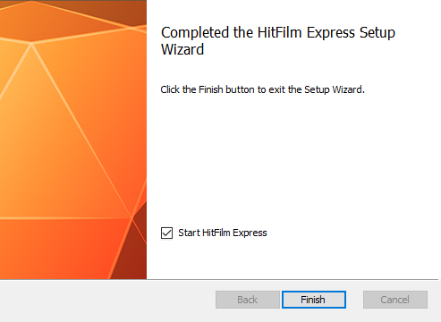
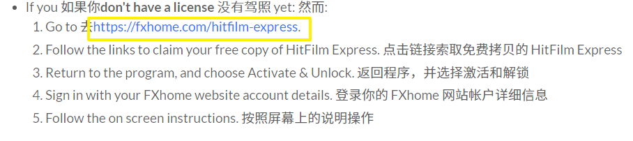
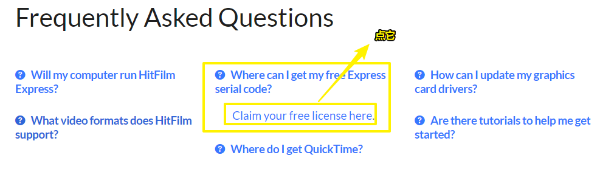
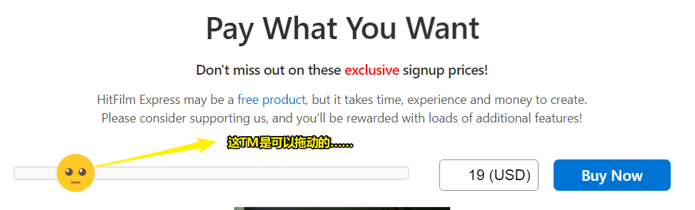
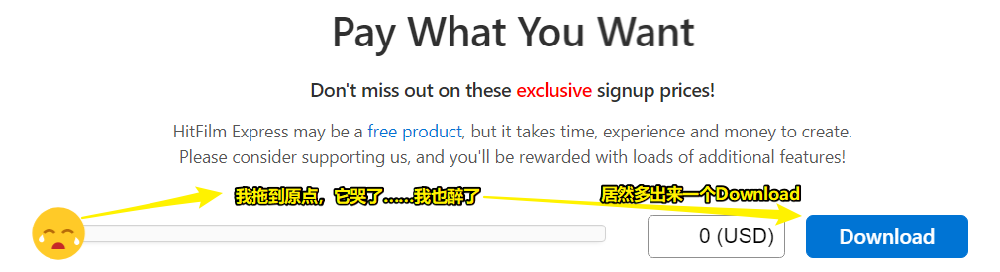
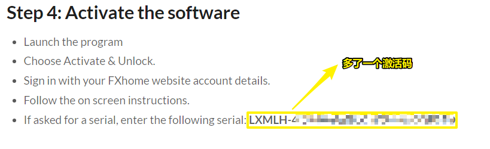

# 08-视频剪辑软件-HitFilm Express

## ★资料

➹：[8个免费视频剪辑软件，你，值得拥有。 - 知乎](https://zhuanlan.zhihu.com/p/21879714)

➹：[【合辑版】【 Hitfilm Express视频编辑 全13集】_哔哩哔哩 (゜-゜)つロ 干杯~-bilibili](https://www.bilibili.com/video/av49913093/?p=2)

## ★为什么要学这个？

我经常性的会在腾讯课堂里边录制一些公开直播课，而这些公开直播课一般是不提供回放的……有些同学因为没时间听，所以会找一些同学要录播……而同学们在录制的时候，或多或少会把自己PC桌面上的软件等不必要的信息都给录进去了……

## ★下载、安装、激活

1）注册账户

[Create a FXhome account - fxhome.com](https://fxhome.com/register)

用户名 -> 密码 -> 邮箱 -> 邮箱验证激活 -> 完成注册

2）下载

[HitFilm Express: Update history - fxhome.com](https://fxhome.com/hitfilm-express/whats-new)

使用IDM下载

大小 -> 400.73M

3）安装

安装 -> 双击 -> custom -> ……

4）软件第一次打开，要激活它，不然导出的视频会有水印

点击激活 -> 输入邮箱和密码（之前的密码千万不要是chrome浏览器自动生成的，不然这一步你就得到浏览器里边看看输入的是啥密码了）

激活需要注册码 -> 但网站并咩有给我注册码 -> 难道这软件是收费的？

确实是收费的……9刀 入门版

可是官网说了这个软件是免费的啊？ -> 官网总不能欺骗我们吧 -> 因此，我怀疑一定是自己哪里咩有搞好

于是我到B站里边找有关hitfilm express的教程，结果看到了[这个教程](https://www.bilibili.com/video/av47030111/)里边回复：

根据这个回复，我意识到这软件确实有免费的，但这个回复并不能解决「我如何才能拿到 serial code」 的问题

偶然，我回顾了这个安装说明：

[Install Instructions for HitFilm Express - fxhome.com](https://fxhome.com/software-install/hitfilm-express/2020-04-20)

里边 Step 4 提到：

于是来到这个页面，也就是这个软件的首页

[Download HitFilm Express - for Mac & PC - fxhome.com](https://fxhome.com/hitfilm-express)

在这个页面的底部，有个「常见问题的回答」：

点击图中的链接，我来到了 [Download HitFilm Express | for Mac & PC - fxhome.com](https://fxhome.com/hitfilm-express/pwyw)  这个页面

这个页面我之前在下载软件的时候就打开过，但是这是一个要我们付费的页面，闲来无事，我到了这个：

我一拖动：

当我点击「Download」：

就跳到了这个页面 [Install Instructions for HitFilm Express - fxhome.com](https://fxhome.com/software-install/hitfilm-express)

这个页面很熟悉，之前我们点开过一个类似的，但它的第四步多了个serial code：

至此，这个软件的下载、安装、以及激活就大功告成了……

我一直以为这个软件的激活码是通过邮件发过来的或者是我下载的这个最新版已经不提供免费版的了，万万没想到，居然是这样拿到激活码的……

