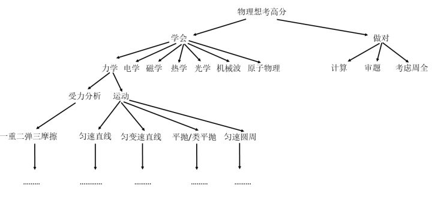

# Think

- 一定要会「翻墙」 -> 「谷歌搜索」这操作每天都会频繁使用

- 如果你不知道这概念是什么，那么你就大量的举例吧！如「啥叫幸存者偏差？」 -> 举大量体现「幸存者偏差」的例子

- 中文关键字搜索不到时，请用英文关键字！如「vscode choose string」

- 请用 ` -> `表示理解或者做某个东西的过程顺序标志

- 如果你不了解用java做后端的大致过程，那么你可学习Node.js 来了解后端的大致过程

- 如果你对关系型数据库的CRUD不感冒，那么你可以学习no sql的CRUD

- 只学后端，不学前端，不能形成闭环；同样，只学前端，不学后端，也不能形成闭环；深挖一个前端，但产品、设计、后端等都应有所涉猎，因为稍微懂点的话，可以让自己的能力提高一倍……（这是乘法的加成，可不是简单的加法）

- 学习「数据结构+算法」很重要，因为这很能训练自己的逻辑、以及编写复杂代码的能力

- 多写规范的代码 -> 这会减少你后续修改代码的次数，利于维护自己的项目

- CRM是学习一个新东西的不二法门

- 如果你感觉对这个东西的学习遇到了瓶颈 -> 那么请你学一个新东西，因为这带来的边际效益是大大的

- 多看英文教程 -> 因为英文教程浅显易懂，除非有牛逼的中文翻译、牛逼的中文教程

- 看视频入门后 -> 就不要看视频学习知识点了，而是多看文章，如他人博客 -> 当然，你依旧可以看看有关做一个项目的视频

- 多写博客 -> 这会让你明白他人所写的博客文章的文笔逻辑是怎样的 -> 有利于阅读他人博客 -> 同样，你如果可以抄视频归纳成博客 -> 同样，大大的有利于阅读他人的博客

- 不超过12点睡觉，不超过7点起床 -> 三餐按时吃，不要饿肚子学习，多喝水，多关心关心自己的那个腰……

- 多学习其它领域的知识 -> 因为这会发散你的思维 -> 学习是一种习惯，如吃饭、睡觉、喝水般 -> 学习真让人感到快乐 -> 如果觉得遇到跨不过去的点，拿15分钟出来去大量搜索，实在无法解决，请放弃 -> 此时，你得学习一些简单东西，唯有这样，学习才不会让感到难受，当然，你也可以去锻炼放松一下！

- 我认为教授知识比较好的老师 -> 方应杭（饥人谷）、若愚（饥人谷）、小野（js++）、谢成（青盟）、单老师（青盟）、李刚（疯狂java）

- 不要觉得付出了很大心血，然后没有得到想要的结果，就觉得努力白费了 -> 过程永远都是最重要的，请复盘每次的失败，并不断的改正 -> 舒适的生活，一点乐趣都没有……

- 不要只看一个人的教程，一图胜千言

- 关于降维打击，学了数据结构与算法以后，你会觉得平时写的业务代码并没有起初你感觉到的那种难度。前端培训6个月 -> 高薪？如果你有大量时间自学的话，我建议你去学C、数据结构与算法、网络等内容，而不是自学前端什么的，毕竟这前端，你只要知道怎么做了，就很容易通过CRM来满足平时的业务开发了，况且还有前端培训可以缩短你去找寻怎么做的时间……

- 有了系统学习的经历后，请组合式学习，只看一个人的教程并不好，多对比其他人对同一个知识点的讲解，有利于自己对该知识点的深入理解

- 不要想着很用心的看一遍视频或者书籍什么的就完事了，你得螺旋式的看！

- 关于看技术书籍？——看到一个是什么，请抽离出一个问题来！看到知识点的讲解罗列，请加工成适合自己的理解方式！ -> 先看薄的书籍（如0~300页） -> 再看厚的书籍

- 关于透明，在计算机里边，就是黑盒之意，简单来说，你调用他人的API，就只管调用就好了，你无须把这个API给拆了，然后看看它里边有什么东东！白话点来说，「你当我是透明的吗？」即所谓的「无视我」

- 我觉得夫妻应该是这样一种存在——可以让双方变得更好！

- 知道自己有啥问题远远要比人家给你一个问题重要得多，如「我一直对数学里边的n>0，然后……」不感冒，我觉得我很有可能是对代数不感冒，所以「啥叫代数呢？」 -> 简单来说，就是代替数字 -> [什么才是代数？ - 知乎](https://www.zhihu.com/question/50576405) -> 李永乐老师对[双蛋问题](https://www.bilibili.com/video/av96214853?t=684)的讲解

- 我对「情商」二字不感冒，与其说「情商」，还不如说是「软技能」

- 意识到自己不足，但不去改正，这TM就是在浪费时间……

- 我为啥要去学编程、前端？ -> 因为无聊，所以我需要找一件事来对抗无聊，而编程学习就是这样一件事，在接触编程的过程中，它能一直给予我新鲜感！简单来说，编程学习对于我而言就是用来「打发时间」的…… -> 关于编程的意义：[编程对你的意义是什么，除了赚钱？ - 知乎](https://www.zhihu.com/question/25422044) -> 轮子哥回答了「是消磨时间的一种有效手段」

- 关于屯课 -> 卖课方在告诉你「你某方面不行呀！而我们的课程刚好可以解决你问题……」 -> 话说，自身是否存在问题，真得需要你卖课方来「提醒」吗？ -> 贩卖焦虑真得让人恶心……

- 从书中发现自己的问题，并找到与之相对应的答案……你说要创造个答案？……我想这一定得积累大量大量的智慧 -> 看到这样一句话：
  
  > 我们现在的99%的困惑，其实历史上其他人都遇到过。并不是因为智慧都是读书读出来，而是读书，和伟大的前人对话，是解决大部分问题的捷径。所以才会有杨绛先生的名言：“你的问题主要在于读书不多而想得太多。”
  
- 你要不停地问，才能找到根本问题，随着你不停地问，解决一个问题又一个问题，你会发现你很快就能找到「根本问题」了，这无疑大大的提高了解决问题的效率！

- 既然这些东西让我感到不快乐，我为何还要在意呢？

- 不要觉得自己特别，人生没有任何意义……活着只是为了等待死亡……

- 我做了个梦，这个梦让我意识到突破自己的极限是多么的痛苦，这梦大概是这样子的：有100层关卡（类似攀岩的闯关），也许你初始化的极限在第7层就到了，那么来到第8层，你就会死活都过不去，每次过这第8层，都会让你感受到死亡的恐惧，这第八层类似这样：

  

  每过一次，你都会发自内心的求饶说「放过我吧！……我不想过了……太痛苦了」，而其它小伙伴则翻过去了第8层，你向自己妥协了，认为自己根本无法过去，而且在尝试的过程中无比痛苦，于是上天召唤了一个少女，这少女身旁带着一条巨龙，该巨龙会带你直接飞到第一百层，但你要抓住巨龙的尾巴飞上第100层，一旦你没抓牢撒手了，那你就GG了，在从第8层飞上第100层的过程中，你无数次想松手，因为你的灵魂在颤栗，你眼神溃散，麻木，一种超级超级恐惧的心理充斥着你的心神，你感受到「死亡才是人生最快乐的事儿」，你想死，迫切的想死，但万万没想到，你还是来到了第100层，因为这梦是你的呀！你才是这梦中的主角，而且你成为了有史以来第二个以这种方式来到第100层的人……当你站在100层之上，注视着下方，你发现一切的恐惧烟消云散，你开始思考，如果我是从第八层一路攀爬到100层，那么我会突破92次极限，如果能突破92次极限，那我该多强呀？所以，重新来过，战胜恐惧，突破极限？还是在100层做个永远垫底的存在？

- 当你不理解一个词的时候，就去理解它的近义词、同义词，如我不理解「灵感」，那我就把「灵感」二字改成「启发」 -> inspire -> 创作型歌手会听到某人的歌或者经历某些事、看到某些事而产生灵感或者说受到启发而写出一首歌来……

- 人生的意义？ -> 我想应该是成长吧！ -> 让自己变得更好，如可以早起、不熬夜…… -> 能够控制自己做对的事儿……

- 我们知道学习一个东西，除了输入以外，还需要输出，而有一种很简单的既可以做到输入和输出的姿势：那就是翻译英文成中文，当然，这得是理解过后的翻译……比直接看中文要好很多！ -> 输入英文，加工后输出中文，如果你再加一层实践，那对知识的吸收就好很多了……

- 关于你是否真正理解一个东西，在我看来，你是否可以活学活用这个东西，是否可以通过这个东西来举一反三 -> 否则，你只是记住了这个东西，然后生硬的使用它罢了！

  > 《论语·述而》：「举一隅不以三隅反，则不复也。」意思是教人认识四方形的东西，先给他指出一个角，再让他类推另外三个角，如果不能类推，就不再教他了。后用「举一反三」指懂得一件事就可以类推出其他许多同类的事。

- 我很好奇为啥一个数会有那么多名字，如自然数，质数、整数、合数等等，它们不就是一个数吗？你们为啥要加那么多外延？同样的，大家都是人，然后按肤色分，有黄种人、白种人、黑种人，按职业分，程序员、警察、医生……按国籍分中国人、韩国人、日本人……大家都是数、大家都是人，难道人天生就喜欢分类？贴标签？难道与众不同、特立独行是一种追求性的美？难道如果不这样划分的话，就会让人感到无比的无聊？还是说，不分类的话，会增大问题的复杂度？会让生活变得混乱？ -> 分类似乎是一种结构化操作！

- 我们写的代码就像是一份稿子一样，计算机拿到了这份稿子就会去读去执行（编译成计算机能执行的机器码），我们所写的稿子告诉了计算机该怎么做，而计算机的反馈就是把信息打印在屏幕上给我们看！如 `console.log('hi');` -> 计算机看到我们所写的这句话，就会在屏幕打印个 `hi`出来，这就类似于我们在教计算机讲话，而计算机就像是个婴儿一样，学着我们讲一样的话……有时候我们的教法，计算机它无法理解或者计算机所讲出来的话不是我们所告诉它的那样，那么这个时候我们的「稿子」显然是有bug了！ 如果稿子里边的内容贼鸡儿多，那么又得需要用到一些调试工具来辅助我们找bug了……

- 一种涉及深度和广度的思考姿势 -> 九宫格思考法 -> 你找到一个点之后，就发散你的思维，或者说使用你的联想能力，生成8个与这个点有联系的点 -> 对每个点套娃

- 关于英语口语或者说关于背单词，我们可以直接到Youtube等网站下边，去看那些英文评论就好了！哪个单词不会就记下来呗！这比单纯地拿本单词书然后去背要好得多！ -> 类比我们日常讲中文口语，都是看了某个内容然后发表中文评论

- 借力打力 -> 回忆起一个知识点，然后根据这个知识点回忆起其它的知识点 -> 就像脑图那样……这样一来我只需要记住一个知识点，就能推出与这个知识点相关的其它知识点出来……

- 有些东西不管用文字再怎么形容，都不如自己亲身接触、经历一番，如我没有吃过榴莲，与其听人家形容榴莲怎样怎样好吃，还不如自己去买个榴莲好好品尝一番……

- 如果你买一个东西，出现了回购，那么这个东西于你而言就是符合你心意的，如我之前买了一箱苹果，我看只要28块就有10斤左右，于是我就买了看看，货到了，拿起一个苹果一看，顿时想退货，下次再也不会买这样的东西了……在如我之前买了个3T的硬盘，用的还可以，如果这3T用完了，那么定会回购……

- 有些概念需要通过比较，才能得知这东东的本质是啥，如你吃了一条鱼（叫B）你觉得这很「鲜」，可你为啥觉得这很「鲜」呢？因为我之前吃过同一条这样的鱼（叫A），A是河里抓的，而B则是水库里抓的，同样一种鱼类，同样一种做法，因为生活环境不同，口感天差地别，而这种差别可以用「鲜」来描述……

- 当你看到一句话、听到一句话，你发现自己并不理解这句话，那么此时你应该从句话里边去找一些「你为什么不理解的」线索，然后根据这些线索，理解这些「不理解」，最后组合，完成对这句话的理解……

- 有一段时间里边，我发现自己对前端的认识并没有长进，而且随着时间的推进，自己已有的前端知识开始贬值了……直到我参加了winter的「前端进阶训练营」，我才感受到自己对前端的认识又有了向前迈进的可能……

- 又有一个新技术出来了，快学……我又得去做加法了……为何不去学学那些能让你做乘法的东西呢？如数据结构与算法什么的……

- 对的时间做对的事情 ，如当下的我要找一份前端工作，但我居然还有时间去看看Java等与前端无关的技术，话说，你目前的前端技能能否帮助你找到一份工作呢？如果不能，请不要东搞西搞的……如果你觉得一天到晚搞前端有点腻，那么我建议你还是搞一些非IT技术的内容调和一下，如学一下英语、看一下有关逻辑学的书、写作、唱歌等等……当然，你也可以搞一些内功知识，如数据结构与算法、计算机组成原理、网络、操作系统……

- 之前在「学习观」里边看到「知识非信息，学习非记忆」，偶然看到以下这么一张图：

  

  > 图中这提炼出来的知识不一定正确哈！图中给我的感觉就像是「点、线、面」
  
- 如何找到不可分割的知识？就像你学习一个内容，起初这「内容」应该像「质数」这样的存在，比如说你要学前端，那么首先的目标是成为一个助理工程师，然后再是前端工程师，但现在市面上很多培训机构，就直接讲了「前端工程师」这个层面的知识，而「助力工程师」这个层面的知识，即便讲了，也只是讲了一些很基础的内容 -> 表面上你在学「前端工程师」这个层面的知识，觉得这对工作很有用，但其实你会发现，自己很容易会遇到瓶颈，很难解决一些「难题」，而且对知识吸收率并不高……没有那些从p4级别一路稳扎稳打上来的人强…… -> [前端工程师](https://time.geekbang.org/learning/path-detail/2) -> 如果岁月可回头，让我回到2018年，我一定先去学习「助力工程师」这个层面的知识 或者 是 [计算机基础知识](https://time.geekbang.org/learning/path-detail/3) 这个层面的知识 又或者是 「逻辑学、哲学……」，而不是一上来就是HTML、CSS、JS……

- 记忆点 -> 这是我在创造营2020听到的词 -> 按照我的理解就是艺人在表演时，舞蹈动作、歌声、歌词、旋律、体型、形象、表情等，让大众会通过这些小点记住了这么一个人 -> 对比，学习，我们不能记住所有，我们要了解一个东西，只需要记住它的「记忆点」就好了  -> 「记忆点」有点像「重点」的意思……如果你搞可视化笔记的时候，可以通过「记忆点」来搞……如 -> 长得像「黄子韬」孙如云、洛丽塔服装想起「谢安然」、演唱陈情令「无羁」的陈卓璇…… -> 「记忆点」又有点像我在谷歌搜索里边输入的「关键字」了，因为我都是这样搜索的「创造营2020 陈情令」「创造营2020 长得像黄子韬」「创造营2020 洛丽塔」

- 面对一个复杂的问题，你可以用「树」的姿势去拆解它，如：

  

  ➹：[如何学好高中物理？ - 「已注销」的回答 - 知乎](https://www.zhihu.com/question/19812276/answer/135104741) 
  
- 为什么要画图？ -> 我在看极客时间的「视觉笔记」专栏里边，看到了大概这样一句描述「人脑解析图片的速度要比文字快得多的多」 -> 事实证明确实如此，当然图片的信息量没有文字多，但我们画图画的其实是要点，即可以快速让你清楚我们在讲什么…… -> 我经常使用谷歌搜索一些有关技术知识点的图片，如stack heap……

- 有时候你很难看懂一句话在表达什么，这是因为这里边出现了很多你不懂的名词，这些名词就像一个函数一样，你不知道这个名词的背后有多少信息量，有多少行代码，当这些一个个的名词**有机的**串联起来之后，你会发现这短短的一句话，意味深长…… -> 当然，你也可以把一句话看成是一个函数，一段话看成是一个功能模块，一篇文章就是一个可以用的成品，不断地完善文章，让这篇文章可以千古流传……

- 人活着的意义似乎就是要解决无数的问题，问题一个个输入到你的脑海中，你不断的学习知识，解决问题……如此反复……

- 当你心算`20*21`的时候，请先把 `20*20`算出来，并把算出来的结果扔到一个在你周围让你感到深刻的东西身上，同理 `20*1`也是如此，最后让这俩东西相加起来即可 -> 这是何猷君在参加「跟着村长去支教」这个综艺里边教小朋友如何记忆时用的方法…… -> 类比到编程，这就是在把一个运算结果赋值给一个变量呀！如果你在算 `20*21`的时候，把中间结果存到自己的脑子里边肯定会很痛苦，还不如把它们存到某个让你有深刻印象的东西身上呢？如课堂上，有黑板、五星红旗等

- 前端，同样一份薪资，每一年所需的要求都会逐渐提高……这给我的赶脚就是「能早点上车，就早点上车……不然，以后上车的难度就越来高，当然，你本人也得要有一定的预测能力来判断这个东西是不是呈现这样的趋势……」 

