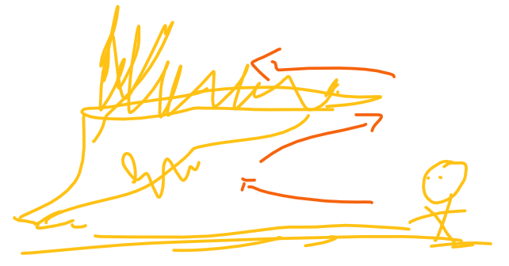

# Think

- 一定要会「翻墙」 -> 「谷歌搜索」这操作每天都会频繁使用

- 如果你不知道这概念是什么，那么你就大量的举例吧！如「啥叫幸存者偏差？」 -> 举大量体现「幸存者偏差」的例子

- 中文关键字搜索不到时，请用英文关键字！如「vscode choose string」

- 请用 ` -> `表示理解或者做某个东西的过程顺序标志

- 如果你不了解用java做后端的大致过程，那么你可学习Node.js 来了解后端的大致过程

- 如果你对关系型数据库的CRUD不感冒，那么你可以学习no sql的CRUD

- 只学后端，不学前端，不能形成闭环；同样，只学前端，不学后端，也不能形成闭环；深挖一个前端，但产品、设计、后端等都应有所涉猎，因为稍微懂点的话，可以让自己的能力提高一倍……（这是乘法的加成，可不是简单的加法）

- 学习「数据结构+算法」很重要，因为这很能训练自己的逻辑、以及编写复杂代码的能力

- 多写规范的代码 -> 这会减少你后续修改代码的次数，利于维护自己的项目

- CRM是学习一个新东西的不二法门

- 如果你感觉对这个东西的学习遇到了瓶颈 -> 那么请你学一个新东西，因为这带来的边际效益是大大的

- 多看英文教程 -> 因为英文教程浅显易懂，除非有牛逼的中文翻译、牛逼的中文教程

- 看视频入门后 -> 就不要看视频学习知识点了，而是多看文章，如他人博客 -> 当然，你依旧可以看看有关做一个项目的视频

- 多写博客 -> 这会让你明白他人所写的博客文章的文笔逻辑是怎样的 -> 有利于阅读他人博客 -> 同样，你如果可以抄视频归纳成博客 -> 同样，大大的有利于阅读他人的博客

- 不超过12点睡觉，不超过7点起床 -> 三餐按时吃，不要饿肚子学习，多喝水，多关心关心自己的那个腰……

- 多学习其它领域的知识 -> 因为这会发散你的思维 -> 学习是一种习惯，如吃饭、睡觉、喝水般 -> 学习真让人感到快乐 -> 如果觉得遇到跨不过去的点，拿15分钟出来去大量搜索，实在无法解决，请放弃 -> 此时，你得学习一些简单东西，唯有这样，学习才不会让感到难受，当然，你也可以去锻炼放松一下！

- 我认为教授知识比较好的老师 -> 方应杭（饥人谷）、若愚（饥人谷）、小野（js++）、谢成（青盟）、单老师（青盟）、李刚（疯狂java）

- 不要觉得付出了很大心血，然后没有得到想要的结果，就觉得努力白费了 -> 过程永远都是最重要的，请复盘每次的失败，并不断的改正 -> 舒适的生活，一点乐趣都没有……

- 不要只看一个人的教程，一图胜千言

- 关于降维打击，学了数据结构与算法以后，你会觉得平时写的业务代码并没有起初你感觉到的那种难度。前端培训6个月 -> 高薪？如果你有大量时间自学的话，我建议你去学C、数据结构与算法、网络等内容，而不是自学前端什么的，毕竟这前端，你只要知道怎么做了，就很容易通过CRM来满足平时的业务开发了，况且还有前端培训可以缩短你去找寻怎么做的时间……

- 有了系统学习的经历后，请组合式学习，只看一个人的教程并不好，多对比其他人对同一个知识点的讲解，有利于自己对该知识点的深入理解

- 不要想着很用心的看一遍视频或者书籍什么的就完事了，你得螺旋式的看！

- 关于看技术书籍？——看到一个是什么，请抽离出一个问题来！看到知识点的讲解罗列，请加工成适合自己的理解方式！ -> 先看薄的书籍（如0~300页） -> 再看厚的书籍

- 关于透明，在计算机里边，就是黑盒之意，简单来说，你调用他人的API，就只管调用就好了，你无须把这个API给拆了，然后看看它里边有什么东东！白话点来说，「你当我是透明的吗？」即所谓的「无视我」

- 我觉得夫妻应该是这样一种存在——可以让双方变得更好！

- 知道自己有啥问题远远要比人家给你一个问题重要得多，如「我一直对数学里边的n>0，然后……」不感冒，我觉得我很有可能是对代数不感冒，所以「啥叫代数呢？」 -> 简单来说，就是代替数字 -> [什么才是代数？ - 知乎](https://www.zhihu.com/question/50576405) -> 李永乐老师对[双蛋问题](https://www.bilibili.com/video/av96214853?t=684)的讲解

- 我对「情商」二字不感冒，与其说「情商」，还不如说是「软技能」

- 意识到自己不足，但不去改正，这TM就是在浪费时间……

- 我为啥要去学编程、前端？ -> 因为无聊，所以我需要找一件事来对抗无聊，而编程学习就是这样一件事，在接触编程的过程中，它能一直给予我新鲜感！简单来说，编程学习对于我而言就是用来「打发时间」的…… -> 关于编程的意义：[编程对你的意义是什么，除了赚钱？ - 知乎](https://www.zhihu.com/question/25422044) -> 轮子哥回答了「是消磨时间的一种有效手段」

- 关于屯课 -> 卖课方在告诉你「你某方面不行呀！而我们的课程刚好可以解决你问题……」 -> 话说，自身是否存在问题，真得需要你卖课方来「提醒」吗？ -> 贩卖焦虑真得让人恶心……

- 从书中发现自己的问题，并找到与之相对应的答案……你说要创造个答案？……我想这一定得积累大量大量的智慧 -> 看到这样一句话：
  
  > 我们现在的99%的困惑，其实历史上其他人都遇到过。并不是因为智慧都是读书读出来，而是读书，和伟大的前人对话，是解决大部分问题的捷径。所以才会有杨绛先生的名言：“你的问题主要在于读书不多而想得太多。”
  
- 你要不停地问，才能找到根本问题，随着你不停地问，解决一个问题又一个问题，你会发现你很快就能找到「根本问题」了，这无疑大大的提高了解决问题的效率！

- 既然这些东西让我感到不快乐，我为何还要在意呢？

- 不要觉得自己特别，人生没有任何意义……活着只是为了等待死亡……

- 我做了个梦，这个梦让我意识到突破自己的极限是多么的痛苦，这梦大概是这样子的：有100层关卡（类似攀岩的闯关），也许你初始化的极限在第7层就到了，那么来到第8层，你就会死活都过不去，每次过这第8层，都会让你感受到死亡的恐惧，这第八层类似这样：

  

  每过一次，你都会发自内心的求饶说「放过我吧！……我不想过了……太痛苦了」，而其它小伙伴则翻过去了第8层，你向自己妥协了，认为自己根本无法过去，而且在尝试的过程中无比痛苦，于是上天召唤了一个少女，这少女身旁带着一条巨龙，该巨龙会带你直接飞到第一百层，但你要抓住巨龙的尾巴飞上第100层，一旦你没抓牢撒手了，那你就GG了，在从第8层飞上第100层的过程中，你无数次想松手，因为你的灵魂在颤栗，你眼神溃散，麻木，一种超级超级恐惧的心理充斥着你的心神，你感受到「死亡才是人生最快乐的事儿」，你想死，迫切的想死，但万万没想到，你还是来到了第100层，因为这梦是你的呀！你才是这梦中的主角，而且你成为了有史以来第二个以这种方式来到第100层的人……当你站在100层之上，注视着下方，你发现一切的恐惧烟消云散，你开始思考，如果我是从第八层一路攀爬到100层，那么我会突破92次极限，如果能突破92次极限，那我该多强呀？所以，重新来过，战胜恐惧，突破极限？还是在100层做个永远垫底的存在？

- 当你不理解一个词的时候，就去理解它的近义词、同义词，如我不理解「灵感」，那我就把「灵感」二字改成「启发」 -> inspire -> 创作型歌手会听到某人的歌或者经历某些事、看到某些事而产生灵感或者说受到启发而写出一首歌来……